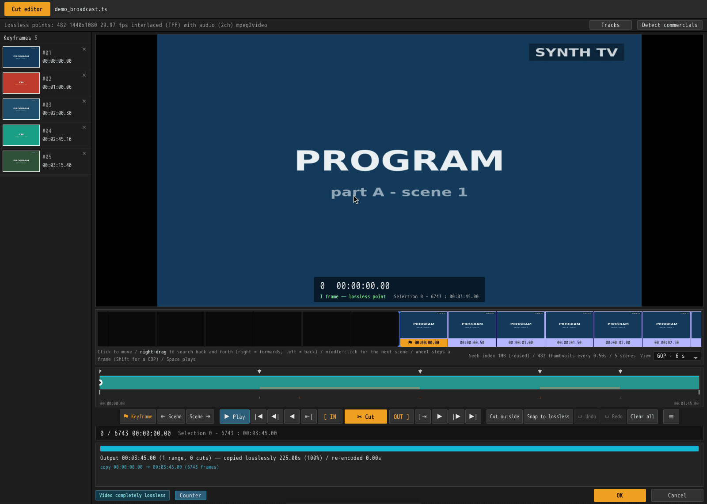
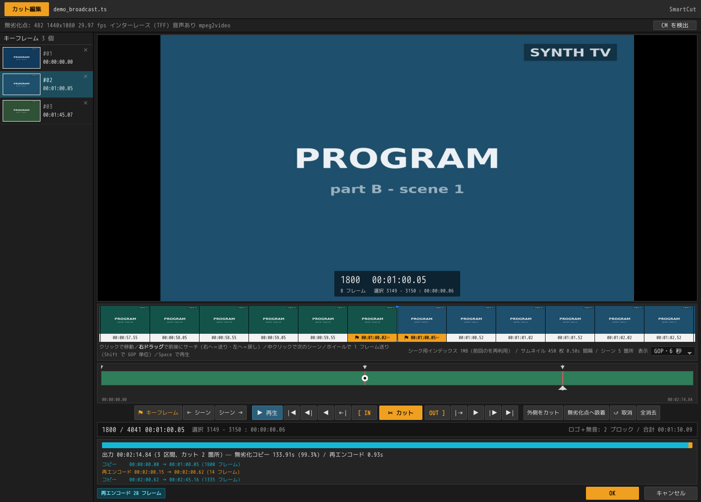

<div align="center">

# smartcut

**放送録画から CM を、再エンコードせずに落とす。**

[](https://github.com/DeepRegular/SmartCut/releases)
[](LICENSE)
[](#導入)
[](rust/)

[English](README.md) ・ 日本語



</div>

上は 3 分 45 秒の録画から CM ブロックを 2 つ落としたところ——**133.91 秒を
ビット単位でコピー、再エンコードは 0.93 秒。6743 フレーム中、触ったのは
28 フレームだけ。**

*使っている素材は*
[`tests/make_demo_media.sh`](tests/make_demo_media.sh)
*が ffmpeg の生成ソースだけから作る合成のテスト録画で、色板・偽の局ロゴ・
15 秒格子の CM でできている。*

## 仕組み

映像を切るには普通、全部を復号して再エンコードする。smartcut は
**カット点にかかる部分 GOP だけを再エンコードし、残りはビット単位でそのまま
コピーする。**

```
... I ....... I=========================I ....... I ...
      ^t_in   ^k_first                  ^k_term   ^t_out
    |<-head->|<--------- body --------->|<-tail->|
     再エンコード      ストリームコピー      再エンコード
```

実際の地デジ録画で **99% 以上が無劣化コピー**、CM 自動検出を使った 5 区間・
22 分の書き出しでは **40589 フレーム全てがビット完全一致**する。

## できること

- **スマートレンダリング** — H.264 / HEVC / MPEG-2 / MPEG-4 Part 2。
  アクセスポイント上で切れば再エンコードはゼロ。
- **CM 境界の自動検出** — 放送が字幕ストリームに打つ継ぎ目の印、無音の並び、
  局ロゴの有無の 3 つを使い、15 秒の格子に乗る区間を CM ブロックとして出す。
  境界はアクセスポイントへ吸着させるので、**CM カットがまるごと無劣化**に
  なる。
- **カット編集 GUI** — フィルムストリップ、シーン検出、スクロールサーチ、
  音声つきプレビュー再生。表示されるのは常に**編集後のタイムライン**。
- **プロキシ編集** — 読み込んだ録画から小さな代役を 1 回だけ作り、以後
  プレビュー・ストリップ・再生はそちらから読む。素材と**同じ時刻・同じ
  アクセスポイント**を持たせてあるので、切るときは元の録画をそのまま使う。
- **放送素材への対応** — インターレース保持、2:3 プルダウン（フィールド単位の
  タイムライン）、フレーム欠落、非ゼロの `start_time`、ARIB の ADTS レイアウト。
- **出力の器** — MPEG-TS / MP4 / Matroska。既定は入力と同じ器・同じ場所。

対応コーデック・トラック構成には制限がある。[既知の制限](docs/validation.md#既知の制限)を参照。

## 導入

[Releases](https://github.com/DeepRegular/SmartCut/releases) から取得する。
**FFmpeg を別途入れる必要があるのは deb だけ**で、他は同梱している。

| | |
|---|---|
| Linux | `smartcut_0.1.1_amd64.AppImage`、または `smartcut-0.1.1-linux-x86_64.tar.gz`（解凍して `./smartcut`）。どちらも FFmpeg 同梱、glibc 2.39 以上（Ubuntu 24.04 / Debian 13 / Fedora 40 以降） |
| Linux（deb） | `smartcut_0.1.1_amd64.deb` — `sudo apt install ./smartcut_0.1.1_amd64.deb`。FFmpeg を抱えずシステムの 7.1 にリンクするので 2.5MB で済むかわりに Debian 13 / Ubuntu 25.04 以降が要る。GUI が `smartcut`、コマンドライン版が `smartcut-cli` |
| Windows | `smartcut_0.1.1_x64-setup.exe`（インストーラ）または `smartcut-portable-x64.zip`（解凍して実行）。x64 のみ、WebView2 ランタイムが要る |

自分でビルドする場合は [ビルドと開発](docs/development.md)。

## 使い方

GUI にファイルをドロップするか、コマンドラインから:

```bash
smartcut input.ts --keep 5.3-12.7 -o out.ts   # 指定区間を残す
smartcut input.ts --cut 8.0-20.0  -o out.ts   # 指定区間を削除
smartcut input.ts --analyze                   # 計画だけ表示（書き出さない）

smartcut input.ts --analyze --detect-cm --logo  # CM 候補を出す
smartcut input.ts --analyze --scenes            # シーンの変わり目を出す
```

| オプション | 意味 |
|---|---|
| `--keep START-END` / `--cut START-END` | 区間指定（複数可）。`1:23:45.6` 形式も可 |
| `--audio-mode copy\|reencode` | 既定は `copy`（無劣化、境界誤差 ±10.7ms）。`reencode` はサンプル精度 |
| `--index scan\|container` | アクセスポイント索引の作り方。`container` は速いが TS では使えない |
| `--detect-cm` / `--logo` / `--scenes` | CM 候補・ロゴ併用・シーン検出 |
| `--no-open-gop` | オープン GOP をコピー開始点として使わない |
| `-o OUTPUT` | 出力先。器は拡張子で決まる |

## 編集画面



カットは引き算で、画面に出ているのは**録画からカットを引いたもの**であって
元の録画ではない。カットしたところは灰色にならず**消える**——シークバーが
縮み、フィルムストリップは穴の上で閉じ、フレームカウンタは「書き出される
ほうの尺」を数える。残るのは継ぎ目を示す赤い縦線だけ。

下の行は、書き出す前に見えている**エンジンの実行計画**そのもの。どこを
コピーし、どこを再エンコードし、それが何フレームなのかが出ている。

## ドキュメント

読みどころは[実装上の難所](docs/algorithm.md#実装上の難所)——「GOP 単位で切って
繋ぐだけ」で済まない 8 つの理由を、実際に踏んだ順に書いてある。

| | |
|---|---|
| [アルゴリズムと実装上の難所](docs/algorithm.md) | 切り分けの原理と、8 つの落とし穴 |
| [Rust コアの実装](docs/rust-core.md) | タイムスタンプ、SPS/PPS 混在、音声境界 |
| [検証結果と既知の制限](docs/validation.md) | フレームハッシュ照合、実素材での検証 |
| [GUI](docs/gui.md) | 編集画面、プロキシ編集、サムネイル軌道、シーン検出、再生 |
| [CM 境界の検出](docs/cm-detection.md) | 字幕リセット・無音・ロゴ、15 秒格子、誤検出を出さない設計 |
| [放送録画ワークフローとの互換](docs/broadcast-ts.md) | PID レイアウト、ADTS、L-SMASH / DGIndex |
| [ビルドと開発](docs/development.md) ・ [配布](docs/distribution.md) | 作り方と配り方 |
| [BDMV / BDAV への拡張](docs/bdmv.md) ・ [移植方針](docs/design.md) | 調査と設計判断 |

## 構成

```
rust/     Rust コア（smartcut_core）と CLI    ← 本体
gui/      Tauri v2 + バニラ JS の GUI
smartcut/ Python リファレンス実装             ← テストオラクル
tests/    E2E テスト 66 ケース
docs/     ドキュメント
```

Python 実装はアルゴリズムと落とし穴を確定させた**リファレンス実装兼テスト
オラクル**として残してある。同じフレームハッシュ照合を Rust と共有していて、
`tests/run_tests.sh` と `tests/run_rust_tests.sh` が同一の無劣化率を出す。

## ライセンス

[GPL-3.0](LICENSE)。

x264 / x265 が GPL であり、リンクするとアプリ全体が GPL になるため。
再エンコードはハードウェアエンコーダ（NVENC / QSV / VideoToolbox / AMF）にも
切り替えられる。H.264 / HEVC の特許ライセンスは、商用配布では別途検討が要る。
