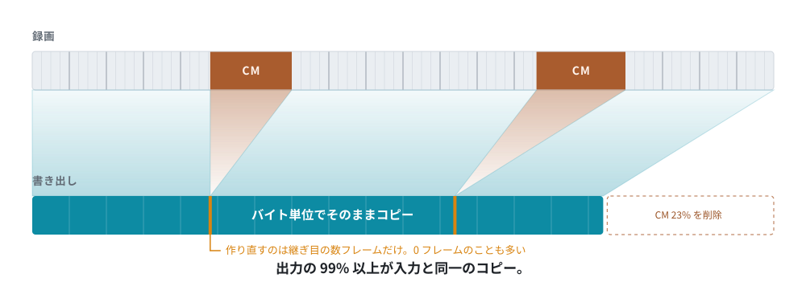
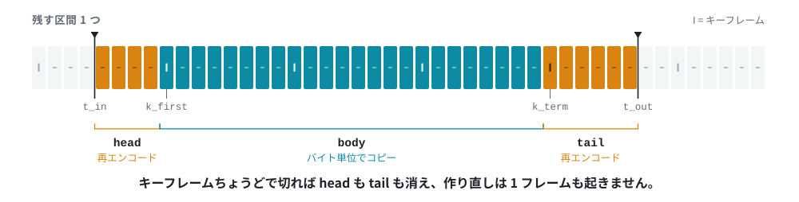

<div align="center">

# SmartCut

**録画は残す。CM は落とす。**

テレビ録画から CM を、再エンコードせずに切り出す。

[](https://github.com/DeepRegular/SmartCut/releases)
[](LICENSE)
[](#ダウンロード)
[](rust/)

[English](README.md) ・ 日本語

<picture>
  <source media="(prefers-color-scheme: dark)" srcset="docs/images/hero-dark.ja.svg">
  
</picture>

</div>

## SmartCut とは

SmartCut は、日本のテレビ録画から CM を切り取るためのデスクトップアプリです。
一晩ぶんの `.ts` ファイルをまとめてドロップすると、CM の切れ目を自動で探します。
あとは境界を目で確かめてカットし、書き出すだけです。

**ポイントは書き出し方にあります。** ふつうの動画編集ソフトは、ファイル全体を
いったん絵に戻し、また一から作り直します。時間がかかるうえに、全部のコマが
少しずつ元より悪くなります。

SmartCut はそれをしません。映像は、それだけで 1 枚の絵になる**キーフレーム**と、
「前のコマから変わったところ」だけを持つコマとでできています。キーフレームの
位置で切れば、残りは**バイト単位でそのままコピー**できます。作り直しが必要なのは、
カット点がキーフレームの間に落ちたときの、その数コマだけです。

実際の放送録画なら、**出力の 99% 以上が入力と同一のコピー**になります。
CM の切れ目のようにカット位置がキーフレームに一致する場合は、再エンコードが
1 コマも発生しません。

この方式を**スマートレンダリング**と呼びます。SmartCut は映像だけでなく、音声や、
日本の放送が一緒に運んでいる字幕・番組情報のストリームにも同じ考え方を適用して
います。

## SmartCut を使う理由

**画質を無駄に落としません。** 2 時間の録画を再エンコードすれば、全コマが少しずつ
劣化します。SmartCut が作り直すのは多くても数十コマ、多くの場合は 0 コマです。

**速いです。** やっていることはバイトのコピーなので、速度を決めるのは CPU では
なくディスクです。30 分の録画なら 1 分もかかりません。

**放送録画の中身がそのまま残ります。** 字幕、番組情報、放送局名、二か国語放送の
両音声、インターレース、2:3 プルダウンがすべて引き継がれます。出力も録画ファイル
の形のままなので、普段使っている録画向けのツールでそのまま開けます。

**一晩ぶんをディスクとして出せます。** ファイルとしてだけではありません。
BDAV フォルダー——レコーダーが BD-RE に書くのと同じ形——を書き出します。番組は
放送されたときの名前・チャンネル・録画日時・番組内容を持ち、CM を抜いた場所ごとに
チャプターが入ります。頼めば、書き終えたディスクをそのまま焼ける **`.iso`** に
包みます。詳しくは[ディスクを書く](docs/technical/bdav.ja.md)にあります。

**切る場所を字幕で確かめられます。** 編集画面のプレビューに字幕を出せます
（既定は表示しない）。放送の ARIB 字幕は放送局が指定した位置と色のまま文字として、
ディスクの字幕（PGS・DVD のサブピクチャ）は描かれた絵のまま重ねます。放送局が
文字ではなくドットで送ってくる字——行の続きを示す矢印など——も、その絵のまま
描きます。継ぎ目が台詞の途中に来ていないかは、絵だけを見ても分かりません。

**CM の切れ目を自動で探します。** 手がかりは 3 つあります。放送局が字幕
ストリームに入れる切り替えの印、無音区間の並び、局ロゴの有無です。SmartCut は
候補に印を置くところまでを担当し、**実際に何を切るかはあなたが決めます。**

**一晩ぶんをまとめて処理できます。** 20 本の録画を追加して `Ctrl+A` → `Ctrl+D`
を押したら、あとは放っておけます。読み込み・検出・編集は並行して動くので、
まとめて処理している最中でも操作を続けられます。

## 30 秒でわかるデモ


3 分 45 秒の録画から CM ブロックを 2 つ取り除いたところです。

- **133.91 秒をビット単位でコピー、再エンコードは 0.57 秒**
- **6743 コマ中、手を加えたのは 17 コマだけ**

この素材は [`tests/make_demo_media.sh`](tests/make_demo_media.sh) が ffmpeg の
テスト用ソースだけから作る練習用の録画です。カラーバー、偽の局ロゴ、15 秒刻みの
CM でできています。実際の放送素材は使っていません。

仕組みを図にすると次のようになります。残す区間ごとに、キーフレームからはみ出した
部分だけを作り直します。

<picture>
  <source media="(prefers-color-scheme: dark)" srcset="docs/images/seam-dark.ja.svg">
  
</picture>

CM 自動検出で決めた 5 区間・22 分の書き出しでは、**40589 コマすべてがビット単位で
一致**しました。

## ダウンロード

ビルド済みのファイルは
[Releases ページ](https://github.com/DeepRegular/SmartCut/releases)にあります。
deb 以外はすべて FFmpeg を同梱しているので、ほかに用意するものはありません。

| プラットフォーム | ファイル | 備考 |
|---|---|---|
| **Linux** | `SmartCut_0.5.11_amd64.AppImage` | 実行権限を付けて起動します |
| **Linux** | `SmartCut-0.5.11-linux-x86_64.tar.gz` | 展開して `./smartcut` を実行します。FUSE を使いたくない場合はこちらです |
| **Linux (Debian/Ubuntu)** | `smartcut_0.5.11_amd64.deb` | `sudo apt install ./smartcut_0.5.11_amd64.deb`。システムに入っている FFmpeg を使うので 3.4 MB で済みます |
| **Windows** | `SmartCut_0.5.11_x64-setup.exe` | インストーラ |
| **Windows** | `smartcut-portable-x64-0.5.11.zip` | 展開して `smartcut.exe` を実行します |

**動作条件。** AppImage と tar.gz には glibc 2.39 以降が必要です（Ubuntu 24.04、
Debian 13、Fedora 40 以降）。deb は FFmpeg 7.1 を使うので、Debian 13 または
Ubuntu 25.04 以降が必要です。deb では GUI が `smartcut`、コマンドライン版が
`smartcut-cli` としてインストールされます。Windows 版は x64 のみで、WebView2
ランタイムが必要です（Windows 11 には標準で入っており、Windows 10 でもほとんどの
環境に入っています）。

ソースからビルドする場合は[ビルド](docs/technical/building.ja.md)を参照して
ください。

## クイックスタート

### GUI を使う

1. **録画を追加する。** ウィンドウにドラッグ＆ドロップするか、
   **＋ ファイルを追加**から選びます。行はドロップした瞬間に埋まり、下ごしらえは
   その裏で進みます。読み込みが終わっていない録画でも、待たずに開けます。
2. **CM を検出する。** `Ctrl+A` で全選択して `Ctrl+D` を押します。SmartCut が
   順に処理して、各 CM ブロックの開始位置と本編に戻る位置に印を置きます。
3. **カットする。** 行をダブルクリックするとカット編集画面が開きます。印はすでに
   置かれているので、CM の先頭の印をクリックして `I`、本編に戻る位置の印を
   クリックして `←` を 1 回押してから `O`、最後に **✂ カット** を押します。
   その録画が終わったら **OK** で一覧に戻ります。
4. **出力設定を確認する。** 出力設定タブの内容は一覧全体に適用されます。保存先、
   ファイルの形式、音声の扱いをここで決めます。
5. **書き出す。** 出力タブで、一覧を上から順に書き出します。

作業の途中でも `Ctrl+S` で一覧を保存できます。カットの内容ごと、次回そのまま
復元されます。スクリーンショット付きの詳しい手順は
[GUI の使い方](docs/user-guide/gui.ja.md)にあります。

### ディスクを開く

ディスクはそのまま開けます。フォルダーでも、マウントしていない `.iso` でも同じ
です。Blu-ray は規格の両方に対応します。レコーダーが書く **BDAV** と、市販
ディスクの **BDMV** です。**DVD-Video** も読めます。タイトル、その再生時間、
打たれているチャプター、収録されている音声・字幕トラックを読み取ります。

ウィンドウにドロップすると、ディスク内のどれを読むのか、そのどのトラックを
取り込むのかを確認する画面が出ます。これは省く価値のない確認です。市販の 1 期
ボックスには、ロゴ・警告・メニューのループが 50 本ほど入っていて、本編 12 話は
その中に紛れています。しかもディスク上では、その 62 本すべてが `000NN` という
名前です。本編らしいものには、あらかじめチェックが入っています。

**開くのは一瞬です。** ディスクは、再生を始められる位置の一覧を自分で持って
います。SmartCut はそれを読むので、録画を丸ごと走査しません。81 GB・2 時間
34 分の UHD タイトルで、8 分 45 秒かかっていたものが 1 秒未満になりました。
音声の言語も同じ索引から引き継ぐので、2 か国語収録を切っても、どちらが日本語かは
出力に残ります。

カットの書き出し先はディスクと同じ場所で、ファイル名には番組名を使います。
ディスクが打ったチャプターは、最初から印としてタイムラインに並びます。
日本の録画では、チャプター位置が CM の境目そのものであることが多いためです。

```bash
smartcut Anime.iso                      # 何が入っているか
smartcut Anime.iso --title 2 --cut 8.0-20.0 -o out.ts
```

暗号化されたディスクは対象外です。読み取りの仕組みと、できないことは
[ディスクを読む](docs/technical/disc.ja.md)にあります。

### コマンドラインを使う

```bash
smartcut input.ts --keep 5.3-12.7 -o out.ts   # この区間を残す
smartcut input.ts --cut 8.0-20.0  -o out.ts   # この区間を削除する
smartcut input.ts --analyze                   # 計画だけ表示し、書き出さない

smartcut input.ts --analyze --detect-cm --logo  # CM 候補を一覧する
smartcut input.ts --analyze --scenes            # シーンの変わり目を一覧する

smartcut input.ts --cut 8.0-20.0 --bdav ~/disc  # ファイルではなくディスクに書く
```

`--keep` と `--cut` は複数回指定できます。秒数のほか `1:23:45.6` の形式も
使えます。オプションの全一覧は
[コマンドラインで使う](docs/user-guide/cli.ja.md)にあります。

## 読めるもの・書けるもの

**開けるファイル:** `.ts` `.m2ts` `.mts` `.m2t` `.mp4` `.mkv` `.mov` `.m4v`
`.vob` `.mpg` `.mpeg` `.m2p`、およびディスク（Blu-ray の BDAV / BDMV、
DVD-Video。フォルダーでも、暗号化されていない `.iso` でも、その場で読みます）

DVD は、1 本のつながった映像を 1GB 前後の断片に分けて収めています。規格上そう
決まっているためです。SmartCut は展開もコピーもせずに断片をつなぎ、必要な範囲
だけを取り出します。カットの書き出しは MPEG-TS です。DVD の形に戻すには
SmartCut が書かない種類の表がいくつも必要になります。

**書けるファイル:** MPEG-TS / M2TS / MP4 / Matroska / QuickTime、または
**BDAV ディスク**（プレーヤーが番組の一覧として読む索引の付いた録画フォルダー。
`.iso` にも包めます）。既定では、入力と同じ形式・同じフォルダーに書き出します。

**映像:** H.264 / HEVC / MPEG-2 / MPEG-4 Part 2 / VC-1。インターレース素材は
インターレースのまま保たれ、2:3 プルダウンも潰さずに扱います。

**4K HDR10** も切れます。カットの境目で書き直すコマにも、録画が持っている HDR の
設定をそのまま持たせるので、途中で見え方が変わることはありません。4K 放送が HLG
を書くときの後方互換の書き方——ストリームの 2 か所がわざと別のことを言う書き方
——もそのまま再現します。**Dolby Vision** はコピーする限り丸ごと残ります。境目で
書き直すコマには持たせられないので、書き直しが発生するカットはそのことを述べます。

VP9 と AV1 は非対応です。端と端をつなげる形式を持たないため、対応するには別の
設計が必要になります。

**VC-1 だけは事情が違います。** 2010 年頃までにプレスされた Blu-ray の多くが
このコーデックで書かれていますが、VC-1 のエンコーダはどこにも存在しません。
FFmpeg にもグラフィックスカードにもないのです。そこで SmartCut は、範囲の両端
専用のエンコーダを自前で持っています。書き出すのは 1 枚で完結する絵だけです。
継ぎ足す断片にはそれで足りますし、実装もフォーマットのごく一部で済みます。
置き換える元のコマよりビットは食いますが、断片は 1 秒に満たない長さなので割に
合います。残りはこれまでどおりバイト単位のコピーです。

**音声:** AAC・AC-3・E-AC-3・MP2・Blu-ray のリニア PCM はスマートレンダリングの
対象です。ファイル内の全トラックを個別にカットするので、二か国語放送は両方の
言語が残ります。
5.1ch をステレオにダウンミックスすることもできますし、出力する音声コーデック
（AAC・AC-3・DTS・リニア PCM）も選べます。ただしその場合はコピーできるフレームが
無くなるため、トラック全体を作り直します。サンプリング周波数を変えたときも同じ
です。

出力設定の画面には、**実際に書ける組み合わせだけ**を表示します。コーデックが
対応していないサンプリング周波数や、フレームに必要な下限を割るビットレートは、
その場で選択できなくなります。書き出しの最後になって失敗することはありません。
ディスクのロスレス音声（DTS-HD と TrueHD）はバイト単位でそのまま運び、
再エンコードしません。

**放送の付随データ（`.ts` で出力する場合）:** 字幕をバイト単位でそのまま引き
継ぎます。番組情報・放送局名・放送時刻は書き出しのあとで戻し、各ストリームは
元の位置に戻します。文字スーパーとデータ放送はカット後のタイムラインに載せられ
ないので、黙って捨てずに「持ち出せません」と表示します。

**ディスクの字幕（`.ts` / `.m2ts` で出力する場合）:** Blu-ray は字幕を書くのでは
なく描くので、運ばれるのは互いに切り離せない複数のパケットに分かれた 1 枚の絵です。
これをまとまりごとそのまま引き継ぎ、残す範囲の両端を繕います。範囲が開いた時点で
すでに出ていた字幕は最初のフレームでもう一度出し直し、範囲が終わる時点で出ている
字幕は下ろします——次の場面まで出しっぱなしにはしません。
[ディスクが描く字幕](docs/technical/disc.ja.md#ディスクが描く字幕)を参照してください。

**カットの中か、傍らか。** DVD も同じように字幕を描き、TS にはその置き場所が
ありません。そこで既定では**変換します**——Blu-ray が運ぶ種類として、同じ画素と
同じ色で書き直すので、カットは字幕の入った 1 ファイルになります。残る 2 つの答えは
どちらのディスクにも使え、どちらも字幕をカットの傍らに置きます。プレイヤーも字幕
ツールもそのまま読める **`.idx` と `.sub`**（VobSub）か、ディスプレイセットその
ものである **`.sup`**——Blu-ray の字幕ならバイト単位でそのままです。どちらでも
残す範囲の両端は繕います。`.mp4` に切ってディスクの字幕を残せるのは傍らに置く道
だけです。
[ディスクの字幕はカットの中か、傍らか](docs/technical/disc.ja.md#ディスクの字幕はカットの中か傍らか)
を参照してください。

映像トラックは 1 ファイルにつき 1 本のみです。制限の一覧は
[既知の制限](docs/technical/validation.ja.md#既知の制限)を参照してください。

## 「GOP 単位で切って繋ぐ」では済まない理由

「キーフレームを探し、そこで切り、繋ぐ」は誰でも思いつく方法で、そして動きません。
以下はすべて試作の途中で実際に踏んだもので、すべてに再現を押さえたテストがあります。

- **パラメータセットが一致しない。** 再エンコードした断片の SPS を元のエンコーダの
  それとビット単位で一致させることはできず、MP4 の `avcC` ボックスは 1 組しか
  持てません。素朴に繋ぐと、出力の半分が違う SPS で復号されます。
- **キーフレームは復号では見つからない。** `ffprobe -skip_frame nokey` はオープン
  GOP のアクセスポイントを取りこぼします。参照先のない I ピクチャをデコーダが
  出力できないからです。最初の試験素材では 10 個中 3 個しか見つかりませんでした。
- **leading picture。** デコード順では I ピクチャの後、表示順では前に来るピクチャは、
  直前の GOP を参照しています。これを捨てられるかどうかは、そのコーデックが
  leading picture を参照ピクチャにすることを許すかで決まり、MPEG-2・H.264・VC-1 は
  それぞれ違う答えを返します。
- **秒は単位として間違っている。** `-c copy` では区間長は DTS に対して測られ、DTS は
  リオーダー分だけ表示時刻より先を走っています。180 フレームが 182 フレームとして
  出てきました。
- **音声に GOP 構造はなく、** そのフレーム境界が映像のカット位置に来ることはありません。
- **継ぎ目の両側のピクチャオーダーカウントは、互いのものではありません。**
  デコーダはその順でピクチャを返しますが、継ぎ目の両側の番号は別のエンコーダが
  振ったものです。重なったところでは、去っていく側の 1 コマが、入ってくる側より
  *後* に返ってきます。

全部で 10 個あり、[実装上の難所](docs/technical/algorithm.ja.md#実装上の難所)に
踏んだ順で並べてあります。ドキュメントを 1 ページだけ読むなら、そのページです。

## どのくらい安全か

**元のファイルは変更しません。** SmartCut は読み込むだけです。出力は新しい
ファイルに書き、既定では入力と同じフォルダーに `cut_` を頭に付けた名前で
作ります。

**出力の大部分は、入力と同一であることが保証されます。** コピーした区間は文字
どおり同じバイト列です。推定値ではありません。コピーとはそういうものです。

**作り直した部分は実測しています。** テストスイートが出力を絵に戻し、ソースと
1 コマずつ突き合わせます。実際の放送録画での結果は次のとおりです。

| 素材 | 結果 |
|---|---|
| 地上波 NHK E テレ（MPEG-2 1440x1080i） | 899/899 コマ、98.2% 無劣化、インターレース保持 |
| BS11（MPEG-2 1920x1080i） | 899/899 コマ、98.2% 無劣化 |
| AT-X（MPEG-2 1440x1080、2:3 プルダウン） | 719/719 コマ、99.9% 無劣化、プルダウンパターン保持 |
| 22 分・5 区間の CM カット | 40589/40589 コマ、**100% ビット単位で一致** |
| VC-1 の Blu-ray（1920x1080i アニメ）、キーフレームの間から間まで 10 秒 | 308/308 コマ、映像の 90% がバイト一致、残りは 48dB で書き直し |
| VC-1 の Blu-ray（1920x1080p 実写・強いグレイン）、同じく 10 秒 | 246/246 コマ、90% がバイト一致、残りは 45dB でグレインも残存 |

**GUI は書き出す前に結果を示します。** タイムライン下のステータス行は、エンジンが
実際に実行する計画そのものです。どの区間をコピーし、どこを作り直し、それが何コマ
なのかが表示されます。「映像は完全に無劣化」と出ていれば、再エンコードは 1 コマも
発生しません。

**「100%」を切り上げることはありません。** 40000 コマ中 2 コマを作り直しても、
四捨五入すれば 100.0% になります。しかしそれは、スマートレンダラーが表示しては
いけない数字です。SmartCut は代わりにコマ数を出し、本当に 100% でない限り
100% とは書きません。

途中で見つかった不具合や、この方式そのものの限界も含めた完全な結果は
[検証](docs/technical/validation.ja.md)にあります。

## 中身の構成

エンジンは Rust のクレート 1 つです。GUI とコマンドラインツールはその前面に
立つ 2 つのフロントエンドで、カットについて何かを決めるのはどちらでもありません。

```
             gui/                          rust/crates/cli/
  ┌──────────────────────────┐   ┌──────────────────────────┐
  │  Tauri v2・バニラ JS     │   │  smartcut-cli            │
  └────────────┬─────────────┘   └────────────┬─────────────┘
               └───────────────┬──────────────┘
                               ▼
  ┌─────────────────────────────────────────────────────────┐
  │  rust/crates/core — smartcut-core                       │
  ├─────────────────────────────────────────────────────────┤
  │  ソースを開く        input  netpath  index  seek_index  │
  │                      proxy  thumbs                      │
  │  カットそのもの      plan  bitstream  cut  audio  adts  │
  │  放送そのもの        si  arib  caption  series          │
  │  切れ目を探す        cm  logo                           │
  │  ディスク、両方向    disc  dvd  udf  bdav  udfw         │
  │  字幕                pgs  vobsub  subs                  │
  │  編集画面に見せる    preview  playback_audio            │
  └────────────┬───────────────────────────┬────────────────┘
               ▼                           ▼
  ┌──────────────────────────┐   ┌──────────────────────────┐
  │  FFmpeg  libav*          │   │  rust/crates/vc1         │
  │  分離・復号・符号化      │   │  イントラ専用 VC-1       │
  │                          │   │  エンコーダ              │
  └──────────────────────────┘   └──────────────────────────┘
```

### なぜこの実装を信用できるか

二度書いてあるからです。

`smartcut/` ディレクトリには、同じアルゴリズムの Python 実装があります。放置された
試作ではありません。アルゴリズムとその落とし穴を最初に固めたのがこの実装で、
**リファレンス実装兼テストオラクル**として残してあります。両方の実装が同じ
フレームハッシュ照合にかけられ、同じ入力に対して同じ無劣化率を報告しなければ
なりません。

```
                        アルゴリズム
                              │
              ┌───────────────┴───────────────┐
              ▼                               ▼
   smartcut/        (Python)        rust/crates/core   (Rust)
   リファレンス実装                 配布されるほう
   planner · renderer ·             plan · cut · audio ·
   bitstream · probe · verify       bitstream · ...
              │                               │
              ▼                               ▼
     tests/run_tests.sh              tests/run_rust_tests.sh
              │                               │
              └───────────────┬───────────────┘
                              ▼
         同じ実録画に対する同じフレームハッシュ照合
                              │
                              ▼
                      一致する無劣化率
```

オラクルが同意しないエンジンの変更は、正しいとは呼ばせない。Python が今も
残っている理由はそれだけです。

両方がくぐる E2E テスト 20 スイート・352 チェックは `tests/` にあります。
どのモジュールに何が入っているかは [Rust コア](docs/technical/rust-core.ja.md)、
なぜこの分け方なのかは[設計ノート](docs/technical/design.ja.md)にあります。

## ドキュメント

ドキュメントは 2 つに分かれています。各ページに日本語版と英語版があり、切り替えは
各ページの冒頭にあります。

**[→ ドキュメント一覧](docs/README.ja.md)**

| | |
|---|---|
| **ユーザーガイド**<br>使い方 | [GUI の使い方](docs/user-guide/gui.ja.md) ・ [CM 検出](docs/user-guide/cm-detection.ja.md) ・ [まとめて処理する](docs/user-guide/batch.ja.md) ・ [プロジェクト](docs/user-guide/projects.ja.md) ・ [コマンドラインで使う](docs/user-guide/cli.ja.md) |
| **技術資料**<br>中で何をしているか | [アルゴリズム](docs/technical/algorithm.ja.md) ・ [検証](docs/technical/validation.ja.md) ・ [音声](docs/technical/audio.ja.md) ・ [放送 TS](docs/technical/broadcast-ts.ja.md) ・ [CM 検出の実装](docs/technical/cm-detection.ja.md) ・ [ディスクを読む](docs/technical/disc.ja.md) ・ [ディスクを書く](docs/technical/bdav.ja.md) ・ [Rust コア](docs/technical/rust-core.ja.md) ・ [設計ノート](docs/technical/design.ja.md) ・ [ビルド](docs/technical/building.ja.md) ・ [配布](docs/technical/distribution.ja.md) |

## ライセンス

[GPL-3.0](LICENSE)。

x264 と x265 が GPL なので、リンクするとアプリケーション全体が GPL になります。
再エンコードはハードウェアエンコーダ（NVENC / QSV / VideoToolbox / AMF）に
切り替えることもできます。商用配布を考える場合は、H.264 / HEVC の特許ライセンス
を別途検討してください。
