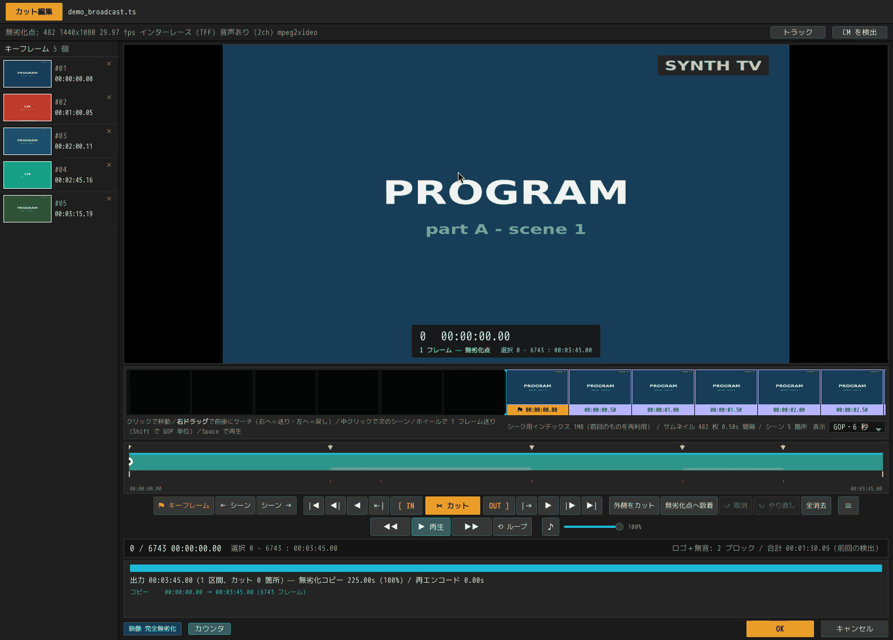

<div align="center">

# SmartCut

**テレビ録画から CM を、再エンコードせずに切り出す。**

[](https://github.com/DeepRegular/SmartCut/releases)
[](LICENSE)
[](#ダウンロード)
[](rust/)

[English](README.md) ・ 日本語



</div>

## SmartCut とは

SmartCut は、日本のテレビ録画を切るためのデスクトップアプリケーションです。一晩
ぶんの `.ts` ファイルをまとめて放り込むと、CM の切れ目を自動で見つけます。境界を
目で確かめてカットし、書き出す。ここまでが基本的な流れです。

重要なのは、その書き出し方です。普通の動画編集ソフトはファイル全体を復号して
エンコードし直すので、時間も画質も失われます。SmartCut はカット点にかかる部分
GOP の数フレームだけを再エンコードし、残りはバイト単位でそのままコピーします。
実際の放送録画では出力の 99% 以上が入力の完全なコピーになり、CM カットのように
切れ目がキーフレームに乗る場合は再エンコードがまったく発生しません。

この方式を**スマートレンダリング**と呼びます。SmartCut は映像だけでなく、音声と、
日本の放送が一緒に送っている字幕・番組情報のストリームにも同じ考え方を適用します。

## SmartCut を使う理由

**失わなくてよいものを失いません。** 2 時間の録画を再エンコードすれば全フレームが
劣化します。SmartCut が触るのは多くて数十フレーム、多くの場合はゼロです。

**速いです。** バイトをコピーするだけなので、速度を決めるのは CPU ではなく
ディスクです。30 分の録画なら 1 分もかかりません。

**放送録画がそのままの形で残ります。** 字幕、番組情報、放送局名、二か国語放送の
両音声、インターレース、2:3 プルダウン、元の PID 配置がすべて引き継がれます。
出力は録画のままの形をしているので、普段使っている録画向けのツールでそのまま
開けます。

**CM の切れ目を自動で探します。** 放送局が字幕ストリームに打つ切れ目の印、無音の
並び、局ロゴの有無という 3 つの独立した手がかりを組み合わせて位置を割り出します。
SmartCut は印を置くところまでを担当し、何を切るかはあなたが決めます。

**一晩ぶんをまとめて処理できます。** 20 本の録画を放り込んで `Ctrl+A` → `Ctrl+D`
を押したら、あとは待つだけです。読み込み・検出・編集は同時に走るので、バッチの
せいで手が止まることはありません。

## 30 秒でわかるデモ

このページ冒頭のアニメーションは、3 分 45 秒の録画から CM ブロックを 2 つ
取り除いたところです。

- **133.91 秒をビット単位でコピー、再エンコードは 0.57 秒**
- **6743 フレーム中、手が入ったのは 17 フレームだけ**

この素材は [`tests/make_demo_media.sh`](tests/make_demo_media.sh) が ffmpeg の
テスト用ソースだけから生成する合成録画で、色板・偽の局ロゴ・15 秒格子の CM で
できています。実際の放送素材は使っていません。

同じ仕組みを図にすると次のようになります。残す区間ごとに、キーフレームの外側に
はみ出した部分だけを作り直します。

```
... I ....... I=========================I ....... I ...
      ^t_in   ^k_first                  ^k_term   ^t_out
    |<-head->|<--------- body --------->|<-tail->|
     再エンコード      ストリームコピー      再エンコード
```

キーフレームちょうどで切れば、この head と tail さえなくなります。CM 自動検出を
使った 5 区間・22 分の書き出しでは、**40589 フレームすべてがビット単位で一致**
しました。

## ダウンロード

ビルド済みのファイルは
[Releases ページ](https://github.com/DeepRegular/SmartCut/releases)にあります。
deb 以外はすべて FFmpeg を同梱しているので、ほかに入れるものはありません。

| プラットフォーム | ファイル | 備考 |
|---|---|---|
| **Linux** | `SmartCut_0.3.4_amd64.AppImage` | 実行権限を付けて起動します |
| **Linux** | `SmartCut-0.3.4-linux-x86_64.tar.gz` | 展開して `./smartcut` を実行します。FUSE を避けたい場合はこちらです |
| **Linux (Debian/Ubuntu)** | `smartcut_0.3.4_amd64.deb` | `sudo apt install ./smartcut_0.3.4_amd64.deb`。システムの FFmpeg にリンクするので 3.0 MB で済みます |
| **Windows** | `SmartCut_0.3.4_x64-setup.exe` | インストーラ |
| **Windows** | `smartcut-portable-x64-0.3.4.zip` | 展開して `smartcut.exe` を実行します |

**動作条件。** AppImage と tar.gz は glibc 2.39 以上が必要です（Ubuntu 24.04 /
Debian 13 / Fedora 40 以降）。deb は FFmpeg 7.1 が必要なので Debian 13 /
Ubuntu 25.04 以降になります。deb は GUI を `smartcut`、コマンドライン版を
`smartcut-cli` としてインストールします。Windows 版は x64 のみで、WebView2
ランタイムが必要です（Windows 11 には標準で入っており、Windows 10 でもほぼ
入っています）。

ソースからビルドする場合は[ビルド](docs/developers/building.ja.md)を参照して
ください。

## クイックスタート

### GUI を使う

1. **録画を追加します。** ウィンドウにドラッグ＆ドロップするか、**＋ ファイル追加**
   から選びます。追加された録画は裏で読み込まれて索引が作られるので、あとから
   開くときは待ち時間がありません。
2. **CM を検出します。** `Ctrl+A` で全選択し、`Ctrl+D` を押します。SmartCut が
   順に処理し、各 CM ブロックの開始位置と本編に戻る位置に印を置きます。
3. **カットします。** 行をダブルクリックするとカット編集画面が開きます。印は
   すでに置かれているので、CM の先頭の印をクリックして `I`、本編が戻る位置の印を
   クリックして `←` を 1 回押してから `O`、そして **✂ カット** を押します。
   その録画の作業が終わったら **OK** で戻ります。
4. **出力設定を確認します。** 出力設定タブの内容は一覧全体に適用されます。
   保存先、コンテナ、音声の扱いを決めます。
5. **書き出します。** 出力タブで一覧を上から順に書き出します。

作業の途中でも `Ctrl+S` で一覧を保存でき、次回はカットごとそのまま戻ってきます。
スクリーンショット付きの詳しい手順は[ユーザーガイド](docs/user-guide/gui.ja.md)に
あります。

### Blu-ray を開く

ディスクはそのまま開けます。フォルダーでも、マウントしない `.iso` でも同じです。
規格の両半分——レコーダーが書く **BDAV** と、市販ソフトの **BDMV**——を読みます。

窓に落とすと、中のどれを読むのか、そしてどのトラックを取るのかを訊いてきます。
これは訊く値打ちのある問いです。市販の 1 期ボックスには、ロゴ・警告・メニューの
ループが 50 本と、その中に紛れた 12 話が入っていて、ディスクはその 62 本すべてを
`000NN` と呼んでいます。見る値打ちのあるものには最初からチェックが入っています。

カットはディスクの隣に、番組名で書き出されます。ディスクが打ったチャプターは、
そのままキーフレームとしてタイムラインに並びます——日本の録画では、それが CM の
境目そのものであることが多いからです。

```bash
smartcut Anime.iso                      # 何が入っているか
smartcut Anime.iso --title 2 --cut 8.0-20.0 -o out.ts
```

暗号化されたディスクは対象外です。読み方と、できないことは
[Blu-ray を読む](docs/developers/disc.ja.md)にあります。

### コマンドラインを使う

```bash
smartcut input.ts --keep 5.3-12.7 -o out.ts   # この区間を残す
smartcut input.ts --cut 8.0-20.0  -o out.ts   # この区間を削除する
smartcut input.ts --analyze                   # 計画だけ表示し、書き出さない

smartcut input.ts --analyze --detect-cm --logo  # CM 候補を一覧する
smartcut input.ts --analyze --scenes            # シーンの変わり目を一覧する
```

`--keep` と `--cut` は複数回指定でき、秒数のほかに `1:23:45.6` 形式も使えます。
オプションの全一覧は[コマンドラインリファレンス](docs/user-guide/gui.ja.md#コマンドラインリファレンス)にあります。

## 対応形式

**入力コンテナ:** `.ts` `.m2ts` `.mts` `.m2t` `.mp4` `.mkv` `.mov` `.m4v`、
および Blu-ray（BDAV / BDMV、フォルダーまたは暗号化されていない `.iso` をそのまま）

**出力コンテナ:** MPEG-TS / M2TS / MP4 / Matroska / QuickTime。既定は入力と同じ
コンテナ・同じディレクトリです。

**映像:** H.264 / HEVC / MPEG-2 / MPEG-4 Part 2。インターレース素材は
インターレースのまま保たれ、2:3 プルダウンはフィールド単位のタイムラインで
扱われます。VP9 と AV1 は非対応です。連結できるエレメンタリストリーム形式を
持たないため、別の設計が必要になります。

**音声:** AAC と Blu-ray の LPCM はスマートレンダリングの対象です。ファイル内の
全トラックが独立にカットされるので、二か国語放送は両方の言語が残ります。必要なら
5.1ch をステレオに畳めます。出力する音声コーデックも選べます——AAC・AC-3・DTS・
リニア PCM——ただしコピーできるフレームが無くなるので、その場合は全編を焼き直します。
サンプリング周波数も同じように選べ、リニア PCM なら量子化ビット数も選べます。
出力設定の画面には、実際に書ける組み合わせだけを出します。コーデックが持たない
レートや、フレームが必要とする下限を割るビットレートは、書き出しの最後で気付く
のではなく、その場で灰色になります。
AC-3・E-AC-3・MP2 はスマートレンダリングではなく
コピーで通し、その旨を明示します。ディスクのロスレス音声——DTS-HD と TrueHD——は
バイト単位でそのまま運び、再エンコードしません。MP4 には Blu-ray の LPCM を
入れる箱が無いので、同じサンプルをそのまま素の PCM として書きます。

**放送ストリーム（`.ts` 出力時）:** ARIB STD-B24 の字幕をバイト単位でそのまま
引き継ぎます。番組情報（EIT）・放送局名（SDT）・放送時刻（TOT）は多重化のあとで
書き戻され、各ストリームは元の PID に戻ります。文字スーパーとデータ放送はカット
されたタイムラインには載せられないので、黙って落とさず「持ち出せません」と
表示します。

映像トラックは 1 本のみです。制限の一覧は[既知の制限](docs/technical/validation.ja.md#既知の制限)を参照してください。

## どのくらい安全か

**元のファイルは決して変更されません。** SmartCut は読むだけです。出力は新しい
ファイルに書かれ、既定では同じディレクトリに `cut_` を頭に付けた名前で作られます。

**出力の大部分は入力と同一であることが保証されます。** コピー区間は文字どおり
同じバイト列です。これは推定値ではなく、ストリームコピーとはそういうものだ、と
いうことです。

**再エンコードされた部分は測定されています。** テストスイートは出力を復号し、
ソースとフレームごとにハッシュで突き合わせます。実際の放送録画での結果は
次のとおりです。

| 素材 | 結果 |
|---|---|
| 地上波 NHK E テレ（MPEG-2 1440x1080i） | 899/899 フレーム、98.2% 無劣化、インターレース保持 |
| BS11（MPEG-2 1920x1080i） | 899/899 フレーム、98.2% 無劣化 |
| AT-X（MPEG-2 1440x1080、2:3 プルダウン） | 719/719 フレーム、99.9% 無劣化、プルダウンパターン保持 |
| 22 分・5 区間の CM カット | 40589/40589 フレーム、**100% ビット単位で一致** |

**GUI は書き出す前に結果を示します。** タイムライン下のステータス行は、エンジンが
実際に実行する計画そのものです。どの区間をコピーし、どこを再エンコードし、それが
何フレームなのかが出ています。「映像は完全に無劣化」と表示されていれば、
1 フレームも再エンコードされません。

**「100%」を切り上げることはありません。** 40000 フレーム中 2 フレームを再
エンコードしても、普通に計算すれば 100.0% になります。しかしそれは
スマートレンダラーが絶対に表示してはいけない数字です。SmartCut は代わりに
フレーム数を出し、本当に 100% でない限り 100% とは書きません。

途中で見つかった不具合や、この方式に内在する限界を含めた完全な結果は
[検証](docs/technical/validation.ja.md)にあります。

## 技術ドキュメント

各ページに英語版と日本語版があり、切り替えは各ページの冒頭にあります。

**[→ 技術ドキュメント](docs/README.ja.md)**

| | |
|---|---|
| **ユーザーガイド** | [GUI](docs/user-guide/gui.ja.md) ・ [CM 検出](docs/user-guide/cm-detection.ja.md) ・ [プロジェクト](docs/user-guide/projects.ja.md) ・ [バッチ処理](docs/user-guide/batch.ja.md) |
| **技術解説** | [アルゴリズム](docs/technical/algorithm.ja.md) ・ [検証](docs/technical/validation.ja.md) ・ [放送 TS](docs/technical/broadcast-ts.ja.md) ・ [音声](docs/technical/audio.ja.md) |
| **開発者向け** | [Rust コア](docs/developers/rust-core.ja.md) ・ [設計](docs/developers/design.ja.md) ・ [ビルド](docs/developers/building.ja.md) ・ [配布](docs/developers/distribution.ja.md) ・ [Blu-ray を読む](docs/developers/disc.ja.md) |

1 ページだけ読むなら[実装上の難所](docs/technical/algorithm.ja.md#実装上の難所)を
おすすめします。「GOP 単位で切って繋ぐだけ」では済まない 8 つの理由を、実際に
踏んだ順に書いてあります。

## リポジトリの構成

```
rust/     Rust コア（smartcut_core）と CLI    ← 本体
gui/      Tauri v2 + バニラ JS の GUI
smartcut/ Python リファレンス実装             ← テストオラクル
tests/    E2E テスト 17 スイート・267 チェック
docs/     ドキュメント
```

Python 実装はリファレンス実装兼テストオラクルとして残してあります。アルゴリズムと
その落とし穴を最初に確定させたのがこの実装です。Rust コアと同じフレームハッシュ
照合を共有していて、`tests/run_tests.sh` と `tests/run_rust_tests.sh` は同一の
無劣化率を報告します。

## ライセンス

[GPL-3.0](LICENSE)。

x264 と x265 が GPL であり、リンクするとアプリケーション全体が GPL になります。
再エンコードはハードウェアエンコーダ（NVENC / QSV / VideoToolbox / AMF）にも
切り替えられます。商用配布を考える場合、H.264 / HEVC の特許ライセンスは別途
検討が必要です。
