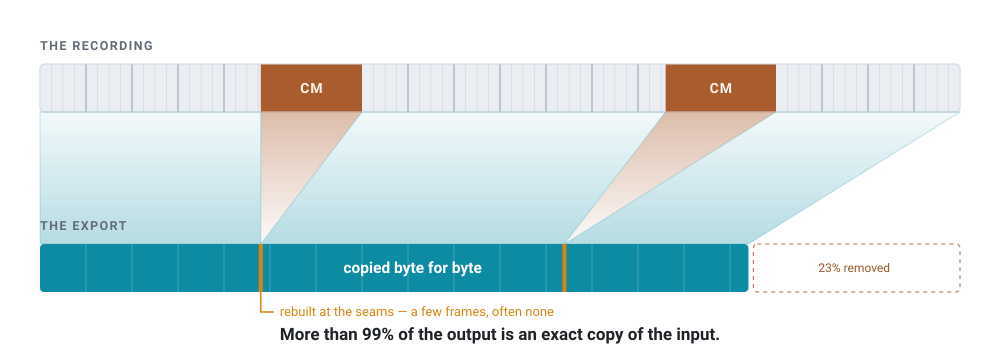
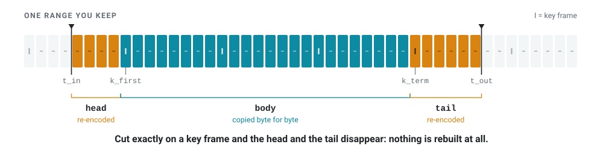

<div align="center">

# SmartCut

**Keep the recording. Lose the commercials.**

Cut commercials out of a TV recording without re-encoding it.

[](https://github.com/DeepRegular/SmartCut/releases)
[](LICENSE)
[](#download)
[](rust/)

English ・ [日本語](README.ja.md)

<picture>
  <source media="(prefers-color-scheme: dark)" srcset="docs/images/hero-dark.svg">
  
</picture>

</div>

## What is SmartCut?

SmartCut is a desktop application for cutting Japanese TV recordings. Drop a
night's worth of `.ts` files onto it and it finds the commercial breaks for you.
You check the boundaries, cut, and export.

**What matters is how it exports.** A normal video editor takes the whole file
apart into pictures and builds it again from scratch. That takes time, and every
frame comes out slightly worse than it went in.

SmartCut does not do that. Video is stored as **key frames**, which are complete
pictures, and frames that hold only what changed since the last one. Cut on a key
frame and the rest of the file can simply be **copied, byte for byte**. Only the
few frames caught between key frames at a cut point have to be rebuilt.

On real broadcast recordings, **more than 99% of the output is an exact copy of
the input** — and when the cuts land on key frames, which commercial breaks
usually do, nothing is rebuilt at all.

This technique is called **smart rendering**. SmartCut applies it to the video,
to the audio, and to the subtitle and programme-information streams a Japanese
broadcast carries alongside them.

## Why SmartCut?

**No quality is lost unnecessarily.** Re-encoding a two-hour recording makes
every frame in it slightly worse. SmartCut touches a few dozen frames at most,
and often none at all.

**It is fast.** Copying bytes is limited by your disk, not your processor. A
30-minute recording is written out in well under a minute.

**Broadcast recordings come through intact.** Captions, programme information,
the station name, both languages of a bilingual broadcast, interlacing and 2:3
pulldown all survive. The output still looks like a recording, so it opens in
whatever you already use for recordings.

**A night's cuts can leave as a disc.** Not only as files. SmartCut can write a
BDAV folder — the same shape a recorder writes to a BD-RE — with each programme
under the name it went out under, the channel it came off, the night it was
recorded, what the broadcaster said it was about, and a chapter point wherever a
commercial break was taken out. Ask for it and the finished disc is wrapped in a
**`.iso`** a burner can take. See [Writing a disc](docs/technical/bdav.md).

**You can place a cut by the subtitles.** The editor's preview will draw them
over the picture (off by default): a broadcast's ARIB captions as characters, at
the position and colour the broadcaster asked for — including the ones the
broadcaster sends as dots rather than as characters, such as the arrow that
carries a line onto the next one — and a disc's, PGS and a DVD's subpictures, as
the pictures they are. Whether a seam lands in the middle
of a line is not something the picture alone will tell you.

**Commercial breaks are found for you.** SmartCut uses three independent
clues: the marks the broadcaster puts in its own subtitle stream at every
switch, runs of silence, and whether the station logo is on screen. It places
the marks; **you** decide what to cut.

**It handles a whole evening at once.** Drop in twenty recordings, press
`Ctrl+A` then `Ctrl+D`, and come back later. Reading, detection and editing all
run at the same time, so a batch never stops you from working.

## 30-second demo


Two commercial blocks are removed from a 3 minute 45 second recording:

- **133.91 seconds copied bit-for-bit, 0.57 seconds re-encoded**
- **17 frames out of 6743 were touched at all**

The clip is a practice recording built by
[`tests/make_demo_media.sh`](tests/make_demo_media.sh) out of ffmpeg's own test
sources: colour cards, a fake station logo and a 15-second commercial grid. No
broadcast material is involved.

Here is the same idea as a diagram. For each range you keep, only the parts that
stick out past the key frames have to be rebuilt:

<picture>
  <source media="(prefers-color-scheme: dark)" srcset="docs/images/seam-dark.svg">
  
</picture>

A 22-minute export of 5 ranges, placed by the automatic commercial detector,
came out **bit-identical across all 40589 frames**.

## Download

Builds are on the [Releases page](https://github.com/DeepRegular/SmartCut/releases).
Every build except the `.deb` bundles FFmpeg, so there is nothing else to
install.

| Platform | File | Notes |
|---|---|---|
| **Linux** | `SmartCut_0.5.13_amd64.AppImage` | Make it executable and run it |
| **Linux** | `SmartCut-0.5.13-linux-x86_64.tar.gz` | Unpack and run `./smartcut`. Use this if you would rather not deal with FUSE |
| **Linux (Debian/Ubuntu)** | `smartcut_0.5.13_amd64.deb` | `sudo apt install ./smartcut_0.5.13_amd64.deb`. Only 3.4 MB, because it uses the FFmpeg already on your system |
| **Windows** | `SmartCut_0.5.13_x64-setup.exe` | Installer |
| **Windows** | `smartcut-portable-x64-0.5.13.zip` | Unzip and run `smartcut.exe` |

**Requirements.** The AppImage and the tar.gz need glibc 2.39 or newer, which
means Ubuntu 24.04, Debian 13, Fedora 40 or later. The `.deb` needs FFmpeg 7.1,
which means Debian 13 or Ubuntu 25.04 or later; it installs the GUI as
`smartcut` and the command-line tool as `smartcut-cli`. The Windows builds are
x64 only and need the WebView2 runtime, which ships with Windows 11 and is
already present on nearly all Windows 10 machines.

To build from source, see [Building](docs/technical/building.md).

## Quick start

### With the GUI

1. **Add your recordings.** Drag them onto the window, or use **＋ Add files**.
   Each row is filled in the moment the file lands, and the preparation runs
   behind it. You can open a recording before it has finished being read.
2. **Find the commercials.** Press `Ctrl+A` to select everything, then `Ctrl+D`.
   SmartCut works through the list and marks the start of every commercial block
   and every point where the programme resumes.
3. **Cut.** Double-click a recording to open the cut editor. The marks are
   already in place: click the one at the start of a break and press `I`, click
   the one where the programme resumes, press `←` then `O`, and press
   **✂ Cut**. Press **OK** when you have finished with that recording.
4. **Check the settings.** The output settings tab applies to the whole list:
   where to write, which format, and what to do with the sound.
5. **Export.** The export tab writes the whole list, top to bottom.

You can save the list at any point with `Ctrl+S`, and it comes back next time
with your cuts intact. There is a full walkthrough with screenshots in
[Using the GUI](docs/user-guide/gui.md).

### From a disc

SmartCut opens a disc as it is — as a folder, or as an `.iso` that never needs
mounting. It reads both halves of the Blu-ray specification: **BDAV**, what a
recorder writes, and **BDMV**, what a pressed disc is. It reads **DVD-Video**
too: the titles, how long each one runs, the chapters the disc set, and the
audio and subtitle tracks it declares.

Drop a disc on the window and SmartCut asks which of the recordings on it you
meant, and which of their tracks to take. That question is worth asking: a
pressed season set holds twelve episodes among fifty logos, warnings and menu
loops, and the disc calls all sixty-two of them `000NN`. The ones likely to be
programmes are ticked for you.

**Opening one is instant.** A disc keeps its own list of the places playback can
start from, so SmartCut reads that instead of examining the whole recording: a
UHD title of 81 GB and 2 hours 34 minutes went from 8 minutes 45 seconds to
under a second. Audio languages come off the same list, so cutting a bilingual
disc leaves an output that still says which track is which.

Cuts are written next to the disc under the programme's name. The chapters the
disc set are already on the timeline as marks, and on a Japanese recording they
are frequently the commercial breaks themselves.

```bash
smartcut Anime.iso                      # what is on it
smartcut Anime.iso --title 2 --cut 8.0-20.0 -o out.ts
```

Encrypted discs are out of scope. See [Reading a disc](docs/technical/disc.md)
for how a disc is read and what SmartCut does not do with it.

### From the command line

```bash
smartcut input.ts --keep 5.3-12.7 -o out.ts   # keep this range
smartcut input.ts --cut 8.0-20.0  -o out.ts   # drop this range
smartcut input.ts --analyze                   # show the plan, write nothing

smartcut input.ts --analyze --detect-cm --logo  # list the commercial candidates
smartcut input.ts --analyze --scenes            # list the scene changes

smartcut input.ts --cut 8.0-20.0 --bdav ~/disc  # onto a disc rather than into a file
```

`--keep` and `--cut` can be repeated, and accept `1:23:45.6` as well as plain
seconds. Every option is listed in
[Using the command line](docs/user-guide/cli.md).

## What it can read and write

**Files it can open:** `.ts` `.m2ts` `.mts` `.m2t` `.mp4` `.mkv` `.mov` `.m4v`
`.vob` `.mpg` `.mpeg` `.m2p`, plus discs — Blu-ray (BDAV or BDMV) and
DVD-Video, as a folder or as an unencrypted `.iso`, read where they lie.

A DVD stores one continuous stream in pieces of about a gigabyte, because the
format required it. SmartCut joins the pieces back together and takes the part
you asked for out of them, without unpacking or copying anything first. The cut
comes out as a transport stream: putting it back into a DVD's own shape would
mean writing several kinds of table SmartCut does not write.

**Files it can write:** MPEG-TS, M2TS, MP4, Matroska, QuickTime — or a **BDAV
disc**, a folder of recordings with an index a player reads as a list of
programmes, optionally wrapped in a `.iso`. By default the output uses the same
format and folder as the input.

**Video:** H.264, HEVC, MPEG-2, MPEG-4 Part 2, VC-1. Interlaced material stays
interlaced, and 2:3 pulldown is handled properly rather than flattened.

**4K HDR10** cuts too. The few pictures rewritten at a boundary carry the
recording's own HDR settings, so the picture does not visibly shift partway
through — including the backward-compatible way a 4K broadcast signals HLG,
where two parts of the stream say different things on purpose.
**Dolby Vision** is copied intact wherever the pictures are copied; the
pictures rewritten at a boundary cannot carry it, and a cut that has to rewrite
any says so.

VP9 and AV1 are not supported. They have no form that can be joined end to end,
so supporting them would need a different design.

**VC-1 is a special case.** Most Blu-rays pressed before about 2010 were written
in it, and there is no VC-1 encoder anywhere — not in FFmpeg, not on a graphics
card. So SmartCut carries its own, purely for the frames at the ends of a range.
It writes whole pictures only, which is all a joined fragment needs and only a
small part of the format. Those pictures cost more bits than the ones they
replace, but a fragment is under a second long, so the trade is worth making.
Everything else is copied byte for byte as usual.

**Audio:** AAC, AC-3, E-AC-3, MP2 and a Blu-ray's linear PCM are all smart
rendered. Every track in the file is cut separately, so a bilingual broadcast
keeps both languages.
5.1 can be folded down to stereo, and the sound can be written as a different
codec entirely — AAC, AC-3, DTS or linear PCM — although that leaves no frame to
copy, so the whole track is rebuilt. The same is true of changing the sample
rate.

The output settings screen only offers combinations that **can actually be
written**: a rate a codec does not support, or a bitrate below what its frames
need, is greyed out there rather than discovered at the end of an export.
A disc's lossless audio — DTS-HD and TrueHD — is carried byte for byte and never
re-encoded.

**Broadcast extras (when writing a `.ts`):** captions are carried across byte
for byte. Programme information, the station name and the broadcast clock are
put back afterwards, and every stream goes back where it arrived. Superimposed
text and data broadcasting cannot be carried on a cut timeline, and SmartCut
says so rather than dropping them quietly.

**A disc's subtitles (when writing a `.ts` or `.m2ts`):** a Blu-ray draws its
subtitles rather than writing them, so what travels is a picture spread over
several packets that mean nothing apart from one another. Those are carried
across whole, and both ends of every kept range are mended: a subtitle that
was already on screen when the range opens is put up again at its first
frame, and one still on screen when the range ends is taken down, instead of
standing there into the next scene. See
[the subtitles a disc draws](docs/technical/disc.md#the-subtitles-a-disc-draws).

**Inside the cut, or beside it.** A DVD draws its subtitles the same way and a
transport stream has nowhere to put those, so they are **converted** by
default: written as the kind a Blu-ray carries, the same pixels and the same
colours, so the cut is one file with its subtitles inside. Two other answers
go for either disc, and both put the subtitles next to the cut instead —
**`.idx` and `.sub`**, the VobSub pair every player and subtitle tool already
reads, or **`.sup`**, the display sets themselves, which is a Blu-ray's
subtitles byte for byte. Either way both ends of every kept range are mended,
and beside is the one way an `.mp4` of a disc keeps its subtitles at all. See
[a disc's subtitles, inside the cut or beside it](docs/technical/disc.md#a-discs-subtitles-inside-the-cut-or-beside-it).

One video track per file. See
[known limitations](docs/technical/validation.md#known-limitations) for the full
list.

## Why is this harder than it looks?

"Find a key frame, cut there, join the pieces" is the obvious approach, and it
does not work. Every one of these was hit for real while building the prototype,
and every one has a test pinning the reproduction:

- **The parameter sets do not match.** A re-encoded fragment's SPS cannot be made
  bit-identical to the original encoder's, and an MP4 `avcC` box holds only one
  set. Join the pieces naively and half the output is decoded with the wrong one.
- **Key frames cannot be found by decoding.** `ffprobe -skip_frame nokey` misses
  the access points in open GOPs, because the decoder cannot output an I picture
  whose references are absent. On the first test material it found 3 of 10.
- **Leading pictures.** Pictures that come after an I picture in decode order but
  before it in display order reference the GOP that just ended. Whether they can
  simply be dropped depends on whether the codec allows them to be reference
  pictures — and MPEG-2, H.264 and VC-1 each answer differently.
- **Seconds are the wrong unit.** Under `-c copy` a duration is measured against
  the DTS, which runs ahead of presentation time by the reorder depth. 180 frames
  came out as 182.
- **Audio has no GOP structure,** so its frames never land where the video's cut
  does.
- **The picture order counts either side of a splice are not one another's.**
  A decoder hands pictures back in that order, and the two sides of a seam were
  numbered by different encoders. Where they overlap, one picture of the outgoing
  scene comes back a frame *after* the incoming one.

There are ten of them, in [the pitfalls](docs/technical/algorithm.md#pitfalls),
in the order they were hit. If you read one page of the documentation, make it
that one.

## How safe is it?

**Your original file is never modified.** SmartCut only reads it. The output
goes to a new file, by default in the same folder with `cut_` in front of the
name.

**Most of the output is provably identical to the input.** The copied parts are
byte-for-byte the same bytes. That is not an estimate — it is what copying
means.

**The rebuilt parts are measured, not assumed.** The test suite decodes the
output and compares it against the source frame by frame. Against real
broadcast recordings:

| Material | Result |
|---|---|
| Terrestrial NHK E-Tele (MPEG-2 1440x1080i) | 899/899 frames, 98.2% lossless, interlacing preserved |
| BS11 (MPEG-2 1920x1080i) | 899/899 frames, 98.2% lossless |
| AT-X (MPEG-2 1440x1080, 2:3 pulldown) | 719/719 frames, 99.9% lossless, pulldown pattern preserved |
| A 22-minute commercial cut, 5 ranges | 40589/40589 frames, **100% bit-identical** |
| A Blu-ray in VC-1 (1920x1080i animation), 10s between key frames | 308/308 frames, 90% of the video byte-identical, the rest rewritten at 48 dB |
| A Blu-ray in VC-1 (1920x1080p film, heavy grain), same 10s | 246/246 frames, 90% byte-identical, the rest at 45 dB with the grain intact |

**The GUI shows you the result before you commit to it.** The status line under
the timeline is the plan the engine will actually carry out: which ranges are
copied, which are rebuilt, and how many frames that is. If it says "Video
completely lossless", not one frame will be re-encoded.

**"100%" is never rounded up.** Two rebuilt frames out of 40000 rounds to 100.0%
in ordinary arithmetic, and that is exactly the number a smart renderer must
never print. SmartCut shows the frame count instead, and writes 100% only when
it means it.

Full results, including the bugs found along the way and the limits inherent in
the approach, are in [Validation](docs/technical/validation.md).

## Under the hood

The engine is one Rust crate. The GUI and the command-line tool are two front
ends onto it: neither of them decides anything about a cut.

```
             gui/                          rust/crates/cli/
  ┌──────────────────────────┐   ┌──────────────────────────┐
  │  Tauri v2, vanilla JS    │   │  smartcut-cli            │
  └────────────┬─────────────┘   └────────────┬─────────────┘
               └───────────────┬──────────────┘
                               ▼
  ┌─────────────────────────────────────────────────────────┐
  │  rust/crates/core — smartcut-core                       │
  ├─────────────────────────────────────────────────────────┤
  │  opening a source    input  netpath  index  seek_index  │
  │                      proxy  thumbs                      │
  │  the cut itself      plan  bitstream  cut  audio  adts  │
  │  the broadcast       si  arib  caption  series          │
  │  finding the breaks  cm  logo                           │
  │  discs, both ways    disc  dvd  udf  bdav  udfw         │
  │  subtitles           pgs  vobsub  subs                  │
  │  the editor's view   preview  playback_audio            │
  └────────────┬───────────────────────────┬────────────────┘
               ▼                           ▼
  ┌──────────────────────────┐   ┌──────────────────────────┐
  │  FFmpeg  libav*          │   │  rust/crates/vc1         │
  │  demux, decode, encode   │   │  intra-only VC-1 encoder │
  └──────────────────────────┘   └──────────────────────────┘
```

### Why trust the implementation?

Because it is written twice.

The `smartcut/` directory holds a Python implementation of the same algorithm.
It is not a prototype left lying around: it is what pinned down the algorithm and
its pitfalls in the first place, and it is kept as a **reference implementation
and test oracle**. Both implementations are put through the same frame-hash
verification, and both have to report the same lossless ratio on the same input.

```
                        the algorithm
                              │
              ┌───────────────┴───────────────┐
              ▼                               ▼
   smartcut/        (Python)        rust/crates/core   (Rust)
   reference implementation         the one that ships
   planner · renderer ·             plan · cut · audio ·
   bitstream · probe · verify       bitstream · ...
              │                               │
              ▼                               ▼
     tests/run_tests.sh              tests/run_rust_tests.sh
              │                               │
              └───────────────┬───────────────┘
                              ▼
               the same frame-hash comparison
              against the same real recordings
                              │
                              ▼
                  identical lossless ratios
```

An engine change the oracle disagrees with does not get to be called correct.
That is the whole reason the Python is still there.

`tests/` holds the 20 end-to-end suites and 352 checks both sides are run
through. See [Rust core](docs/technical/rust-core.md) for what lives in each
module, and [Design notes](docs/technical/design.md) for why the split is shaped
this way.

## Documentation

The documentation is in two parts. Every page exists in English and Japanese;
the switch is at the top of each one.

**[→ All documentation](docs/README.md)**

| | |
|---|---|
| **User guide**<br>How to use it | [Using the GUI](docs/user-guide/gui.md) ・ [Commercial detection](docs/user-guide/cm-detection.md) ・ [Working through a batch](docs/user-guide/batch.md) ・ [Projects](docs/user-guide/projects.md) ・ [Using the command line](docs/user-guide/cli.md) |
| **Technical**<br>What it does inside | [Algorithm](docs/technical/algorithm.md) ・ [Validation](docs/technical/validation.md) ・ [Audio](docs/technical/audio.md) ・ [Broadcast TS](docs/technical/broadcast-ts.md) ・ [Commercial detection internals](docs/technical/cm-detection.md) ・ [Reading a disc](docs/technical/disc.md) ・ [Writing a disc](docs/technical/bdav.md) ・ [Rust core](docs/technical/rust-core.md) ・ [Design notes](docs/technical/design.md) ・ [Building](docs/technical/building.md) ・ [Distribution](docs/technical/distribution.md) |

## License

[GPL-3.0](LICENSE).

x264 and x265 are GPL, and linking against them makes the whole application GPL.
Re-encoding can also be switched to a hardware encoder (NVENC, QSV,
VideoToolbox, AMF). If you intend to distribute commercially, patent licensing
for H.264 and HEVC needs separate consideration.
