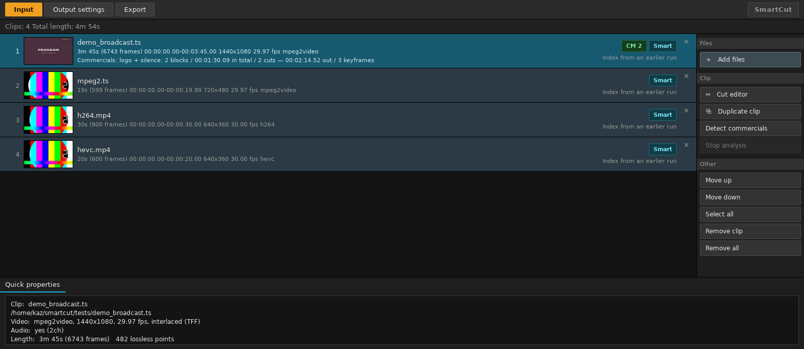

<div align="center">

# SmartCut

**Cut the commercials out of a broadcast recording without re-encoding it.**

[](https://github.com/DeepRegular/SmartCut/releases)
[](LICENSE)
[](#install)
[](rust/)

English ・ [日本語](README.ja.md)


</div>

Above: two commercial blocks taken out of a 3:45 recording — **133.91 s copied
bit-for-bit, 0.57 s re-encoded. 17 frames out of 6743 were touched at all.**

*The clip is a synthetic test recording, built by*
[`tests/make_demo_media.sh`](tests/make_demo_media.sh)
*from nothing but ffmpeg's own sources: colour cards, a fake station logo, and a
15-second commercial grid.*

## How

Cutting video normally means decoding and re-encoding the whole file. SmartCut
**re-encodes only the partial GOPs that the cut points fall inside, and copies
everything else bit-for-bit.**

```
... I ....... I=========================I ....... I ...
      ^t_in   ^k_first                  ^k_term   ^t_out
    |<-head->|<--------- body --------->|<-tail->|
      re-encode        stream copy       re-encode
```

On real terrestrial recordings **over 99% of the output is a lossless copy**.
A 22-minute, 5-range export driven by the automatic commercial detector came
out **bit-identical across all 40589 frames**.

## What it does

- **Smart rendering** — H.264 / HEVC / MPEG-2 / MPEG-4 Part 2. Cutting exactly
  on an access point re-encodes nothing at all. **The audio works the same
  way** (`--audio-mode smart`, the default): only the AAC frames a boundary falls inside
  are re-encoded, so nothing from the far side of a cut is heard -- 4 frames
  out of 5606, measured, and **none at all when the seam falls in silence**,
  as a commercial cut does -- where the output is byte-identical to a copy. And it stays **MPEG-2 AAC**, which left to FFmpeg it
  would not: the ADTS headers are written here so a seam is not one MPEG-4
  frame in an MPEG-2 stream.
- **5.1 folded down when it has to be** (`--audio-channels 2`, or the output
  settings screen). A surround recording that has to play somewhere that will
  not have it is the one case where copying the audio is not the answer, so
  this re-encodes the track -- with libav's own downmix coefficients, and with
  the ADTS headers rewritten to say stereo, which is where a transport stream
  states its channel count.
- **Captions and programme information come through** (writing a .ts). The
  ARIB STD-B24 caption stream the broadcast sends is carried across, shifted
  by exactly what the pictures were shifted by -- a caption statement is
  whole inside one packet, so there is nothing at a seam to re-encode and it
  arrives **byte for byte**. So do the programme on now and the one after
  (EIT), the station name (SDT) and the broadcast clock (TOT): the muxer
  writes a description of the streams and stops there, so the finished file
  is walked once more and **the recording's own tables are put back**. Every
  stream returns to **the PID it arrived on**, which is where a tool built
  around broadcast recordings looks for it. Superimposed text and the data
  broadcast cannot come -- the first arrives with no time on its packets and
  the second is a carousel of sections rather than a stream -- and the tool
  says so rather than dropping them quietly.
- **Multi-audio broadcasts** are read, and **both tracks are written**. A
  bilingual broadcast sends its two sound tracks on separate PIDs, and only
  one of them used to be looked at. Smart rendering runs on each track
  independently: two tracks have their frames at different instants and drift
  by different amounts, so one track's answer cannot stand in for the other's.
  The one you do not want is switched off in the cut editor's **track** menu.
- **Automatic commercial-boundary detection** — reads the junction marks the
  broadcast puts in its own caption stream, runs of silence, and the presence
  of the station logo, and reports the runs that land on the 15-second grid.
  Boundaries snap to access points, so **cutting commercials stays entirely
  lossless**.
- **Cut-editing GUI** — film strip, scene detection, scroll search, and preview
  playback with audio. What you see is always the *edited* timeline.
- **A clip list, and a batch behind it** — drop a night's recordings on the
  input screen and they are read in the background, each leaving its seek
  index on disc; `Ctrl+A` then `Ctrl+D` sets a commercial detection running on
  all of them. Reading, detecting and cutting **run at the same time**: the
  batch does not stop for the editor, and a clip the batch has not reached can
  be opened anyway. The whole list — recordings, cuts and output settings — saves
  as a **project** with `Ctrl+S` and comes back the next evening. The cut editor
  opens on one clip in a window of its
  own and closes with OK; cuts stay with the clip, so you can work through the
  list and then write the lot out in one go. A clip can be **duplicated**,
  cuts and marks and all — one recording cut two ways, both written out, sat
  side by side in the list. What the output screen shows is
  not a poster frame but **the frames that will actually be re-encoded** —
  everything else is copied byte for byte.
- **A seek index** — the two passes that used to be repeated on every open
  (walking the packets for the access points, decoding the key pictures for
  the thumbnail track) are done once and written down. **Opening a half-hour
  recording a second time goes from 18 seconds to 0.1.** The index also
  carries the byte offset of every access point, which takes the guesswork
  out of seeking.
- **Proxy editing** (off by default; `SMARTCUT_PROXY=1`) — a small stand-in is
  built from the recording, and the preview, the film strip and playback read
  from it. It carries the recording's own timestamps and access points, so
  cutting still works from the recording itself. It is for material where
  decoding a single picture is itself too slow to scrub, which broadcast
  1440x1080 MPEG-2 is not.
- **Built for broadcast material** — interlacing is preserved, 2:3 pulldown is
  handled on a field-level timeline, and dropped frames, non-zero `start_time`,
  and ARIB ADTS layout are all accounted for.
- **Output containers** — MPEG-TS / MP4 / Matroska, defaulting to the same
  container and directory as the input.
- **English or Japanese** — the interface follows whatever the machine is set
  to, and Preferences overrides it. The change lands at once, in both windows,
  and is remembered for next time.

Codec and track-layout limits apply; see
[known limitations](docs/validation.md#known-limitations).

## Install

Grab a build from [Releases](https://github.com/DeepRegular/SmartCut/releases).
**Only the .deb asks for FFmpeg on the system** — every other build bundles it.

| | |
|---|---|
| Linux | `SmartCut_0.3.0_amd64.AppImage`, or `SmartCut-0.3.0-linux-x86_64.tar.gz` (unpack it, run `./smartcut`). Both carry FFmpeg and need glibc 2.39+ (Ubuntu 24.04 / Debian 13 / Fedora 40 or newer) |
| Linux (deb) | `smartcut_0.3.0_amd64.deb` — `sudo apt install ./smartcut_0.3.0_amd64.deb`. 2.6MB, because it links the system FFmpeg 7.1 instead of carrying one; that means Debian 13 / Ubuntu 25.04 or newer. Installs the GUI as `smartcut` and the cutter as `smartcut-cli` |
| Windows | `SmartCut_0.3.0_x64-setup.exe` (installer) or `smartcut-portable-x64.zip` (unzip and run). x64 only; needs the WebView2 runtime |

To build it yourself, see [Building and development](docs/development.md).

## Usage

Drop a file onto the GUI, or use the command line:

```bash
smartcut input.ts --keep 5.3-12.7 -o out.ts   # keep the given range
smartcut input.ts --cut 8.0-20.0  -o out.ts   # drop the given range
smartcut input.ts --analyze                   # show the plan, write nothing

smartcut input.ts --analyze --detect-cm --logo  # commercial candidates
smartcut input.ts --analyze --scenes            # scene changes
```

| Option | Meaning |
|---|---|
| `--keep START-END` / `--cut START-END` | Ranges; repeatable. `1:23:45.6` form also accepted |
| `--audio-mode smart\|copy\|reencode` | `smart` (default) re-encodes only the frames a boundary falls inside, so nothing from the far side of a cut is heard -- and nothing at all when the seam falls in silence. `copy` is lossless to the byte; `reencode` is sample-accurate |
| `--audio-channels N` | Channels to write, 1..8. Anything but the recording's own is a downmix -- 5.1 folded to stereo for the players that make a mess of surround -- and there is no copying through one, so it re-encodes the whole track whatever `--audio-mode` says |
| `--audio-bitrate RATE` | Bits per second for re-encoded audio, `192k` or `192000`. Left out, it follows the recording, and comes down with the channel count when there is a fold |
| `--aac auto\|mpeg2\|mpeg4` | Which AAC the frames this tool writes announce themselves as. `auto` follows the recording, which for a broadcast means MPEG-2 AAC |
| `--index scan\|container` | How access points are indexed. `container` is faster but unavailable for TS |
| `--seek-index PATH` | Where to keep the seek index. Written on the first run, read on the next, which skips the walk over the packets |
| `--detect-cm` / `--logo` / `--scenes` | Commercial candidates, logo assist, scene detection |
| `--drop-stream INDEX` | Leave one of the recording's streams out of the output; repeatable. The same thing the cut editor's **Tracks** menu does |
| `--no-tables` | Writing a `.ts`, do not put the recording's own PMT, SDT, EIT and TOT back — leave the muxer's own tables standing |
| `--no-open-gop` | Never start a copy at an open GOP |
| `-o OUTPUT` | Output path; the extension picks the container |

## The clip list



Where a night's worth of recordings goes. **Each one is read in the background
as it arrives**, leaving a seek index behind; `Ctrl+A` then `Ctrl+D` runs
commercial detection over everything selected. The row carries what is known
about that recording — length, resolution, the commercial blocks found, the cuts
made, the length it will be written at. Cuts live with the clip, so the list can
be cut through one at a time and **written out in one go**. The cut editor opens
on one clip in a window of its own and comes back with OK.

The **SmartCut** button in the corner of this screen opens Preferences, where the
interface language is set: English, Japanese, or whatever the machine is set to,
which is the default. The change takes effect at once — both windows — and is
remembered for next time.

**About SmartCut**, in the same menu, prints the versions: the program's and the
cutting engine's, the FFmpeg libraries this process actually loaded and what they
are licensed under, and the platform. It is the one part of either window whose
text can be selected, so it can go straight into a bug report.

The same menu saves and opens **projects** (`Ctrl+S` / `Ctrl+O`). What is written
is the list itself — the paths, the cuts and marks made in each recording, and the
output settings. Nothing that can be worked out again goes in: the seek indexes and
the commercial detections live in the program's own cache directory, so opening a
project simply reads them again. That keeps a `.scproj` at a few hundred bytes, and it
means a project still opens on another machine, or after the caches have been
cleared. A `.scproj` dropped on the window opens too, as does
`smartcut friday-night.scproj`.

The title bar names the project that is open and puts a `*` in front of it
while there is work that is not on disc — and closing the window on that work
asks first. Being on disc is *compared*, not tracked: cancelling out of the
editor, or removing a clip that was just added, takes the `*` off again by
itself.

## The editor


Cuts are subtractive: the timeline you see is **the recording minus the cuts**,
never the original. A cut region does not turn grey — it *disappears*. The
seek bar shrinks, the film strip closes over the hole, and the frame counter
counts the length that will actually be written. All that is left of a cut is
a red vertical line at the join.

The status line at the bottom is the plan the engine will execute, before you
commit to it: which ranges get copied, which get re-encoded, and how many
frames that is.

## Documentation

Every page is available in English and in Japanese; the switch is at the top
of each one. The part worth reading first is
[the pitfalls](docs/algorithm.md#pitfalls) — the eight reasons why
"just cut on GOP boundaries and concatenate" does not work, in the order they
were hit.

| | |
|---|---|
| [Algorithm and pitfalls](docs/algorithm.md) | How the cut is split, and the eight traps |
| [Rust core](docs/rust-core.md) | Timestamps, mixed SPS/PPS, audio boundaries |
| [Validation and limits](docs/validation.md) | Frame-hash verification, real-material results |
| [GUI](docs/gui.md) | Editor, the seek index, thumbnail track, scene detection, playback, the proxy |
| [Commercial detection](docs/cm-detection.md) | Silence plus logo, the 15-second grid, avoiding false positives |
| [Broadcast workflow compatibility](docs/broadcast-ts.md) | PID layout, ADTS, L-SMASH / DGIndex |
| [Building](docs/development.md) ・ [Distribution](docs/distribution.md) | How to build and ship it |
| [BDMV / BDAV](docs/bdmv.md) ・ [Design notes](docs/design.md) | Research and design decisions |

## Layout

```
rust/     Rust core (smartcut_core) and CLI   <- the real implementation
gui/      Tauri v2 + vanilla JS GUI
smartcut/ Python reference implementation     <- test oracle
tests/    11 end-to-end suites, 112 checks
docs/     Documentation
```

The Python implementation is kept as the **reference implementation and test
oracle** that pinned down the algorithm and its pitfalls. It shares the same
frame-hash verification with the Rust core, and `tests/run_tests.sh` and
`tests/run_rust_tests.sh` report identical lossless ratios.

## License

[GPL-3.0](LICENSE).

x264 and x265 are GPL, and linking against them makes the whole application
GPL. Re-encoding can also be switched to a hardware encoder (NVENC / QSV /
VideoToolbox / AMF). Patent licensing for H.264 / HEVC needs separate
consideration for commercial distribution.
