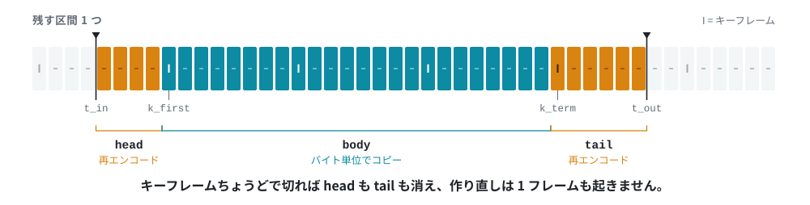

# アルゴリズムと実装上の難所

[← ドキュメント](../README.ja.md) ・ [← SmartCut](../../README.ja.md) ・
[English](algorithm.md)

## アルゴリズム

残す区間 `[t_in, t_out)` について、次のように切り分ける。

<picture>
  <source media="(prefers-color-scheme: dark)" srcset="../images/seam-dark.ja.svg">
  
</picture>

```
... I ....... I=========================I ....... I ...
      ^t_in   ^k_first                  ^k_term   ^t_out
    |<-head->|<--------- body --------->|<-tail->|
     再エンコード      ストリームコピー      再エンコード
```

`head` と `tail` は GOP の途中で始まる／終わるので、直前のアクセスポイントから
復号して作り直すほかない。その間の `body` は入力のバイト列をそのまま出力する。
アクセスポイントちょうどで切れば、再エンコードは一切発生しない。

作り直すにはエンコーダが必要になる。ところが **VC-1** にはエンコーダが無い。
2010 年頃までにプレスされた Blu-ray の多くが VC-1 で書かれているのに、libavcodec
にも、グラフィックスカードにも、フリーな実装のどれにもエンコーダは存在しない。
そこで SmartCut は、その部分のピクチャを自分で書く。書くのはイントラピクチャだけ
である。断片の外を参照できない以上、`head` と `tail` にはイントラだけで足りる。
画質への影響とその測り方は
[Rust コア](rust-core.ja.md#エンコーダのないコーデック-vc-1)にまとめてある。

Python リファレンス実装の構成は次のとおり。

| ファイル | 役割 |
|---|---|
| [`probe.py`](../../smartcut/probe.py) | ストリームのパラメータ、アクセスポイント索引、leading picture の検出、参照判定 |
| [`planner.py`](../../smartcut/planner.py) | 区間指定をセグメント列に変換する |
| [`bitstream.py`](../../smartcut/bitstream.py) | Annex-B / MPEG-2 のアクセスユニット分割 |
| [`renderer.py`](../../smartcut/renderer.py) | ffmpeg の実行と連結 |
| [`verify.py`](../../smartcut/verify.py) | 出力を復号し、ソースとフレーム単位で突き合わせる |

## 実装上の難所

「GOP 単位で切って繋ぐだけ」では済まない理由をここに挙げる。いずれも試作の過程で
実際に踏んだ問題であり、再現を固定するテストがある。

### 1. パラメータセット（SPS/PPS）が一致しない

再エンコード部分の SPS を、元ストリームとビット単位で一致させることはできない。
エンコーダが違えば VUI も VBV も違う。ところが MP4 の `avcC` ボックスは、
Matroska の CodecPrivate と同様に**パラメータセットを 1 組しか持てない**。素朴に
連結すると、コピー部分か再エンコード部分のどちらかが誤った SPS で復号され、映像が
壊れる。

対策は 2 段構えである。

- 各断片を Annex-B の生エレメンタリストリームとして書き出し、単純なバイト連結で
  繋ぐ。エレメンタリストリームは IDR ごとに SPS/PPS をストリーム内に持つので、
  断片ごとに異なるパラメータセットが合法的に共存できる。
- 最終的な MP4 は `avc3` / `hev1` サンプルエントリで書く。ISO/IEC 14496-15 が
  定めるストリーム内保持の形式で、これなら `avcC` に畳まれない。

MPEG-2 ではシーケンスヘッダがもともとストリーム内にあるので、この問題は起きない。

トランスポートストリームのストリーム情報が持つのは、ファイルで最初に出てくる
1 組だけである。SmartCut が書いたカットでは、それは再エンコードした頭のもので、
番号はコピー部分のものと同じなのに中身が違う。そのファイルを再エンコードのために
読むとき、シークは狙ったエントリーポイントより手前に着地する。次のストリーム内の
パラメータセットより前にある助走部分のピクチャは、頭の SPS で解釈されていた。
デコーダはこれを受け付け、誤った参照を残す。IDR の無い x264 の素材では、カットを
カットし直したときに再エンコード区間の B ピクチャがすべて 28〜35 dB に落ちた。
そこで、読み出しの最初のキーパケットより前はデコーダに渡さない
（`cut::RunUp`。再エンコード、作り直す結合の各リール、重なりの後ろ側で使う）。
プレビューは以前からそうしている。キーパケットに印の無いファイルは狙った
エントリーポイントから渡し、何も示さないファイルは数百ピクチャ後から渡す。

### 2. アクセスポイント索引は「パケット」を走査する

参照先の無い I ピクチャをデコーダが出力できないため、`ffprobe -skip_frame nokey`
は**オープン GOP のアクセスポイントを取りこぼす**。試作時のテスト素材では、実際に
ある 10 個のうち 3 個しか見つからなかった。

パケットの `K` フラグを見る方式なら復号そのものが不要で、速く、かつ正確である。

### 3. leading picture — オープン GOP 問題の核心

復号順では I ピクチャより後、表示順では前に来るピクチャを leading picture と
呼ぶ。前の GOP を参照しているので、そこからコピーを始めると表示できない。

そして、**その leading picture 自身が参照ピクチャかどうか**で扱いが正反対になる。

- MPEG-2: B ピクチャが参照されることはない。したがって leading picture は
  捨ててよく、オープン GOP でもコピー開始点として使える。
- H.264（x264 の `open-gop` など）: B ピラミッドがあるため leading picture が
  参照ピクチャになりうる。後続フレームが参照しているものを捨てると、そのフレームが
  壊れ、GOP の残りも巻き添えになる。ただし、参照ピクチャであっても、エントリ
  ポイントより後ろのピクチャが実際に参照しているとは限らない（後述）。
- HEVC: leading picture は RADL と RASL であり、同じエントリポイントの trailing
  picture がそれらを参照することは規格が禁じている。したがって符号化器が何を
  していようと常に捨ててよい。参照先が切り口の向こう側にある RASL は、捨てなければ
  ならない。これが `bitstream::leading_always_droppable` である。おかげで、
  計測していない次の点まで待たずに、すぐ次のエントリポイントからコピーを始められる。
  これが必要になったのは 4K 放送である。エントリポイントは全部 CRA で IDR が
  1 枚も無く、ピクチャごとに測ると全部が開始点に使えない判定になる。1 分切り出すと、
  直す前は冒頭 13.3 秒を再エンコードしていた。直したあとは 0.44 秒である
  （区間の 22.8% が 1.4% になった）。
- VC-1: B ピクチャが参照されない点は MPEG-2 と同じだが、ピクチャヘッダを単体では
  読めない。ピクチャ種別が 3 ビットで書かれるのか 1 ビットで書かれるのかさえ、
  *シーケンス*ヘッダで決まるからである。トランスポートストリームはシーケンス
  ヘッダをエントリポイントごとに置き直しており、libavformat が extradata として
  渡してくる。シーケンスヘッダが一度も現れないストリームでは安全側に倒し、すべて
  参照ピクチャとみなす。この場合はオープン GOP からコピーを始められなくなるだけで、
  ほかに影響は無い。

そこで、まず `nal_ref_idc`（H.264）、NAL タイプ（HEVC）、`picture_coding_type`
（MPEG-2）をビットストリームから読み、leading picture に参照ピクチャが含まれるかを
見る。含まれなければ、その点はコピー開始点に使える。

H.264 で参照ピクチャが含まれる場合は、それだけでは決めない。
[`leadrefs`](../../rust/crates/core/src/leadrefs.rs) がデコーダと同じ手順で
確かめる。エントリポイントから先の短期参照ピクチャを追跡し（スライディング
ウィンドウ、`frame_num` の欠番、`memory_management_control_operation` 1）、
leading picture 以外の全ピクチャについて、全スライスの参照リストを規格の 8.2.4
どおりに組み立てる。初期順序、フィールドの交互配置、並べ替え、有効な長さまで
再現する。

ただし、どのリストにも leading picture が現れないことを確かめるだけでは
足りない。録画と切り出した結果とでは、デコーダが持つ参照ピクチャが違うからである。
leading の参照ピクチャを捨てると `frame_num` に欠番ができ、切り出した結果を
復号するデコーダはそこを推定フレームで埋める。推定フレームはスライディング
ウィンドウと P ピクチャのリストでは捨てたピクチャと同じ位置に入る。一方、
カウントはデコーダが決めるので I より大きくなり、B ピクチャの既定のリストに
入り込む。元の録画では、そこに捨てたピクチャは無かった。

そのため、leading picture を捨てるのは次の条件をすべて満たすときだけである。

- 残すピクチャのリストが、バッファにある leading picture を指さない。
- leading の参照ピクチャか、その後に入った推定フレームがバッファにあるあいだは、
  残す B スライスが両方のリストの有効な項目をすべて
  `ref_pic_list_modification` で指定している。一部でも既定のままなら使えない。
- leading の参照ピクチャが、自分では `memory_management_control_operation` を
  持たない（`adaptive_ref_pic_marking_mode_flag` が 0）。
- leading の参照フィールドが、対になるフィールド無しでバッファに残っていない。
- キーピクチャ自身が参照ピクチャである。

判断がつかないときも「参照される」とみなし、従来の判定と同じ答えを返す。
長期参照、上記以外のメモリ管理操作、`pic_order_cnt_type` 1、まだ届いていない
パラメータセット、読めないスライス、1000 ピクチャ追っても決まらない点がこれに
あたる。

追跡するのは、パラメータセットがストリームの中にある H.264 だけである。
トランスポートストリームと `.m2ts` は常に対象になる。そこから作り直した MP4 や
Matroska もキーパケットに SPS と PPS が残っているので対象になる。パラメータ
セットが `avcC` にしか無い MP4 と Matroska は、従来どおり `nal_ref_idc` だけで
決める。判定結果はエントリポイントごとに索引へ保存する（`seek_index::VERSION` 15）。

B のリストの条件は、実際に壊れた例から加えた。最初の実装には無く、市販
Blu-ray と同じ構成のクリップ（23.976p の H.264。I、参照ピクチャである leading
の B、参照ピクチャでない leading の B の順）で、leading picture を捨ててよいと
判定した。後続の B はリスト 0 では I を明示的に指していたが、リスト 1 は既定の
長さのままだった。その切り出しは `--verify` で 2 フレームが食い違い、16.2 dB
だった。いまの条件ではこの点を使わない。

試作の段階では、x264 の open-gop 素材で leading picture を捨てると、コピー区間の
最初の GOP 60 フレームがすべて不一致になり、残せば一致したと記録していた。
この結果は再現しなかった。x264 で作ったトランスポートストリーム 20 種類
（b-pyramid の normal と strict、参照 16 枚、B フレーム 8 枚と 16 枚、MBAFF の
tff と bff、bluray-compat の 4 スライス、weightp 2 など）で、leading picture を
取り除いてキーから復号したが、壊れたものは無かった。当時の条件では、20 種類
すべてで leading picture を捨ててよいと判定していた。

いまの条件では、どれも捨てない。x264 が書く leading の参照 B は、どれも自分で
`memory_management_control_operation` 1 を持っているからである。以前の実装は、
外すのがエントリポイントより前のピクチャだけなら操作 1 を通していた。切り出した
結果でもそれらはバッファに残るが、I より後ろのどのピクチャよりも古いので、害は
無いと考えていた。ところが、残っていること自体が問題になる。カウントでは I より
後ろのすべてのピクチャより小さいので、後続の B のリスト 0 では、その B より後に
表示されるピクチャすべての前に並ぶ。そのせいで、リスト 1 の入れ替え（8.2.4.2.3）
が起きなくなることがある。x264 のストリームのヘッダを書き換えて、後続の参照 B が
I を外す形にした規格どおりのストリームで確かめた。その次の、既定のリストのままの
B は、leading picture の有無で復号結果が違った。

そのため、B ピラミッドを使う x264 のオープン GOP からはコピーを始めない。
`nal_ref_idc` だけで判定していたころと同じ扱いである。下のレコーダーの BD-RE は
leading の B が操作を持たないので、こちらは変わらない。

これが必要になったのは、レコーダーで録画したフィールド符号化の BD-RE である。
各 GOP の I の前に leading の B フレームが 2 枚あり、1 枚目は 2 枚目からしか
参照されない。P ピクチャは明示的な並べ替えでこの 2 枚を飛ばして I のフィールドを
指し、後続の B ピクチャは参照リストが短いので I より前まで届かない。
`nal_ref_idc` だけで判定すると、こうした録画ではどのエントリポイントからも
コピーを始められない。各範囲の冒頭は、まだ測っていない点に届くまで
再エンコードになっていた。このディスクのタイトルでは、再エンコードの長さが
90〜111 秒から 5.5〜10 秒に縮んだ。

コピーの*終了*点については、どちらであってもオープン GOP で構わない。表示範囲が
`lead_start` で終わるだけである。

leading picture の除去はコンテナでは表現できない（エディットリストが必要になる）
ので、Annex-B のアクセスユニット境界を自前で解析し、そこでピクチャを切り出す
（[`bitstream.py`](../../smartcut/bitstream.py)）。H.264 の「最初のスライスが
ピクチャの先頭」という規則は、MPEG-2 には通用しない。MPEG-2 はピクチャ開始コードの
あとにヘッダがいくつか続いてからスライスが来るので、切り方が変わる。

### 4. 区間指定は秒ではなくフレーム数・パケット数で

`-t` に秒数を渡すと、2 つの理由で狂う。

- `-c copy` のもとでは `-t` は DTS に対して評価される。DTS は並べ替え深さの
  分だけ表示時刻より先行しているので、次の GOP の I/P ピクチャが余分に混入する
  （180 フレームが 182 フレームになった）。
- 分数フレームレート（30000/1001）では、丸めによって結果が ±1 フレームずれる。

結局、確実なのは**表示フレーム数とコピーするパケット数を整数で数えて渡す**方法
だけである（`-frames:v N`）。パケット数はアクセスポイント索引の復号順インデックスの
差から厳密に求まる。

### 5. コンテナの start_time（MPEG-TS）

TS のタイムスタンプは 0 から始まらない（テスト素材では 1.423 秒）。`-ss` はファイル
先頭からの相対だが、ffmpeg は出力を `-ss` の分だけ基準化するので、**start_time は
出力タイムラインに残留オフセットとして残る**。

秒数で指定した `-t` はこのオフセットの影響をそのまま受ける。そこで、アクセス
ポイントの時刻は start_time を引いて正規化し、区間長はフレーム数で渡している。
これで両方の問題を避けられる。

### 6. 再エンコード区間は「手前から」復号する

オープン GOP のソースでは、`-ss` で目的位置へ直接シークすると、ffmpeg は復号でき
なかった GOP を丸ごと捨てる。その結果、**出力が最大 1 GOP 分遅れて始まる**
（実測 0.2 秒）。そこで、数 GOP 手前のアクセスポイントから復号を始め、出力側の
`-ss` で前を切り落とす。

### 7. 音声は GOP 構造を持たない

音声は映像のセグメント単位ではなく、**残す区間ごと**に切る。

- `--audio-mode copy` はソースのフレームをそのまま使う。区間の境界は最も近い音声
  フレームに吸着する（AAC で最大 24 ミリ秒程度）。
- `--audio-mode reencode` は `atrim` と `concat` フィルタを 1 パス通す。サンプル
  精度になるかわりに全編を再エンコードする。

Rust コアにはこのほかに `smart` があり、これが既定である。境界をまたぐフレーム
だけを再エンコードし、残りはコピーする。5.1ch 録画をステレオに畳むのはチャンネル数の
指定（`--audio-channels`）で、こちらにはコピー経路が無いので、モードが何であれ
全編の再エンコードになる。

どちらも[音声](audio.ja.md)で詳しく扱う。

AAC のエンコーダ遅延とプライミングを、エディットリストで厳密に扱ってはいない。

### 8. 検証の参照はファイル先頭から全復号する

`--verify` の参照側を `-ss` で作ってはいけない。オープン GOP では参照側自体が
ずれるので（理由は 6 と同じ）、**正しいカットが誤りとして報告される**。先頭から
復号し、フレーム番号で切り出す。

### 9. ピクチャの入らない再エンコード区間を作らない

`tail` は「コピーの終端」から「区間の終わり `t_out`」までである。ふつうは数フレーム
離れているが、`t_out` がアクセスポイントのすぐ後に来ると、その差が 1 ピクチャの
間隔より小さくなる。29.97 fps のストリームで、ピクチャが 60.05996 秒にあるところへ
60.060 秒を指定した場合がこれである。

こうして生まれた区間には**復号すべきピクチャが 1 枚も入らない**。カッターは中身の
無い区間を受け付けない（そうでなければ、ピクチャの出てこない再エンコードが素通り
してしまう）ので、そのクリップだけでなく実行そのものが止まる。

したがって `tail` は、`head` に 1 フレーム以上を求めるのと同じ理由で、半フレーム
以上あるときにだけ作る。Python リファレンス実装も同じ基準にしている。
念のため、フレーム数 0 と算出された再エンコード区間はそもそも出力しない。

### 10. 継ぎ目の両側で、ピクチャオーダーカウントは通用しない

デコーダはピクチャオーダーカウント順にピクチャを返す。ところが継ぎ目の両側の
カウントは、別々のエンコーダが書いたものである。再エンコードした `head` は自前の
コード化ビデオシーケンスを開いて 0 から数え、その後ろに継いだコピー区間 `body` は
録画に書かれていたカウントをそのまま運ぶ。

コピー区間が IDR から始まっていれば、シーケンスが再開してデコーダが抱えていた
ピクチャを出力するので、問題にならない。ところが、あるオーサリングツールで作った
ディスクとレコーダーが焼いたディスクでは、エントリーポイントがリカバリーポイント
付きの I ピクチャで、シーケンスは再開しない。スライスに書かれるのはカウントの下位
ビット（`pic_order_cnt_lsb`）だけで、上位は直前の参照ピクチャから求める。
したがってコピー側の I は、`head` が最後に書いた下位ビットを基準に解釈される。

その結果、コピー側の I のカウントが表示済みのピクチャより小さく求まることがある。
libavcodec はこれを出力済みのピクチャとみなし、コピー側の先頭の何枚かを捨てる。
オーサリング盤では 714 枚中 7 枚、フィールド対で符号化されたレコーダー盤では
1379 枚中 15 枚が消えた。12 箇所を切り出した例では 718 枚中 698 枚しか出なかった。
コピーの中身は正しく、同じ I から録画を復号するとビット単位で一致する。

**そこで、必要なときだけ `head` のカウントを付け直す。** `cut::poc_seam` は
`head` のスライスとコピー側の最初のスライスを読み、I の表示位置を求める。
それが `head` より後ろに来ないときに限り、`head` の全スライスの
`pic_order_cnt_lsb` を同じ量だけずらす。ずらす量は、I が `head` の最後の参照
ピクチャから `2 × max_num_ref_frames` 以上離れるように決める。この余白は、
継ぎ目で `frame_num` が飛んだぶんを埋めるために libavcodec が作るフレームの
置き場である。I より上に残ると B ピクチャの参照リストに入り込む。レコーダー盤
では、余白を 2 にしたとき、コピーした 718 フレーム中 2 フレームが録画と食い
違った。
`head` のピクチャどうしのカウントの差は変わらず、コピー側には手を付けない。

順番が合っているだけでは足りない。補われるフレームから離れているかも確かめる。
以前は、コピー側の I がすでに `head` より後ろにあれば、そのまま通していた。
余白は確かめていなかった。leading picture を捨てたエントリポイントから始まる
範囲で、`head` が 10 枚あまりだったとき、I の後ろの B フレーム 2 枚が
libavcodec の補ったフレームを参照していた。`--verify` では、コピーした
1183 フレーム中 2 フレームが食い違い、28.5 dB だった。いまは次の順にずらす量を探す。

1. フィールドの幅はそのままで、余白を確保できる量
2. フィールドを 1 バイト広げて、余白を確保できる量
3. 余白は確保できないが、順番だけは合う量

すでに順番が合っていて余白を確保できない場合は、手を付けずにそのままにする。

フィールドの幅が足りないこともある。x264 は自分のピクチャに必要なだけのビット数で
カウントを書く。レコーダー盤では `head` が MBAFF で 4 ビット、録画側は 8 ビット
だった。4 ビットでは 8 フレーム先までしか表せない。広げないと余白を確保できない
ときは、`head` の SPS の `log2_max_pic_order_cnt_lsb` を 8 増やし、
各スライスのフィールドも 1 バイト広げる。1 バイト単位にしたのは、算術符号の
スライスはデータをバイト境界から始めるからである。フィールドより後ろがちょうど
1 バイトずれるだけなら、残りのヘッダを読まなくても境界は保たれる。

ある範囲の末尾を再エンコードし、同じ録画の次の範囲がコピーで始まる場合も同じ
継ぎ目なので、同じように扱う。判断にはコピー側の最初のピクチャが必要になる。
そのため、`head` の始めからそのピクチャが届くまで、ライターはマルチプレクサへの
書き込みを音声も含めてすべて保留し、書いた順に送り出す。付け直しが不要な
切り出しは、この仕組みが無い場合とバイト単位で同じになる。
2026-09-09 に無条件で付け直す方法を試したが、かえって悪化したので取り下げた。
今回は、カウントの逆転が求まったとき、または補われるフレームがコピー側の I より
上に来ると求まったときだけ動く。復号できる枚数を減らした例は、
測った範囲では無い。
対象外は 2 つある。トランジション無しで結合したときのリール間の継ぎ目と、
HEVC である（CRA のエントリーポイントでは試していない）。

`--clean-joins` はオプションとして残してある。再エンコードを少し多めに使って
シーケンスを再開させる IDR まで進む。引き換えに正確さが落ち、2 つのエントリー
ポイントの間はコピーではなく再エンコードになる。本来の参照付きで復号した同じ
ピクチャと比べて 51 dB になる。良い再エンコードではあるが録画そのものではない
ので、既定では使わず、指定されたときだけ行う。

`--clean-joins` でもう 1 つ問題になるのは、どこまで進んでよいかである。
`examples/idrdiag.rs` は録画を走査して、各エントリーポイントから次のクリーンな
エントリーポイントまでどれだけ待つかを表示する。手元の H.264 ディスク 4 枚で結果は大きく分かれた。2 枚は中央値で
1〜3 秒、1 枚は 26 分の本編に IDR がひとつしかなく、中央値は 13 分だった。
そこで到達範囲は 2 秒で打ち切り、その範囲にクリーンな点が無ければプランは元のままに
する。MPEG-2 と VC-1 は各ピクチャの表示順をその GOP の中で明示していて並べ替えの
問題が無いので、この処理はそもそも一切動かない。

ディスクではインデックスを走査せず、ディスク自身の表から得ているので、この読み取り
には録画そのものが必要になる。そこで、録画を開いた状態でプランを作る入口 `plan_on`
を足し、`plan` は算術のままにした。各エントリーポイントの先頭バイトはすでに
分かっているので、パス 1 回ではなく数回のシークで済む。

### 11. 1 フレームが 2 枚のピクチャで届くことがある

出力タイムラインはフィールドで数えている。プルダウンは 3 フィールド表示するピクチャ
を含み、フレーム格子では表せないからである。この数え方が表しているのは、そのピクチャ
が何フィールド分表示されるかであって、1 フレームが何枚のピクチャで届くかではない。
そして後者は常に 1 とは限らない。H.264 では 1 フレームをフィールド 2 枚として
符号化できる（PAFF）。レコーダーが自分で焼く Blu-ray がまさにこれで、
1440x1080 29.97 の全フレームが 2 枚に割れている。

放送の 1080i はインターレース素材をフレームとして符号化しているので、放送の
コーパスではここに当たらない。レコーダー盤では 2 箇所が同時に壊れる。

- 配置。1 枚は半フレームで、タイムラインを占めるのは 2 フィールドではなく
  1 フィールドである。2 を与えると区間の長さは実際の倍になり、各パケットに書く
  duration も倍になる。
- 先読み。DTS を決めるキューは、表示順が確定するまでピクチャを抱えておく。何枚
  抱えるかは録画の並べ替え深度から取るが、これはフレームを数えた値である。1 枚しか
  抱えないと、P フレームの復号時刻を、その手前に表示される B フレームが届く前に
  確定してしまう。届いた B は行き場を失って落ちる。40 秒の切り出しでは、1842 枚中
  642 枚がこうして落ちた。コピー区間は最初の 1 枚からブロックノイズの塊になった。

そこでキューは枚数ではなく**半フレーム単位**で測ることにした。1 フィールド分の
ピクチャは半分を 1 つ、それ以外は 2 つと数える。3 フィールド表示のピクチャも
1 フレームなので、境界を動かさないために 2 つと数える。これでフレーム符号化の素材は
以前とまったく同じだけ抱えることになり、大半がフレーム符号化で数組だけフィールド対が
ある録画も、その数組の周りだけ余裕が増える。

半フレームかどうかの判定は、中のピクチャではなくパケットに対して行う。libavcodec の
MPEG-2 パーサはフィールド対を 1 パケットに結合する。手元の放送録画 1 本では 30 秒の
間に 7 回、ピクチャ 2 枚（1 フレーム 2 フィールド）が 1 パケットに結合されていた。
一方 H.264 パーサはフィールドを 1 枚ずつ渡す。そこで、パケットの中で開始する
ピクチャの数を数えることにした。H.264 なら `first_mb_in_slice` が 0 のスライス、
MPEG-2 なら picture coding extension の個数である。開始するピクチャが 1 枚で、
それがフィールドのときだけ半フレームと判定する。

このフラグを読むにはシーケンスヘッダが先に必要になる。`field_pic_flag` は
`frame_num` の後ろにあり、その幅は SPS にしか書かれていない。VC-1 のヘッダと
同じく録画ごとに一度だけ読む。`frame_mbs_only_flag` が立っているシーケンスなら、
ピクチャを 1 枚も見ずに済む。ただし、ヘッダを見るだけでは決まらない。SmartCut が
同じ録画に書き戻すのは MB-AFF で、そのヘッダもフィールドを許しているが、中の
ピクチャはすべてフレームだからである。

対の 2 枚目は、自分のタイムスタンプではなく 1 枚目のすぐ後ろに置く。2 枚は復号順で
必ず隣り合うので、1 枚目は直前に見たピクチャで確定する。対に 1 つしかタイムスタンプ
を与えない録画や、丸めると同じ位置に来る 2 つを与える録画では、こうしないと 2 枚が
同じ場所に重なり、片方が行き場を失うからである。
