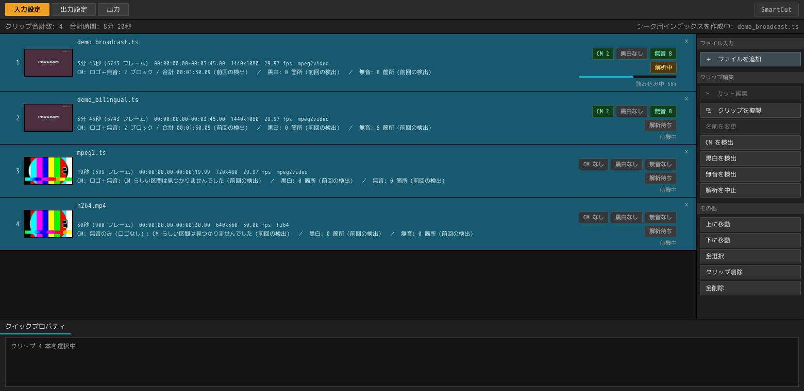

# まとめて処理する

[← ドキュメント](../README.ja.md) ・ [← SmartCut](../../README.ja.md) ・ [English](batch.md)

SmartCut は、録画を 1 本ずつ開いて片付けるためのものではありません。
**一晩ぶんをまとめて放り込んで、順に片付ける**ための道具です。

```
①  録画をまとめてドロップする
②  Ctrl+A → Ctrl+D で、全部に CM 検出をかける
③  1 本ずつダブルクリックして切る
④  最後に、一覧をまとめて書き出す
```

カットは編集ウィンドウではなく**一覧の行のほう**に残ります。ですから、上から順に
切っていって、書き出しは最後にまとめて、という進め方ができます。

## 1. 落とした瞬間から、裏で下ごしらえが始まる



ファイルを落とすと、行はすぐに埋まります。そのうしろで、SmartCut は 3 つの
下ごしらえを同時に進めています。

| 裏で動くもの | 何をしている | どのくらいかかる |
|---|---|---|
| **読み込み** | 早送りやカットに使う索引（シーク用インデックス）を作る | 1 GB あたり 1 秒くらい |
| **サムネイル** | 帯に並べる絵と、場面の変わり目を作る | 1 GB あたり 4 秒くらい |
| **CM 検出** | CM の切れ目を探す（`Ctrl+D` で始まります） | 30 分の録画で 10 〜 60 秒 |

同じ種類の処理は 1 本ずつ順番に、種類が違えば 3 つ同時に走ります。
進み具合は各行の右下に出ます。まだ順番が来ていない行は `待機中` です。

**索引は 1 回作れば残ります。** 同じ録画を次に開いたときは、
`前回の索引を再利用` と出て、読み込みそのものが省かれます。

**待つ必要はありません。** 読み込みが終わっていない録画でも、ダブルクリック
すればその場で開けます。何が先に使えて何があとから来るのかは
[GUI の使い方](gui.ja.md#開いた瞬間から使えます)にあります。

## 2. 一覧全体に CM 検出をかける


`Ctrl+A`（全選択）に続けて `Ctrl+D`（CM を検出）。これだけで、選んだ録画すべての
検出が順番待ちに入ります。**18 本を選んで `Ctrl+D` を 1 回**——これがこの機能の
目的です。夜に押して、朝に結果を見る、という使い方を想定しています。

進み具合は行に出ます（`CM 検出中 84% — ロゴを探しています`）。
まだ順番の来ていない行は `CM 検出 待機中` です。

**検出は印を置くだけで、切りません。** 何を消すかは、あとであなたが編集画面で
決めます。詳しくは [CM 検出](cm-detection.ja.md)を見てください。

**止めたいときは「解析を中止」。** もう一度押せば再開します。読み込みと
サムネイル作りはファイルの途中でも止まれますが、CM 検出は途中で止まれないので、
止まるのは 1 本と 1 本の**あいだ**になります。

止まるのは「いま動いているもの」だけです。止めてすぐ別の録画を選んで検出を
始められます。

## 3. 裏の処理を待たずに編集する

読み込み・サムネイル・CM 検出・カット編集は、すべて同時に動きます。
**12 本目で重い処理が走っていても、いま開いている 1 本には影響しません。**

編集ウィンドウを開いているあいだ、裏の 3 つはパソコンの**半分**だけを使います。
あなたが見ている絵のほうが優先だからです。

**編集ウィンドウを開いても、裏の処理は止まりません。** そのクリップですでに
始まっている処理は最後まで走ります。読み込みの進み具合も、絵も、場面の印も、
ウィンドウを開いたせいで巻き戻ることはありません。

## 4. 同じ録画を 2 行に分ける

**⧉ クリップを複製**は、同じ録画をもう 1 行増やします。
2 時間の録画に番組が 2 本入っているときのための機能です。同じファイルを 2 行に
置いて、それぞれ違うところを残します。

**複製すると、カットも印もそのまま引き継がれます。** 2 本目のカットは、たいてい
1 本目を少しずらしたものだからです。索引も CM 検出の結果も引き継ぐので、
ディスクを読み直すこともありません。

**出力ファイル名がぶつかる行には、一覧の順に `_1` `_2` が付きます。**
複製したときだけでなく、別のフォルダーにある同名の番組や、ディスクから読んだ
録画（どれも `00001` という名前です）でも同じです。番号が無いと、2 本目が
1 本目を上書きしてしまい、「2 本出力しました」と言いながら 1 本消えていることに
なります。片方を消せば、残ったほうは番号の無い名前に戻ります。

## 5. まとめて書き出す

出力タブは、一覧を**上から順に**書き出します。行ごとに進み具合と結果が出て、
その上に全体の状況・経過時間・残り時間が出ます。

先に出したい録画があるときは、**その行を上へドラッグ**してください。
書き出す順番は一覧の順番そのものです。

`出力中止` を押すと、いま書いている 1 本を最後まで書き終えてから止まります。
途中まで書かれた中途半端なファイルが残ることはありません。
（BDAV ディスクとして書いている途中で止めた場合は、書いたぶんも取り消します。
理由は [GUI の使い方](gui.ja.md#4-書き出す)にあります。）

## ネットワーク共有（NAS）にある録画

NAS 上の録画も、ふつうにドラッグ＆ドロップできます。書き出し先に指定することも
できます。

ただし **SmartCut は共有をマウント（接続）しません。** 接続にはパスワードが
必要で、それを預かるのはファイルマネージャーやキーリングの仕事だからです。
つながっていない共有を渡されたときは、どこで接続すればよいかを表示して止まります。

```
\\nas\rec につながっていません。ファイルマネージャーで smb://nas/rec を
開いてから、もう一度追加してください。（現在つながっている共有: \\nas\録画）
```

## 途中で保存する

一覧まるごと——録画・カット・トラックの選択・出力設定——は `Ctrl+S` で保存でき、
次回そのまま再開できます。[プロジェクト](projects.ja.md)を見てください。

---

3 つの処理をなぜ並行させているのか、どうチューニングしたのかは
[設計ノート](../technical/design.ja.md#3-つの処理と開いたままの編集画面)にあります。
