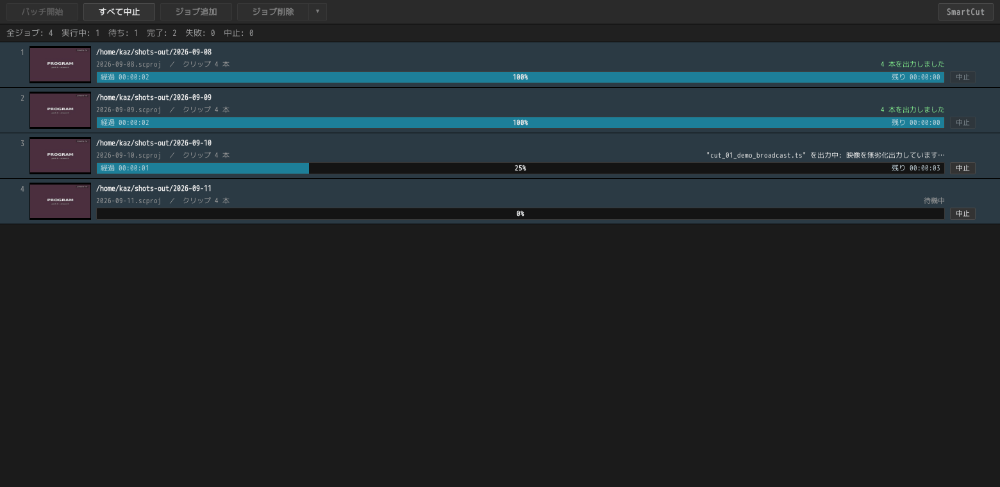

# まとめて処理する

[← ドキュメント](../README.ja.md) ・ [← SmartCut](../../README.ja.md) ・ [English](batch.md)

SmartCut は、録画を 1 本ずつ開いて片付けるためのものではありません。
**一晩分をまとめて放り込んで、順に片付ける**ための道具です。

```
①  録画をまとめてドロップする
②  Ctrl+A → Ctrl+D で、全部に CM 検出をかける
③  1 本ずつダブルクリックして切る
④  最後に、一覧をまとめて書き出す
```

カットは編集ウィンドウではなく**一覧の行のほう**に残ります。ですから、上から順に
切っていって、書き出しは最後にまとめて、という進め方ができます。

## 1. 落とした瞬間から、裏で下ごしらえが始まる


ファイルを落とすと、行はすぐに埋まります。そのうしろで、SmartCut は 3 つの
下ごしらえを同時に進めています。

| 裏で動くもの | 何をしている | どのくらいかかる |
|---|---|---|
| **読み込み** | 早送りやカットに使う索引（シーク用インデックス）を作る | 1 GB あたり 1 秒くらい |
| **サムネイル** | 帯に並べるサムネイルと、場面の変わり目を作る | 1 GB あたり 1〜2 秒くらい。4K の録画はもっとかかります |
| **CM 検出** | CM の切れ目を探す（`Ctrl+D` で始まります） | 30 分の録画で 10 〜 60 秒 |

同じ種類の処理は 1 本ずつ順番に、種類が違えば 3 つ同時に走ります。
進み具合は各行の右下に出ます。まだ順番が来ていない行は `待機中` です。

**索引は 1 回作れば残ります。** 同じ録画を次に開いたときは、
`前回の索引を再利用` と出て、読み込みそのものが省かれます。

**待つ必要はありません。** 読み込みが終わっていない録画でも、ダブルクリック
すればその場で開けます。何が先に使えて何があとから来るのかは
[GUI の使い方](gui.ja.md#開いた瞬間から使えます)にあります。

## 2. 一覧全体に CM 検出をかける


`Ctrl+A`（全選択）に続けて `Ctrl+D`（CM を検出）。これだけで、選んだ録画すべての
検出が順番待ちに入ります。**18 本を選んで `Ctrl+D` を 1 回。** これがこの機能の
目的です。夜に押して、朝に結果を見る、という使い方を想定しています。

進み具合は行に出ます（`CM 検出中 84% — ロゴを探しています`）。
まだ順番の来ていない行は `CM 検出 待機中` です。

**検出は印を置くだけで、切りません。** 何を消すかは、あとから編集画面で
決めます。詳しくは [CM 検出](cm-detection.ja.md)を見てください。

**止めたいときは「解析を中止」。** もう一度押せば再開します。読み込みと
サムネイル作りはファイルの途中でも止まれますが、CM 検出は途中で止まれないので、
止まるのは 1 本と 1 本の**あいだ**になります。

止まるのは「いま動いているもの」だけです。止めてすぐ別の録画を選んで検出を
始められます。

## 3. 裏の処理を待たずに編集する

読み込み・サムネイル・CM 検出・カット編集は、すべて同時に動きます。
**12 本目で重い処理が走っていても、いま開いている 1 本には影響しません。**

編集ウィンドウを開いているあいだ、裏の 3 つはパソコンの**半分**だけを使います。
画面に表示している映像のほうが優先だからです。

**編集ウィンドウを開いても、裏の処理は止まりません。** そのクリップですでに
始まっている処理は最後まで走ります。読み込みの進み具合も、サムネイルも、場面の印も、
ウィンドウを開いたせいで巻き戻ることはありません。

## 4. 同じ録画を 2 行に分ける

**⧉ クリップを複製**は、同じ録画をもう 1 行増やします。
2 時間の録画に番組が 2 本入っているときのための機能です。同じファイルを 2 行に
置いて、それぞれ違うところを残します。

**複製すると、カットも印もそのまま引き継がれます。** 2 本目のカットは、たいてい
1 本目を少しずらしたものだからです。索引も CM 検出の結果も引き継ぐので、
ディスクを読み直すこともありません。

**出力ファイル名がぶつかる行には、一覧の順に `_1` `_2` が付きます。**
複製したときだけでなく、別のフォルダーにある同名の番組や、ディスクから読んだ
録画（どれも `00001` という名前です）でも同じです。番号が無いと、2 本目が
1 本目を上書きしてしまい、「2 本出力しました」と言いながら 1 本消えていることに
なります。片方を消せば、残ったほうは番号の無い名前に戻ります。

## 5. まとめて書き出す

出力タブは、一覧を**上から順に**書き出します。行ごとに進み具合と結果が出て、
その上に全体の状況・経過時間・残り時間が出ます。

先に出したい録画があるときは、**その行を上へドラッグ**してください。
書き出す順番は一覧の順番そのものです。

`出力中止` を押すと、いま書いている 1 本を最後まで書き終えてから止まります。
途中まで書かれた中途半端なファイルが残ることはありません。
（BDAV ディスクとして書いている途中で止めた場合は、書いた分も取り消します。
理由は [GUI の使い方](gui.ja.md#4-書き出す)にあります。）

## 一晩かけてプロジェクトを順に処理する

一覧 1 つは、一晩分の仕事です。**バッチ出力ツール**が扱うのはその外側です。
保存したプロジェクトをキューに並べ、誰も見ていないあいだに順番に書き出します。

ジョブの中身はプロジェクトファイル 1 つだけです。`.scproj` には録画・カット・
トラックの選択・出力設定が入っています。キューが持つのは、どのファイルを
どの順で処理するか、それだけです。

**そのファイルは、キューが持つ複製です。** `バッチに登録` でも `ジョブ追加` でも、
キューは専用の保存場所に複製を書いて、それを実行します。並べたあとに元の
プロジェクトを編集してもキューの中身は変わりませんし、行を消しても元のファイルは
残ります。複製を編集したいときは、行の `プロジェクトを開く` から開いてください。

```
①  一晩分を切る
②  出力 タブ → バッチに登録（プロジェクトの保存も、ツールの起動も、この 1 回で済みます）
③  次の晩の分も同じようにする
④  立ち上がったツールで バッチ開始 を押して寝る
```

### ツールは別ウィンドウで動く



SmartCut メニューの `バッチ出力ツール…` を選ぶと、**別ウィンドウが、別プロセス
として**立ち上がります。そこが肝心なところです。メインのウィンドウを閉じても、
SmartCut を終了しても、書き出し中のキューは止まりません。

キューはそのツールの中にだけあります。並べるのも、順番を変えるのも、走らせるのも
止めるのもツール側です。メインのウィンドウが関わるのは `バッチに登録` だけで、
いま画面にある一覧をキューの末尾に入れます。**ツールが開いていなければ、そこで
立ち上がります。** すでに走っている最中でも構いません。追加した分は処理中のジョブの
後ろに入り、ツールは数秒のうちに気づいて、そこまで来たときに拾います。

**バーはキュー全体に対する操作の置き場です。** `バッチ開始` で始め、
`すべて中止` で書き出し中のジョブと、その後ろのジョブを全部止めます。その隣に、
キューの中身を作る 2 つが並びます。`ジョブ追加` は以前保存したプロジェクトを
まとめて選べます。**選んだファイルはコピーされ、キューはそのコピーを実行します。**
元のファイルは触りません。`ジョブ削除` は選んだ行を外します。`ジョブ削除` の
右端の `▾` には、まとめて外す 2 つ、`出力済のジョブを削除` と `すべて削除` が
入っています。

**行の選び方は入力画面の一覧と同じです。** クリックでその行 1 つ。Ctrl を押し
ながらで 1 行ずつ足し引き。Shift でそこまでの範囲。何もない欄をクリックすれば
全部外れます。選んだ行はまとめて動かせますし、まとめて消せます。

キーも同じです。`↑` `↓` で選ぶ行を動かし、`Shift` を足せば範囲が伸びます。
`Ctrl+A` で全選択、`Delete` で選んだ行を削除。`Enter` は、行が 1 つのときに
そのプロジェクトを別ウィンドウで開きます。ダブルクリックも同じです。

**1 件だけ止めるときは、その行から止めます。** キューが走っているあいだ、まだ
やることの残っている行には `中止` が出ます。書き出し中のジョブなら `出力中止`
と同じ止まり方をします。いま書いている録画を最後まで書き終えてから止まるので、
中途半端なファイルは残りません（録画 1 本だけのジョブなら、その 1 本は書き上がり
ます）。そのあとキューは次のジョブへ進みます。まだ順番が
来ていないジョブなら、そこを飛ばします。どちらも次に `バッチ開始` を押したときには
待機に戻っています。ジョブを中止するのはこの実行についての話で、恒久的に外すのは
`ジョブ削除` の役目です。

実行中もツールはキューの画面のままなので、**ジョブは 1 行ではなくカード**に
なっています。1 行目は**書き出し先**です。プロジェクトが指定したフォルダー、その下に
専用フォルダーがあればそれも、ディスクなら `/BDAV` まで。フォルダーを指定して
いないプロジェクトは録画の隣に書くので、そのフォルダーを出します。録画が複数の
フォルダーから来ているときは 1 つに定まらないので、最初の 1 つと「ほか n か所」を
出します。その下の行が名前と録画の本数、さらに下がバーです。

**左の画像は、いま作っているフレーム**です。順番が来るまでは 1 本目の録画のサムネイル
を表示しています。書き出しが始まると、出力画面のプレビューと同じ画像に変わります。
映るのは再エンコードされるフレームだけです。つまり、つなぎ目で SmartCut が作って
いるフレームが表示されます。出力画面を開いていなくても、キューの画面だけで同じものが見えます。
書き終えたあとは、最後のフレームがそのまま残ります。

**その下の行は録画の名前**です。書き出し中は、パスがいま開いている録画。順番待ちの
あいだと書き終えたあとは、1 本目の録画と「ほか n 本」。どちらも一覧に並んでいたのと
同じ名前です。

プロジェクトファイルの名前はどこにも出ません。キューが実行しているのは専用の保存場所に
作った複製なので、そのファイル名は処理の中身を表さないからです。読めない
プロジェクトのときだけ、キューに並べたときの名前が出ます。

**バーは埋まっていく枠**で、中には数字が並びます。左が経過時間、真ん中がパーセント、
右が残り時間の見込み。そのジョブの `中止` は枠の右隣です。**終わったあともそのまま
残ります。** 時計はジョブが止まったところで止まり、残りは 0 になり、バーは到達した
位置を保つので、走り終えたキューをあとから読めます。`中止` もすべての行に出した
ままで、その行に止めるものがあるときだけ押せます。

**ディスクを作るジョブでは、バーは 3 回進みます。** 録画のカット、索引の作成、
イメージの書き出しの 3 つです。パーセントと残り時間はそのときの作業についてのもの
なので、次の作業に移るとバーは 0 に戻ります。経過時間だけはジョブの頭から数えます。
いま 3 つのどれをしているかは、バーの一段上に出ます。UDF イメージなら、そこに
パーセントも出ます。

**文字で出す情報は、すべてバーの一段上の行の右端**に出ます。いま何を書いているか、
あるいは待機中・出力済み・失敗・中止。右端はバーの右端と揃えてあります。ですから
何も入っていないバーはまだ始まっていないジョブ、端まで埋まったバーは書き終えた
ジョブ、ということになります。

出力フォーマットはどこにも出しません。スマートレンダリングでは、出てくるものは
入ったもののコピーで、わざわざ書くフォーマットがそもそも無いからです。

**並び順がそのまま実行順**です。順番を変えるには行をドラッグしてください。
選んだ行が複数あれば、まとめて運びます。ドラッグ中は、どの位置に入るかが
線で表示されます。Escape で元に戻ります。

**行を右クリック**すると、選んだ行に対してできることが並びます。順番は
`先頭へ移動` `上に移動` `下に移動` `末尾へ移動`。そのほかは次の 4 つです。
下の 2 つはファイル 1 つについての項目なので、選んだ行が 1 つのときだけ押せます。

| | |
|---|---|
| `もう一度出力する` | 出力済み・失敗・中止のジョブを、いまの位置のまま待機に戻します。選んだ行のうち、当てはまるものが全部戻ります。これが無いと、同じジョブをもう一度書くには一度外して入れ直すしかありません |
| `プロジェクトを開く` | そのジョブを別ウィンドウで開きます。直すためのものです。そのウィンドウの `出力` 画面では `バッチに登録` が **`バッチを上書き`** になっていて、押すとキューのそのジョブが直したものに入れ替わります。`Ctrl+S` でも同じです |
| `出力先フォルダーを開く` | どこへ書くのかを、お使いのデスクトップのファイルマネージャーで開きます |
| `ジョブ削除` | 選んだジョブをキューから外します。キューが持っていた複製も一緒に消えます。元のプロジェクトはそのままです |

**キューはプログラムを閉じても残ります。** 変更のたびにファイルへ書き出して
いるので、深夜に並べたキューは朝もそのままです。書き終わったジョブは結果を
つけたまま一覧に残り、二度は書きません。`出力済のジョブを削除` を使えば、その
分をまとめて片付けて、これから処理する分だけを残せます。

ジョブの実行は、手でやるのとまったく同じ手順です。プロジェクトを開き、一覧を
読み込み、`出力` 画面が書き出します。ディスクの作成もイメージも付随ファイルも
そのまま通ります。

**1 件失敗してもキューは止まりません。** その行に失敗の理由を赤で残して、次の
ジョブへ進みます。一晩まかせるということは、質問に答える人がいないということだ
からです。

### 終わったらスリープ・シャットダウンする

`完了後` は隅の `SmartCut` メニューの中にあります。開くと `何もしない`
`スリープ` `シャットダウン` が出てきて、開かなくてもいまどれなのかは行に出ています。
設定はキューと一緒に覚えます。実行するのはキューが最後まで走ったときで、失敗の出た
キューでも実行します（失敗は画面に残るので、戻ってきたときに読めます）。途中で
中止したキューでは実行しません。

実行の前に **1 分のカウントダウンと `中止` ボタン**が出ます。勝手に電源が落ちる
パソコンは、落ちる前にその旨を知らせるべきだからです。

## ネットワーク共有（NAS）にある録画

NAS 上の録画も、ふつうにドラッグ＆ドロップできます。書き出し先に指定することも
できます。

ただし **SmartCut は共有をマウント（接続）しません。** 接続にはパスワードが
必要で、それを預かるのはファイルマネージャーやキーリングの仕事だからです。
つながっていない共有を渡されたときは、どこで接続すればよいかを表示して止まります。

```
\\nas\rec につながっていません。ファイルマネージャーで smb://nas/rec を
開いてから、もう一度追加してください。（現在つながっている共有: \\nas\録画）
```

## 途中で保存する

一覧まるごと、つまり録画・カット・トラックの選択・出力設定は `Ctrl+S` で保存でき、
次回そのまま再開できます。[プロジェクト](projects.ja.md)を見てください。

---

3 つの処理をなぜ並行させているのか、どうチューニングしたのかは
[設計ノート](../technical/design.ja.md#3-つの処理と開いたままの編集画面)にあります。
