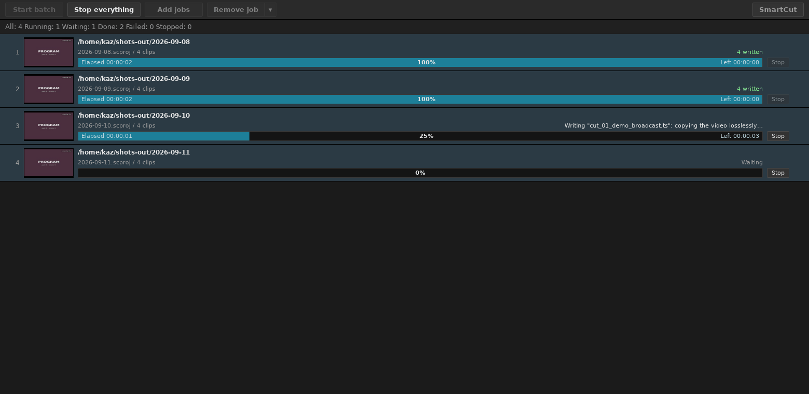

# Working through a batch

[← Documentation](../README.md) ・ [← SmartCut](../../README.md) ・ [日本語](batch.ja.md)

SmartCut is not built around opening one recording at a time. It is built for
**dropping in a whole evening's recordings and working through them**.

```
①  drop the recordings in together
②  Ctrl+A, then Ctrl+D, to run commercial detection on all of them
③  double-click them one at a time and cut
④  export the whole list at the end
```

Cuts belong to **the row in the list**, not to the editor window. So you can cut
your way down the list and leave the exporting until last.

## 1. Preparation starts the moment you drop them


The rows fill in immediately. Behind them, SmartCut is doing three jobs at once.

| Background job | What it does | How long it takes |
|---|---|---|
| **Loading** | builds the seek index, used for seeking and cutting | about 1 second per GB |
| **Thumbnails** | makes the filmstrip pictures and finds scene changes | one or two seconds per GB, longer on 4K |
| **Commercial detection** | looks for the commercial breaks (started by `Ctrl+D`) | 10–60 seconds for a 30-minute recording |

Two jobs of the same kind run one after another; jobs of different kinds run at
the same time. Progress appears at the bottom right of each row. Rows whose turn
has not come say `Queued`.

**The index is built once and kept.** Open the same recording again and the row
says `Index from an earlier run`, skipping the loading pass entirely.

**You do not have to wait.** A recording that has not finished loading still
opens on a double-click. What is available immediately and what arrives later is
in [Using the GUI](gui.md#usable-from-the-moment-it-opens).

## 2. Detect commercials across the whole list


`Ctrl+A` (select all), then `Ctrl+D` (detect commercials). That queues detection
for every selected recording. **Eighteen recordings, one keystroke** — that is
what the feature is for. Press it in the evening, look at the results in the
morning.

**There is no need to wait for the reading.** Press it straight after the drop
and a recording that has not been read yet keeps the detection, starting it as
soon as its own read finishes.

Progress appears on the row: `Detecting commercials 84% — Looking for the logo`.
Rows still queued say `Commercial detection queued`, and rows waiting to be read
say `Commercial detection after the read`. Both carry a `Detection booked` badge.

**Detection only places marks; it does not cut.** You decide what to remove,
later, in the editor. See [Commercial detection](cm-detection.md).

**To stop, press "Stop analysis".** Press it again to resume. Loading and
thumbnails can stop in the middle of a file, but commercial detection cannot, so
it stops **between** recordings.

Only what is running stops. You can stop a batch and immediately start detection
on something else.

## 3. Edit without waiting for the background

Loading, thumbnails, commercial detection and cutting all run at the same time.
**A long job on the twelfth recording does not affect the one you have open.**

While the editor window is open, the three background jobs share **half** the
machine. The picture you are looking at comes first.

**Opening the editor does not stop the background.** Work already started on
that clip runs to the end. Its progress, its pictures and its scene marks never
go backwards because you opened a window.

## 4. Splitting one recording across two rows

**⧉ Duplicate clip** adds the same recording to the list a second time. It is
there for the two-hour recording that contains two programmes: put the same file
on two rows and keep a different part in each.

**A duplicate keeps the cuts and the marks.** The second programme's cuts are
usually the first one's, moved. The index and the detection results come along
too, so nothing is read from disk again.

**Rows that would write the same filename get `_1`, `_2` in list order.** That
happens with duplicates, but also with same-named programmes from different
folders, and with recordings read off a disc (they are all called `00001`).
Without the numbers the second one would overwrite the first, and the program
would report two exports while leaving one file. Delete one of them and the
other goes back to its unnumbered name.

## 5. Export the list

The output tab writes the list **from the top down**. Each row shows its
progress and result, with the overall state, elapsed time and time remaining
above.

To export something first, **drag its row upwards**. The export order is the
list order.

`Stop export` finishes the recording it is on and then stops. It never leaves a
half-written file behind. (If you stop it while it is writing a BDAV disc, what
it has written is taken back off the disc as well — the reason is in
[Using the GUI](gui.md#4-export).)

## An overnight queue of projects

One list is one evening's work. The **batch tool** is the other axis: a queue
of saved projects, written out one after another with nobody in the room.

A job is a project file and nothing else. A `.scproj` already holds the
recordings, the cuts, the track choices and the output settings, so the queue
only has to say which files and in what order.

**That file is the queue's own copy.** バッチに登録 and ジョブ追加 both write
one into a folder of the queue's, and it is the copy that runs: editing the
project you queued from does not change what the queue will write, and taking
the row out does not touch it. To change a job, open it from its own row with
`プロジェクトを開く`.

```
①  cut an evening's recordings
②  出力 tab → バッチに登録 (one press: it saves the project and opens the tool)
③  do the same for the next evening's work
④  press バッチ開始 in the tool's window, and go to bed
```

### The tool is a window of its own



`バッチ出力ツール` on the SmartCut menu opens **a second window, in a process
of its own**. That is the point of it: closing the main window — or quitting
SmartCut entirely — does not stop a queue that is being written.

The queue lives there and nowhere else. The tool shows it, orders it, runs it
and stops it; the main window's only part in it is `バッチに登録`, which puts
the list on screen at the end of the queue — **and starts the tool if one is
not already up**. It works while the queue is running, too: an added job lands
behind the one being written, and the tool notices it within a second or two
and picks it up when it gets there.

**The bar is what you say to the queue as a whole.** `バッチ開始` starts it and
`すべて中止` calls off the job being written and every job behind it. Beside
them are the two things a queue is made of: `ジョブ追加`, which takes projects
saved earlier, several at a time — **what it takes is a copy, and the queue
runs the copy**, leaving the file you picked exactly as it was; and `ジョブ削除`, which takes out the rows you
have picked, with the `▾` on the end of it holding the two ways of doing that
in bulk — `出力済のジョブを削除` and `すべて削除`.

**Rows are picked the way they are picked on the input screen**: a click for
that row, Ctrl for one more or one fewer, Shift for everything between here and
the last plain click, and a click on the empty part of the list to let them all
go. What is picked moves together and is taken out together.

The keys are the same too. `↑` and `↓` move the picking, `Shift` with them
stretches it, `Ctrl+A` takes the lot and `Delete` takes the picked rows out.
`Enter` opens the project of a single picked row in a window of its own, and so
does a double click on the row.

**A single job is called off from its own row.** While the queue is running
each row that still has something to do carries a `中止`. On the job being
written it stops the way `出力中止` does — the recording in hand is finished
first, so nothing half-written is left behind, which for a job of one
recording means that one is written anyway — and the queue goes on to the next
job. On a job whose turn has not come, the queue passes over it. Either way it
is waiting again the next time you press `バッチ開始`: calling a job off is
about this run, and `ジョブ削除` is what takes it out for good.

The tool stays on the queue while it works, so **each job is a card rather
than a line**. It leads with **where the job writes** — the folder the project
names, the folder of its own under it where there is one, and `/BDAV` where it
is a disc. A project with no folder of its own writes beside its recordings, so
that is the folder shown; where the recordings come from more than one folder
there is no single answer, and the line names the first with a word for how
many others there are. Under that line is a name and how many recordings the
job holds, and under that, the bar.

**The picture is the frame being made.** Until the job's turn comes it is the
first recording's own picture; once the job is being written it is the frame
the output screen's preview is showing, which is a frame that is actually being
re-encoded — the joins, and nothing else, since every other frame is copied out
of the recording bit for bit. What somebody watching one list sees on that
screen is on the card here, without the screen. The last frame of a job stays
on its card afterwards.

**The line under it names the recordings.** While the job is being written it
is the one the pass has open; waiting its turn and once it is written, the
first of them with a word for how many more there are. Either way it is the
name that recording had in the list.

The project's own file is not named anywhere on the card. The queue runs a copy
it made for itself, in a folder of its own, so that name is a fact about this
program's scratch space rather than about the evening's work. A project that
cannot be read falls back to the name the job was queued under.

**The bar is a box that fills in**, and the numbers stand in it: the elapsed
time on the left, the percentage in the middle, an estimate of what is left on
the right, with the job's own `中止` beside it. They stay once the job has
finished — the clock stops where the job stopped, what is left reads zero, and
the bar keeps what it reached — so a queue that has run can be read afterwards.
`中止` stays on every row too, and is live only while there is something on
that row to stop.

**A job that writes a disc fills the bar three times**: the cuts, the index,
and the image. The percentage and the estimate are about the pass in hand, so
the bar starts again as each one begins; only the clock counts from the head of
the job. Which of the three is running is said on the line above the bar, with
the image's own percentage in it.

**Everything a row says in words is at the right of the line above the bar** —
what is being written, or that the job is waiting, written, failed or called
off — and it stops where the bar stops. So a bar with nothing in it is a job
that has not started, and one filled end to end is a job that is written.

Nothing on a card says what the output format is, because a smart render mostly
has none to state: what comes out is what went in, copied.

**The order is the running order**, and a row is moved by dragging it: press
it, carry it to where it belongs, and a line shows the gap it will drop into.
Several picked rows are carried together. Escape puts them back.

**A right click on a row** is where the rest of what can be done to the picked
jobs is: `先頭へ移動` / `上に移動` / `下に移動` / `末尾へ移動` for the order, and
then the four below — of which the middle two are about one file, and are live
only while a single row is picked.

| | |
|---|---|
| `もう一度出力する` | Puts a job that has been written — or failed, or been called off — back in the queue as one that is waiting, in the place it already holds; every picked row it applies to goes back at once. Without it the only way to write a job twice is to take it out and add it again |
| `プロジェクトを開く` | Opens that job in a list window of its own, to be worked on. On that window's 出力 screen `バッチに登録` reads **`バッチを上書き`**, and pressing it puts what you have done back into the job in the queue; `Ctrl+S` does the same |
| `出力先フォルダーを開く` | Shows where it writes, in whatever your desktop uses to show folders |
| `ジョブ削除` | Takes the picked jobs out of the queue for good, and the queue's copy of each goes with the row. The project it was copied from is left alone |

**The queue survives the program.** It is written to a file as it is changed,
so a queue lined up at midnight is still there in the morning — and a job that
has been written stays in the list with what it wrote, and is not written
again. `出力済のジョブを削除` clears out that half of it in one go, leaving
exactly the jobs still to do.

Each job runs exactly as it would by hand: the project is opened, the list is
read, and the 出力 screen writes it — the disc pass, the image and the sidecars
included.

**A job that fails does not stop the queue.** It is marked in red with what went
wrong and the next job starts: a night left to run is left because nobody is
there to answer a question.

### Sleeping or shutting down at the end

`完了後`, on the `SmartCut` menu in the corner, folds out to `何もしない`,
`スリープ` or `シャットダウン`, and shows which of them is the answer without
being opened. It is remembered with the queue. It fires once the queue has run to the end — including a queue
that ended with failures, which are still on the screen when the machine comes
back — and never over a queue somebody stopped.

Before anything happens there is **a minute's countdown with a 中止 button**
next to it. A machine that turns itself off is a machine that should say so
first.

## Recordings on a network share (NAS)

Recordings on a NAS can be dropped in like any other, and a share can be used as
the output folder.

But **SmartCut does not mount shares.** Mounting needs a password, and that
belongs to the file manager or the keyring, not to a video editor. Given a share
that is not connected, it stops and says where to connect it.

```
Not connected to \\nas\rec. Open smb://nas/rec in the file manager and add it
again. (shares connected now: \\nas\video)
```

## Saving part-way through

The whole list — recordings, cuts, track choices, output settings — saves with
`Ctrl+S` and comes back next time. See [Projects](projects.md).

---

Why the three jobs run in parallel, and how that was tuned, is in the
[design notes](../technical/design.md#three-lanes-and-an-editor-that-stays-open).
