# GUI の使い方

[← ドキュメント](../README.ja.md) ・ [← SmartCut](../../README.ja.md) ・ [English](gui.md)

画面を順に追う操作手順書です。**入れる → 切る → 出す**の 3 段で、録画を並べる
ところから書き出しが終わるところまでを通して説明します。

導入は [README](../../README.ja.md#ダウンロード)、なぜそこで切れるのかは
[アルゴリズム](../technical/algorithm.ja.md)、GUI の実装については
[設計ノート](../developers/design.ja.md)にあります。

以下のスクリーンショットは
[`tests/make_demo_media.sh`](../../tests/make_demo_media.sh) が ffmpeg のテスト用
ソースだけから生成する合成録画（1440x1080 インターレース MPEG-2、3 分 45 秒、
CM ブロック 2 つ）を切っているところです。実際の放送素材は使っていません。

## 画面は 4 つ、ウィンドウは 2 つ

画面は作業の順に並んでいます。

| 画面 | どこ | すること |
|---|---|---|
| **入力設定** | 一覧ウィンドウ（タブ 1 枚目） | 録画を並べる。追加した順にシーク用インデックスを作る |
| **カット編集** | **別ウィンドウ** | 一覧の 1 本を開いて切り、**OK** で戻る |
| **出力設定** | 一覧ウィンドウ（タブ 2 枚目） | 出力先・コンテナ・音声の扱い。**一覧のすべてのクリップに効く** |
| **出力** | 一覧ウィンドウ（タブ 3 枚目） | 一覧を上から順に書き出す |

カット編集だけがタブになっていません。ほかの 3 つは一覧全体に対して一度決める
設定ですが、カットは 1 本ずつ行う作業で、「この 1 本は終わった」という区切りが
必要だからです。その区切りが **OK** ボタンであり、別ウィンドウになっている理由も
そこにあります。

---

## 1. 録画を並べる

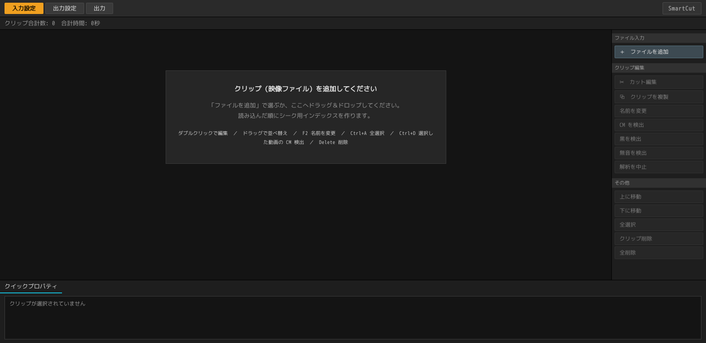

起動すると空の一覧が出ます。**クリップ**とは一覧の 1 行のことで、ディスク上の
録画ファイル 1 つを指します。

### 追加する

| やり方 | |
|---|---|
| **ドラッグ＆ドロップ** | ウィンドウのどこに落としても効きます。フォルダーを落とすとその中のファイルが入ります |
| **＋ ファイルを追加** | 右上のボタンです。複数選択できます |
| **コマンドラインの引数** | `smartcut 録画1.ts 録画2.ts`。`.scproj`（プロジェクト）も同じように開きます |

読めるのは `.ts` `.m2ts` `.mts` `.m2t` `.mp4` `.mkv` `.mov` `.m4v` です。それ以外を
落とした場合は無視した旨だけを表示し、一覧は変わりません。

### Blu-ray（BDAV / BDMV）

**ディスクは 1 件ではなく、中の録画ぶんの行になります。** `BDAV` や `BDMV` フォルダーを
含むフォルダーでも、`.iso` でも、それらが入ったフォルダーでも同じです。`.iso` は
マウントしません。中のストリームをその場で読みます。

落とすと「**ディスクの読み込み**」が開き、2 つのことを訊きます。

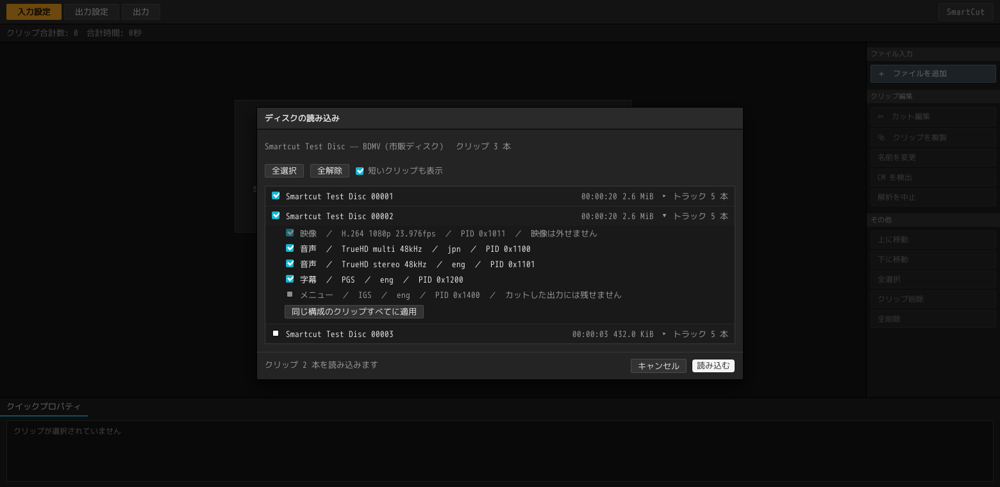

**どのクリップを読むか。** 録画ディスクは全部が候補です。市販ディスクは中身の大半が
本編ではありません——1 期ボックスなら、ロゴ・警告・メニューのループ 50 本の中に 12 話が
紛れていて、そのすべてが `000NN` という名前です——ので、5 分を超えるものに最初から
チェックが入り、残りは「短いクリップも表示」の裏にあります。各行には再生時間と
ディスク上のサイズが出ます。本編とロゴを見分けられるのはこの 2 つです。

**どのトラックを読むか。** 行の「トラック」を開くと、そのクリップが持っているものが
ディスクの索引どおりに並びます。映像、言語付きの音声、字幕、メニューです。映像は
外せません。市販ディスクの字幕とメニューは必ず外れます——カットでは持ち出せないので、
黙って落とすかわりにそう表示します。それ以外は自由に外せます。「同じ構成のクリップ
すべてに適用」で、その答えをディスク全体に写せます。1 期ボックスならこれが欲しいはずです。

録画ディスクの行の名前は `00001.m2ts` ではなく**番組名**です。ディスク自身の索引が
番組名・録画日時・チャプターを持っているので、そこから読んでいます。市販ディスクには
番組名が入っていないので、行の名前はディスク名とクリップ番号になります。

書き出し先は、出力設定で指定しないかぎり**ディスクの隣**、名前はその行の名前です
（`cut_2026年08月17日01時00分-BS11…ts`）。ディスクの中には書けないためです。
コンテナの「入力と同じ」は、この場合 `.ts` を意味します。

暗号化されたディスクは開けません。仕組みは
[Blu-ray を読む](../developers/disc.ja.md)にあります。

ネットワーク共有（SMB）のパスも、コマンドラインの引数でも、ファイルマネージャー
からのドラッグでも、出力先フォルダーの指定でも受け取ります。ただし
**SmartCut 自身はマウントを行いません。** つながっていない共有を渡すと、
「ファイルマネージャーで `smb://…` を開いてから、もう一度追加してください」と
表示して止まります。

### 追加した瞬間から裏で走るもの

クリップは追加した順に読み込まれ、シーク用インデックスがディスクに残ります。
これはカット編集を開いたときにエンジンがやることを先に済ませているだけで、
読み終えたクリップは**開いた瞬間に編集できます**。

行の右下に進み具合が出ます。`索引 2 秒` は今回作ったという意味、
`前回の索引を再利用` は以前の結果がそのまま使えたという意味です。

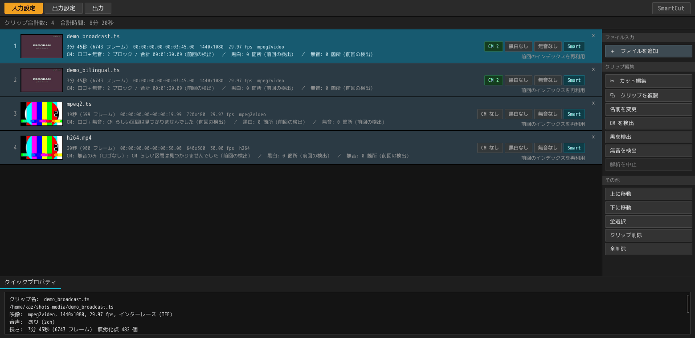

各行には、ファイル名、尺（フレーム数）・範囲・解像度・フレームレート・
コーデック、そして CM 検出とカットの結果が出ます。右端の `Smart` は
スマートレンダリングが効く素材であること、`CM 2` は CM ブロックが 2 つ
見つかったことを示します。

**左の絵はカットに追従します。** 録画の頭は黒画面や前番組の終わりのことが
多いので、少し中に入ったところの 1 枚を出しています。カットを入れたあとは
**残る側の**同じ位置から取り直すので、CM を切った行に CM の絵が残ることは
ありません。

**行はドラッグで並べ替えられます。** 書き出しはこの順に走るので、先に出したい
ものを上へ移動できます。複数選択したぶんはまとめて動きます。

### 一覧での操作

| | |
|---|---|
| **ダブルクリック** / `Enter` | その録画のカット編集を開く |
| `Ctrl+A` | 全選択 |
| `Ctrl+D` | 選択した録画の CM 検出 |
| `Delete` | 一覧から外す（ファイル自体は消えません） |
| `↑` `↓` | 選択を動かす。`Shift` を足すと範囲選択 |
| **行のドラッグ** | 並べ替え。`Esc` で取りやめ |
| **⧉ クリップを複製** | 同じ録画をもう 1 行足す。カットも印も引き継ぎます |

**複製**は、2 時間の録画に番組が 2 本入っているときのための機能です。同じ
ファイルを 2 行に置き、それぞれ別の範囲で書き出します。出力ファイル名には
`_1` `_2` と番号が付きます。

画面下の**クイックプロパティ**には、選択している 1 本の素性が出ます。パス、
コーデック、解像度、走査方式、音声、尺、無劣化点の数、シーンの数、索引の状態
です。複数選択しているときは本数だけを表示します。

### CM を検出する

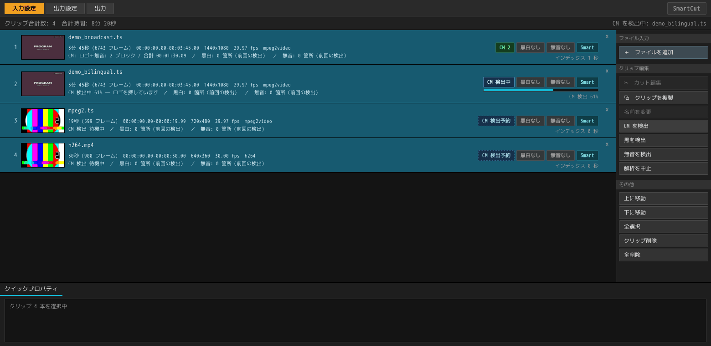

`Ctrl+A` → `Ctrl+D`（または右の「CM を検出」ボタン）で、選択したすべてに検出が
走ります。一晩ぶんの録画を放り込んで `Ctrl+D` を 1 回、というのが想定している
使い方です。検出は 1 本ずつ順に、索引作りの裏ではなく並行して進みます。

進み具合は行に出ます（`CM 検出中 84% — ロゴを探しています`）。まだ順番の来て
いない行は `CM 検出 待機中` と表示されます。音声を調べる段は数秒、ロゴを探す段は
その 10 倍ほどかかるので、進捗の数字もそのぶん重み付けしてあります。

検出できるのは、字幕のリセット・無音・局ロゴという 3 つの手掛かりから求めた
15 秒格子上の区間です。見つかったブロック数と合計時間が行に出ます。詳しくは
[CM 検出](cm-detection.ja.md)を参照してください。

**検出は印を置くところまでで、切るのは人がやります。** カット編集を開くと、
各 CM ブロックの先頭と本編に戻る位置が、すでにキーフレームとして並んでいます。

途中で止めたいときは「解析を中止」を押します。もう一度押せば続きから再開します。
検出はクリップとクリップの間で止まり、1 本の途中では止まりません。

一晩ぶんをまとめて処理する方法については[バッチ処理](batch.ja.md)を参照して
ください。

---

## 2. 切る

一覧の行をダブルクリックすると、別ウィンドウで開きます。

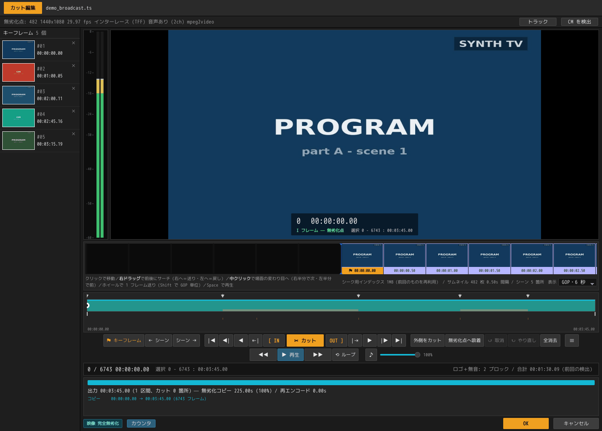

### 画面の見取り図

| どこ | 何 |
|---|---|
| 最上段 | ファイル名 |
| 情報バー | 無劣化点の数・解像度・fps・走査方式・音声・コーデック。右端に**トラック**と**CM を検出** |
| 左の列 | **キーフレーム**（印）の一覧。サムネイル付きで、押せばそこへ飛びます |
| 中央大きく | プレビュー。右下にフレーム番号・タイムコード・フレームの種別・選択範囲 |
| その下の帯 | **フィルムストリップ**。既定は 1 セル＝1 GOP（右の「表示」で 3 秒〜3 分、フレーム単位に変えられます） |
| シークバー | 緑が出力そのもの。`▼` がキーフレーム、赤い縦線がカットの継ぎ目、下の細い目盛りがシーンの変わり目 |
| ボタンの列 | 中央が**カット**、その左が `[ IN`、右が `OUT ]`。外へ向かって「移動」「1 フレーム」「無劣化点」「先頭・末尾」と対称に広がります |
| 下の帯と行 | エンジンの**実行計画**。どこをコピーし、どこを再エンコードするか |
| 右下 | **OK** と**キャンセル** |

### 見たいところへ行く

| 操作 | |
|---|---|
| フィルムストリップを**クリック** | そのコマへ移動 |
| フィルムストリップを**右ドラッグ** | 前後にサーチ。中央より右で送り、左で戻し、離れるほど速くなります |
| フィルムストリップで**中クリック** | 次のシーンの変わり目へ |
| フィルムストリップで**ホイール** | 1 目盛り 1 フレーム。`Shift` を足すと無劣化点単位で飛びます |
| シークバーを**ドラッグ** | 位置を動かす。IN / OUT の印の近くを掴むとその印が動きます |
| シークバーに**ホバー** | その時刻のコマが小さく出ます |
| `Space` または **▶ 再生** | ここから再生（映像と音声）。もう一度押すと停止 |
| `←` `→` | 1 フレーム戻る・進む。押しっぱなしで連続 |
| `Shift+←` `Shift+→` | 1 秒 |
| `S` / `Shift+S` | 次の / 前のシーンの変わり目へ |
| `◀\|` `\|▶` | 前の / 次の**無劣化点**へ |
| `\|◀` `▶\|` | 先頭・末尾へ |

**画面に出ている数字はすべて出力側の時計です。** カットしたところは灰色になる
のではなく消えます。シークバーが縮み、フィルムストリップは穴の上で閉じ、
フレームカウンタは実際に書き出される尺を数えます。

### 印と編集は別物です

- **キーフレーム**は目印であって、編集ではありません。`⚑ キーフレーム`
  （または `K`）でいまのフレームを登録します。左の列にサムネイル付きで並び、
  押せばそこへ飛びます。カードの `×` で消せます。
- **カット**が編集です。IN・OUT で範囲を選んで `✂ カット` を押すと、その範囲が
  出力から消えます。

印は自分で打たなくても並びます。CM 検出が置くもの、録画の隣の `.keyframe`
ファイル、そして**ディスク**から開いた録画では、ディスク自身が打った
チャプター——日本の録画では CM の境目そのものであることが多いものです。ディスクの
チャプターを読むのは初めて開いたときだけで、`.keyframe` があればそちらが勝ちます。

### IN と OUT で選ぶ

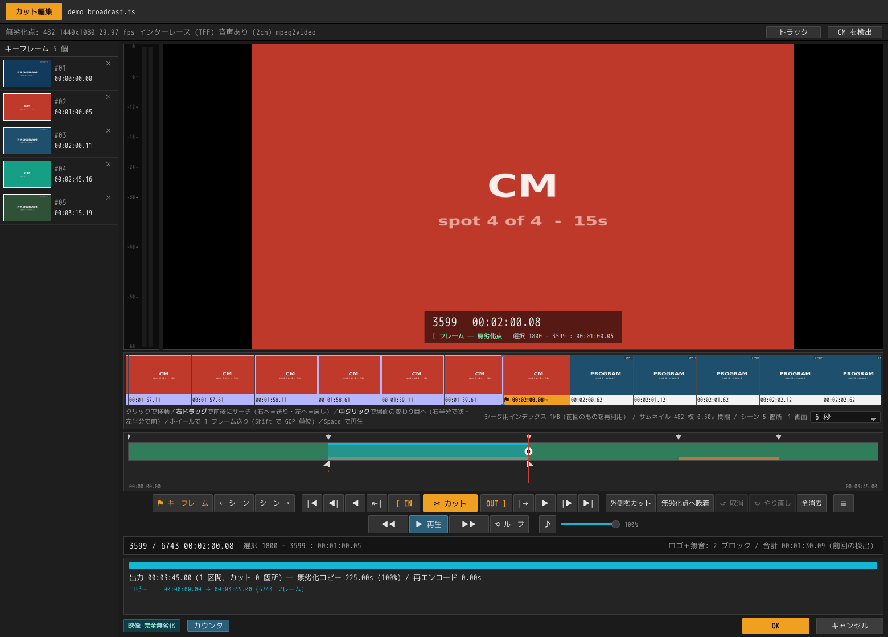

CM の先頭のキーフレームを押して `I`。続いて本編に戻る位置のキーフレームを押し、
`←` で 1 コマ戻ってから `O`。これで CM ブロックがちょうど選択に収まります。

- **IN〜OUT は OUT のフレームも含みます。** 5 フレーム選べば 5 フレーム減ります。
- **片方を打っても、もう片方は動きません。** 範囲を詰めていくときは IN と OUT を
  交互に置くので、IN を置き直したからといって OUT を失う理由はありません。
  2 つが交差したときだけ、いま置いたほうが勝ち、相手はタイムラインの端まで
  退きます。
- 選択の状態はプレビューの下とステータス行に `選択 1800 - 3599 : 00:01:00.06`
  のかたちで出ます。

### 切る

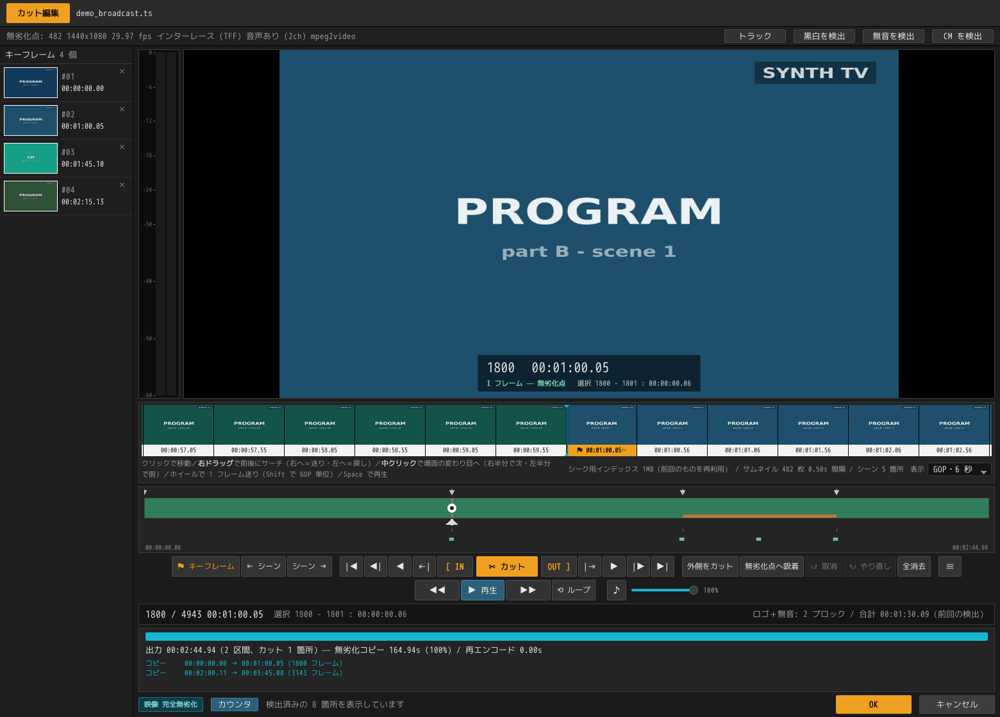

`✂ カット` を押すと、選んだ範囲が出力から消えます。画面はその場で作り直され、
下の帯と行に書き出しの計画が出ます。

```
出力 00:02:44.94（2 区間、カット 1 箇所）— 無劣化コピー 164.94s (100%) / 再エンコード 0.00s
コピー　　00:00:00.00 → 00:01:00.05（1800 フレーム）
コピー　　00:02:00.11 → 00:03:45.00（3143 フレーム）
```

左下のバッジが `映像 完全無劣化` になっていれば、この出力には再エンコードされる
コマが 1 枚もありません。もう一方の CM ブロックも同じ手順で切れば
`3 区間、カット 2 箇所` になります。

**カットが残した継ぎ目は、そのままキーフレームになります。** あとで確かめたく
なるのはまさにその位置だからです。シークバーにも赤い縦線が残ります。

### 切り直す・まとめて切る

| ボタン | |
|---|---|
| **外側をカット** | 選択の外を全部落とします。1 か所だけ切り出したいときの一手 |
| **無劣化点へ吸着** | 選択の両端をいちばん近い無劣化点へ寄せます。押せば再エンコードがゼロになります |
| **↺ 取消** | 直前のカットを戻します（50 段） |
| **全消去** | カットとキーフレームの両方を消します |

### 再エンコードが必要になるとき

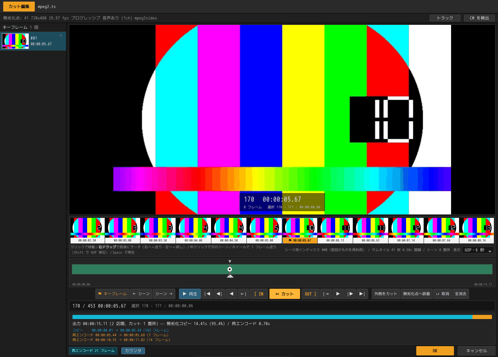

カット点が GOP の途中に落ちると、その部分 GOP だけが作り直されます。帯の橙色の
部分と、行の `再エンコード` がそれにあたります。上の例では 461 フレーム中
**14 フレーム**だけが焼き直され、尺でいえば 97.0% はバイト単位のコピーのまま
残ります。

放送録画の CM 境界は無音の位置にあり、そこはたいてい無劣化点でもあるので、CM を
落とすだけなら完全無劣化になることが多いです。任意の位置で切りたいときに、この
14 フレームぶんが代償になります。`無劣化点へ吸着` を押せばゼロにできます。

### 書き出すトラックを選ぶ

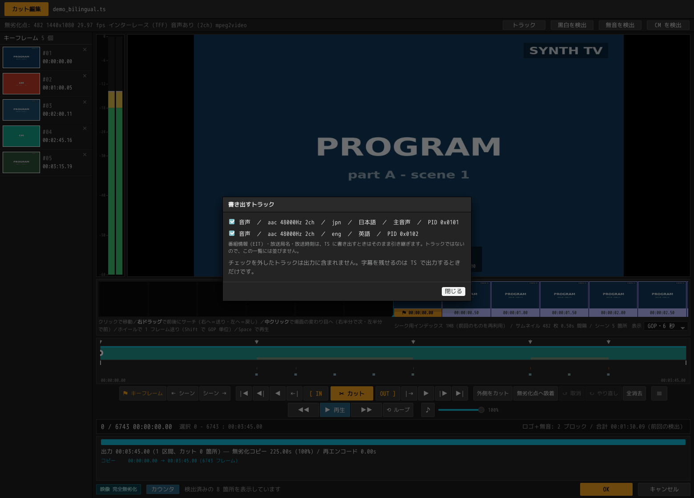

情報バーの **トラック** から開きます。放送録画には映像と音声以外のものも入って
いるので、そのうちどれを出力に含めるかをここで決めます。

**既定は全部入りです。** このメニューが存在する理由は、二か国語放送の副音声を
外したいときのためです。誰も何も言っていないトラックは、録画に入っていた
トラックです。それを黙って落とすのは、その録画が何のためのものかをプログラムが
決めてしまうことになります。

字幕を残せるのは `.ts` に書き出すときだけです。文字スーパーとデータ放送は
カットされたタイムラインに載せられないので、選択肢ではなく「持ち出せません」と
して並びます。番組情報（EIT）・放送局名・放送時刻はトラックではないので並び
ませんが、`.ts` に書き出すときはそのまま引き継がれます。

この選択は**そのクリップについての答え**なので、編集の一部としてクリップに残り、
プロジェクトにも保存されます。同じ録画を複製した 2 行が、別々の答えを持って
かまいません。

### 終える

- **OK** — カットと印を一覧に持ち帰って閉じます。
- **キャンセル** — この画面でやったことを捨てて閉じます。

どちらの場合も一覧ウィンドウは開いたままなので、すぐ次の 1 本に取りかかれます。

---

## 3. 出力設定

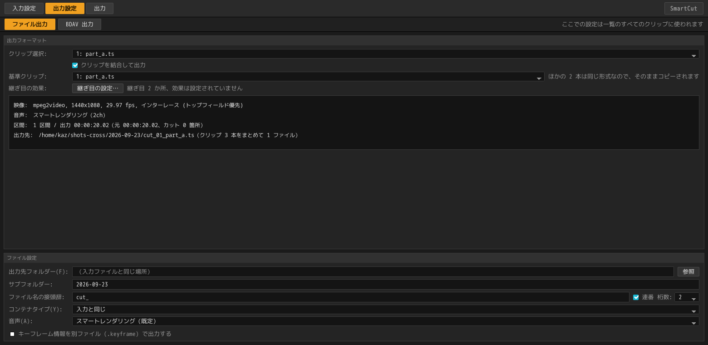

**ここでの設定は一覧のすべてのクリップに適用されます。** 上半分は確認用で、
クリップを選ぶと、その録画が現在の設定でどう書き出されるかが出ます。映像・音声・
区間の数と出力尺・出力先のパスです。

| 項目 | |
|---|---|
| **出力先フォルダー** | 空欄なら入力ファイルと同じ場所です。`参照` で選ぶか、パスを直接書きます（SMB のパスも可） |
| **ファイル名の接頭辞** | 既定は `cut_` で、`cut_録画.ts` のように前に付きます |
| **コンテナタイプ** | `入力と同じ` か、特定のコンテナを選びます。器は拡張子で決まります |
| **音声** | `スマートレンダリング（既定）` / `そのままコピー` / `すべて再エンコード` |
| **音声コーデック** | `入力と同じ` のほか AAC・AC-3・DTS・リニア PCM。素材と違うコーデックを選ぶと、**全編を焼き直します** |
| **音声チャンネル** | `入力と同じ` のほか 1ch・2ch・5.1ch。素材と違う数を選ぶとダウンミックスになり、**全編を焼き直します**。素材より多いチャンネル数は選べないよう灰色にします |
| **サンプリング周波数** | `入力と同じ` のほか 96 / 48 / 44.1 / 32 kHz。96 kHz は Blu-ray の LPCM が使うレートです。素材と違うレートはリサンプルになり、**全編を焼き直します**。書き出すコーデックが扱えないレート（AC-3 と DTS は 48 kHz まで）と、素材より高いレートは選べないよう灰色にします。`入力と同じ` で素材のレートを扱えないときだけ、扱えるうちで最も近いレートで書きます |
| **量子化ビット数** | `入力と同じ` のほか 16 bit・24 bit。素材が 16 bit なら 24 bit は選べないよう灰色にします。`リニア PCM` のときだけ有効です。ほかのコーデックは音そのものではなく音の記述を書くので、ビット数の置き場所がありません。非圧縮トラックの大きさはこれで決まり（チャンネル数 x ビット数 x サンプリング周波数）、ビットレートの代わりに表示される値がそれです |
| **音声ビットレート** | 焼き直すときのビットレートです。`おまかせ` はコーデックとチャンネル数に見合った値を選びます。エンコーダーが実際に受け付ける段だけを並べます（DTS には上限だけでなく下限もあります） |
| **キーフレーム情報を別ファイル (.keyframe) で出力する** | 動画と同じ名前の `.keyframe` を隣に出します |

**音声の 3 つのモードの違い。** 既定の `スマートレンダリング` は継ぎ目にかかる
数フレームだけを焼き直し、切った側の音が漏れないようにします。無音で切れば
`そのままコピー` と 1 バイトも変わりません。`そのままコピー` はバイト単位で
無劣化ですが、継ぎ目に切った側の音が少し残ります。`すべて再エンコード` は
サンプル精度で切れるかわりに全編が焼き直しになります。詳しくは
[音声](../technical/audio.ja.md)にあります。

**ディスクから来た音声。** Blu-ray の LPCM は AAC と同じくスマートレンダリングの
対象です。DTS-HD と TrueHD はロスレスで、ここではそのフレームを焼き直しません。
どのモードでも継ぎ目ごとコピーし、そう表示します。MP4 には Blu-ray の LPCM を
入れる箱が無いので、同じサンプルを素の PCM として書きます（失われるものは
ありません）。TrueHD も入りますが、規格外であり、映像より数ミリ秒遅れて始まります。
`.ts` と `.m2ts` はどれもディスクのまま運ぶので、`入力と同じ` を選べばそうなります。

**音声コーデックを選ぶと何が起きるか。** コピーできるのは素材と同じコーデックの
フレームだけなので、別のコーデックを選ぶことは全編の焼き直しを選ぶことです
（ダウンミックスと同じ理屈です）。用途で選んでください。AAC は放送が積んでいる
もので、スマートフォンでもそのまま再生できます。AC-3 はディスクプレーヤーや
AV アンプが最も確実に鳴らします。DTS も同じくアンプ向けです。リニア PCM は
非圧縮 — 編集を続ける素材として渡すなら、二世代目の劣化がありません。

ビットレートの候補はコーデックごとに変わります。AC-3 と DTS はビットレートを
規格の表から選ぶ形式なので、その表にある値だけを出します。**リニア PCM のときは、
実際にかかるビットレートを表示したうえで欄が灰色になります。** 非圧縮の大きさは
「チャンネル数 × ビット深度 × サンプリング周波数」で決まるので、選ぶ余地は無く、
知らせる価値だけがあるからです。一覧のクリップごとに値が違う場合は範囲で示します。
上の設定出力フォーマットの音声行は 1 クリップの説明なので、常にそのクリップ自身の
値が出ます。

この表示が織り込んでいる意外な点が 1 つあります。Blu-ray の LPCM はチャンネルを 2 本
ずつ書くので、モノラルを `.ts` に入れると 2 チャンネル分——768 ではなく 1536 kbit/s
——かかります。

なお、リニア PCM を `.ts` に書くときは、トランスポートストリーム自体を HDMV
（Blu-ray の流儀）として登録します。それが LPCM を宣言できる唯一の書き方だから
です。`.mp4` や `.mkv` ではビッグエンディアンの素の PCM になります。

**規格上書けない組み合わせは灰色になります。** この 5 つの組み合わせがすべて
ファイルとして書けるわけではなく、書けるかどうかは素材と行き先で変わります。
Blu-ray の LPCM——トランスポートストリームが宣言できる唯一のリニア PCM——は
48 kHz では書けても 44.1 kHz では書けません。DTS はモノラル・ステレオ・クアッド・
5.0・5.1 のいずれかでしか書けず、さらに 1 フレームが全チャンネルを記述できる長さを
必要とするため、チャンネル数とサンプリング周波数に応じたビットレートの下限が
あります（5.1 の 48 kHz なら 768 kbit/s から）。

書けない候補は一覧から消さずに灰色のまま残します。黙って短くなった一覧は、
何が無いのかを言えないからです。どれが灰色になるかは、ほかの設定と一緒に動きます。
44.1 kHz を選べば `リニア PCM` が灰色になり、コンテナを MP4 に変えれば——そこでは
素のビッグエンディアン PCM として書き、レートを選びません——また選べるように
なります。判断はこの画面の持つ表ではなくエンジンが返します。出るのは、この
ビルドがリンクしているエンコーダーが実際に開ける組み合わせです。

**素材より大きい値も灰色になります。** この 5 行のうち 3 行——チャンネル数・
サンプリング周波数・量子化ビット数——はサンプルそのものを指定するもので、
焼き直しなら素材より大きい値でも書けてしまいます。ただし、書けることと
増えることは別です。2ch から作った 6ch は 2ch 分の音を 6 本に広げたもの、
44.1 kHz から作った 48 kHz は同じ波形を多い点で描き直したもの、16 bit から
作った 24 bit は下位 8 bit が 0 のままの同じ数値です。増えるのはファイルの
大きさだけなので、この 3 行は素材の値とそれ以下だけを出し、上は灰色にします。
96 kHz は、そのレートを持つ素材——LPCM やロスレス音声を 96 kHz で収めた
Blu-ray——のときに選べ、48 kHz で標本化された放送では灰色になります。

一覧に対する「素材の値」は、その中で最も小さいものです。ここでの設定は一覧の
すべてのクリップ・すべてのトラックに適用されるので、ステレオの録画と 5.1ch の
録画が並んでいれば上限は 2ch になります——5.1ch を選べば前者が広げられてしまう
からです。値を持たない素材は上限を決めず、読み込みが終わったクリップが 1 本も
無いあいだは各行とも全部を出します。

**モードの下にある 5 行——音声コーデック・音声チャンネル・サンプリング周波数・
量子化ビット数・音声ビットレート——は、モードが `すべて再エンコード` のときだけ
現れます。** どれもエンコードの内容を指定するものであり、ほかの 2 つのモードは
全編のエンコードを行わないからです。隠れているあいだも値は保持されるので、
モードを戻せばそのまま使えます。

`.keyframe` の中身は**行番号だけ・CRLF 改行・ヘッダなし**で、番号は書き出した
ファイル側の時計で数えます。同じ名前の `.keyframe` が動画の隣にあれば、その動画を
SmartCut で開いたときに自動で読み込みます。

---

## 4. 書き出す

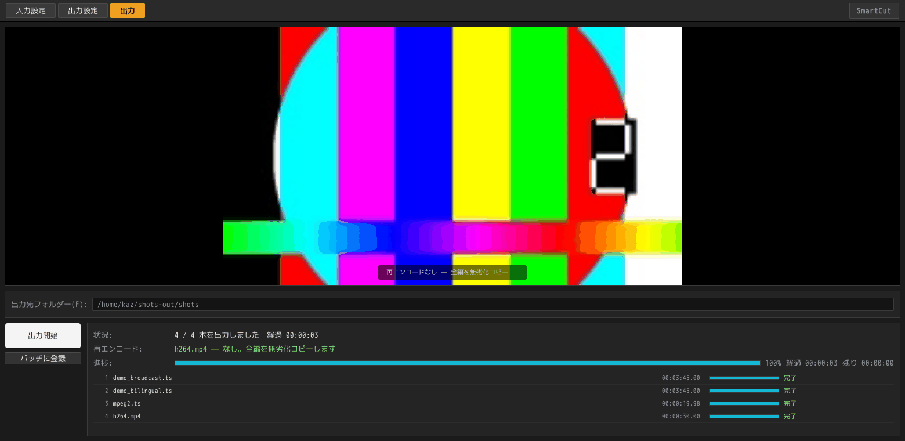

`出力開始` を押すと、一覧を上から順に書き出します。行ごとに進み具合と結果が出て、
その上に全体の状況・経過時間・残り時間が出ます。書き終わると
`4 / 4 本を出力しました` のように表示されます。

`出力中止` は、いま書き出しているクリップを最後まで書き終えてから止まります。

### この画面に出るのは「再エンコードされるコマ」です

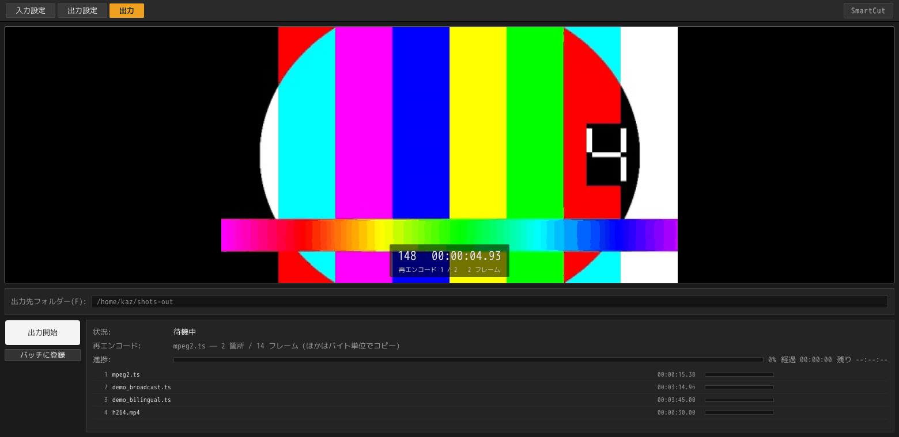

大きく出ているのは代表画像ではありません。再エンコードされるコマそのもの、
つまり**このプログラムの責任で画質が変わりうる唯一の場所**です。何箇所あるかは
`再エンコード 1 / 2`、全部で何フレームかは上の行に出ます。

カットがすべて無劣化点に乗ったクリップでは、代表画像が出て、その下に
`再エンコードなし — 全編を無劣化コピー` と表示されます。

---

## 作業を保存する

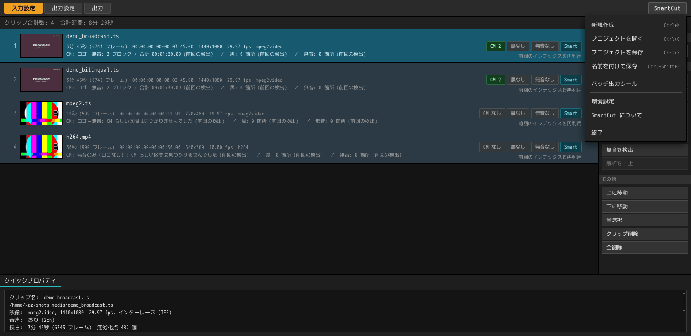

右上の **SmartCut** ボタンから、プロジェクトの保存と読み込みができます
（`Ctrl+S` / `Ctrl+O`）。プロジェクトが保持するのは一覧そのもの、つまり録画の
パス、入れたカットと印、トラックの選択、出力設定です。

`.scproj` ファイルは数百バイトしかなく、別のマシンでも、キャッシュを消した
あとでも開けます。中身と、その設計理由は[プロジェクト](projects.ja.md)を
参照してください。

## 表示言語とバージョン情報

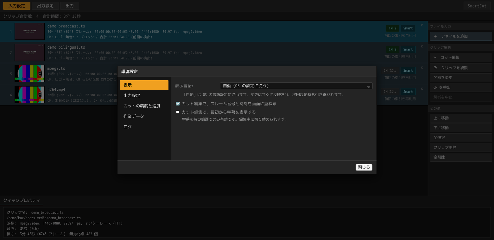

同じメニューの **環境設定…** で表示言語を選べます。日本語・English・OS の設定に
従う（既定）の 3 つです。変更は両方のウィンドウにその場で反映され、次回起動時も
引き継がれます。

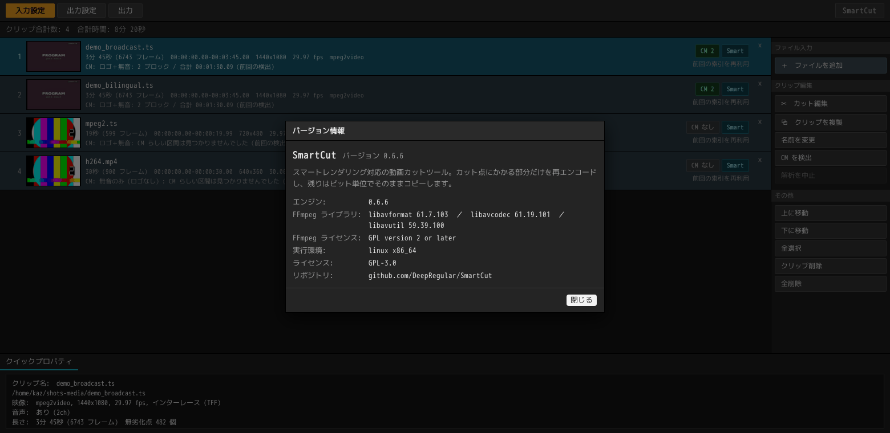

**SmartCut について** はバージョン情報を表示します。本体とカットエンジンの版、
実際に読み込まれている FFmpeg ライブラリの版とライセンス、実行環境です。両方の
ウィンドウのうち、テキストを選択してコピーできるのはここだけなので、不具合を
報告するときはそのまま貼り付けられます。

---

## キーボード一覧

### 一覧ウィンドウ

| | |
|---|---|
| `Ctrl+A` | 全選択 |
| `Ctrl+D` | 選択した録画の CM 検出 |
| `Ctrl+S` / `Ctrl+Shift+S` | プロジェクトを保存 / 名前を付けて保存 |
| `Ctrl+O` | プロジェクトを開く |
| `Enter` / ダブルクリック | カット編集を開く |
| `Delete` | 一覧から外す |
| `↑` `↓`（`Shift`＋で範囲） | 選択を動かす |

### カット編集ウィンドウ

| | |
|---|---|
| `Space` | 再生 / 停止 |
| `←` `→` | 1 フレーム（押しっぱなしで連続） |
| `Shift+←` `Shift+→` | 1 秒 |
| `I` / `O` | ここを選択の開始 / 終わりに |
| `K` | いまのフレームをキーフレームに登録 |
| `S` / `Shift+S` | 次の / 前のシーンの変わり目へ |
| `Ctrl+D` | CM を検出 |

---

## うまくいかないとき

| 症状 | 対処 |
|---|---|
| **ファイルを落としても何も起きない** | 対応拡張子（`.ts` `.m2ts` `.mts` `.m2t` `.mp4` `.mkv` `.mov` `.m4v`）か確認してください。フォルダーは受け取りません |
| **「`\\nas\rec` につながっていません」と出る** | ファイルマネージャーで先にその共有を開いてください。SmartCut はマウントを行いません |
| **字幕が出力に入らない** | 字幕を残せるのは `.ts` に書き出すときだけです。出力設定のコンテナタイプを確認してください |
| **編集画面の絵が粗い / 出るのが遅い** | 初回は索引とサムネイルを作っています。下の行に進み具合が出ます。2 回目以降は作りません |
| **再エンコードを 0 にしたい** | 範囲を選んで `無劣化点へ吸着` を押してください。それでも 0 にならない場合、その素材はカット点がアクセスポイントに乗りません |
| **対応していないコーデック・構成** | [既知の制限](../technical/validation.ja.md#既知の制限)を参照してください |

---

## コマンドラインリファレンス

GUI と同じエンジンが `smartcut`（deb では `smartcut-cli`）としても使えます。

```bash
smartcut input.ts --keep 5.3-12.7 -o out.ts   # この区間を残す
smartcut input.ts --cut 8.0-20.0  -o out.ts   # この区間を削除する
smartcut input.ts --analyze                   # 計画だけ表示し、書き出さない

smartcut input.ts --analyze --detect-cm --logo  # CM 候補を一覧する
smartcut input.ts --analyze --scenes            # シーンの変わり目を一覧する
```

| オプション | 意味 |
|---|---|
| `--keep START-END` / `--cut START-END` | 残す / 削除する区間。複数指定できます。`1:23:45.6` 形式も使えます |
| `--audio-mode smart\|copy\|reencode` | 既定は `smart` で、境界にかかるフレームだけを焼き直すので切った側の音が漏れません。継ぎ目が無音なら 1 フレームも焼き直しません。`copy` はバイト単位で無劣化、`reencode` はサンプル精度です |
| `--audio-codec source\|aac\|lpcm\|ac3\|dts` | 出力する音声コーデック。既定の `source` は素材のままです。ほかを選ぶとコピーできるフレームが無くなるので、`--audio-mode` が何であれ全編を焼き直します。`--audio-bitrate` を省くと、そのコーデックとチャンネル数に見合った値を使います（LPCM にビットレートはありません） |
| `--audio-channels N` | 出力するチャンネル数（1〜8）。素材と違う数はダウンミックス（サラウンドを持て余す再生環境のために 5.1ch を 2ch へ畳む）になります。ダウンミックスにコピー経路は無いので、`--audio-mode` が何であれ全編を焼き直します |
| `--audio-bitrate RATE` | 焼き直す音声のビットレート。`192k` でも `192000` でも指定できます。省くと素材に合わせ、畳んだときはチャンネル数に応じて下げます。エンコーダーが開けない値——DTS の下限はチャンネル数とレートで動きます——のときは、そのコーデックが通常運ばれる値まで上げたうえでそう伝えます |
| `--audio-samplerate RATE` | 焼き直す音声のサンプリング周波数。`48k` でも `48000` でも指定できます。省くと素材に合わせます。素材と違うレートはリサンプルで、ダウンミックスと同じくコピー経路が無いので、`--audio-mode` が何であれ全編を焼き直します。すべてのコーデックがすべてのレートを扱えるわけではなく（AC-3 は 3 種類、Blu-ray LPCM は別の 3 種類）、扱えないレートを指定すると最も近いものに直したうえでそう伝えます |
| `--audio-bits 16\|24` | 書き出す音声の量子化ビット数。リニア PCM のときだけ意味を持ちます。非可逆コーデックは浮動小数点を受け取ってビットレートを使うので、ビット数を指定しても断ったうえでそう伝えます。省くと素材に合わせます |
| `--aac auto\|mpeg2\|mpeg4` | SmartCut が書くフレームが名乗る AAC の種別。既定の `auto` は素材に合わせます（放送素材なら MPEG-2 AAC） |
| `--index scan\|container` | アクセスポイント索引の作り方。`container` は速いですが TS では使えません |
| `--seek-index PATH` | シーク用インデックスの置き場所。初回に書き、2 回目からは読むのでパケットの走査を省けます |
| `--detect-cm` / `--logo` / `--scenes` | CM 候補・ロゴ併用・シーン検出 |
| `--drop-stream INDEX` | 録画のストリームを 1 本、出力から外します（複数指定可）。カット編集の**トラック**メニューと同じものです |
| `--title N` | Blu-ray（フォルダーまたは `.iso`）の何番目の録画を開くか。番号のかわりに番組名の一部でも指定できます。省くと一覧を表示して終わります |
| `--tables partial\|broadcast\|muxer` | `.ts` の自己記述をどう書くか。既定の `partial` は部分 TS（SIT 1 枚、DVB EN 300 468 Annex C / ARIB TR-B15）、`broadcast` は録画自身の PMT・SDT・EIT・TOT を戻し、`muxer` は多重化器が書いたテーブルをそのまま残します |
| `--no-open-gop` | オープン GOP をコピー開始点として使いません |
| `-o OUTPUT` | 出力先。器は拡張子で決まります |
