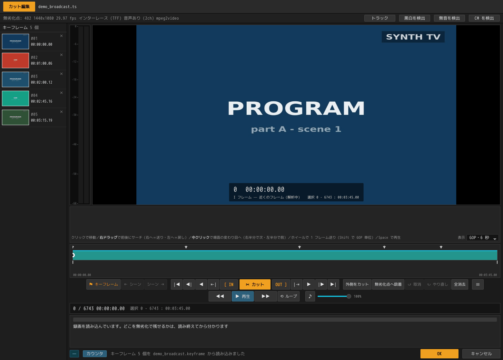
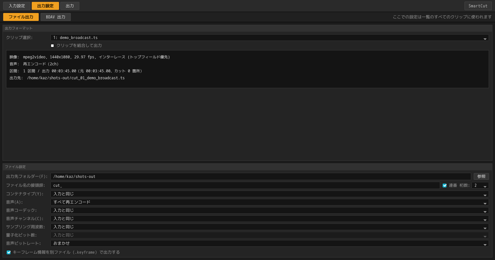
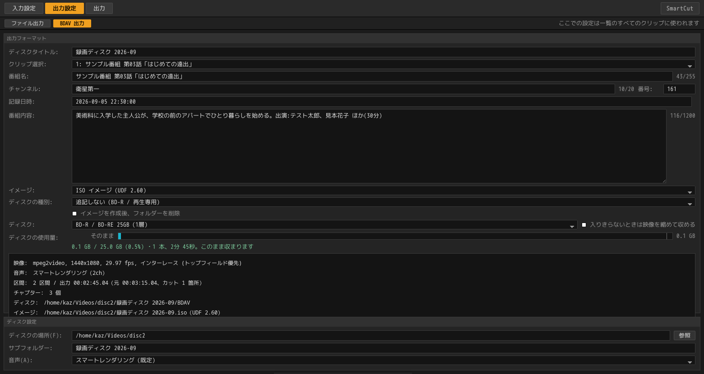

# GUI の使い方

[← ドキュメント](../README.ja.md) ・ [← SmartCut](../../README.ja.md) ・ [English](gui.md)

画面を順に追っていく操作手順書です。**入れる → 切る → 出す**の 3 段構えで、
録画を並べるところから書き出しが終わるところまでを通して説明します。

- インストールの仕方は [README](../../README.ja.md#ダウンロード)にあります。
- コマンドラインから使いたいときは[コマンドラインで使う](cli.ja.md)へ。
- 「なぜその位置で切れるのか」を知りたくなったら
  [アルゴリズム](../technical/algorithm.ja.md)へ。

> このページのスクリーンショットは、実際の放送素材ではありません。
> [`tests/make_demo_media.sh`](../../tests/make_demo_media.sh) が ffmpeg の
> テスト用の映像だけから作る、練習用の偽の録画です（1440x1080、3 分 45 秒、
> CM ブロック 2 つ）。

---

## 最初に：画面は 4 つ、ウィンドウは 2 つ

画面は、作業の順番どおりに並んでいます。

| 画面 | どこにある | すること |
|---|---|---|
| **入力設定** | 一覧ウィンドウ（タブ 1 枚目） | 録画を並べる |
| **カット編集** | **別ウィンドウ** | 一覧の 1 本を開いて切り、**OK** で戻る |
| **出力設定** | 一覧ウィンドウ（タブ 2 枚目） | 保存先・ファイルの形式・音声の扱い。**一覧全部に効きます** |
| **出力** | 一覧ウィンドウ（タブ 3 枚目） | 一覧を上から順に書き出す |

カット編集だけが別ウィンドウになっています。ほかの 3 つは「一覧全体について
一度決める設定」ですが、カットは 1 本ずつやる作業で、「この 1 本は終わった」と
いう区切りが要るからです。その区切りが **OK** ボタンです。

---

## 1. 録画を並べる


起動すると、空の一覧が出ます。この一覧の 1 行を**クリップ**と呼びます。
1 行が、録画ファイル 1 つに対応します。

### 追加する

| やり方 | |
|---|---|
| **ドラッグ＆ドロップ** | ウィンドウのどこに落としても構いません。フォルダーを落とすと、その中の対応ファイルが入ります |
| **＋ ファイルを追加** | 右上のボタンです。まとめて選べます |
| **コマンドラインの引数** | `smartcut 録画1.ts 録画2.ts`。保存したプロジェクト（`.scproj`）も同じように開けます |

読めるファイルはこれだけです。

```
.ts  .m2ts  .mts  .m2t  .mp4  .mkv  .mov  .m4v      （動画ファイル）
.vob .mpg   .mpeg .m2p                              （DVD の中身）
```

これ以外を落としたときは、「無視しました」とだけ表示して、一覧は変わりません。

### ディスク（Blu-ray・DVD）を開く

**ディスクは、そのまま開けます。** `BDAV`・`BDMV`・`VIDEO_TS` フォルダーを
含むフォルダーでも、`.iso` ファイルでも構いません。`.iso` はマウント（接続）
しなくても、中身をその場で読みます。

**ディスクは 1 行ではなく、中に入っている録画の数だけ行になります。**

落とすと「**ディスクの読み込み**」画面が開いて、2 つのことを聞かれます。


**① どの録画を読むか。**
レコーダーで録ったディスクなら、中身は全部が候補です。
市販のディスクはそうではありません。アニメ 1 期のボックスには、ロゴ・警告・
メニューのループが 50 本ほど入っていて、本編 12 話はその中に紛れています。
しかもディスク上では、その 62 本すべてが `000NN` という名前です。

そこで、**5 分を超えるものにはあらかじめチェックが入っています。**
短いものは「短いクリップも表示」の裏に隠れています。各行には再生時間と
ファイルサイズが出るので、本編とロゴはたいていこの 2 つで見分けられます。

**② どのトラックを読むか。**
行の「トラック」を開くと、その録画が持っているもの——映像、言語付きの音声、
字幕、メニュー——が並びます。映像は外せません。市販ディスクの字幕とメニューは
必ず外れます（カットした映像には載せられないためです）。
「同じ構成のクリップすべてに適用」を押すと、その答えをディスク全体にコピー
できます。ボックスものではこれが便利です。

**行の名前について。**

| ディスクの種類 | 行に出る名前 |
|---|---|
| レコーダーで録った Blu-ray（BDAV） | **番組名**（ディスク自身が番組名・録画日時・チャプターを持っています） |
| 市販の Blu-ray（BDMV） | ディスク名 + クリップ番号（番組名が入っていないため） |
| DVD-Video | ディスク名 + タイトル番号 |

**開くのは一瞬です。** ディスクは「どこから再生を始められるか」の一覧を自分で
持っているので、SmartCut はそれを読むだけで済みます。録画を丸ごと調べません。
81 GB・2 時間 34 分のディスクで、8 分 45 秒かかっていたものが 1 秒未満に
なりました。

**ディスクが打ったチャプターは、最初からタイムラインに並びます。**
日本の録画では、チャプター位置が CM の切れ目そのものであることが多いためです。

書き出し先は、出力設定で指定しないかぎり**ディスクと同じ場所**です
（ディスクの中には書き込めないためです）。

暗号化されたディスクは、DVD も Blu-ray も開けません。

### 落とした瞬間に始まること


**行はドロップした瞬間に埋まります。** 長さ・解像度・フレームレート・
コーデック・音声の有無は、ファイル自身が名乗っている情報なので、
録画がどれだけ長くても 30 ミリ秒で分かります。左の絵も同じ時点で入ります。
20 本落としても、最後の行がパスと空の四角のまま数分待たされることはありません。

そのうえで、裏では**下ごしらえ**が進みます。

| 表示 | 何をしている |
|---|---|
| `読み込み中` | 早送りやカットに使う索引を作っています（画面では「シーク用インデックス」と呼びます。1 GB あたり 1 秒くらい） |
| `サムネイル` | 帯に並べる絵と、場面の変わり目を作っています（1 GB あたり 4 秒くらい） |
| `待機中` | まだ順番が来ていません |
| `索引 2 秒` | 今回、索引を作り終えました |
| `前回の索引を再利用` | 前に作った索引が使えたので、読み込みを省きました |

ウィンドウの右上には、いまどのクリップを見ているかが出ます。
上の図では、2 本目を読み込みながら 1 本目のサムネイルを作っているところです。
3・4 本目はまだ順番待ちですが、**4 行とも内容と絵はもう表示されています。**

読み込みが終わると、行の数字はそちらの答えで置き換わります。食い違うのは
長さだけです。DVD の中身は自分の長さを記録していないので、最初の答えが
外れることがあります。

**どの処理も、編集を待たせません。** まだ読み込みの終わっていない録画も
ダブルクリックで開けます（[開いた瞬間から使えます](#開いた瞬間から使えます)）。

### 一覧での操作


各行には、ファイル名、長さ（フレーム数）・範囲・解像度・フレームレート・
コーデック、そして CM 検出とカットの結果が出ます。
右端の `Smart` は「この素材ならスマートレンダリングが効く」という印、
`CM 2` は「CM ブロックが 2 つ見つかった」という意味です。

| 操作 | |
|---|---|
| **ダブルクリック** / `Enter` | その録画のカット編集を開く |
| `Ctrl+A` | 全選択 |
| `Ctrl+D` | 選択した録画の CM 検出 |
| `Delete` | 一覧から外す（**ファイル自体は消えません**） |
| `↑` `↓` | 選択を動かす。`Shift` を足すと範囲選択 |
| **行のドラッグ** | 並べ替え。`Esc` で取りやめ |
| **右クリック** | その行に対する操作をメニューで出す |
| **⧉ クリップを複製** | 同じ録画をもう 1 行足す。カットも印も引き継ぎます |

**左の絵はカットに追従します。** 録画の頭は黒画面や前の番組の終わりのことが
多いので、少し中に入ったところの 1 枚を出しています。カットを入れたあとは
**残る側の**同じ位置から取り直すので、CM を切った行に CM の絵が残ることは
ありません。

**行はドラッグで並べ替えられます。** 書き出しはこの順に走るので、先に出したい
ものを上へ移動してください。

**複製**は、2 時間の録画に番組が 2 本入っているときのための機能です。
同じファイルを 2 行に置いて、それぞれ別のところを残します。出力ファイル名には
`_1` `_2` と番号が付きます。

画面下の**クイックプロパティ**には、選んでいる 1 本の詳しい情報が出ます。
複数選んでいるときは本数だけを表示します。

### CM を検出する


`Ctrl+A` → `Ctrl+D`（または右の「CM を検出」ボタン）で、選んだ録画すべてに
検出が走ります。**一晩ぶんをまとめて追加して `Ctrl+D` を 1 回**、というのが
想定している使い方です。

進み具合は行に出ます（`CM 検出中 84% — ロゴを探しています`）。
まだ順番の来ていない行は `CM 検出 待機中` です。

**検出は印を置くところまでで、切るのは人がやります。**
カット編集を開くと、各 CM ブロックの先頭と本編に戻る位置が、すでにキーフレーム
として並んでいます。詳しくは [CM 検出](cm-detection.ja.md)を見てください。

途中で止めたいときは「解析を中止」を押します。もう一度押せば続きから再開します。

一晩ぶんをまとめて扱う流れは[まとめて処理する](batch.ja.md)にあります。

---

## 2. 切る

一覧の行をダブルクリックすると、別ウィンドウで開きます。


### 開いた瞬間から使えます

編集画面は、録画を読み終えるのを待ちません。開いてから、**使えるものが 3 段階で
増えていきます。**

| いつ | 使えるようになるもの |
|---|---|
| **開いた瞬間**（30 ミリ秒） | 長さ・解像度・fps・音声・コーデック、タイムライン、シークバー、キーフレーム、**カットそのもの**、トラック選択、CM 検出 |
| **読み込みが終わったとき**（1 GB あたり約 1 秒） | 無劣化点の数、`無劣化点へ吸着`、コマ単位で正確なプレビュー、出力の計画、再生 |
| **サムネイルができたとき**（1 GB あたり約 4 秒） | 帯の絵がすべて埋まる、場面の変わり目、シークバーのホバー |

**待たされるのは 2 つだけです。** `無劣化点へ吸着` は吸着する先がまだ無いので、
`再生` は始める位置がまだ正確に決まらないので、少しあとになります。
それ以外は 1 段階目から使えます。



下の帯に `録画を読み込み中です。無劣化で残る範囲は読み終えてから分かります` と
書かれているあいだが 1 段階目です。`無劣化点へ吸着` は灰色ですが、
プレビューは出ていて、帯にも絵が並び、**カットはもう入れられます。**

**この段階の絵は「だいたいの位置」で取ったものです。** 正確な位置を知るための
索引がまだ無いので、帯のセルは等間隔に刻まれ、絵が入らないセルが残ることが
あります。再生位置を動かしているあいだは速いほうだけで埋め、**手を止めた瞬間に
残りが埋まります。** サーチ中はまばらに見えて、離すと詰まるのはこのためです。

読み込みが終われば、どちらも正確なものに揃います。**先に入れたカットは、
入れた位置のまま残ります。** 変わるのはその代償だけです。切れ目が無劣化点に
乗っていなければ、数フレームの再エンコードとして計画に出てきて、
`無劣化点へ吸着` が使えるようになった時点でゼロにできます。

### 画面のどこに何があるか

| どこ | 何 |
|---|---|
| 最上段 | ファイル名 |
| 情報バー | 無劣化点の数・解像度・fps・走査方式・音声・コーデック。右端に**トラック**と**CM を検出** |
| 左の列 | **キーフレーム**（印）の一覧。サムネイル付きで、押せばそこへ飛びます |
| 中央 | プレビュー。右下にフレーム番号・時刻・そのコマの種類・選択範囲 |
| その下の帯 | **フィルムストリップ**。前後のコマを絵で並べたものです。1 セルの長さは右の「表示」で選べます |
| シークバー | **緑が出力そのもの**。`▼` がキーフレーム、赤い縦線がカットの継ぎ目、下の細い目盛りが場面の変わり目 |
| ボタンの列 | 中央が**カット**、その左が `[ IN`、右が `OUT ]`。外へ向かって「移動」「1 フレーム」「無劣化点」「先頭・末尾」と対称に広がります |
| 下の帯と行 | **書き出しの計画**。どこをコピーして、どこを作り直すか |
| 右下 | **OK** と**キャンセル** |

> **「無劣化点」とは。** 映像は、そこだけで絵になる**キーフレーム**と、前後の
> コマとの差分だけを持つコマが交互に並んでできています。差分のコマの途中で
> 切ると、そこから絵を組み立て直さなければなりません。
> **キーフレームの位置で切れば、その必要がありません。**
> SmartCut はこの「そのまま切れる位置」を無劣化点と呼んでいます。

**画面に出ている数字は、すべて出力側の時計です。** カットしたところは灰色に
なるのではなく、消えます。シークバーが縮み、帯は穴の上で閉じ、フレーム
カウンタは実際に書き出される長さを数えます。

### 見たいところへ行く

| 操作 | |
|---|---|
| フィルムストリップを**クリック** | そのコマへ移動 |
| フィルムストリップを**右ドラッグ** | 前後にサーチ。中央より右で送り、左で戻し、離れるほど速くなります |
| フィルムストリップで**中クリック** | 次の場面の変わり目へ |
| フィルムストリップで**ホイール** | 1 目盛り 1 フレーム。`Shift` を足すと無劣化点単位で飛びます |
| シークバーを**ドラッグ** | 位置を動かす。IN / OUT の印の近くを掴むと、その印が動きます |
| シークバーに**ホバー** | その時刻のコマが小さく出ます |
| `Space` または **▶ 再生** | ここから再生（映像と音声）。もう一度押すと停止 |
| `←` `→` | 1 フレーム戻る・進む。押しっぱなしで連続 |
| `Shift+←` `Shift+→` | 1 秒 |
| `S` / `Shift+S` | 次の / 前の場面の変わり目へ |
| `◀\|` `\|▶` | 前の / 次の**無劣化点**へ |
| `\|◀` `▶\|` | 先頭・末尾へ |

### 印とカットは別物です

- **キーフレーム**は目印であって、編集ではありません。`⚑ キーフレーム`
  （または `K`）で、いま見ているコマを登録します。左の列にサムネイル付きで
  並び、押せばそこへ飛びます。カードの `×` で消せます。
- **カット**が編集です。IN と OUT で範囲を選んで `✂ カット` を押すと、
  その範囲が出力から消えます。

印は、自分で打たなくても並ぶことがあります。CM 検出が置いたもの、録画の隣に
ある `.keyframe` ファイル、そして**ディスク**から開いた録画なら、ディスク自身が
打ったチャプターです。

### IN と OUT で範囲を選ぶ


CM の先頭のキーフレームを押して `I`。
続いて本編に戻る位置のキーフレームを押し、`←` で 1 コマ戻ってから `O`。
これで CM ブロックがちょうど選択に収まります。

- **IN 〜 OUT は、OUT のコマも含みます。** 5 コマ選べば 5 コマ減ります。
- **片方を打っても、もう片方は動きません。** 範囲を詰めるときは IN と OUT を
  交互に置くからです。2 つが交差したときだけ、いま置いたほうが優先され、
  もう片方は端まで退きます。
- 選んだ範囲は、プレビューの下と下の行に
  `選択 1800 - 3599 : 00:01:00.06` の形で出ます。

### 切る


`✂ カット` を押すと、選んだ範囲が出力から消えます。画面はその場で作り直され、
下に書き出しの計画が出ます。

```
出力 00:02:44.94（2 区間、カット 1 箇所）— 無劣化コピー 164.94s (100%) / 再エンコード 0.00s
コピー　　00:00:00.00 → 00:01:00.05（1800 フレーム）
コピー　　00:02:00.11 → 00:03:45.00（3143 フレーム）
```

**左下のバッジが `映像 完全無劣化` になっていれば、作り直されるコマは
1 枚もありません。** もう一方の CM ブロックも同じ手順で切れば
`3 区間、カット 2 箇所` になります。

**カットが残した継ぎ目は、そのままキーフレームになります。**
あとで確かめたくなるのは、まさにその位置だからです。シークバーにも赤い縦線が
残ります。

### やり直す・別の切り方をする

| ボタン | |
|---|---|
| **外側をカット** | 選んだ範囲の**外**を全部落とします。1 か所だけ切り出したいときの一手 |
| **無劣化点へ吸着** | 選んだ範囲の両端を、いちばん近い無劣化点へ寄せます。**押せば再エンコードがゼロになります** |
| **↺ 取消** | 直前のカットを戻します（50 段まで） |
| **全消去** | カットとキーフレームの両方を消します |

### 再エンコードが必要になるとき


**カット点がキーフレームの間に落ちると、その前後だけが作り直されます。**
帯の橙色の部分と、行の `再エンコード` がそれにあたります。

上の例では 461 フレーム中**14 フレーム**だけが再エンコードされ、
時間でいえば 97.0% はそのままのコピーで残ります。

放送録画の CM の境目は無音の位置にあり、そこはたいてい無劣化点でもあるので、
**CM を落とすだけなら完全無劣化になることが多い**です。この 14 フレームは、
好きな位置で切ったときの代償です。`無劣化点へ吸着` を押せばゼロにできます。

### 書き出すトラックを選ぶ


情報バーの **トラック** から開きます。放送録画には、映像と音声のほかにも
いろいろ入っています。そのうちどれを出力に含めるかを、ここで決めます。

**既定は全部入りです。** このメニューがあるのは、二か国語放送の副音声を
外したいときのためです。特に指定のないトラックも、その録画に入っていた
トラックであることに変わりはありません。黙って落とすのは、その録画が
何のためのものかをプログラムが勝手に決めることになります。

- **字幕を残せるのは `.ts` で書き出すときだけ**です。
- 文字スーパーとデータ放送は、カット後の映像に載せられないので、選択肢では
  なく「持ち出せません」と表示されます。
- 番組情報・放送局名・放送時刻はトラックではないので並びませんが、
  `.ts` で書き出すときはそのまま引き継がれます。

この選択は**そのクリップについての答え**なので、編集の一部としてクリップに
残り、プロジェクトにも保存されます。

### 1 本を終える

- **OK** — カットと印を一覧に持ち帰って閉じます。
- **キャンセル** — この画面でやったことを捨てて閉じます。

どちらの場合も一覧ウィンドウは開いたままなので、すぐ次の 1 本に取りかかれます。

---

## 3. 出力設定


**ここでの設定は、一覧のすべてのクリップに効きます。**

上半分は確認用です。クリップを選ぶと、その録画が**いまの設定でどう書き出される
か**が出ます。映像・音声・区間の数と出力の長さ・出力先のパスです。

**出力には 2 通りあります。** この画面のすぐ下にあるタブで選びます。

| | |
|---|---|
| **ファイル** | ふつうの動画ファイルとして書き出します |
| **BDAV ディスク** | レコーダーやプレーヤーが「番組の一覧」として開くフォルダーを作ります（[下で説明します](#bdav-ディスクとして書き出す)） |

タブを切り替えても、それぞれの設定は残ります。

### 設定項目

| 項目 | |
|---|---|
| **出力先フォルダー** | 空欄なら入力ファイルと同じ場所です。`参照` で選ぶか、パスを直接書きます（NAS のパスも可） |
| **サブフォルダー** | 出力先の下に、この名前のフォルダーを作ってそこへ書きます。2 本以上のときに出ます。空にすれば、上のフォルダーへ直接書きます |
| **ファイル名の接頭辞** | 既定は `cut_` で、`cut_録画.ts` のように前に付きます |
| **コンテナタイプ** | ファイルの形式です。`入力と同じ` か、特定のものを選びます |
| **音声** | `スマートレンダリング（既定）` / `そのままコピー` / `すべて再エンコード` |
| **音声コーデック** | `入力と同じ` のほか AAC・AC-3・DTS・リニア PCM |
| **音声チャンネル** | `入力と同じ` のほか 1ch・2ch・5.1ch |
| **サンプリング周波数** | `入力と同じ` のほか 96 / 48 / 44.1 / 32 kHz |
| **量子化ビット数** | `入力と同じ` のほか 16 bit・24 bit（リニア PCM のときだけ意味を持ちます） |
| **音声ビットレート** | 再エンコードするときのビットレート。`おまかせ` が無難です |
| **キーフレーム情報を別ファイル (.keyframe) で出力する** | 動画と同じ名前の `.keyframe` を隣に出します |

`.keyframe` の中身は**行番号だけ・ヘッダなし**で、番号は書き出したファイル側の
時計で数えます。同じ名前の `.keyframe` が動画の隣にあれば、その動画を SmartCut
で開いたときに自動で読み込みます。

### 音声の 3 つのモード

| モード | 何が起きるか |
|---|---|
| **スマートレンダリング**（既定） | 継ぎ目にかかる数フレームだけを作り直します。切った側の音が漏れません。**継ぎ目が無音なら、`そのままコピー` と 1 バイトも変わりません** |
| **そのままコピー** | バイト単位で無劣化ですが、継ぎ目に切った側の音が少し残ります |
| **すべて再エンコード** | サンプル単位で正確に切れる代わりに、全編が作り直しになります |



**コーデック・チャンネル・周波数・ビット数・ビットレートの 5 行は、
`すべて再エンコード` を選んだときだけ現れます。** どれもエンコードの中身を
指定するもので、ほかの 2 つのモードは全編のエンコードをしないからです。
隠れているあいだも値は保持されます。

**録音の中身を変えると、全編が作り直しになります。** コピーできるのは録画と
同じ形のフレームだけだからです。次のどれか 1 つでも録画と違う値にすると、
そのトラックは全編再エンコードになります。

- コーデックを変える（AAC → AC-3 など）
- チャンネル数を変える（5.1ch → ステレオ＝ダウンミックス）
- サンプリング周波数を変える（＝リサンプル）

用途で選んでください。**AAC** は放送が積んでいるもので、スマホでもそのまま
鳴ります。**AC-3** はディスクプレーヤーや AV アンプが最も確実に鳴らします。
**DTS** も同じくアンプ向けです。**リニア PCM** は非圧縮なので、この先も編集を
続ける素材として渡すなら、二世代目の劣化がありません。

**ディスクから来た音声について。** Blu-ray のリニア PCM は AAC と同じく
スマートレンダリングの対象です。DTS-HD と TrueHD はロスレス（元どおりに戻せる
圧縮）なので、どのモードでも継ぎ目ごとそのままコピーし、そう表示します。

### 灰色になっている選択肢

**規格上書けない組み合わせは、灰色になって選べません。**
たとえば 44.1 kHz を選ぶと `リニア PCM` が灰色になり、コンテナを MP4 に変えれば
また選べるようになります。

これは書けない候補を一覧から消しているのではなく、**残したまま灰色にして**
います。黙って短くなった一覧では、何が無いのかが伝わらないからです。

この判定は画面が持っている表ではなく、実際に書き出しを行うエンジンが返します。
つまり、**このビルドが本当に書ける組み合わせだけが選べます。**
書き出しの最後になって失敗することはありません。

**素材より大きい値も灰色になります。** チャンネル数・サンプリング周波数・
量子化ビット数の 3 つは、再エンコードすれば素材より大きい値でも書けてしまい
ます。ただし、書けることと情報が増えることは別です。

- 2ch から作った 6ch は、2ch 分の音を 6 本に広げたもの
- 44.1 kHz から作った 48 kHz は、同じ波形を多い点で描き直したもの
- 16 bit から作った 24 bit は、下位 8 bit が 0 のままの同じ数値

増えるのはファイルの大きさだけです。ですから、この 3 行は素材の値とそれ以下
だけを選べるようにしています。

**一覧に対する「素材の値」は、その中でいちばん小さいものです。** ステレオの
録画と 5.1ch の録画が並んでいれば、上限は 2ch になります。5.1ch を選べる
ようにすると、ステレオのほうが広げられてしまうからです。

### BDAV ディスクとして書き出す



一晩ぶんのカットは、ファイルとしてだけでなく、**ディスクとしても**出せます。

```
BDAV/
  info.bdav              どの番組が入っているか、ディスクの名前は何か
  PLAYLIST/00001.rpls    1 本の録画。どこからどこまでか。その番組名
  CLIPINF/00001.clpi     その録画の索引
  STREAM/00001.m2ts      映像・音声そのもの
```

これは**レコーダーが BD-RE に書くものそのもの**で、オーサリングツールや
ImgBurn がそのまま焼けます。

ディスクとして出すときだけ、次の項目が増えます。

| 項目 | |
|---|---|
| **ディスクタイトル** | レコーダーが一覧の上に出す、そのディスクの名前です。並んでいる録画のシリーズ名で埋めておきます（番組名から話数・サブタイトル・`[字]` などの記号を落としたもの）。1 つのシリーズに揃っていないとき——別番組の寄せ集めや、シーズンをまたぐとき——はそういう名前が無いので、代わりに作成日時が入ります（`2026-09-11 00:15`）。どちらも上から書き換えられます |
| **番組名** | **クリップごと**の設定です。ディスクの索引に、その録画の名前として入ります。録画が自分について言っていることで埋めておくので、上から書き換えてください。空にすると、また元の名前に戻ります |
| **チャンネル** | クリップごと。局が名乗っている名前と、その隣に視聴者が知っている 3 桁の番号です。録画が言っていなければ空（0）で、地上波の録画はここが空になります |
| **記録日時** | クリップごと。番組が放送された日時で、`2026-08-17 01:00:00` の形です。`2026/8/17 1:00` のような書き方も受け付けて、この形に直します。日時として読めないものが残っていると、出力は始まりません（黙って日時なしで書くよりましだからです） |
| **番組内容** | クリップごとの複数行です。番組表の 1 文と、その下の出演者・スタッフ。レコーダーの一覧でその番組を選んだときに出るのがこれです |
| **イメージ** | 書き終えたディスクを `.iso` に包むかどうか（`作らない` / `UDF 2.50` / `UDF 2.60`）。フォルダーはどちらでも書かれ、`.iso` はその隣に同じ名前で置かれます |
| **ディスクの場所** | 「出力先フォルダー」の代わりに出ます。**空欄にはできません**（ディスクは 1 か所ですが、一覧の録画は 4 か所から来ているかもしれないためです）。この下に「サブフォルダー」の名前でもう 1 段作り、そこに `BDAV` を書きます |

**番組情報は録画と一緒に付いていきます。** これがディスクとして出す意味です。
`00001.m2ts` は誰も録画に付けたい名前ではありません。人が読むものは、隣の索引に
住んでいます——番組名、録ったチャンネル、記録日時、放送局が書いた番組内容。
すべて、録画がすでに知っていることから埋まります。

- ディスクから読んだ録画は、そのプレイリストが言っていたことを持っていきます。
- 放送録画は、自分の番組情報を読みます。
- SmartCut が前に作ったカットも、その情報を積んだままです。

**そのすべてを、上から書き換えられます。** 途中の道具がこれらを捨ててしまった
録画には、ほかに取ってくる先がありませんし、直せない名前は間違ったまま永遠に
残る名前だからです。欄に出ているものが、そのままディスクに入ります。空にすれば
ディスク側の欄も空になります——実物のディスクがそうしていて、オーサリングツールの
ディスクは番組名と日時だけを書き、チャンネルと番組内容を空にしています。例外は
番組名だけで、これは空にすると元に戻ります。レコーダーの一覧に名前の無い行が
並ぶのは、誰も望まない結果だからです。

各欄の隣にある数字は、索引にあとどれだけ入るかです。文字数ではなく、プレイリストが
使う ARIB 符号のバイト数で——番組名 255、チャンネル 20、番組内容 1200 です。
入りきらなくなると色が変わります。入りきらないぶんは、ディスクに入る途中で
切り落とされるからです。

**チャプターはカットの位置に入ります。** 残した区間の先頭ごとに 1 つ——つまり
CM の切れ目——に加えて、カット編集で打った印も入ります。ディスクではこれが
視聴者の使うものなので、`.keyframe` の書き出しはここでは出てきません。同じ一覧を
2 か所に書くことになるうえ、プレーヤーが見るのは片方だけだからです。

**2 回目はディスクに足されます。** 番号は既にあるものの続きから振られ、
すでにディスクにあるものは消しも書き換えもしません。1 週間かけて 1 枚を埋める
使い方ができます。

**SmartCut はディスクを焼きません。** 渡すのは `.iso` までで、焼くのは普段
お使いのソフトで行ってください。

もっと詳しいことは[ディスクを書く](../technical/bdav.ja.md)にあります。

---

## 4. 書き出す


`出力開始` を押すと、一覧を上から順に書き出します。行ごとに進み具合と結果が
出て、その上に全体の状況・経過時間・残り時間が出ます。
書き終わると `4 / 4 本を出力しました` のように表示されます。

`出力中止` は、**いま書き出しているクリップを最後まで書き終えてから**止まります。
途中まで書かれたファイルが残ることはありません。

**ディスクに書いている途中で止めた場合は、書いたぶんもディスクから引き上げます。**
索引を作る工程は、止めると言われたあとに数分かける仕事なので走りません。
索引が無ければ、書かれた映像はどの番組からも指されず、次回の番号付けからも外れ、
あとで作る `.iso` にだけ入ってしまいます。それを避けるためです。

### 画面に出ているのは「再エンコードされるコマ」


大きく出ている絵は、代表画像ではありません。**再エンコードされるコマそのもの**
——つまり、このプログラムの責任で画質が変わりうる唯一の場所です。

何箇所あるかは `再エンコード 1 / 2`、全部で何フレームかは上の行に出ます。

カットがすべて無劣化点に乗ったクリップでは、ふつうの代表画像が出て、その下に
`再エンコードなし — 全編を無劣化コピー` と表示されます。

書き出しているあいだ、絵はいま書いているところへ移っていきます。
走り終わっても先頭には戻らず、**最後に再エンコードしたコマがそのまま残ります。**

---

## 作業を保存する


右上の **SmartCut** ボタンから、プロジェクトの保存と読み込みができます
（`Ctrl+S` / `Ctrl+O`）。保存されるのは一覧そのもの——録画の場所、入れたカットと
印、トラックの選択、出力設定です。

同じメニューの **新規作成**（`Ctrl+N`）は、そのすべてを空にします。

`.scproj` ファイルは数百バイトしかなく、別のパソコンでも開けます。
詳しくは[プロジェクト](projects.ja.md)を見てください。

## 表示言語とバージョン情報


同じメニューの **環境設定…** で表示言語を選べます。日本語・English・
OS の設定に従う（既定）の 3 つです。変更は両方のウィンドウにその場で反映され、
次回起動時も引き継がれます。


**SmartCut について** は、本体とエンジンのバージョン、実際に読み込まれている
FFmpeg のバージョンとライセンス、実行環境を表示します。
**両方のウィンドウのうち、文字を選択してコピーできるのはここだけ**なので、
不具合を報告するときはそのまま貼り付けられます。

---

## キーボード一覧

### 一覧ウィンドウ

| | |
|---|---|
| `Ctrl+A` | 全選択 |
| `Ctrl+D` | 選択した録画の CM 検出 |
| `Ctrl+N` | 新規作成 |
| `Ctrl+S` / `Ctrl+Shift+S` | プロジェクトを保存 / 名前を付けて保存 |
| `Ctrl+O` | プロジェクトを開く |
| `Enter` / ダブルクリック | カット編集を開く |
| `Delete` | 一覧から外す |
| `↑` `↓`（`Shift`＋で範囲） | 選択を動かす |

### カット編集ウィンドウ

| | |
|---|---|
| `Space` | 再生 / 停止 |
| `←` `→` | 1 フレーム（押しっぱなしで連続） |
| `Shift+←` `Shift+→` | 1 秒 |
| `I` / `O` | ここを選択の開始 / 終わりに |
| `K` | いまのコマをキーフレームに登録 |
| `S` / `Shift+S` | 次の / 前の場面の変わり目へ |
| `Ctrl+D` | CM を検出 |

---

## うまくいかないとき

| 症状 | 対処 |
|---|---|
| **ファイルを落としても何も起きない** | 対応している拡張子か確認してください（`.ts` `.m2ts` `.mts` `.m2t` `.mp4` `.mkv` `.mov` `.m4v` `.vob` `.mpg` `.mpeg` `.m2p`）。フォルダーを落とした場合は、その中の対応ファイルだけが入ります |
| **「`\\nas\rec` につながっていません」と出る** | ファイルマネージャーで先にその共有を開いてください。SmartCut は接続を行いません |
| **字幕が出力に入らない** | 字幕を残せるのは `.ts` で書き出すときだけです。出力設定のコンテナタイプを確認してください |
| **編集画面の絵が粗い / 出るのが遅い** | まだ読み込みの途中です。読み込みが終わればコマ単位で正確になり、サムネイルができれば帯が残らず埋まります（[開いた瞬間から使えます](#開いた瞬間から使えます)）。索引は初回だけ作ります |
| **再エンコードを 0 にしたい** | 範囲を選んで `無劣化点へ吸着` を押してください。それでも 0 にならない場合、その素材はカット点をキーフレームに乗せられません |
| **対応していないコーデック・構成** | [既知の制限](../technical/validation.ja.md#既知の制限)を参照してください |

---

コマンドラインから同じことをする方法は[コマンドラインで使う](cli.ja.md)、
GUI がどう作られているかは[設計ノート](../technical/design.ja.md)にあります。
