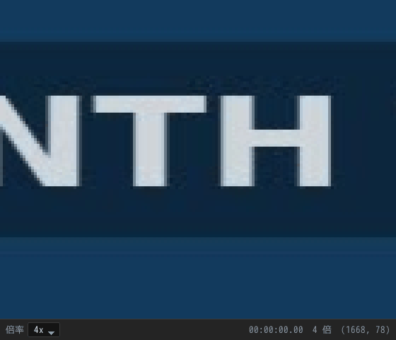
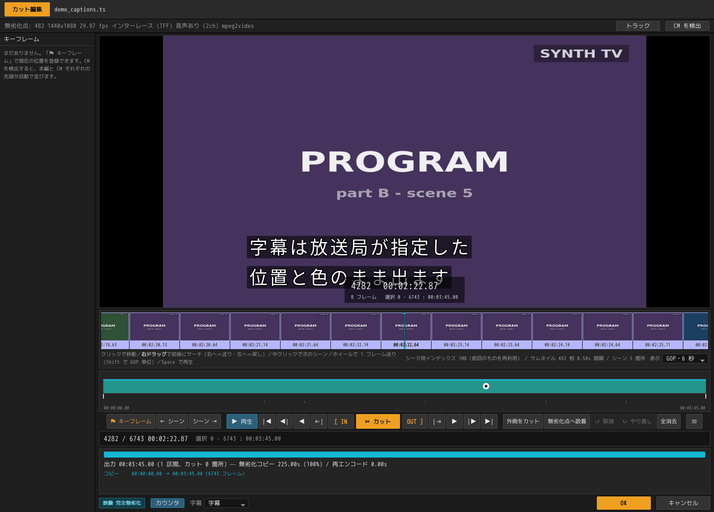
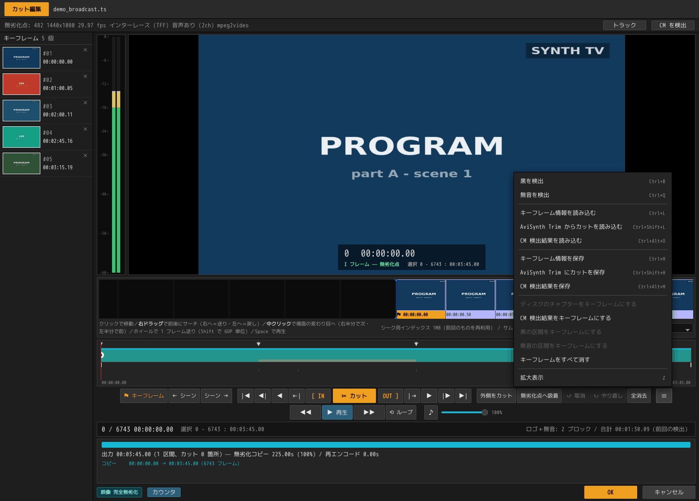
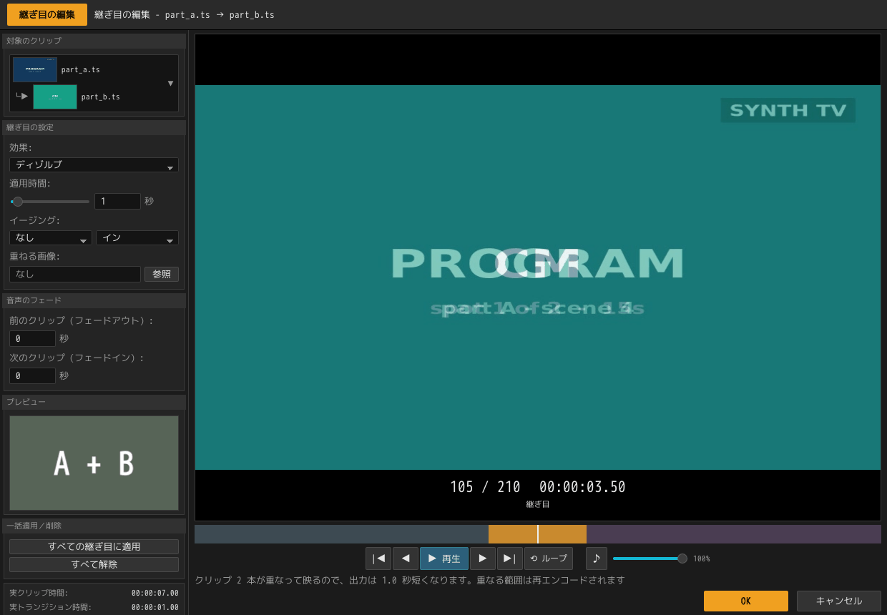
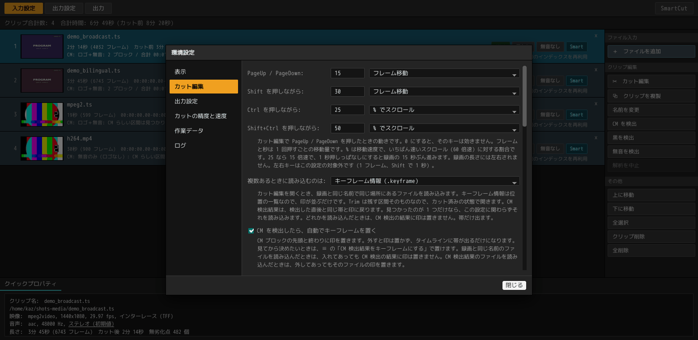
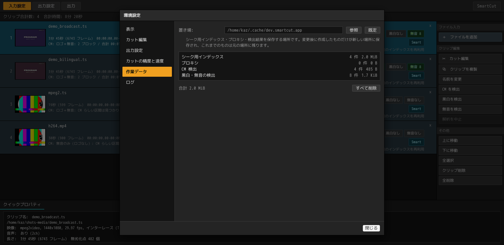

# GUI の使い方

[← ドキュメント](../README.ja.md) ・ [← SmartCut](../../README.ja.md) ・ [English](gui.md)

画面を順に追っていく操作手順書です。**入れる → 切る → 出す**の 3 段構えで、
録画を並べるところから書き出しが終わるところまでを通して説明します。

- インストールの仕方は [README](../../README.ja.md#ダウンロード)にあります。
- コマンドラインから使いたいときは[コマンドラインで使う](cli.ja.md)へ。
- 「なぜその位置で切れるのか」を知りたくなったら
  [アルゴリズム](../technical/algorithm.ja.md)へ。

> このページのスクリーンショットに写っているのは、実際の放送素材ではありません。
> ffmpeg のテスト用映像だけから
> [`tests/make_demo_media.sh`](../../tests/make_demo_media.sh) で作った、
> 練習用の録画です（1440x1080、3 分 45 秒、CM ブロック 2 つ）。

---

## 最初に：画面は 4 つ、ウィンドウは 4 つ

画面は、作業の順番どおりに並んでいます。

| 画面 | どこにある | すること |
|---|---|---|
| **入力設定** | 一覧ウィンドウ（タブ 1 枚目） | 録画を並べる |
| **カット編集** | **別ウィンドウ** | 一覧の 1 本を開いて切り、**OK** で戻る |
| **出力設定** | 一覧ウィンドウ（タブ 2 枚目） | 保存先・ファイルの形式・音声の扱い。**一覧全部に効きます** |
| **出力** | 一覧ウィンドウ（タブ 3 枚目） | 一覧を上から順に書き出す |
| **バッチ出力ツール** | **別ウィンドウ・別プロセス** | 保存したプロジェクトを並べて順に書き出す。本体を閉じても止まらない。[まとめて処理する](batch.ja.md#一晩かけてプロジェクトを順に処理する) |

ほかの 3 つは一覧全体に対して一度決めればよい設定ですが、カットは 1 本ずつ
進める作業なので、「この 1 本は終わった」という区切りが必要です。そのため
カット編集だけを別ウィンドウにし、その区切りを **OK** ボタンにしています。

バッチ出力ツールは 1 つの一覧ではなく複数の一覧を扱うので、タブにはなって
いません。メニューの `バッチ出力ツール` から開きます。別プロセスにしてあるのは、
夜に並べたキューを、並べたウィンドウを閉じたあとも書き出し続けられるように
するためです。

4 つ目のウィンドウが**拡大表示**です。画面ではなく道具で、カット編集の
プレビューの一部を録画そのもののピクセルで拡大します。設定も編集内容も
持たず、カット編集を閉じると一緒に閉じます（[拡大して確かめる](#拡大して確かめる)）。

各ウィンドウの大きさと位置は、それぞれ別に記憶されます。一覧ウィンドウを
広げてもカット編集の大きさは変わりません。次に開いたときは、前回閉じたときの
大きさと位置で表示されます。最大化したまま閉じれば、次も最大化した状態で
開きます。

モニターを外したりつなぎ替えたりして、記憶している位置が画面の外になった
場合は、その位置は使わず、既定の位置に表示します。

---

## 1. 録画を並べる


起動すると、空の一覧が表示されます。この一覧の 1 行を**クリップ**と呼び、
1 行が録画ファイル 1 つに対応します。

### 追加する

| やり方 | |
|---|---|
| **ドラッグ＆ドロップ** | ウィンドウのどこに落としても構いません。フォルダーを落とすと、その中の対応ファイルが入ります |
| **＋　ファイルを追加** | 右上のボタンです。まとめて選べます |
| **コマンドラインの引数** | `smartcut 録画1.ts 録画2.ts`。保存したプロジェクト（`.scproj`）も同じように開けます |

読み込めるのは、次の拡張子のファイルです。

```
.ts  .m2ts  .mts  .m2t  .mp4  .mkv  .mov  .m4v      （動画ファイル）
.webm                                               （VP9 と AV1）
.vob .mpg   .mpeg .m2p                              （DVD の中身）
```

これ以外のファイルを落としても、「無視しました」と表示されるだけで、一覧は
変わりません。

### ディスク（Blu-ray・DVD）を開く

ディスクはそのまま開けます。`BDAV`・`BDMV`・`VIDEO_TS` フォルダーを含む
フォルダーでも、`.iso` ファイルでも構いません。`.iso` はマウントしなくても、
中身をその場で読み込みます。

**ディスクは 1 行ではなく、中に入っている録画の数だけ行になります。**

落とすと「ディスクの読み込み」画面が開き、次の 2 つを選びます。


① どの録画を読み込むか。
レコーダーで録ったディスクなら、入っている録画はすべて候補になります。
市販のディスクではそうはいきません。アニメ 1 期のボックスには、ロゴ・警告・
メニューのループが 50 本ほど入っていて、本編 12 話はその中に紛れています。
しかもディスク上では、その 62 本すべてに `000NN` という名前しか付いていません。

そこで、5 分を超えるものにはあらかじめチェックが入った状態で開きます。
短いものは「短いクリップも表示」を押すまで隠れています。各行には再生時間と
ファイルサイズが表示されるので、本編とロゴはたいていこの 2 つで見分けられます。

② どのトラックを読み込むか。
行の「トラック」を開くと、その録画に入っている映像、言語付きの音声、字幕、
メニューが並びます。映像は外せません。字幕はカットと一緒に出力され、
出力ファイルに含めるか別ファイルにするかは[出力設定](#設定項目)で決めます。
メニューは出力に残せません。ボタンの飛び先が元のタイムライン上の位置で、
カットした出力では場所が変わってしまうためです。ディスクが文字データとして
持つテキスト字幕も同様で、描画に使う書体がストリームではなくディスク側の
ファイルに置かれています。この 2 つは選択肢としてではなく、
「カットした出力には残せません」という表示で並びます。
「同じ構成のクリップすべてに適用」を押すと、選んだ内容をディスク全体に
写せます。ボックスものではこれが便利です。

行の名前は、ディスクの種類によって次のように決まります。

| ディスクの種類 | 行に出る名前 |
|---|---|
| レコーダーで録った Blu-ray（BDAV） | 番組名（ディスクに番組名・録画日時・チャプターが記録されています） |
| 市販の Blu-ray（BDMV） | ディスク名 + クリップ番号（番組名が入っていないため） |
| DVD-Video | ディスク名 + タイトル番号 |

開くのは一瞬です。ディスクには「どこから再生を始められるか」の一覧が記録
されているので、SmartCut はそれを読むだけで済み、録画を丸ごと調べることは
しません。81 GB・2 時間 34 分のタイトルでも、一覧に並ぶまで 1 秒かかりません。

ディスクに記録されているチャプターは、最初からタイムラインに並びます。
日本の録画では、チャプターの位置がそのまま CM の切れ目になっていることが
多いためです。

ディスクの中には書き込めないので、書き出し先は、出力設定で指定しないかぎり
ディスクと同じ場所になります。

暗号化されたディスクは、DVD も Blu-ray も開けません。

### 落とした瞬間に始まること


行の情報は、ドロップした瞬間に埋まります。長さ・解像度・フレームレート・
コーデック・音声の有無はファイル自身に記録されている情報なので、録画がどれだけ
長くても 30 ミリ秒で読み取れます。左のサムネイルも同じ時点で入ります。
20 本落としても、最後の行がパスと空の四角のまま数分待たされることはありません。

そのうえで、裏では**準備処理**が進みます。

| 表示 | 何をしている |
|---|---|
| `読み込み中` | 早送りやカットに使う索引を作っています（画面では「シーク用インデックス」と呼びます。1 GB あたり 1 秒くらい） |
| `サムネイル` | 帯に並べるサムネイルと、場面の変わり目を作っています（1 GB あたり 1〜2 秒くらい。4K の録画はもっとかかります） |
| `待機中` | まだ順番が来ていません |
| `インデックス 2 秒` | 今回、索引を作り終えました |
| `前回のインデックスを再利用` | 前回作った索引が使えたので、読み込みを省きました |

ウィンドウの右上には、どのクリップにどの処理がかかっているかが表示されます。
上の図では、2 本目を読み込みながら 1 本目のサムネイルを作っているところです。
3・4 本目はまだ順番待ちですが、4 行とも情報とサムネイルはすでに表示されています。

読み込みが終わると、行の数字は読み込みで確定した値に置き換わります。最初の
値と食い違うことがあるのは長さだけです。DVD の中身には長さが記録されて
いないので、最初に表示した値が外れることがあります。

どの処理も、編集の妨げにはなりません。まだ読み込みの終わっていない録画も、
ダブルクリックで開けます（[開いた瞬間から使えます](#開いた瞬間から使えます)）。

ほかのソフトの妨げにもなりません。準備処理はパソコンのコアをすべて使いますが、
優先度を下げて動いているので、ほかのソフトがコアを必要とすればそちらが
優先されます。パソコンが空いていれば、準備処理の速さは変わりません。

### 一覧での操作


各行には、ファイル名、長さ（フレーム数）・範囲・解像度・フレームレート・
コーデック、そして CM 検出とカットの結果が表示されます。
右端の `Smart` はこの素材でスマートレンダリングが効くという印で、
`CM 2` は CM ブロックが 2 つ見つかったという意味です。

| 操作 | |
|---|---|
| **ダブルクリック** / `Enter` | その録画のカット編集を開く |
| `F2` | クリップ名を変更する |
| `Ctrl+A` | 全選択 |
| `Ctrl+D` | 選択した録画の CM 検出 |
| `Ctrl+B` / `Ctrl+Q` | 選択した録画の 黒白 / 無音 検出 |
| `Delete` | 一覧から外す（**ファイル自体は消えません**） |
| `↑` `↓` | 選択を動かす。`Shift` を足すと範囲選択 |
| **行のドラッグ** | 並べ替え。`Esc` で取りやめ |
| **何もないところをクリック** | 選択を解除する |
| **右クリック** | その行に対する操作をメニューで出す |
| **⧉　クリップを複製** | 同じ録画をもう 1 行足す。カットも印も引き継ぎます |

追加したクリップは選択された状態になり、それまで選ばれていた行は選択から
外れます。20 本の一覧に 3 本足したあと、その 3 本を探し直さずに CM 検出や
並べ替えに取りかかれます。

左のサムネイルはカットに追従します。録画の先頭は黒画面や前の番組の終わりで
あることが多いので、少し中に入った位置の 1 枚を表示しています。カットを
入れたあとは、残る側の同じ位置から取り直すので、CM を切った行に CM の
サムネイルが残ることはありません。

行はドラッグで並べ替えられます。書き出しはこの順に進むので、先に出したい
ものを上へ移動してください。並び順そのものに意味があるときは、出力設定の
連番でファイル名にも残せます。

名前は行の幅いっぱいに出ます。それでも収まらないときは末尾が省略されるので、
全体を読みたいときは名前にマウスを乗せてください。放送録画では話数が末尾に
付くことが多く、そこが切れると行の見分けがつかなくなるためです。

クリップ名は変更できます。`F2`、右の「名前を変更」、または右クリック
メニューから行うと、行の名前がその場で入力欄に変わります。`Enter` で確定、
`Esc` で取りやめです。空にすると元の名前に戻ります。

変更した名前は、一覧とカット編集の見出しだけでなく、書き出すファイル名にも
使われます。ファイル名に使えない文字（`? : /` など）は全角に置き換わります。
BDAV 出力では番組名にも入ります（出力設定で番組名を直接書いたときは、そちらが
優先されます）。

複製は、2 時間の録画に番組が 2 本入っているときのための機能です。
同じファイルを 2 行に並べ、それぞれで別の部分を残します。出力ファイル名には
`_1` `_2` と番号が付きます。

一覧に入れたあとでファイルの名前を変えたり、別のフォルダーへ移したりすると、
行はもとの場所を指したままになります。カット編集を開こうとした時点でそれが
分かり、行は赤くなって「ファイルが見つかりません」と表示します。名前を戻すか、
その行を一覧から外して入れ直してください。

画面下の**クイックプロパティ**には、選んでいる 1 本の詳しい情報が表示されます。
複数選んでいるときは本数だけを表示します。

### CM を検出する


`Ctrl+A` → `Ctrl+D`（または右の「CM を検出」ボタン）で、選んだ録画すべての
検出が始まります。一晩分をまとめて追加して `Ctrl+D` を 1 回押す、という
使い方を想定しています。

読み込みの途中でも押せます。まだ読み込みが終わっていない録画は予約扱いに
なり、その行の読み込みが終わり次第、上から順に検出が始まります。落として
すぐ `Ctrl+A` → `Ctrl+D` で構いません。

進み具合は行に表示されます（`CM 検出中 84% — ロゴを探しています`）。
まだ順番の来ていない行は `CM 検出 待機中`、読み込みを待っている行は
`解析後に CM 検出` になります。

**検出の状態は、状態バッジの隣のバッジで分かります。** 順番待ちの行は破線の
`CM 検出予約`、検出中の行は実線の `CM 検出中`、済んだ行は `CM 5` や `CM なし`
です。3 つは形で見分けられるので、どの行が残っているかは一覧を見るだけで
分かります。

バッジは検出ごとに 1 つずつ付きます。黒白検出なら `黒白 検出予約` `黒白 検出中`
`黒白 6` `黒白なし`、無音検出なら `無音 検出予約` `無音 検出中` `無音 15`
`無音なし` です。一度も検出していない録画には、その検出のバッジは出ません。
`黒白なし` は「探したが無かった」で、バッジが無いのは「まだ探していない」です。

前回までに検出した結果も覚えているので、一覧に並べ直した行や、カット編集で
検出した行にも、そのままバッジが付きます。

行の下のバーに表示できるのは、その行で動いている処理 1 つ分だけです。
読み込みが終わった行ではサムネイル作りと CM 検出が同時に動くので、バーには
サムネイルのほうが出ます。検出の状態をバッジで示しているのはそのためです。

検出が行うのは印を置くところまでで、切るのは利用者です。
カット編集を開くと、各 CM ブロックの先頭と本編に戻る位置が、キーフレーム
としてすでに並んでいます。詳しくは [CM 検出](cm-detection.ja.md)を見てください。

途中で止めたいときは「解析を中止」を押します。もう一度押せば続きから再開します。

一晩分をまとめて扱う流れは[まとめて処理する](batch.ja.md)にあります。

### 黒・白と無音を検出する

右の「黒を検出」（`Ctrl+B`）と「無音を検出」（`Ctrl+Q`）で、選んだ録画を
まとめて調べます。前者は映像が真っ黒な区間を、後者は音声が無音の区間を
探します。CM 検出とも、お互いとも別の処理です。

**ボタンの名前は環境設定に合わせて変わります。** 既定は黒だけなので
「黒を検出」です。「白だけ」にすれば「白を検出」、「黒と白」にすれば
「黒白を検出」になります。行を右クリックしたときのメニューと、カット編集の
`≡` メニューも同じです。行に出る結果とバッジも同じ名前になります。探して
いないものについて「なし」とは表示しません。

**設定を変えると、前の設定での結果は消えます。** 探すものを変えたあとの
「黒: 3 箇所」は、変える前の検出の答えです。そのため、変えた時点で各行の
結果はいったん消えます。黒と白の両方を探した結果は、あとから黒だけ・白だけ
としても使えるので、そのときは残ります。無音の検出結果は影響を受けません。

**別々に動きます。** 黒白のほうは全フレームをデコードするので、30 分の放送
で 20 秒から 1 分ほどかかります。無音のほうは音声だけを読むので、同じ録画が
数秒で終わります。片方だけ欲しいときに、もう片方を待つ必要はありません。

読み込みがまだ終わっていない録画にも予約できます。`Ctrl+A` → `Ctrl+B` と
押しておけば、各行の読み込みが終わった順に検出が始まります。予約した行には
破線のバッジが付くので、どの行が残っているかは一覧を見れば分かります。

進み具合は行に出ます（`黒 検出中 33%`、`無音 検出中 60%`）。終わると
`黒: 1 箇所`、`無音: 4 箇所` のように 1 行ずつ残ります。両方頼んだときは
2 行出ます。音声のない録画で無音検出を頼むと、その行だけ
`無音: 検出できません: 音声がありません` になります。

結果は覚えているので、カット編集を開いたときには帯と印がすでに並んでいます。

---

## 2. 切る

一覧の行をダブルクリックすると、別ウィンドウで開きます。


### 開いた瞬間から使えます

編集画面は、録画の読み込みが終わるのを待たずに開きます。使える機能は、
開いてから 3 段階で増えていきます。

| いつ | 使えるようになるもの |
|---|---|
| **開いた瞬間**（30 ミリ秒） | 長さ・解像度・fps・音声・コーデック、タイムライン、シークバー、キーフレーム、カットそのもの、トラック選択、CM 検出 |
| **読み込みが終わったとき**（1 GB あたり約 1 秒） | 無劣化点の数、`無劣化点へ吸着`、フレーム単位で正確なプレビュー、出力の計画、再生 |
| **サムネイルができたとき**（1 GB あたり 1〜2 秒。4K はもっとかかります） | 帯のサムネイルがすべて埋まる、場面の変わり目、シークバーのホバー |

待たされるのは 2 つだけです。`無劣化点へ吸着` は吸着先がまだ無いため、
`再生` は開始位置を正確に決められないため、どちらも少しあとになります。
それ以外は 1 段階目から使えます。


下の帯に `録画を読み込んでいます。どこを無劣化で残せるかは、読み終えてから分かります` と
表示されているあいだが 1 段階目です。左に並んでいるキーフレームは、録画と同じ
名前の `.keyframe` から読み込んだもので、これも解析を待ちません。
場面の変わり目へ飛ぶ `← シーン` `シーン →` はまだ灰色ですが、プレビューは
表示され、カットもすでに入れられます。帯のサムネイルは、読み込みと並行して
端から埋まっていきます。

この段階のサムネイルは、おおよその位置で取ったものです。正確な位置を求める
ための索引がまだ無いので、帯のセルは等間隔に刻まれ、サムネイルが入らない
セルが残ることがあります。再生位置を動かしているあいだは速く取れる分だけで
埋め、手を止めた瞬間に残りが埋まります。サーチ中はまばらに見えて、離すと
詰まるのはこのためです。

左の列のキーフレームのサムネイルも同じです。読み込みが終わるまでは近い位置で
取ったものが入り、終わると、印の時刻ちょうどのサムネイルに入れ替わります。

読み込みが終われば、どちらも正確なものに揃います。**先に入れたカットは、
入れた位置のまま残ります。** 変わるのは、そのカットにかかるコストだけです。
切れ目が無劣化点に乗っていなければ、数フレームの再エンコードとして計画に
表示され、`無劣化点へ吸着` が使えるようになった時点でゼロにできます。

### 画面のどこに何があるか

| どこ | 何 |
|---|---|
| 最上段 | ファイル名 |
| 情報バー | 無劣化点の数・解像度・fps・走査方式・音声・コーデック。右端に**トラック**・**CM を検出**（黒白と無音の検出は右下の `≡` メニューです） |
| 左の列 | **キーフレーム**（印）の一覧。サムネイル付きで、押せばそこへ飛びます。黒白検出・無音検出が置いた印には `黒` `白` `無音` の札が付きます |
| 中央 | プレビュー。映像の下端中央にフレーム番号・時刻・そのフレームの種類・選択範囲が出ます（最下段の**カウンタ**で消せます） |
| プレビューの左 | **音声レベルメーター**。再生中は鳴っている音、止めているときは再生位置の音の大きさです（環境設定で消せます） |
| その下の帯 | **フィルムストリップ**。前後のフレームをサムネイルで並べたものです。1 画面に映る秒数は右の「1 画面」で選べます。セルの幅は、そのセルが表す時間に比例します |
| シークバー | 緑の部分が出力になる範囲。`▼` がキーフレーム、赤い縦線がカットの継ぎ目、下の細い目盛りが場面の変わり目。その下の 2 段が、黒・白の区間と無音の区間です |
| ボタンの列 | 中央が**カット**、その左が `[ IN`、右が `OUT ]`。外へ向かって「移動」「1 フレーム」「無劣化点」「先頭・末尾」と対称に広がります |
| 下の帯と行 | **書き出しの計画**。どこをコピーして、どこを作り直すか |
| 最下段 | 左にカットのコスト、その隣に**カウンタ**と**字幕**（プレビューに何を出すか）。右に **OK** と**キャンセル** |

> 「無劣化点」とは。映像は、それ 1 枚で画像になる**キーフレーム**と、前後の
> フレームとの差分だけを持つフレームが交互に並んでできています。差分のフレームの
> 途中で切ると、そこから映像を組み立て直さなければなりませんが、キーフレームの
> 位置で切ればその必要がありません。SmartCut は、このそのまま切れる位置を
> 無劣化点と呼んでいます。

> キーフレームの間隔が広い動画について。放送の録画はキーフレームが 0.5 秒ごとに
> 並んでいますが、ウェブや配信サービスから持ってきた動画では、数秒に 1 枚という
> ことがあります（33 秒に 1 枚という素材もありました）。この場合も、
> 「1 画面」で選んだ秒数が 1 画面に収まるようにセルを刻みます。長いセルは
> サムネイルが左端に寄り、右側は余白になります。
> 時刻の左に `▲` が付いているセルが無劣化点です。それ以外のセルは、その場で
> フレームを作り出します。ドラッグしている間は直前の無劣化点のサムネイルを
> 出しておき、手を離したところで本来のフレームに差し替わります。

画面に表示される数字は、すべて書き出したあとの時間です。カットした部分は
灰色になるのではなく、画面から消えます。シークバーは縮み、帯はその穴を詰め、
フレームカウンタは実際に書き出される長さを数えます。

### 見たいところへ行く

| 操作 | |
|---|---|
| フィルムストリップを**クリック** | そのフレームへ移動 |
| フィルムストリップを**右ドラッグ** | 前後にサーチ。中央より右で送り、左で戻し、離れるほど速くなります |
| フィルムストリップで**中クリック** | 場面の変わり目へ。中央より右で次、左で前に移動します |
| **ホイール** | 1 目盛り 1 フレーム。`Shift` を足すと無劣化点単位で飛びます。編集画面のどこで回しても同じです。左の印の一覧やプランの上では、そちらのスクロールになります |
| シークバーを**ドラッグ** | 位置を動かす。IN / OUT の印の近くを掴むと、その印が動きます |
| シークバーに**ホバー** | その時刻のフレームが小さく出ます |
| `Space` または **▶ 再生** | ここから再生（映像と音声）。もう一度押すと停止。映像は録画と同じフレームレートで表示します。処理が間に合わないパソコンでは、音声に遅れないようフレームを間引いて表示します |
| **◀◀** **▶▶** | 巻き戻し・早送り。押すたびに 2→4→8→16 倍、もう一度押すと止まります。いま何倍かはボタンに出ます。音は出ません |
| `←` `→` | 1 フレーム戻る・進む。押しっぱなしで連続 |
| `Shift+←` `Shift+→` | 1 秒 |
| `PageUp` `PageDown` | 環境設定で決めた量だけ戻る・進む。単位を % にしたキーは量ではなく速度なので、押しているあいだスクロールし続けます。`Shift`、`Ctrl`、`Shift+Ctrl` にそれぞれ別の設定を持たせられます |
| `↑` `↓` | 前の / 次の**場面の変わり目**へ |
| `Shift+↑` `Shift+↓` | 前の / 次の**無劣化点**へ |
| `Ctrl+←` `Ctrl+→` | 前の / 次の**キーフレーム**へ（左の列の印）。移動先の印は、左の列でも選択された状態になります |
| `S` / `Shift+S` | 次の / 前の場面の変わり目へ |
| `◀\|` `\|▶` | 前の / 次の**無劣化点**へ |
| `\|◀` `▶\|`、`Home` `End` | 先頭・末尾へ |

### 継ぎ目を繰り返し聞く

再生の行はカットの行の下にあり、左から巻き戻し・再生・早送り・ループ、
その右に音量が並びます。

ループを押しておくと、再生が選択範囲の終わりまで来たところで開始位置に戻り、
また再生します。繰り返すのは選択範囲です。再生位置が選択範囲の中にあれば
そこから、外にあれば IN から始まります。選択範囲を決めていない録画では、
録画全体を繰り返します。

カットした直後は、選択範囲がその継ぎ目の 1 点に畳まれています。この状態で
`Space` を押すと、**継ぎ目の前後あわせて 0.5 秒**が繰り返されます。継ぎ目の
前も含まれるので、つながり方をそのまま聞き取れます。もっと長く聞きたいときは、
IN と OUT を継ぎ目の前後に打ってください。その範囲がそのまま繰り返されます。

音量はプレビューだけの音量で、書き出す音声は変わりません。♪ を押すと音が
消え、もう一度押すと戻ります（`M` も同じです）。スライダーの上でホイールを
回しても動かせます。音量とミュートの状態は記憶されるので、次にクリップを
開いたときも同じ大きさで鳴ります。音声のない録画では、♪ もスライダーも
操作できません。

### 音のレベルを見る

プレビューの左に、音声レベルメーターが立っています。再生中は実際に鳴っている
音を、止めているときは再生位置のフレームの音を表示します。目盛りは dBFS で、
上端の 0 が振り切れる位置です。-18 までが緑、-6 までが黄、その上が赤で、
バーの上の細い線は直前のピークです。

CM の切れ目では、音が 1 秒ほど途切れます。1 フレームずつ送りながらメーターを
見ていくと、その無音がどのフレームから始まるかが分かります。映像だけでは
見分けにくい切れ目も、ここで確かめられます。

バーは**録画のチャンネル数だけ**並びます。モノラルなら 1 本、ステレオなら 2 本、
5.1ch なら 6 本、7.1ch なら 8 本です（8 本が上限で、それより多い録画は先頭の
8 チャンネルを表示します）。本数に合わせて幅と間隔も変わります。パソコンが
ステレオまでしか鳴らせなくても、本数は変わりません。メーターが示すのは録画が
持っている音であって、再生装置が混ぜたあとの音ではないからです。

音声のない録画では目盛りだけが残ります。不要なときは環境設定の「カット編集で、
音声レベルメーターを表示する」を外してください。開いているカット編集にもその場で
反映されます。

### 拡大して確かめる



`Z`、または ≡ の**拡大表示**で、拡大用のウィンドウが開きます。カット編集の
プレビューにマウスを乗せると、その周りを拡大して表示します。倍率は
ウィンドウの下で 2 倍から 8 倍まで選べます。

映すのは**録画そのもののピクセル**です。プレビューは画面の幅に合わせて縮めて
あるので、インターレースの縞（動いている輪郭に出る、櫛の歯のような模様）は
縮小の時点で消えてしまいます。拡大表示はフレームを録画の大きさで読み直すので、
縞が残っているかどうかをそのまま確かめられます。ウィンドウの右下には、
表示しているフレームの時刻・倍率・中心のピクセル位置が出ます。

再生中は画像が止まります。フレームごとに読み直すと再生の邪魔になるためで、
再生を止めた時点のフレームに追いつきます。ウィンドウはカット編集を閉じると
一緒に閉じます。

### 字幕を出して確かめる



最下段、カットのコストの隣に「字幕」があります。既定は「表示しない」で、
字幕を選ぶとプレビューの映像の上に重なります。**カットの位置を字幕で確かめる
ための機能です。** 継ぎ目が台詞の途中に来ていないか、CM の前後で字幕がどこまで
出ているかは、映像だけでは分かりません。

- 放送の文字字幕（ARIB）は、放送局が指定した位置・大きさ・色のまま文字として
  描画するので、拡大しても輪郭がぼやけません。文字ではなく点の並びで送られて
  くるもの、たとえば次の行へ文を続ける矢印、話者名を囲む二重括弧、ドイツ語の
  `ü` も、その点の並びから文字と同じ枠に描画します。
- ディスクの字幕（PGS と DVD のサブピクチャ）は画像なので、ディスクに入っている
  画像をそのまま重ねます。
- 字幕が 2 本以上あるとき（二か国語、日本語と英語など）は、選んだ 1 本だけを
  表示します。
- フレーム番号と時刻の表示は、字幕を出していても映像の下端のままです。字幕と
  場所が重なりますが、こちらが手前に出るので、現在位置が読めなくなることは
  ありません。字幕を丸ごと見たいときは、隣の「カウンタ」を押して消してください。
  現在位置はフィルムストリップの下の行にも出続けますし、消したことは次の
  クリップを開いても引き継がれます。
- 再生中も字幕は追従します。
- 字幕のない録画では、選択欄そのものが表示されず、最下段に並ぶのは「カウンタ」
  だけです。このページのほかのスクリーンショットがそうなっているのは、
  練習用の録画に字幕が無いためです。

ここでの選択で、書き出す内容は変わりません。ここで決めるのは画面に表示するか
どうかだけで、どの字幕を出力に入れるかは「トラック」と出力設定で決めます。

### 黒・白の区間と無音の区間を探す

右下の `≡` メニューの「黒を検出」（`Ctrl+B`）「無音を検出」（`Ctrl+Q`）で、
いま開いている録画を調べます。前者の名前は、一覧のボタンと同じく環境設定の
「黒白検出で探すもの」に合わせて変わります。一覧で検出済みの録画なら、開いた
時点で結果が並んでいます。押すと読み直します。2 つは別々の処理なので、片方を
押してももう片方の結果は消えません。

見つかった区間はタイムラインの下に帯で出ます。黒・白は青灰色、無音は緑で、
場面の変わり目（オレンジの細い目盛り）とは別の段に並びます。

検出した区間は[プロジェクト](projects.ja.md)にも保存されます。保存してから
開き直せば、録画を読み直さずに帯がそのまま出ます。

**印は区間の両端に置きます。** 手前を切る位置と、続きが始まる位置は別の
フレームです。フェードのときはとくに離れるので、始まりと終わりの両方を
キーフレームにします。端をたどるキーも別々です。`Alt+↑` `Alt+↓` が黒・白の
区間の端、`Alt+Shift+↑` `Alt+Shift+↓` が無音の区間の端です。黒へのフェードと
無音は同じ場所にあるとは限らないので、まとめて 1 つのキーにはしていません。

印を置くかどうかは、検出ごとに環境設定で決められます。外すと帯だけが出ます。
録画と同じ名前のファイル（`.keyframe` など）を読み込んだときも、開いた時点では
帯だけです。人が作った一覧に検出の印を混ぜてしまわないためです。

帯を見てから印にしたいときは、`≡` の「黒白の区間をキーフレームにする」
「無音の区間をキーフレームにする」を選んでください。いま出ている区間の両端に
印が付きます。検出し直す必要はありません。取り消しも効きます。

置いた印は、左のキーフレーム一覧で見分けられます。時刻の下に `黒` `白` `無音`
の札が付きます。区間の端に立っている印にだけ付き、両方に当てはまるときは
2 つ並びます（CM の切れ目は、黒へのフェードと無音が重なっていることが
よくあります）。

黒の区間は 2〜4 フレームしかないことがよくあります。そのため全フレームを
デコードして探します。30 分の放送で 20 秒から 1 分ほどです（NAS に置いた
録画では読み込み速度で決まります）。無音のほうは音声だけを読みます。

判定の長さと、無音とみなす音量は環境設定で変えられます。既定は黒も無音も
3 秒、音量は -50 dB です。**既定のままでは CM の切れ目の黒は拾いません。**
切れ目に入る黒は 2〜4 フレームなので、そちらを拾いたいときは単位をフレームに
して 2 くらいにしてください。

**探すのは既定では黒だけです。** 白も見たいときは環境設定で「黒と白」または
「白だけ」にしてください。選んだものに合わせて、入力一覧のボタンと編集画面の
メニューの名前も変わります。

### 印とカットは別物です

- キーフレームは目印であって、編集ではありません。`⚑ キーフレーム`
  （または `K`）で、いま見ているフレームを登録します。左の列にサムネイル付きで
  並び、押せばそこへ飛びます。カードの `×` で消せます。
- 左の列では、`Ctrl` を押しながらのクリックで印を 1 つずつ、`Shift` を押し
  ながらのクリックでひと続きの印をまとめて選べます。選んだ状態で `Del` を
  押すと、その印がまとめて消えます。消した直後なら `Ctrl+Z` で戻せます。
  選ぶのをやめるときは、列のカードが無いところをクリックしてください。
- カットが編集です。IN と OUT で範囲を選んで `✂ カット` を押すと、
  その範囲が出力から消えます。

印は、自分で打たなくても並ぶことがあります。3 つの検出（CM・黒白・無音）が
置いたもの、録画と同じ名前の `.keyframe` や CM 検出結果のファイルから読み込んだ
もの、そしてディスクから開いた録画なら、ディスクに記録されているチャプターです。

### 印を読み込む・書き出す



操作ボタンの右端に **≡** があります。印にまつわる操作はここにまとまっています。

| 項目 | 何をするか |
|---|---|
| **キーフレーム情報を読み込む** | 別の場所にある `.keyframe` を選んで読む（`Ctrl+L`） |
| **AviSynth Trim からカットを読み込む** | `Trim` の並びを選んで読む（`Ctrl+Shift+L`）。印ではなくカットとして入ります |
| **CM 検出結果を読み込む** | 保存してある検出結果を選んで読み込む（`Ctrl+Alt+O`）。帯と印が検出直後の状態で戻ります |
| **キーフレーム情報を保存** | 印の位置を録画と同じ名前で書き出す（`Ctrl+H`） |
| **AviSynth Trim にカットを保存** | 残る区間を `Trim` の並びで書き出す（`Ctrl+Shift+H`） |
| **CM 検出結果を保存** | いま出ている検出結果を書き出す（`Ctrl+Alt+H`）。検出していなければ選べません |
| **ディスクのチャプターをキーフレームにする** | 消したチャプターを置き直す。ディスク以外の録画では選べません |
| **CM 検出結果をキーフレームにする** | いま出ている検出結果を印にする。検出していなければ選べません |
| **黒白の区間をキーフレームにする** | いま出ている黒・白の区間の両端を印にする。名前は帯に出ている色に合わせて「黒の区間」「白の区間」に変わります |
| **無音の区間をキーフレームにする** | いま出ている無音の区間の両端を印にする。検出していなければ選べません |
| **キーフレームをすべて消す** | 印だけ消す。カットは残ります |
| **拡大表示** | 拡大用のウィンドウを開く・閉じる（`Z`）|

書き出す形式は 3 つあります。保存先には録画のパスが最初から入っています。

| 形式 | 中身 | 名前 |
|---|---|---|
| **キーフレーム情報** | 印の位置だけ。1 行 1 フレーム番号 | `録画.keyframe` |
| **AviSynth Trim** | 残る区間そのもの。`Trim` の並び | `録画.ts.trim.avs` |
| **CM 検出結果** | 見つけた区間と、その根拠。JSON 形式 | `録画.cm.json` |

保存画面で拡張子を `.keyframe`、`.avs`、`.json` のどれかに書き換えれば、
その形式で保存されます。読み込みも同じで、選んだファイルの拡張子で形式が
決まります。

`Ctrl+H`・`Ctrl+Shift+H`・`Ctrl+Alt+H` は、画面を出さずに、録画と同じ名前で
そのまま保存します。同じ名前のファイルがあれば確認します。確認せずに上書きする
設定もあります。

CM 検出には、録画を数分読む時間がかかります。一度検出すれば SmartCut が結果を
保存しておくので、同じ録画を開き直したときは待たずに戻ります。ただし、保存先は
このパソコンの中だけです。別のパソコンで使いたいときや人に渡したいときは、
ファイルに書き出してください。

カット編集を開くときは、録画と同じ名前のこれらのファイルを自動で読み込みます。
**keyframe は印が付くだけ、Trim はカットされた状態で開き、CM 検出結果は帯と
印が付きます。** 複数あるときにどれを読み込むかは、環境設定で決めます。
1 つだけなら、設定に関わらずそれを読み込みます。

これらのファイルを読み込んだときは、CM 検出結果の印を混ぜません。`.keyframe`
は自分で付けた印で、CM 検出は SmartCut が見つけた位置です。1 つの列に混ざると、
どちらの印か分からなくなります。検出結果はタイムラインの帯と下の行に表示
されているので、印にしたければ ≡ の「CM 検出結果をキーフレームにする」を
押してください。

検出しても印を置かないようにもできます。環境設定の「CM を検出したら、自動で
キーフレームを置く」を外してください（既定はオン）。

自動で読み込んだ印は、解析の終わりを待たずに使えます。ウィンドウが開いた
時点で左の列に並び、押せばそこへ飛べます。長い録画ほど解析に時間がかかり
ますが、印はその前から使えます。

番号は、いずれも録画の最初のフレームから数えます。

### IN と OUT で範囲を選ぶ


CM の先頭のキーフレームを押して `I` を押します。続いて本編に戻る位置の
キーフレームを押し、`←` で 1 フレーム戻ってから `O` を押します。これで
CM ブロックがちょうど選択範囲に収まります。`[` と `]` も同じ働きです。

後述の `Ctrl+Del` を使えば、この「1 フレーム戻る」を省けます。残したい
フレームに 2 つ印を打てば、その間だけが消えます。

- **IN 〜 OUT の範囲には、OUT のフレームも含みます。** 5 フレーム選べば
  5 フレーム減ります。
- 片方を打ち直しても、もう片方は動きません。範囲を詰めるときは IN と OUT を
  交互に置き直すためです。2 つが交差したときだけ、いま置いたほうが優先され、
  もう片方は端まで退きます。
- 選んだ範囲は、プレビューの下と下の行に
  `選択 1800 - 3599 : 00:01:00.06` の形で表示されます。

### 切る


`✂ カット`、または `Del` を押すと、選んだ範囲が出力から消えます。画面は
その場で更新され、下に書き出しの計画が表示されます。

```
出力 00:02:44.94（2 区間、カット 1 箇所）— 無劣化コピー 164.94s (100%) / 再エンコード 0.00s
コピー　　00:00:00.00 → 00:01:00.05（1800 フレーム）
コピー　　00:02:00.11 → 00:03:45.00（3143 フレーム）
```

**左下のバッジが `映像 完全無劣化` になっていれば、作り直されるフレームは
1 枚もありません。** もう一方の CM ブロックも同じ手順で切れば
`3 区間、カット 2 箇所` になります。

内訳の行は 3 行までしか見えません。カットが増えれば行も増えるので、
残りはスクロールして読みます。下に続きがあるときは右端に細いバーが出て、
いちばん下の行が影に沈んで見えます。

`Ctrl+Del` は、選択範囲を両端とも 1 フレーム内側に縮めてから切るカットです。
印を打った 2 フレームは残り、その間だけが消えます。IN が 2392、OUT が 5990
なら、消えるのは 2393 から 5989 です。本編の最後のフレームと、本編に戻る
最初のフレームはどちらも残したいので、その 2 か所に印を打って 1 回押せば
CM ブロックが抜けます。印から 1 フレーム内側へ入り直す手間が省けます。

カットの継ぎ目は、そのままキーフレームになります。あとで確かめたくなるのは、
まさにその位置だからです。シークバーにも赤い縦線が残ります。

### やり直す・別の切り方をする

| ボタン | |
|---|---|
| **外側をカット** | 選んだ範囲の外側をすべて取り除きます。1 か所だけ切り出したいときに使います |
| **無劣化点へ吸着** | 選んだ範囲の両端を、いちばん近い無劣化点へ寄せます。押せば再エンコードがゼロになります |
| **↺ 取消** | 直前の操作の前に戻します（100 段まで、`Ctrl+Z`） |
| **↻ やり直し** | 取り消した操作をやり直します（`Ctrl+Y`） |
| **全消去** | カットとキーフレームの両方を消します。取消で戻せます |

**取消は、そのとき選んでいた範囲ごと戻します。** 切ってみたら数フレーム
違っていた、というときは取消を押せば、切る前の選択範囲がそのまま戻ります。
あとは端を動かしてもう一度カットするだけです。再生位置も、そのとき見ていた
位置に戻ります。

取消はカット以外の操作にも効きます。キーフレームの登録、1 つ消す、
すべて消す、全消去のどれも、直前の状態に戻せます。

### 再エンコードが必要になるとき


**カット点がキーフレームの間に落ちると、その前後だけが作り直されます。**
帯の橙色の部分と、行の `再エンコード` がその範囲です。

上の例では 453 フレーム中 21 フレームだけが再エンコードされ、
時間にして 95.4% はそのままコピーされます。

放送録画の CM の境目は無音の位置にあり、そこはたいてい無劣化点でもあるので、
CM を落とすだけなら完全無劣化で済むことが多くなります。この 21 フレームは、
好きな位置で切ったことによるコストです。`無劣化点へ吸着` を押せばゼロに
できます。

### 書き出すトラックを選ぶ


情報バーの「トラック」から開きます。放送録画には、映像と音声のほかにも
さまざまなストリームが入っています。そのうちどれを出力に含めるかを、ここで
決めます。

**既定では、すべてのトラックを含めます。** このメニューは、二か国語放送の
副音声を外したいときのためのものです。指定していないトラックも、その録画に
入っていたことに変わりはありません。断りなく落としてしまうと、その録画が
何のためのものかを SmartCut が勝手に決めることになります。

- 副音声には、放送局が付けた名前が表示されます。二か国語放送と、画面が
  見えない人のための解説放送は、どちらも同じレートのステレオ 2 本として
  届きます。しかも解説放送はたいていどちらのトラックも日本語なので、言語コード
  だけでは見分けが付きません。そこで言語コードと並べて、放送側の呼び方
  （`eng 英語`、`jpn 音声解説`）を表示します。放送が名前を送っていない録画では
  表示されません。
- 字幕を残せるのは、`.ts` で書き出すときだけです。
- 文字スーパーは字幕とは別のトラックです。地震速報のように、番組ではなく
  その時間帯に属する文字なので、字幕とはまとめません。まとめてしまうと、
  台詞を探している人に速報を見せることになります。4K 放送の字幕（XML）も
  専用のトラックです。
- データ放送は、このメニューで切り替えるトラックではありません。残せるのは
  `.ts` だけなので、[環境設定](#出力設定)で一度だけ決めます。ここには
  `データ放送 — 環境設定で決めます` と表示されます。ディスクから読んだ録画の
  メニューと、ディスク側の書体で描くテキスト字幕は、出力に残せないので
  `出力できません` と表示されます。
- Blu-ray の字幕は、ほかのトラックと同じようにここで選べます。DVD の字幕は
  ここでは選べず、出力設定で決めた行き先にそのまま従うので、専用の 1 行に
  「出力先は出力設定で決めます（出力ファイルの中／別ファイル）」と表示されます。
- 番組情報・放送局名・放送時刻はトラックではないので並びませんが、
  `.ts` で書き出すときはそのまま引き継がれます。

この選択はクリップごとの設定なので、編集内容の一部としてクリップに残り、
プロジェクトにも保存されます。

### 1 本を終える

- **OK** を押すと、カットと印を一覧に反映して閉じます。
- キャンセル（`Esc`）は、この画面で行った編集を捨てて閉じます。何か編集して
  いれば、捨てる前に確認します。

どちらの場合も一覧ウィンドウは開いたままなので、すぐ次の 1 本に取りかかれます。

---

## 3. 出力設定


**ここでの設定は、一覧のすべてのクリップに効きます。**

上半分は **出力フォーマット** です。クリップを選ぶと、その録画がいまの設定でどう
書き出されるかが表示されます。映像・音声・区間の数と出力の長さ・出力先のパス
です。**クリップを結合して出力** もここにあります。1 本にまとめるかどうかは、
ファイルの名前の付け方ではなく出力そのものの形を決める設定だからです。

出力の形は 2 通りあり、この画面のすぐ下にあるタブで選びます。

| | |
|---|---|
| **ファイル出力** | ふつうの動画ファイルとして書き出します |
| **BDAV 出力** | レコーダーやプレーヤーが「番組の一覧」として開くフォルダーを作ります（[下で説明します](#bdav-ディスクとして書き出す)） |

タブを切り替えても、それぞれの設定は残ります。

### 設定項目

| 項目 | |
|---|---|
| **クリップを結合して出力** | 上の **出力フォーマット** にあります。オフなら 1 行につき 1 ファイルで、これまでどおりです。オンにすると、リストの並び順のまま 1 本のファイルとして書き出します。名前は先頭の行から取ります。→ [クリップを結合して出力](#クリップを結合して出力) |
| **基準クリップ** | **クリップを結合して出力** をオンにしたときだけ、そのすぐ下に出ます。解像度・フレームレート・コーデック・音声トラックを、どの行に合わせるかを選びます |
| **継ぎ目の効果** | 上の **出力フォーマット** にあります。**クリップを結合して出力** をオンにしたときだけ出ます。`継ぎ目の設定…` で別ウィンドウが開きます。→ [継ぎ目の効果](#継ぎ目の効果) |
| **出力先フォルダー** | 空欄なら入力ファイルと同じ場所です。`参照` で選ぶか、パスを直接書きます（NAS のパスも可） |
| **サブフォルダー** | 出力先の下に、この名前のフォルダーを作ってそこへ書きます。2 本以上のときに出ます。名前は最初に開いたときに入ります。ディスクならディスク名、プロジェクトを保存してあればその名前、どちらでもなければ今日の日付です。空にすれば、上のフォルダーへ直接書きます。同名のフォルダーが既にあれば枝番が付き、`night` の次は `night-2`、`night-3` になります。2 回目の出力が 1 回目のファイルを上書きすることはありません。欄には入力した名前が残り、実際の書き出し先は横の `同名のフォルダーあり → night-2` で分かります |
| **ファイル名の接頭辞** | 既定は `cut_` で、ファイル名の先頭に付きます。既定値は[環境設定](#出力設定)で変えられます |
| **連番** | 接頭辞のうしろに一覧の行番号を足します。既定はオンで、`cut_01_録画.ts` のようになります。桁数は 2〜4。並び順に意味がある一覧を、名前順に並ぶフォルダーへそのまま持ち出すための項目です。外せば `cut_録画.ts` に戻ります |
| **コンテナタイプ** | ファイルの形式です。`入力と同じ` か、特定のものを選びます。一覧の録画を収められないコンテナは灰色になります（[灰色になっている選択肢](#灰色になっている選択肢)） |
| **音声** | `スマートレンダリング（既定）` / `そのままコピー` / `すべて再エンコード` |
| **音声コーデック** | `入力と同じ` のほか AAC・AC-3・DTS・リニア PCM |
| **音声チャンネル** | `入力と同じ` のほか 1ch・2ch・5.1ch |
| **サンプリング周波数** | `入力と同じ` のほか 96 / 48 / 44.1 / 32 kHz |
| **量子化ビット数** | `入力と同じ` のほか 16 bit・24 bit（リニア PCM のときだけ意味を持ちます） |
| **音声ビットレート** | 再エンコードするときのビットレート。`おまかせ` が無難です |
| **ディスクの字幕** | ディスクから取り込んだ録画のときだけ出ます。既定は `出力ファイルに含める (PGS)` で、字幕の入った 1 ファイルになります。別ファイルにも書き出せます。`.idx / .sub` はプレーヤーも字幕ツールもそのまま読める 2 ファイル、`.sup` はディスプレイセットそのものです。DVD と Blu-ray とで無加工になるものが違うので、どれが無加工かは選択肢の表記に書いてあります |
| **キーフレーム情報を別ファイル (.keyframe) で出力する** | 動画と同じ名前の `.keyframe` を同じ場所に出します |

`.keyframe` の中身は 1 行に番号 1 つでヘッダは無く、番号は書き出したファイル側の
時間で数えます。同じ名前の `.keyframe` が動画と同じ場所にあれば、その動画を
SmartCut で開いたときに自動で読み込みます。

この項目で書き出されるのは、出力のときです。カット編集の画面からも、録画と
同じ名前で同じものを保存できますが、そちらは録画側の時間で数えます。

### 音声の 3 つのモード

| モード | 何が起きるか |
|---|---|
| **スマートレンダリング**（既定） | 継ぎ目にかかる数フレームだけを作り直します。切った側の音が漏れません。継ぎ目が無音なら、`そのままコピー` と 1 バイトも変わりません |
| **そのままコピー** | バイト単位で無劣化ですが、継ぎ目に切った側の音が少し残ります |
| **すべて再エンコード** | サンプル単位で正確に切れる代わりに、全編が作り直しになります |


**コーデック・チャンネル・周波数・ビット数・ビットレートの 5 行は、
`すべて再エンコード` を選んだときだけ表示されます。** どれもエンコードの内容を
指定する項目で、ほかの 2 つのモードでは全編のエンコードを行わないためです。
隠れているあいだも値は保持されます。

コピーできるのは録画と同じ形式のフレームだけなので、音声の内容を変えると
全編が作り直しになります。次のどれか 1 つでも録画と違う値にすると、
そのトラックは全編再エンコードになります。

- コーデックを変える（AAC → AC-3 など）
- チャンネル数を変える（5.1ch → ステレオ＝ダウンミックス）
- サンプリング周波数を変える（＝リサンプル）

用途で選んでください。AAC は放送で使われている形式で、スマートフォンでも
そのまま再生できます。AC-3 はディスクプレーヤーや AV アンプで最も確実に
再生できます。DTS も同じくアンプ向けです。リニア PCM は非圧縮なので、この先も
編集を続ける素材として渡すなら、二世代目の劣化がありません。

ディスクから読み込んだ音声では、Blu-ray のリニア PCM は AAC と同じく
スマートレンダリングの対象です。DTS-HD と TrueHD はロスレス（元どおりに戻せる
圧縮）なので、どのモードでも継ぎ目ごとそのままコピーし、その旨を表示します。

### クリップを結合して出力

**クリップを結合して出力** にチェックを入れると、1 行 1 ファイルでは
なくなります。リストの並び順のまま 1 本のファイルに書き出し、名前は先頭の行から
取ります。前編と後編、12 話ぶんの録画、2 台のチューナーで同じ放送を録ったもの。

コピーできるところはこれまでどおりコピーします。20 本をまとめる手間は 20 本を
切る手間と同じです。各行のカットもそのまま効くので、全行から CM を抜いた
リストは、CM の無い 1 本のファイルになります。

**基準クリップが、出来上がるファイルの仕様を決めます。** ファイルが持てる映像
の仕様は 1 組だけですが、録画のリストは行数ぶんの仕様を持っています。そこで
1 行を選んでそこから全部を取ります。チェックボックスの隣のドロップダウンで
指定します。何も選ばなければ先頭の行です。

基準と仕様の一致する行は、単体で切るときとまったく同じようにスマート
レンダリングされます。**一致しない行は、基準に合わせて書き直します。**
解像度が違えば拡大縮小し、フレームレートが違えばフレームを繰り返すか間引き、
音声が違えば再エンコードします。書き直すのはその行だけです。どの行をなぜ
書き直すのかは、書き出しを始める前に出力画面に出ます。

```
note: holiday.mp4 is not the shape of episode01.ts, so its pictures and its
sound are written afresh to fit it -- frame size: 1440x1080 vs 1920x1080;
frame rate: 29.97 vs 25; channels: 2 vs 6.
```

まとめて書き出すときだけ扱いが変わるものが 3 つあります。理由はどれも同じで、
ファイルがそれぞれ 1 組しか持てないからです。

| | |
|---|---|
| **音声トラック** | 基準クリップのものです。本数の少ない行は、足りないトラックの区間が無音になります。多い行は余ったトラックを書きません |
| **ディスクが描く字幕** | 基準クリップのものだけです。表示セットが画面に何かを出し、後のセットがそれを消すので、2 本の録画が 1 つの画面を共有できません |
| **番組情報** | 基準クリップのものです。放送のテーブルが説明するのは基準クリップの番組で、ファイル名もそこから取っています |

BDAV ディスクはまとめられません。ディスクが収めるのは録画 1 本ずつで、それぞれ
索引に項目を持ちます。20 本から作った 1 本を収めたディスクは、19 個の番組名を
失ったディスクです。BDAV 出力のときはチェックボックス自体が出ません。

### 継ぎ目の効果

**クリップを結合して出力** をオンにすると、出力フォーマットに **継ぎ目の効果**
の行が出ます。
`継ぎ目の設定…` を押すと **継ぎ目の編集** が別ウィンドウで開きます。横の 1 行は
いま何か所に効果が入っているかで、押す前から分かります。



**別ウィンドウなのは、効果は見ないと決められないからです。** `ディゾルブ 1.4 秒
Sine イン-アウト` が自分の録画 2 本に何をするかは、設定の文字からは読み取れま
せん。このウィンドウは継ぎ目の前後を出力と同じ手順で合成して映し、音つきで
再生します。カット編集と同じで、OK で確定、キャンセルで元のままです。

| 項目 | |
|---|---|
| **対象のクリップ** | どの継ぎ目かを選びます。効果は手前のクリップに属するので、最後の行以外が並びます。上のサムネイル 2 枚が、その継ぎ目の前後です |
| **効果** | `なし`、黒または白へのフェード、ディゾルブ、上下左右からのワイプとスライド |
| **適用時間** | 30 秒まで。スライダーでも直接入力でも指定できます |
| **イージング** | 進行の加減速です。12 種類の曲線に、イン／アウト／イン-アウト／アウト-イン の 4 モードを組み合わせます。`無し` は等速です |
| **重ねる画像** | 継ぎ目に重ねる静止画です。タイトルやカードに使えます。効果の始まりで現れ、終わりで消えます |
| **プレビュー**（左の小さい図） | 効果の途中で 2 本がどう組み合わさるかの図です。ワイプがどちら向きに進むか、スライドで後ろの絵が動くかどうかは、名前だけでは分かりません |
| **すべての継ぎ目に適用** | いま出ている設定をリスト内の全部の継ぎ目に入れます。12 話に同じ効果を 12 回指定しなくて済みます |
| **すべて解除** | すべての継ぎ目から効果を外します |
| **実クリップ時間** | 右のプレビューが何秒ぶんかです。効果の前後 3 秒ずつと効果そのものを合わせた長さです |
| **実トランジション時間** | 効果が実際に走る秒数です。継ぎ目の前後に残っている素材が足りなければ、指定より短くなります |

#### 右側のプレビュー

継ぎ目の前後 3 秒ずつを、**出力と同じ合成で**映します。つまみを動かせばその瞬間
の絵が出て、`▶ 再生` は音つきで実時間どおりに通します。下のバーは 3 色で、左が
手前のクリップ、右が次のクリップ、真ん中の色の付いた部分が効果のかかる範囲です。
効果が `なし` のときは、真ん中は線 1 本になります。

鳴るのは出力と同じ音です。2 本は混ざりません（下で説明します）。

`⟲ ループ` を押しておくと、終わりまで行ったら頭から繰り返します。継ぎ目は 1〜2
秒しかないので、何度も見ることになります。

**どの種類を選ぶかで、出来上がるファイルの長さが変わります。** どちらになるかは
ボタンの下の 1 行に出ます。

- **フェード**は前後のクリップから半分ずつ使うので、ファイルの長さは
  効果を入れないときと同じです。
- **ディゾルブ・ワイプ・スライド**は 2 本が同時に映るので、継ぎ目 1 か所に
  つきその秒数だけファイルが短くなります。

**トランジションは、ここで唯一スマートレンダリングできない機能です。**
どちらの録画にも無いフレーム、たとえば 2 本が半分ずつ混ざったフレームを
求めるので、範囲内の全フレームを書き直します。2 秒を指定すれば継ぎ目ごとに
2 秒ぶんのエンコードが発生し、それ以外の場所は一切変わりません。継ぎ目にだけ
用意してあるのはこのためです。

音声はミックスしません。手前のクリップの音が効果のあいだも鳴り続け、途中で
次のクリップの音に入れ替わります。こうすると前後どちらも自分の映像とずれません。

入れ替わる場所は効果の種類で違います。**ディゾルブ・ワイプ・スライド**では
2 本が重なっている区間を手前のクリップの音が通しで鳴り、効果の終わりで次の
クリップに替わります。**フェード**では色に達したところ、つまり効果のちょうど
真ん中で替わります。どちらも、映っているものが自分の音を連れている形です。

切り替わりが唐突に感じられるときは、[環境設定](#出力設定)の継ぎ目のフェードで
音量を落として戻せます。

### 灰色になっている選択肢

**規格上書けない組み合わせは、灰色になって選べません。**
たとえば 44.1 kHz を選ぶと `リニア PCM` が灰色になり、コンテナを MP4 に変えれば
また選べるようになります。

書けない候補を一覧から消すのではなく、残したまま灰色にしています。理由も
示さずに短くなった一覧では、何が無くなったのか分からないためです。

この判定は、画面側の固定の表ではなく、実際に書き出しを行うエンジンに
問い合わせた結果です。つまり、このビルドで本当に書ける組み合わせだけが
選べるので、書き出しの最後になって失敗することはありません。

**コンテナタイプも同じしくみです。** 一覧の録画を収められないコンテナは
灰色になります。`.ts` と `.m2ts` は VP8・VP9・AV1 の映像を運べません。
`.mov` はその 3 つに加えて可逆圧縮の音声も運べません。`入力と同じ` が灰色に
なることはありません。それぞれの録画を元のコンテナへ書き戻すだけだからです。
選びたいコンテナが灰色のときは `.mkv` を選んでください。SmartCut が書ける
ものはすべて収まります。

素材より大きい値も灰色になります。チャンネル数・サンプリング周波数・
量子化ビット数の 3 つは、再エンコードすれば素材より大きい値でも書けて
しまいますが、書けることと情報が増えることは別です。

- 2ch から作った 6ch は、2ch 分の音を 6 本に広げたもの
- 44.1 kHz から作った 48 kHz は、同じ波形を多い点で描き直したもの
- 16 bit から作った 24 bit は、下位 8 bit が 0 のままの同じ数値

増えるのはファイルの大きさだけなので、この 3 行では素材の値とそれ以下だけを
選べるようにしています。

一覧全体に対する「素材の値」は、その中でいちばん小さいものです。ステレオの
録画と 5.1ch の録画が並んでいれば、上限は 2ch になります。5.1ch を選べる
ようにすると、ステレオのほうが広げられてしまうためです。

### BDAV ディスクとして書き出す


一晩分のカットは、ファイルとしてだけでなく、ディスクとしても出せます。

```
BDAV/
  info.bdav              どの番組が入っているか、ディスクの名前は何か
  PLAYLIST/00001.rpls    1 本の録画。どこからどこまでか。その番組名
  CLIPINF/00001.clpi     その録画の索引
  STREAM/00001.m2ts      映像・音声そのもの
```

これはレコーダーが BD-RE に書く構成そのもので、オーサリングツールや
ImgBurn でそのまま焼けます。

ディスクとして出すときだけ、次の項目が増えます。

| 項目 | |
|---|---|
| **ディスクタイトル** | レコーダーが一覧の上に表示する、そのディスクの名前です。並んでいる録画のシリーズ名（番組名から話数・サブタイトル・`[字]` などの記号を除いたもの）があらかじめ入ります。別番組の寄せ集めやシーズンをまたぐ場合など、1 つのシリーズに揃っていないときは共通の名前が無いので、代わりに作成日時が入ります（`2026-09-11 00:15`）。どちらの場合も書き換えられます |
| **番組名** | クリップごとの設定です。ディスクの管理情報に、その録画の名前として書き込まれます。録画に含まれている番組情報があらかじめ入っているので、必要なら書き換えてください。空にすると元の名前に戻ります |
| **チャンネル** | クリップごと。放送局の名前と、その隣に視聴者が使う 3 桁の番号です。録画に入っていなければ空（0）で、地上波の録画はここが空になります |
| **記録日時** | クリップごと。番組が放送された日時で、`2026-08-17 01:00:00` の形です。`2026/8/17 1:00` のような書き方も受け付けて、この形に直します。日時として読めない値が残っていると出力は始まりません。日時なしで書き込んでしまうよりはよいためです |
| **番組内容** | クリップごとの複数行の項目です。番組表の 1 文と、その下の出演者・スタッフが入ります。レコーダーの一覧でその番組を選んだときに表示される内容です |
| **イメージ** | 書き終えたディスクを `.iso` に包むかどうか（`作らない（フォルダーのまま）` / `ISO イメージ（UDF 2.50）` / `ISO イメージ（UDF 2.60）`）。フォルダーはどちらでも書かれ、`.iso` は同じ場所に同じ名前で置かれます |
| **ディスクの種別** | イメージの下にあり、イメージを作るときだけ表示されます。そのイメージを焼いたディスクに何をしてよいかを書き分ける項目です。既定の「追記しない（BD-R / 再生専用）」は、BD-R や、再生するだけの BD-RE に当てはまる値です。「レコーダーで編集する（BD-RE）」はレコーダーが BD-RE に書く値で、ディスクに録画を足したり消したりするときにレコーダーが参照します。焼いたディスクをレコーダーに戻すなら、こちらを選んでください |
| **イメージを作成後、フォルダーを削除** | イメージの下にあり、イメージを作るときだけ表示されます。同じ 30 GB が 2 つ残るのは、たいていの用途では無駄だからです。フォルダーはこれまでどおり書かれ、`.iso` もそれを元に作られます。削除されるのはそのあとで、`.iso` が正しく書けたときだけです。消えるのは `BDAV` フォルダーで、その上のフォルダーは空になったときだけ消えます。自分のフォルダーに直接書いた場合、そこにあるほかのファイルは残ります |
| **ディスク** | 焼く予定のディスクです（25GB / DL 50GB / XL 100GB / XL 128GB）。下の「ディスクの使用量」は、この容量を基準に描かれます |
| **トランスコードする** | 一覧が選んだディスクに収まらないとき、映像をトランスコードして収めます。収まるときは何もしません。音声・字幕・番組情報はそのままで、小さくなるのは映像だけです。オンにすると、下の図に「変換後」の行が増え、映像をどのくらいのサイズにするかが表示されます。対象は MPEG-2 の録画だけで、それ以外の録画は元のサイズのまま容量を占めます。内部の仕組みは[ディスク容量に合わせる](../technical/transrate.ja.md)にあります |
| **ディスクの使用量** | 一覧全体がディスク容量のどれだけを占めるかを、録画 1 本ずつの帯で描きます。白い線がディスクの端で、その手前の細い線が残しておく 1% です。線を越えた部分は赤く表示されます。数字は書き出す前の見積もりで、丸ごと 1 本なら 1% ほどの精度です。単位は GiB で、ファイルマネージャーの表示と同じ 1024 換算です。1 層のディスクが 23.3 GiB と表示されるのはそのためで、上の「25GB」はパッケージに書かれている呼び名のほうです |
| **ディスクの場所** | 「出力先フォルダー」の代わりに表示されます。ディスクは 1 か所に書きますが、一覧の録画は 4 か所から来ているかもしれないので、空欄にはできません。この下に「サブフォルダー」の名前でもう 1 段フォルダーを作り、そこに `BDAV` を書きます |

**番組情報は、録画と一緒に書き込まれます。** これがディスクとして出す意味です。
`00001.m2ts` という名前を録画に付けたい人はいません。人が読む情報は、同じ
ディスクの索引のほうに入っています。番組名、録画したチャンネル、記録日時、
放送局が書いた番組内容です。すべて、録画にすでに含まれている情報から埋まります。

- ディスクから読んだ録画は、そのプレイリストに書かれていた内容を引き継ぎます。
- 放送録画からは、録画に含まれる番組情報を読み取ります。
- SmartCut が以前に作ったカットにも、その情報はそのまま残っています。

どの欄も書き換えられます。途中で使ったツールがこれらの情報を落としてしまった
録画では、ほかに取ってくる先が無く、手で直せなければ間違った名前がそのまま
残るからです。欄に表示されている内容が、そのままディスクに書き込まれます。
空にすれば、ディスク側の欄も空になります。実際のディスクも同じで、オーサリング
ツールで焼いたディスクは番組名と日時だけが書かれ、チャンネルと番組内容は
空です。例外は番組名だけで、空にすると元の名前に戻ります。レコーダーの一覧に
名前の無い行が並ぶことは、誰も望まないためです。

各欄の隣にある数字は、索引の欄にあとどれだけ入るかを示します。文字数ではなく、
プレイリストが使う ARIB 符号のバイト数で数えます。上限は番組名 255、
チャンネル 20、番組内容 1200 です。あふれた分はディスクに書くときに
切り落とされるので、入りきらなくなると色が変わります。

チャプターはカットの位置に入ります。残した区間の先頭ごとに 1 つ、つまり CM の
切れ目に加えて、カット編集で打った印も入ります。ディスクでは視聴者が使うのが
チャプターなので、`.keyframe` の書き出しはここには表示されません。同じ一覧を
2 か所に書くことになるうえ、プレーヤーが見るのは片方だけだからです。

同じ場所に 2 回目を書くと、ディスクに追加されます。番号は既にあるものの
続きから振られ、すでにディスクにあるものは消したり書き換えたりしません。
1 週間かけて 1 枚を埋めるような使い方ができます。

SmartCut はディスクを焼きません。作るのは `.iso` までで、焼くのは普段
お使いのソフトで行ってください。

もっと詳しいことは[ディスクを書く](../technical/bdav.ja.md)にあります。

---

## 4. 書き出す


`出力開始` を押すと、一覧を上から順に書き出します。行ごとに進み具合と結果が
表示され、その上に全体の状況・経過時間・残り時間が出ます。
書き終わると `4 / 4 本を出力しました` のように表示されます。

進み具合以外に伝えることがあれば、バーの下の行に表示されます。フォルダーに
枝番が付いたこと、ディスクの管理情報やイメージが書けなかったこと、イメージが
できたのでフォルダーを削除したことなどです。書き終わっても残り、次の出力が
始まるときに消えます。

**`.ts` の書き出しは、2 段階で進みます。** 映像と音声を書いたあと、放送の
番組情報を書き戻すために、できたファイルをもう一度読み直します。その間、
状況の行は `仕上げ中: 放送の番組情報を書き戻しています` に変わります。バーは
2 段階を通して進むので、止まったように見えることはありません。ディスクに
書くときのクリップも同じです。

書き出しの間、このボタンは `出力中止` に変わります。押すと、いま書き出して
いるクリップを最後まで書き終えてから止まります。途中まで書かれたファイルが
残ることはありません。

`バッチに登録` は、いま書き出さずにキューへ回します。保存の画面は出ず、
いまの一覧の複製がキュー専用の保存場所に書かれます。出力先には何も書きません。
名前は、開いているプロジェクトがあればその名前、無ければ一覧の先頭の行の
名前です。複製はキューが管理するもので、バッチ出力ツールでそのジョブを消すと
一緒に消えます。

登録は保存も兼ねます。開いているプロジェクトがあれば、そのファイルにも
書きます。無題の一覧なら、複製が書き出された時点で保存済みとして扱い、
タイトルバーの `*` が消えます。登録すると
[バッチ出力ツール](batch.ja.md#一晩かけてプロジェクトを順に処理する)も
起動します。すでに開いていれば、そのキューの末尾に並びます。

ディスクに書いている途中で止めた場合は、書いた分もディスクから取り消します。
索引を作る工程は、中止の指示のあとに数分かかるので実行しません。索引が無いと、
書かれた映像はどの番組からも参照されず、次回の番号付けからも外れ、あとで作る
`.iso` にだけ入ってしまいます。それを避けるために取り消します。

### 画面に出ているのは「再エンコードされるフレーム」


大きく表示されている画像は、代表画像ではなく、**再エンコードされるフレーム
そのもの**です。つまり、SmartCut の処理で画質が変わりうる唯一の場所です。

何箇所あるかは `再エンコード 1 / 2` に、全部で何フレームかは上の行に
表示されます。

カットがすべて無劣化点に乗ったクリップでは、ふつうの代表画像が出て、その下に
`再エンコードなし — 全編を無劣化コピー` と表示されます。

ディスクに収めるために「トランスコードする」をオンにしているときは別です。
継ぎ目の再エンコードが無くても全編が書き直されるので、`ディスクに収めるため全編を
トランスコード` と表示されます（MPEG-2 の録画だけです。ほかの形式はそのまま
コピーされるので、表示も変わりません）。

書き出しのあいだ、表示はいま書いている箇所へ移っていきます。終わっても先頭
には戻らず、最後に再エンコードしたフレームがそのまま残ります。

---

## 作業を保存する


右上の **SmartCut** ボタンから、プロジェクトの保存と読み込みが行えます
（`Ctrl+S` / `Ctrl+O`）。保存されるのは一覧そのもの、つまり録画の場所、入れた
カットと印、トラックの選択、出力設定です。

同じメニューの「新規作成」（`Ctrl+N`）は、そのすべてを空にします。

このメニューには、プロジェクト以外の項目も並んでいます。「バッチ出力ツール」
は、保存したプロジェクトを順に書き出す別ウィンドウを開きます
（[まとめて処理する](batch.ja.md#一晩かけてプロジェクトを順に処理する)）。
「環境設定」「SmartCut について」「終了」もここにあります。

`.scproj` ファイルは数百バイトから数キロバイトしかなく、別のパソコンでも開けます。
詳しくは[プロジェクト](projects.ja.md)を見てください。

## 環境設定


同じメニューの「環境設定」です。ここでの設定はプロジェクトには保存されず、
SmartCut 側の設定として、次回の起動時にもそのまま引き継がれます。

左のタブで 6 つのグループを切り替えます。OK ボタンは無く、変更はその場で
反映されます。

### 表示

| 設定 | 内容 |
|---|---|
| **表示言語** | 「日本語」「English（英語）」「自動（OS の設定に従う）」から選びます（既定は自動）。両方のウィンドウにその場で反映されます |
| **カット編集で、フレーム番号と時刻を画面に重ねる** | カット編集の映像の下に表示される情報です。カット編集の「カウンタ」ボタンと同じ設定です |
| **カット編集で、音声レベルメーターを表示する** | プレビューの左に立つメーターです。メーターの表示／非表示はここだけで切り替えます |
| **カット編集で、最初から字幕を表示する** | 字幕を持つ録画を開いたとき、最初の字幕トラックを選択した状態にします。編集中に切り替えられます |

### カット編集



| 設定 | 内容 |
|---|---|
| **PageUp / PageDown** | このキーを押したときの動きです。修飾キーなし・`Shift`・`Ctrl`・`Shift+Ctrl` の 4 通りに、それぞれ数値と単位を設定できます。単位は「フレーム移動」「秒移動」「% でスクロール」の 3 つです。前の 2 つは 1 回押すごとの移動量です。% は移動速度で、いちばん速いスクロール（60 倍速）に対する割合です。25 なら 15 倍速で、1 秒押しっぱなしにすると録画が 15 秒分進みます。録画の長さには左右されません。既定は 15 フレーム、`Shift` で 30 フレーム、`Ctrl` で 25 %、`Shift+Ctrl` で 50 % です。0 にすると、そのキーは効きません |
| **複数あるときに読み込むのは** | 録画と同じ名前の `.keyframe`、`.trim.avs`、`.cm.json` が複数あるときに、どれを読み込むかです |
| **CM を検出したら、自動でキーフレームを置く** | 既定はオンです。外すと印は置かず、タイムラインに帯が出るだけになります。見てから置きたいときは、≡ の「CM 検出結果をキーフレームにする」で置けます。録画と同じ名前のファイルを読み込んだときは、オンにしてあっても印は置きません |
| **黒・白の区間とみなす長さ** | これ以上続いた区間だけを扱います。単位はフレームと秒から選べます。既定は 3 秒です。放送の CM の切れ目に入る黒は 2〜4 フレームなので、既定のままでは拾いません。録画と録画のあいだのような長い黒だけが出ます。切れ目の黒を拾いたいときは、単位をフレームにして 2 くらいにしてください |
| **黒白検出で探すもの** | 「黒と白」「黒だけ」「白だけ」から選びます。**既定は「黒だけ」**です。CM の切れ目に入るのは黒だからです。白はタイトルの頭やニュースのフラッシュなど番組の中身であることも多く、数十箇所になることがあるので、必要なときに選んでください。ここを変えると、入力一覧のボタンや編集画面のメニューの名前も「黒を検出」「白を検出」のように変わります。行に出る結果とバッジも同じです。探さなかったほうは記録にも残らないので、ここを変えた時点で各行の結果はいったん消え、検出し直すと録画を読み直します |
| **黒白を検出したら、自動でキーフレームを置く** | 既定はオンです。外すと印は置かず、タイムラインの下に帯が出るだけになります。録画と同じ名前のファイルを読み込んだときも、カット編集を開いた時点の検出結果に印は置きません。あとから印にしたいときは、`≡` の「黒の区間をキーフレームにする」（探すものに合わせて名前が変わります）で置けます |
| **無音の区間とみなす長さ** | 同じく無音のほうです。既定は 3 秒です。会話の間は 0.1〜0.4 秒、CM の切れ目は 1 秒前後なので、短くすると息継ぎまで拾って数十箇所になります |
| **無音とみなす音量** | 既定は -50 dB です。音声フレームの最大値で判定します。小さくすると、本当に何も鳴っていないところだけを拾います |
| **無音を検出したら、自動でキーフレームを置く** | 黒白と同じです。既定はオンです。あとから印にするのは `≡` の「無音の区間をキーフレームにする」です |
| **ショートカットでの保存は、確認せずに上書きする** | `Ctrl+H`・`Ctrl+Shift+H`・`Ctrl+Alt+H` が、同じ名前のファイルを確認なしに上書きします |

### 出力設定

「ファイル名の接頭辞」と「接頭辞のうしろに一覧の連番を付ける」（桁数つき）は、
出力設定画面にある同じ項目の初期値です。連番は既定でオンです。ここで変えると、
いま開いている出力設定にもその場で反映されます。プロジェクトを開いたときは、
そのプロジェクトの設定が優先されます。

「データ放送も残す（.ts のみ）」は、リモコンの d ボタンで見られるページを、
カットした出力にも残します。入るのは放送のテーブルをそのまま持つ `.ts` だけ
なので、ディスクや `.mp4` にはこの設定にかかわらず入りません。カットは録画を
短くしたものなので、既定はオンです。ページよりファイルの小ささを優先したい
ときに外してください。カルーセルは、局によってファイルの 1/100 から 1/5 を
占めます。上の 3 つと違って、この項目はここにしかありません。プロジェクトには
保存されない、常設の設定です。

「出力設定を次回の起動に引き継ぐ」を有効にすると、出力設定を保存し、次回の
起動と「新規作成」の時点で復元します。対象は保存先、ファイル名の接頭辞、
コンテナタイプ、音声の扱い、ファイル出力と BDAV 出力のどちらを選んでいたかです。
プロジェクトを開いたときは、そのプロジェクトの設定が優先されます。

保存されない項目が 2 つあります。ディスクタイトルと、出力先の下に作成する
フォルダー名です。どちらも一覧の内容から決まる項目なので、別の録画には
引き継げません。

「既定に戻す」は、現在の出力設定を初期状態に戻します。

### カットの精度と速度

| 設定 | 内容 |
|---|---|
| **範囲の先頭を整え直す（継ぎ目の乱れを防ぐ）** | 開いた GOP から始まる範囲で、先頭の最大 2 秒を再エンコードします。継ぎ目の乱れは減りますが、その分、無劣化でコピーされる区間が短くなります。CLI の `--clean-joins` と同じ設定です |
| **プロキシを作ってから編集する** | 録画全体を再エンコードし、軽い映像で編集します。録画 1 時間につき、数分の処理時間と数 GB の容量が必要です。1 フレームの表示に時間がかかる素材で効果があります。幅も選べます |
| **継ぎ目の音のフェード** | 継ぎ目の手前で音を下げ、継ぎ目の先で戻します。秒数で指定し、0 でフェードなし（既定）。CLI の `--audio-fade` と同じ設定です |

継ぎ目で音がいきなり変わるのを防げます。そのぶん継ぎ目の前後では、本編の音も
指定した秒数だけ小さくなります。

**フェードは、音声を書き直すときにだけ掛かります。** 出力設定の音声がスマート
レンダリングか再エンコードなら掛かり、コピーなら掛かりません。コピーのときは、
出力画面のメッセージにその旨が表示されます。無劣化のままコピーする音声
（TrueHD、DTS-HD MA）も同じで、書き直さないので掛かりません。

出力の先頭と末尾には掛かりません。継ぎ目とは 2 つの区間がつながる場所のことで、
ファイルの始まりと終わりはそれに当たらないためです。

### 作業データ



シーク用インデックス・プロキシ・検出結果（CM・黒白・無音）を保存する場所です。
既定では、OS が SmartCut に割り当てるキャッシュの場所を使います。「参照」で変更できます。
書き込めない場所を指定した場合はその場で受け付けられず、元の場所のままに
なります。

変更後に作成したものだけが新しい場所に保存されます。これまでのものは元の場所に
残ります。

種類ごとの件数と容量が表示され、「すべて削除」で削除できます。削除されるのは
再解析で復元できるデータだけで、カット内容やプロジェクトには影響しません。

### ログ

「FFmpeg のログ」は、FFmpeg 自身のメッセージを標準エラー出力に書き出す設定
です。既定では出力しません。メッセージのほとんどは不具合ではなく、必要な情報は
SmartCut 自身が表示するためです。不具合を報告するときにだけ使ってください。
環境変数 `SMARTCUT_FFMPEG_LOG` と同じ設定です。

プロキシと FFmpeg のログは環境変数でも設定できます
（[ビルド](../technical/building.ja.md)）。環境変数は起動時の初期値として使われ、
ここでの設定があればそちらが優先されます。

## バージョン情報


「SmartCut について」には、本体とエンジンのバージョン、実際に読み込まれている
FFmpeg のバージョンとライセンス、実行環境が表示されます。
**両方のウィンドウのうち、文字を選択してコピーできるのはここだけ**なので、
不具合を報告するときはそのまま貼り付けられます。

---

## キーボード一覧

### 一覧ウィンドウ

| | |
|---|---|
| `Ctrl+A` | 全選択 |
| `Ctrl+D` | 選択した録画の CM 検出 |
| `Ctrl+B` | 選択した録画の 黒白 検出 |
| `Ctrl+Q` | 選択した録画の 無音 検出 |
| `Ctrl+N` | 新規作成 |
| `Ctrl+S` / `Ctrl+Shift+S` | プロジェクトを保存 / 名前を付けて保存 |
| `Ctrl+O` | プロジェクトを開く |
| `Enter` / ダブルクリック | カット編集を開く |
| `F2` | クリップ名を変更 |
| `Delete` | 一覧から外す |
| `↑` `↓`（`Shift`＋で範囲） | 選択を動かす |

### カット編集ウィンドウ

| | |
|---|---|
| `Space` | 再生 / 停止 |
| `M` | 音を消す / 戻す（再生は止まりません） |
| `←` `→` | 1 フレーム（押しっぱなしで連続） |
| `Shift+←` `Shift+→` | 1 秒 |
| `PageUp` `PageDown` | 環境設定で決めた量だけ移動。単位が % のキーは押しているあいだスクロール（`Shift` `Ctrl` `Shift+Ctrl` で別の設定） |
| `↑` `↓` | 前の / 次の場面の変わり目へ |
| `Shift+↑` `Shift+↓` | 前の / 次の無劣化点へ |
| `Alt+↑` `Alt+↓` | 前の / 次の黒・白の区間の端へ |
| `Alt+Shift+↑` `Alt+Shift+↓` | 前の / 次の無音の区間の端へ |
| `Ctrl+←` `Ctrl+→` | 前の / 次のキーフレームへ |
| `Home` / `End` | 先頭 / 末尾のフレームへ |
| `I` または `[` / `O` または `]` | ここを選択の開始 / 終わりに |
| `K` | いまのフレームをキーフレームに登録 |
| `Insert` | いまのフレームのキーフレームを登録 / 解除 |
| `Del` | 選択範囲をカット。左の印の一覧にカーソルがあるときは、選んでいる印を消します |
| `Ctrl+Del` | 選択範囲の内側だけをカット。印を打った 2 フレームは残ります |
| `S` / `Shift+S` | 次の / 前の場面の変わり目へ |
| `Ctrl+Z` | 取り消す |
| `Ctrl+Y` / `Ctrl+Shift+Z` | やり直す |
| `Ctrl+D` | CM を検出 |
| `Ctrl+B` | 黒白を検出 |
| `Ctrl+Q` | 無音を検出 |
| `Z` | 拡大表示を開く・閉じる |
| `Ctrl+L` | キーフレーム情報をファイルから読み込む |
| `Ctrl+Shift+L` | Trim をファイルから読み込む |
| `Ctrl+Alt+O` | CM 検出結果をファイルから読み込む |
| `Ctrl+H` | キーフレーム情報を録画と同じ名前で保存 |
| `Ctrl+Shift+H` | Trim を録画と同じ名前で保存 |
| `Ctrl+Alt+H` | CM 検出結果を録画と同じ名前で保存 |
| `Esc` | 捨てて閉じる（キャンセルと同じ）。どちらも、何か編集していれば確認します |

---

## うまくいかないとき

| 症状 | 対処 |
|---|---|
| **ファイルを落としても何も起きない** | 対応している拡張子か確認してください（`.ts` `.m2ts` `.mts` `.m2t` `.mp4` `.mkv` `.webm` `.mov` `.m4v` `.vob` `.mpg` `.mpeg` `.m2p`）。フォルダーを落とした場合は、その中の対応ファイルだけが入ります |
| **「`\\nas\rec` につながっていません」と出る** | ファイルマネージャーで先にその共有を開いてください。SmartCut は接続を行いません |
| **字幕が出力に入らない** | 字幕を残せるのは `.ts` で書き出すときだけです。出力設定のコンテナタイプを確認してください |
| **編集画面の映像が粗い / 表示が遅い** | まだ読み込みの途中です。読み込みが終わればフレーム単位で正確になり、サムネイルができれば帯が残らず埋まります（[開いた瞬間から使えます](#開いた瞬間から使えます)）。索引は初回だけ作ります |
| **再エンコードを 0 にしたい** | 範囲を選んで `無劣化点へ吸着` を押してください。それでも 0 にならない場合、その素材はカット点をキーフレームに乗せられません |
| **対応していないコーデック・構成** | [既知の制限](../technical/validation.ja.md#既知の制限)を参照してください |

---

コマンドラインから同じことをする方法は[コマンドラインで使う](cli.ja.md)、
GUI がどう作られているかは[設計ノート](../technical/design.ja.md)にあります。
