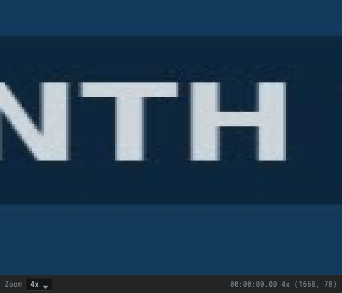
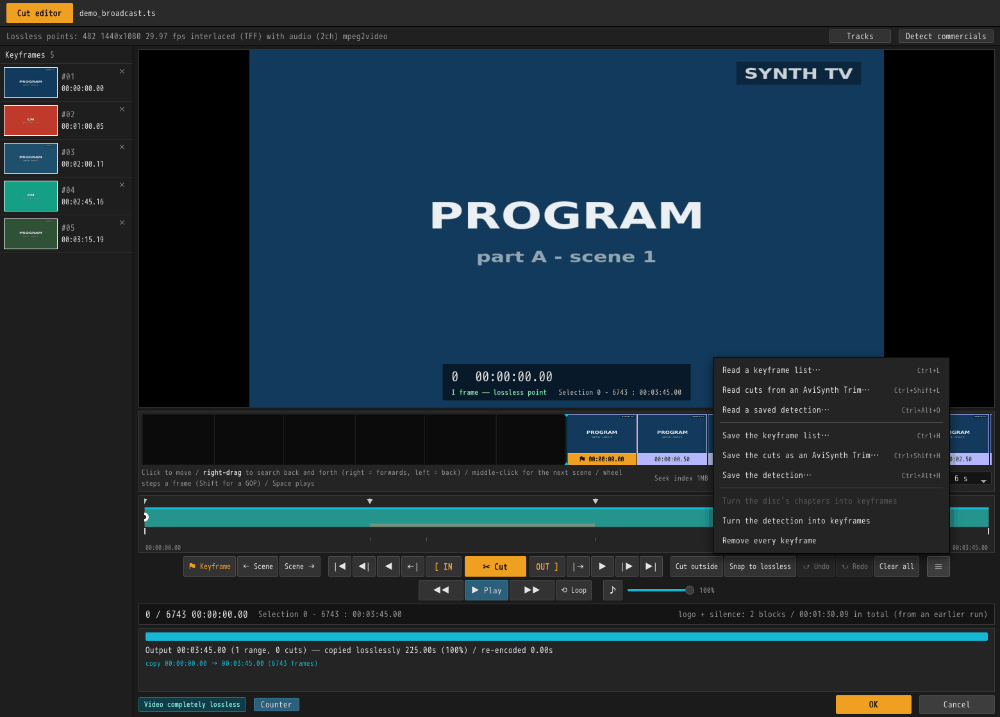

# Using the GUI

[← Documentation](../README.md) ・ [← SmartCut](../../README.md) ・ [日本語](gui.ja.md)

A walk through the screens in the order you meet them. The shape of the job is
**bring them in → cut → write them out**, and this page follows it from an empty
list to a finished export.

- Installing it is covered in the [README](../../README.md#download).
- To do the same things from a terminal, see [Using the command line](cli.md).
- If you start wondering *why* it can cut where it cuts, that is
  [the algorithm](../technical/algorithm.md).

> The screenshots on this page are not real broadcast material. They use a
> practice recording that
> [`tests/make_demo_media.sh`](../../tests/make_demo_media.sh) builds out of
> nothing but ffmpeg's own test sources: 1440x1080, 3 minutes 45, with two
> commercial blocks in it.

---

## First: four screens, four windows

The screens are laid out in the order you use them.

| Screen | Where | What you do there |
|---|---|---|
| **Input** | List window, first tab | Line the recordings up |
| **Cut editor** | **Its own window** | Open one recording, cut it, press **OK** to go back |
| **Output settings** | List window, second tab | Where files go, what format, what happens to the sound. **Applies to the whole list** |
| **Output** | List window, third tab | Write the list out, top to bottom |
| **Batch tool** | **Its own window, its own process** | Queue up saved projects and write them out, top to bottom. Closing the main window does not stop it. See [Working through a batch](batch.md#an-overnight-queue-of-projects) |

The cut editor is a separate window because the three tabs above it are
settings you decide once for the whole list, and cutting is done one recording
at a time: it needs a moment where you can say "this one is finished". That
moment is the **OK** button.

The batch tool has no tab, because it is about a queue of lists rather than
about this one; it is opened from the `バッチ出力ツール` item on the menu. Its
own process, because a queue lined up at midnight has to go on being written
after the window it was lined up in is closed.

The fourth window is the **magnifier** — a tool rather than a screen. It shows
part of the cut editor's picture at the recording's own pixels, holds no
settings and no edit of its own, and closes with the editor
([Looking closely](#looking-closely)).

Each window keeps its own size and its own place. Widening the
list window does not touch the editor's; each one comes back at the size and in
the spot you last closed it at, and one left maximized comes back maximized.

If a remembered spot is off the screen the next time — a monitor unplugged, the
settings carried to another machine — that window opens where it used to open
instead.

---

## 1. Line the recordings up


You start with an empty list. One row of that list is called a **clip**, and one
clip is one recording file.

### Adding recordings

| How | |
|---|---|
| **Drag and drop** | Anywhere on the window. Drop a folder and the supported files inside it come in |
| **＋ Add files** | The button at the top right. You can pick several |
| **Command-line arguments** | `smartcut recording1.ts recording2.ts`. A saved project (`.scproj`) opens the same way |

These are the files it can read:

```
.ts  .m2ts  .mts  .m2t  .mp4  .mkv  .mov  .m4v      (video files)
.vob .mpg   .mpeg .m2p                              (what is inside a DVD)
```

Drop anything else and it says it ignored them; the list does not change.

### Discs: Blu-ray and DVD

**A disc can be opened as it is.** A folder holding a `BDAV`, `BDMV` or
`VIDEO_TS` directory works, and so does an `.iso` file. An `.iso` does not need
mounting — the streams inside it are read where they lie.

**A disc becomes one row per recording on it, not a single row.**

Dropping one opens **Reading a disc**, which asks two questions.


**① Which clips do you want?**
Everything on a disc recorded from television is offered.
A pressed disc is a different matter. A season set holds twelve episodes among
some fifty logos, warnings and menu loops — and on the disc, all sixty-odd of
them are called `000NN`.

So **anything over five minutes is ticked for you**, and the rest is behind
*Show the short clips too*. Each row shows how long the clip runs and how much
of the disc it takes, which is usually enough to tell an episode from a logo.

**② Which tracks do you want?**
Open a row's *tracks* and you see what that clip carries: the video, the audio
tracks with their languages, the subtitles and the menus. The video cannot be
left out. **The subtitles travel with the cut** — whether they end up inside it
or beside it is [an output setting](#the-settings). A **menu** cannot travel:
its buttons point into a timeline the cut has just taken apart. Nor can the
**text subtitles** a disc writes as text, because the typeface they are drawn
with is a file on the disc rather than part of the stream. Both are listed as
`a cut cannot carry this` rather than offered as a choice.
*Use these tracks for every clip like this one* copies your answer across the
whole disc, which is what you want for a season set.

**What the rows are called:**

| Kind of disc | The name on the row |
|---|---|
| Blu-ray recorded off television (BDAV) | the **programme name** — the disc's own index carries the name, the recording time and the chapters |
| Pressed Blu-ray (BDMV) | the disc name plus a clip number (there are no programme names on it) |
| DVD-Video | the disc name plus a title number |

**Opening is instant.** A disc carries its own list of the places playback can
start from, so SmartCut reads that rather than examining the whole recording.
Even an 81 GB title of 2 hours 34 is on the list in under a second.

**The chapters the disc set are on the timeline from the start**, because on a
Japanese recording the chapter marks are frequently the commercial breaks
themselves.

Cuts are written **beside the disc** unless the output settings say otherwise,
because there is nowhere to write inside a disc.

Encrypted discs cannot be opened, DVD and Blu-ray alike.

### What happens the moment a file lands


**The row is filled in immediately.** The length, the resolution, the frame
rate, the codec and whether there is sound all come from what the file says
about itself, which takes about thirty milliseconds however long it is. The
picture on the left arrives at the same time. Drop in twenty recordings and the
last row is never left as a path and an empty square for minutes.

Behind that, the **preparation** runs.

| What the row says | What is happening |
|---|---|
| `Reading` | Building the index used for seeking and cutting — the window calls it the seek index (about 1 second per GB) |
| `Thumbnails` | Building the filmstrip pictures and finding the scene changes (one or two seconds per GB, longer on 4K) |
| `Queued` | Its turn has not come yet |
| `Indexed in 2s` | The index was built just now |
| `Index from an earlier run` | An index from last time could be reused, so the reading pass was skipped |

The top right of the window shows which clip each job is on. Above, the second
recording is being read while the first one's thumbnails are built, and the last
two are still waiting — **and all four rows already show what they are, with a
picture.**

When the reading finishes, its answers replace the first ones on the row. The
only figure that tends to disagree is the length: what is inside a DVD does not
record its own length, so the first answer can be wrong.

**Nothing here makes the editor wait.** A recording that is still being read
opens on a double-click like any other — see
[Usable from the moment it opens](#usable-from-the-moment-it-opens).

**And nothing here makes the rest of the machine wait either.** The preparation
uses every core there is, but it asks for them from behind everything else: if
another program wants a core it gets one first. On an idle machine the
preparation is no slower for it.

### Working the list


Each row shows the filename; the length in frames, the time range, the
resolution, the frame rate and the codec; and then whatever commercial detection
and your own cuts have to say. On the right, `Smart` means smart rendering
applies to this material, and `CM 2` means two commercial blocks were found.

| | |
|---|---|
| **Double-click** / `Enter` | Open that recording in the cut editor |
| `F2` | Rename the clip |
| `Ctrl+A` | Select all |
| `Ctrl+D` | Detect commercials in the selection |
| `Ctrl+B` / `Ctrl+Q` | Detect blank / silent stretches in the selection |
| `Delete` | Remove it from the list (**the file itself is not touched**) |
| `↑` `↓` | Move the selection. Hold `Shift` to extend it |
| **Drag a row** | Reorder. `Esc` cancels |
| **Click where there is no row** | Clear the selection |
| **Right-click** | The commands for that row, as a menu |
| **⧉ Duplicate clip** | Put the same recording in the list twice. Cuts and marks come with it |

**What you add arrives selected**, and whatever was selected before is not. Drop
three recordings onto a list of twenty and you can detect, reorder or rename
those three without finding them again.

**The picture on the left follows the cuts.** Recordings tend to start on black
or on the tail of the previous programme, so the picture is taken a little way
in — and, once there are cuts, a little way into *what survives*. A row whose
commercials have been cut never goes on showing one of them.

**Rows can be dragged into a different order.** The export runs down the list,
so move whatever you want written first to the top. Where that order itself means
something, **Number** in the output settings carries it into the filenames.

**The name has the width of the row**, on a line of its own above everything
else read out of the recording. Where it still does not fit, the end of it is
cut off — which on a broadcast recording is where the episode number is — so
the whole of it is a hover away.

**A clip can be renamed:** `F2`, the **Rename clip** button, or the right-click
menu. The name on the row becomes a field where it stands. `Enter` keeps it,
`Esc` drops it, and emptying it goes back to the name the row arrived with.

The name is used wherever the row is named — the list, the cut editor's header,
and **the file a cut of it is written to**. Characters a filesystem will not take
(`? : /` and the like) become their full-width forms. On a BDAV disc it is the
programme name too, unless the output screen has been given one.

**Duplicating** is for a two-hour recording that contains two programmes: the
same file on two rows, each written out over a different range. The output
filenames get `_1` and `_2` appended.

**A recording renamed or moved after it was added** leaves its row pointing at
a name nothing answers to. Asking for the cut editor is where that is found
out: the row turns red and says the file is no longer there. Put the name back,
or take the row out and add the file again.

**Quick properties**, along the bottom, describes whichever single clip is
selected. With several selected, it just says how many.

### Detecting commercials


`Ctrl+A` then `Ctrl+D` (or the **Detect commercials** button on the right) runs
detection over everything selected. **Dropping in a night's recordings and
pressing `Ctrl+D` once** is exactly what this was built for.

**It can be pressed while the list is still being read.** A recording that is
not ready yet keeps the detection and starts it as soon as its own read
finishes, so `Ctrl+A` then `Ctrl+D` straight after the drop is enough.

Progress appears on the row: `Detecting commercials 84% — Looking for the logo`.
Rows whose turn has not come say `Commercial detection queued`, and rows still
waiting to be read say `Commercial detection after the read`.

**What a detection has to say is a badge beside the row's state.** Dashed
`CM booked` while it waits, solid `Detecting CM` while the pass runs, and then
`CM 5` or `No CM`. The three tell apart by shape, so which rows are still owed
one is something the list is scanned for rather than read for.

There is one badge per detection: `Blank booked`, `Detecting blank`, `Blank 6`
and `No blank` for the pictures, and the same four for the sound. A recording
that has never been through one of them carries no badge for it at all —
`No blank` means the pass was made and found nothing, and no badge means it was
never made.

What was found is remembered, so a row put back in the list, or one detected
from inside the cut editor, wears its badges without being asked again.

The bar under a row can only serve one of the passes on it. The pictures pass
and the detection land on a row together, the moment its read finishes, and the
bar goes to the pictures — which is why the badge is the one that speaks for
the detection.

**Detection only places marks. The cutting is up to you.** Open the cut editor
and the start of each commercial block, and each return to the programme, is
already there as a keyframe. See [Commercial detection](cm-detection.md).

To stop, press **Stop analysis**; pressing it again picks up where it left off.

Running a whole evening's worth at once is covered in
[Working through a batch](batch.md).

### Detecting blank pictures and silence

**Detect black** (`Ctrl+B`) and **Detect silence** (`Ctrl+Q`) on the right read
every selected recording: the first for where the picture is flat, the second
for where the sound is under a level. Both are separate passes from the
commercial detection, and separate from each other.

**The first button is named after what the pass has been told to look for.**
Black out of the box, so *Detect black*; *Detect white* or *Detect blank* where
Preferences says white alone or both. The row's own menu and the cut editor's
`≡` menu follow it.

**They run apart.** The blank pass decodes every picture, so half an hour of
broadcast takes twenty seconds to a minute; the silence pass reads the sound
alone and is done in seconds. Asking for one of them never means waiting for
the other.

A recording still being read can be booked too: `Ctrl+A` then `Ctrl+B` sets
every selected row going as its own read finishes, and a booked row wears a
dashed badge until its turn comes.

Progress appears on the row — `Blank detection 33%`, `Silence detection 60%` —
and what each found stays there on its own line: `Blank: 1 stretch`,
`Silence: 4 stretches`. A recording with no sound answers the silence pass with
`Silence: Cannot detect: no audio` rather than with nothing found.

The answers are kept, so opening the cut editor afterwards shows the bands and
the marks without asking for anything.

---

## 2. Cut

Double-click a row and it opens in its own window.


### Usable from the moment it opens

The editor does not wait for the recording to be read. **What you can do grows
in three stages.**

| When | What becomes available |
|---|---|
| **The moment it opens** (30 ms) | Length, resolution, fps, audio, codec; the timeline, the scrubber, keyframes, **cutting itself**, track choices, commercial detection |
| **When the reading finishes** (about 1 s per GB) | How many lossless points there are, `Snap to lossless`, a frame-accurate preview, the export plan, playback |
| **When the thumbnails are built** (one or two seconds per GB, longer on 4K) | Every picture in the filmstrip, the scene changes, the scrubber's hover preview |

**Only two things wait.** `Snap to lossless` has nothing to snap to yet, and
`Play` has no exact place to start from yet. Everything else works from the
first stage.


While the band underneath reads `Reading the recording. What copies losslessly
is known once it has been read`, you are in the first stage: `Snap to lossless`
is greyed out, but the preview is there and **you can already make cuts.** The
filmstrip fills in from one end as the reading goes on. The marks down the left
came from the `.keyframe` file beside the recording; they do not wait for the
reading either.

**The pictures at this stage were found by approximate seeking.** There is no
index yet to give exact positions, so the filmstrip's cells are cut on an even
grid and some of them stay empty. While you are moving the playhead the strip
keeps to the quick way and **completes itself the moment you stop** — which is
why it can look thin while you search and fill in when you let go.

**The keyframe cards down the left side are the same.** Until the reading
finishes they hold a picture found near the mark; once it finishes, each card
settles on the frame at the mark's own time.

Once the reading finishes, both settle down to exact. **Cuts made earlier stay
exactly where you put them.** The only thing that changes is what they cost: a
join that is not on a lossless point shows up in the plan as a few re-encoded
frames, and `Snap to lossless` can take those to zero once it lights up.

### What is where on the screen

| Where | What |
|---|---|
| Top line | The filename |
| Info bar | Lossless points, resolution, fps, scan type, audio, codec. **Tracks** and **Detect commercials** on the right; the blank and silence passes are in the `≡` menu at the bottom right |
| Left column | The **keyframes** — your marks, each with a thumbnail. Click one to jump there. A mark a detection put down carries `Black`, `White` or `Quiet` under its time |
| The large picture | The preview. At its foot, in the middle: frame number, timecode, what kind of frame it is, and the current selection. **Counter**, on the bottom line, turns them off |
| Beside it, on the left | The **audio level meter**: what is being heard while something plays, and the sound under the playhead while nothing does. **Preferences → Windows** turns it off |
| The band under it | The **filmstrip**: the frames around you, laid out as pictures. The `View` menu on the right sets how much time one cell covers |
| The scrubber | **Green is the output itself.** `▼` are keyframes, a red vertical line is a join left by a cut, the fine ticks below are scene changes, and the two rows under those are the blank and the silent stretches |
| The button row | **Cut** in the middle, `[ IN` to its left and `OUT ]` to its right, and outwards from there: go to, one frame, lossless point, start and end |
| The band and lines below | **The export plan**: what will be copied and what will be rebuilt |
| The bottom line | On the left, what the cut costs, and beside it **Counter** and **Subtitles** — what the preview carries. **OK** and **Cancel** on the right |

> **What a "lossless point" is.** Video is built of **key frames**, which are
> whole pictures on their own, and frames that hold only the difference from
> their neighbours. Cut in the middle of the difference frames and the picture
> has to be rebuilt from scratch. **Cut on a key frame and it does not.**
> SmartCut calls those places — the ones where the stream can simply be cut —
> lossless points.

**Every number on this screen is on the output's clock.** What you cut does not
go grey — it disappears. The scrubber shrinks, the filmstrip closes over the
hole, and the frame counter counts the length that will actually be written.

### Moving around

| | |
|---|---|
| **Click** the filmstrip | Go to that frame |
| **Right-drag** the filmstrip | Search back and forth. Right of centre is forwards, left is back, and further out is faster |
| **Middle-click** the filmstrip | Jump to a scene change: the next one from the right half of the strip, the one before from the left half |
| **Wheel** | One frame per notch. Hold `Shift` to hop from lossless point to lossless point. Anywhere in the window, not only over the filmstrip; over the marks down the left or over the plan it scrolls those instead |
| **Drag** the scrubber | Move the playhead. Grab near the IN or OUT mark and you move that mark instead |
| **Hover** the scrubber | Shows the frame at that moment in a small picture |
| `Space` or **▶ Play** | Play from here, picture and sound. Press again to stop. The picture runs at the recording's own frame rate; where the machine cannot decode and draw that many, it shows fewer rather than falling behind the sound |
| **◀◀** **▶▶** | Rewind and fast forward. Each press doubles the speed, 2 to 16, and once more stops it; the button says which speed it is running at. No sound |
| `←` `→` | Back and forward one frame. Hold to repeat |
| `Shift+←` `Shift+→` | One second |
| `PageUp` `PageDown` | Back and forward by however far the [preferences](#cut-editor) say. A key whose unit is **%** carries a speed rather than an amount, and scrolls for as long as it is held. `Shift`, `Ctrl` and `Shift+Ctrl` each carry their own answer |
| `↑` `↓` | Previous / next **scene change** |
| `Shift+↑` `Shift+↓` | Previous / next **lossless point** |
| `Ctrl+←` `Ctrl+→` | Previous / next **keyframe** — the marks down the left. The one landed on is picked out in that column too |
| `S` / `Shift+S` | Next / previous scene change |
| `◀\|` `\|▶` | Previous / next **lossless point** |
| `\|◀` `▶\|`, `Home` `End` | Start / end |

### Listening to a seam over and over

The playback row sits under the cutting one: rewind, play, fast forward and
**Loop**, with the **volume** to the right of them.

With **Loop** down, playback that reaches the end of the selection goes back to
where it started and plays again. What repeats is the **selection**: it starts at
the playhead where that stands inside it, and at the IN mark where it does not.
On a recording with nothing marked the selection is the whole of it.

Straight after a cut the selection stands collapsed on the seam it just made.
Press `Space` there and what repeats is **half a second around the join** — the
run-up as well as what follows, which is what a join has to be heard as. For a
longer listen, put IN and OUT either side of the seam and that stretch is what
repeats.

The **volume** is the preview's alone — what gets written is untouched. ♪ silences
it and brings it back (so does `M`), and the wheel over the slider moves it. Both
are remembered, so the next clip opens at the level you were working at. On a
recording with no sound, neither is available.

### Watching the level

The meter stands the height of the picture, on its left. While something is
playing it shows what is actually being heard; while nothing is, it shows the
frame under the playhead. The scale is dBFS, 0 at the top being the point
where it would clip: green to -18, amber to -6, red above that, and the thin
line above each bar is the last peak.

**A commercial junction is a second of near silence.** Stepping a frame at a
time with an eye on the meter is how to find the frame that silence begins at,
which is frequently clearer than anything in the picture.

**There is a bar per channel the recording carries** — one for mono, two for
stereo, six for 5.1, eight for 7.1. Eight is the most it draws; a recording
with more than that is metered on its first eight. The bars share the width of
the column, so they thin out as the count rises. The count does not change on a machine that can only play
two of them: what the meter reports is the sound in the recording, not the
downmix the hardware made of it.

On a recording with no sound the scale stands empty. **Preferences →
Windows** puts the whole column away, and an editor already open follows at
once.

### Looking closely



`Z`, or **Magnifier** in the ≡ menu, opens a window of its own. Move the
pointer over the cut editor's picture and that part of it is magnified there,
from 2x to 8x — the menu is at the foot of that window.

**What it shows is the recording's own pixels.** The preview has been scaled to
the width of the stage, and scaling is what takes the comb out of interlaced
material: the fine teeth along a moving edge are single lines, and they do not
survive being resized. The magnifier reads the frame again at the size the
recording holds it, so what is on the screen is what is in the file. The corner
of that window says which frame, how far it is magnified, and which pixel is in
the middle of the view.

The picture holds still while something is playing — reading a frame at full
size thirty times a second would be the playback it is there to watch — and
catches up when playback stops. The window closes with the cut editor.

### Showing the subtitles


**Subtitles** sits on the bottom line, beside what the cut costs. It is off to begin
with; choose a track and it is drawn over the preview. **It is there to place a cut by.** Whether a
seam lands in the middle of a line, and how far a subtitle runs either side of a
commercial break, are not things the picture alone will tell you.

- A broadcast's **ARIB captions** are drawn as characters, at the position, size and
  colour the broadcaster asked for, so they stay sharp however big the window is.
  The ones a broadcaster sends **as dots** rather than as characters — the arrow that
  carries a sentence onto the next line, the brackets a speaker's name sits in, the
  `ü` in a German line — are drawn from those dots, in the cell a character would
  have taken.
- A disc's subtitles — **PGS** and a DVD's **subpictures** — are pictures, and what
  the disc drew is what is put on screen.
- Where a recording carries more than one (a bilingual broadcast, Japanese and English
  on a disc), the one chosen is the one drawn.
- The frame number and time stay at the **foot** of the picture whether subtitles are
  showing or not. They share that corner with a caption, and they are drawn over it, so
  where the playhead is never goes missing. Where the caption is the one you want to
  see whole, turn **Counter** off beside it — the line under the film strip still
  says where you are, and the answer is remembered for the next clip.
- Playback keeps up with them.
- **A recording that carries no subtitles has no picker.** The bottom line then holds
  **Counter** and nothing else — which is what the screenshots elsewhere on this page
  show, since the practice recording has none.

None of this changes what is written. This chooses what is **on screen**; which
subtitles go into the output is answered by **Tracks** and by the output settings.

### Finding blank pictures and silence

**Detect black** (`Ctrl+B`) and **Detect silence** (`Ctrl+Q`), in the `≡` menu
at the bottom right, read the recording that is open. The first is named after
**The blank pass looks for** in Preferences, as the list's button is. If the
list has already been over it, what was found is on the timeline when the
window opens; the lines read it again. They are two passes: running one leaves
what the other found where it is.

Each stretch is drawn as a band under the timeline — blue-grey for black and
white, green for silence — in its own row under the scene changes, which are
the fine orange ticks.

**Both ends of a stretch are marked.** Where the material before it stops being
worth keeping and where what follows begins are two different pictures, and a
fade puts them a second apart, so the start and the end are both keyframes.
Each detection has its own pair of keys for walking those ends: `Alt+↑` and
`Alt+↓` for the blank stretches, `Alt+Shift+↑` and `Alt+Shift+↓` for the silent
ones. A fade to black and a silence are rarely in the same place, which is why
one pair of keys does not walk both.

Whether a detection marks anything is a preference, one for each of the two.
Off, it leaves the band and nothing else. So does a recording that came up with
a mark file of its own — a `.keyframe` beside it is somebody's own answer about
where the breaks are, and a detection's marks are not mixed into it. Ask for the
pass from this menu and they go down.

The marks it does put down are told apart in the keyframe column: under the
time on the card, a small `Black`, `White` or `Quiet`. A mark carries one only
where it stands on the end of a stretch, and two where it stands on the end of
both — a junction is frequently a fade to black and a silence at once.

A black stretch at a junction is often only two to four pictures long, which is
why every picture is decoded to find them. **Out of the box neither pass
reports anything that short:** both minimums are three seconds, which is the
length of a gap that was left on purpose rather than a fade the programme cut
on. For the junctions themselves, say 2 and pick pictures.

**The pictures pass looks for black alone out of the box.** White is asked for
in Preferences, and whatever is asked for is what the button in the list and
the line in this window's menu are named after. Half an hour of broadcast takes twenty seconds
to a minute — on a recording held over a share it is the reading that decides.
The silence pass reads the sound alone.

How long a stretch has to last, and what counts as silence, are in Preferences:
three seconds for either pass out of the box, and -50 dB for the sound.

### Marks and cuts are two different things

- A **keyframe** is a *mark*, not an edit. `⚑ Keyframe` (or `K`) puts one on
  the frame you are on. Marks are listed down the left with a thumbnail each;
  click one to jump there, or click its `×` to remove it.
- In that column, `Ctrl`-click gathers marks one at a time and `Shift`-click
  gathers a run of them. `Del` then removes the lot in one go, and `Ctrl+Z`
  puts them all back.
- A **cut** is the edit. Set IN and OUT, press `✂ Cut`, and that range leaves
  the output.

Marks can also arrive without your placing any: from a detection, from a
`.keyframe` or a saved detection next to the recording, and — for a recording
opened off a **disc** — from the chapters the recorder itself set.

### Reading the marks in, and writing them down



**≡**, at the right-hand end of the transport row, holds everything to do with
the marks.

| Line | What it does |
|---|---|
| **Read a keyframe list…** | Reads a `.keyframe` from wherever it is (`Ctrl+L`) |
| **Read cuts from an AviSynth Trim…** | Reads a `Trim` line (`Ctrl+Shift+L`). It arrives as cuts, not as marks |
| **Read a saved detection…** | Reads a detection saved earlier (`Ctrl+Alt+O`). The band and the marks come back as they were |
| **Save the keyframe list…** | Writes the marks beside the recording (`Ctrl+H`) |
| **Save the cuts as an AviSynth Trim…** | Writes the surviving ranges as `Trim` calls (`Ctrl+Shift+H`) |
| **Save the detection…** | Writes the detection now on screen (`Ctrl+Alt+H`). Greyed where nothing has been detected |
| **Turn the disc's chapters into keyframes** | Puts them back after a clear. Greyed on anything but a disc |
| **Turn the detection into keyframes** | Marks the detection now on screen. Greyed where nothing has been detected |
| **Remove every keyframe** | The marks alone. The cuts stay |
| **Magnifier** | Opens the magnifier window, or closes it (`Z`) |

There are three shapes to write, and the picker opens with the recording's own
path already in it.

| Shape | What is in it | Name |
|---|---|---|
| **Keyframe list** | The marks alone, one frame number per line | `recording.keyframe` |
| **AviSynth Trim** | The ranges that survive, as `Trim` calls | `recording.ts.trim.avs` |
| **Saved detection** | The blocks found, and how they were found. JSON | `recording.cm.json` |

Typing `.keyframe`, `.avs` or `.json` over the name in the picker overrides the
line that was picked, and a file being read is taken for what its own extension
says it is.

`Ctrl+H`, `Ctrl+Shift+H` and `Ctrl+Alt+H` write all three straight to those names
with no picker. They ask before writing over a file that is already there; a
preference turns that question off.

**A detection reads the recording for minutes.** Saving one means opening the
same answer again without that wait. A detection is also kept in SmartCut's own
cache and comes back on its own the next time the recording is opened, so the
file is for carrying one to another machine, or handing it to somebody else.

Opening a recording in the cut editor picks up whichever of them is beside it.
**A keyframe file arrives as marks and cuts nothing. A Trim file is the cut
itself, so the recording opens with the material already taken out. A saved
detection arrives as the band and the marks together.** When more than one is
there, a preference says which is read; any of them on its own is read whatever
that preference says.

**Where one of them was read, a detection is not mixed into the marks.** A
`.keyframe` beside a recording is your answer about where its breaks are and a
detection is the program's, and marks from both in one column cannot be told
apart afterwards. The detection is still shown, as the band under the timeline
and the line beside it, and **≡** → **Turn the detection into keyframes** puts
its marks down if you want them.

A detection can be left at the band every time, too: the preference **Turn a
detection into keyframes**, on out of the box.

**Neither waits for the analysis.** The marks are in the list the moment the
window opens, and pressing one goes there. A long recording takes a while to
analyse; the marks are usable before it does.

The numbers in both count from the recording's first picture.

### Selecting with IN and OUT


Click the keyframe at the head of the commercial block and press `I`. Then click
the keyframe where the programme comes back, press `←` to step one frame off it,
and press `O`. That puts the block exactly inside the selection. `[` and `]` are
the same two keys under the hand that is already on the bracket keys.

Stepping that one frame off is what `Ctrl+Del` below saves you: mark the two
frames you want to *keep* and it takes out what lies between them.

- **IN to OUT includes the OUT frame.** Select five frames and five frames go.
- **Setting one end leaves the other alone**, because you place IN and OUT one
  at a time as you close in. Only when the two cross does the one you just
  placed win, and the other retreats to the end of the timeline.
- The selection is shown under the preview and on the status line, as
  `Selection 1800 - 3599 : 00:01:00.06`.

### Making the cut


`✂ Cut` — or `Del` — takes the selection out of the output. The screen is
rebuilt immediately, and the lines below tell you what will be written:

```
Output 00:02:44.94 (2 ranges, 1 cuts) — copied losslessly 164.94s (100%) / re-encoded 0.00s
copy 00:00:00.00 → 00:01:00.05 (1800 frames)
copy 00:02:00.11 → 00:03:45.00 (3143 frames)
```

**If the badge at the bottom left reads `Video completely lossless`, not one
frame of this output will be rebuilt.** Cut the second commercial block the same
way and it becomes `3 ranges, 2 cuts`.

**Only three lines of the breakdown are visible at once.** More cuts mean more
lines, and the rest are read by scrolling. When there is more below, a slim bar
appears down the right-hand edge and the bottom line sinks into shadow.

`Ctrl+Del` is the same cut moved one picture in at each end: **the two frames
the marks are on stay, and everything between them goes.** With IN on 2392 and
OUT on 5990 it takes out 2393 to 5989. Mark the last frame of the programme and
the first frame of its return -- both worth keeping -- and the block between
them leaves in one press, with no stepping a frame in from either mark first.

**A join left by a cut becomes a keyframe of its own**, because that is exactly
the place you will want to check afterwards. The scrubber keeps a red line
there.

### Cutting again, and cutting the other way round

| Button | |
|---|---|
| **Cut outside** | Drop everything **outside** the selection. One press for lifting a single stretch out |
| **Snap to lossless** | Move both ends of the selection to the nearest lossless point. **Press it and the re-encoding goes to zero** |
| **↺ Undo** | Step back to before the last edit (a hundred deep, `Ctrl+Z`) |
| **↻ Redo** | Put the edit back (`Ctrl+Y`) |
| **Clear all** | Remove every cut and every keyframe. Undo takes it back |

**Undo brings the selection back with the cut.** Cut, look at the join, decide
it was three frames out: one press of Undo and the range you cut by is still
marked. Move the end and cut again. The playhead comes back too, to the frame
you were looking at.

Undo covers more than cutting. Marking a keyframe, deleting one, clearing them
all, Clear all: every one of them is a step back.

### When re-encoding is needed


**When a cut point lands between key frames, the piece around it is rebuilt.**
The orange part of the band, and the `re-encode` lines, are those frames.

Above, **21 frames** out of 453 — leaving 95.4% of the length a byte-for-byte
copy.

Commercial boundaries in a broadcast recording sit in silence, and silence is
usually a lossless point as well, so **removing commercials often comes out
completely lossless.** It is cutting at an arbitrary moment that costs those
twenty-one frames, and `Snap to lossless` takes them back to zero.

### Choosing which tracks are written


**Tracks**, on the info bar. A broadcast recording contains more than a picture
and a sound, and this is where you say which of it goes into the output.

**Everything is on by default.** The case this menu exists for is switching off
the second language on a bilingual broadcast. A track nobody asked about is
still a track that was in the recording, and dropping it silently would mean the
program deciding what the recording is for.

- **A second sound track is named as the broadcaster named it.** A recording in two
  languages and one carrying commentary for a viewer who cannot see the picture both
  arrive as two stereo tracks at the same rate, and most of the commentary ones say
  Japanese on both — the language code alone does not tell them apart. So the row
  carries the broadcaster's own word for the track beside the code, `eng 英語` or
  `jpn 音声解説`, wherever the broadcast gave one.
- **Captions can only be kept when writing a `.ts`.**
- **The crawl is a track of its own, not part of the captions.** It belongs to
  the hour rather than to the programme — an earthquake warning is not a line of
  dialogue — so it is listed and switched separately. A 4K broadcast's subtitles,
  which are XML rather than ARIB characters, are a track of their own too.
- Data broadcasting is not a track this menu switches: it is one standing
  answer, in [the preferences](#output-settings), because it can only go into
  a `.ts`. Left off there, it appears here as `not carried`. For a recording off a disc, a
  menu and the text subtitles drawn with the disc's own typeface really cannot be
  carried, and say so here.
- **A Blu-ray's subtitles are a choice here like any other track.** A DVD's are
  not: they go wherever the output settings send them, and the list says so on a
  line of its own — `inside the cut or beside it, as the output settings say`.
- Programme information, the station name and the broadcast clock are not tracks
  and so are not listed, but they are carried across when writing a `.ts`.

This choice is a fact about *this clip*, so it travels back with the edit and is
saved in the project.

### Finishing with a recording

- **OK** — take the cuts and marks back to the list and close.
- **Cancel** (`Esc`) — throw away what was done here and close. It asks first
  where anything was done.

Either way the list window has stayed where it was, ready for the next
recording.

---

## 3. Output settings


**These settings apply to every clip in the list.**

The top half is there to be read: pick a clip and it shows **what that recording
will become under the current settings** — video, audio, how many ranges, how
long the output is, and the path it will be written to.

**Two things can come out of a run**, chosen by the two tabs just under this
screen's own tab:

| | |
|---|---|
| **Files** | Ordinary video files |
| **BDAV disc** | A folder a recorder or a player opens as a list of programmes ([below](#writing-a-bdav-disc)) |

What is set on either tab stays there when you switch.

### The settings

| Field | |
|---|---|
| **Output folder** | Empty means alongside the input. Use `Browse`, or type a path (an SMB path is fine) |
| **Subfolder** | A folder of that name under the output folder, which is where the run writes. Offered where there is more than one file. The name is filled in the first time you look: the disc's name, or the project's, or else today's date. Emptied, the run writes straight into the folder above. **A folder of that name already there gets a branch number** — `night`, then `night-2`, `night-3` — so a second run never lands on the first one's files. The field keeps the name you gave; `already there → night-2` beside it says where the run will actually write |
| **Filename prefix** | `cut_` by default, in front of the name. What it starts as is a [preference](#output-settings) |
| **Number** | Puts the row's number in the list behind the prefix, in 2 to 4 digits. **On by default**, so `cut_01_recording.ts`; turned off, `cut_recording.ts`. For a list whose order means something and a folder that sorts by name |
| **Container** | The file format. `Same as the input`, or a specific one |
| **Audio** | `Smart rendering (default)` / `Copy through` / `Re-encode everything` |
| **Audio codec** | `Same as the input`, or AAC, AC-3, DTS, linear PCM |
| **Audio channels** | `Same as the input`, or 1ch, 2ch, 5.1ch |
| **Sample rate** | `Same as the input`, or 96 / 48 / 44.1 / 32 kHz |
| **Bit depth** | `Same as the input`, 16 or 24 bit (only meaningful for linear PCM) |
| **Audio bitrate** | For frames that are rebuilt. `Leave it to the engine` is the safe answer |
| **A disc's subtitles** | Shown only for a recording off a disc. `Inside the cut (PGS)` by default — one file, with its subtitles in it — or beside the cut: `.idx / .sub`, the pair every player and subtitle tool reads, or `.sup`, the display sets themselves. **The line says which destination leaves them untouched**, and that is a different one for a DVD than for a Blu-ray |
| **Write the keyframes to a separate .keyframe file** | Puts a `.keyframe` file next to the video, under the same name |

A `.keyframe` file is **frame numbers and nothing else, with no header**, counted
on the clock of the file that was written. If a `.keyframe` file sits next to a
video under the same name, SmartCut loads it when that video is opened.

This setting is about the export. The cut editor can write the same file beside
the *recording*, and that one is counted on the recording's clock.

### The three audio modes

| Mode | What happens |
|---|---|
| **Smart rendering** (default) | Rebuilds only the few frames a boundary falls inside, so nothing from the far side of a cut is heard. **Cut in silence and the result is byte-identical to a copy** |
| **Copy through** | Lossless to the byte, but a little of the cut-away side survives at the join |
| **Re-encode everything** | Cuts to sample precision, at the price of rebuilding the whole track |


**The five rows for codec, channels, rate, bit depth and bitrate appear only
under `Re-encode everything`.** They all describe an encode, and the other two
modes do not run one over the whole track. Their values are kept while they are
hidden.

**Changing what the sound is made of rebuilds the whole track.** The only frames
that can be copied are frames in the recording's own shape. Any one of these
makes the whole track a re-encode:

- a different codec (AAC → AC-3, say)
- a different channel count (5.1 folded to stereo — a downmix)
- a different sample rate (a resample)

Choose by what you need. **AAC** is what a broadcast carries and plays straight
off a phone. **AC-3** is what a disc player or an AV receiver handles most
reliably; **DTS** likewise. **Linear PCM** is uncompressed, so if the material
is going on to be edited further, there is no second generation of loss.

**Audio that came off a disc.** Blu-ray LPCM is smart rendered, the same as AAC.
DTS-HD and TrueHD are lossless, so no mode rebuilds a frame of either: they are
copied whichever mode is set, boundaries and all, and SmartCut says so.

### Why some choices are greyed out

**Combinations that cannot legally be written are greyed out.** Choose 44.1 kHz
and `Linear PCM` goes grey; change the container to MP4 and it comes back.

They are greyed rather than removed from the list, because a list that has
quietly got shorter cannot tell you what is missing.

The decision does not come from a table in the window. It comes from the engine
that does the writing — so **what you can choose is what this build can actually
produce.** An export never fails at the last moment.

**Values larger than the material are greyed out too.** Channels, sample rate
and bit depth can all be written larger than the recording once you are
re-encoding. But being writable and carrying more information are different
things:

- 6 channels made from 2 is two channels' worth of sound spread over six
- 48 kHz made from 44.1 kHz is the same waveform drawn with more points
- 24 bits made from 16 is the same numbers with eight zero bits under them

The only thing that grows is the file. So those three rows offer the recording's
own value and below.

**For a list, "the recording's value" is the smallest one in it.** With a stereo
recording and a 5.1 recording in the same list, the ceiling is 2ch — offering
5.1 would mean the stereo one got spread out.

### Writing a BDAV disc


A night's cuts can go out as files, or **as a disc**:

```
BDAV/
  info.bdav              which programmes are on it, and what the disc is called
  PLAYLIST/00001.rpls    one recording: from when to when, and its name
  CLIPINF/00001.clpi     that recording's own index
  STREAM/00001.m2ts      the picture and sound themselves
```

That folder is **exactly what a recorder writes to a BD-RE**, and an authoring
tool or ImgBurn will burn it as it stands.

Writing a disc adds these fields:

| Field | |
|---|---|
| **Disc title** | The name a recorder shows over the list of what is on the disc. Filled in with the series the recordings are episodes of — the programme name with the episode number, the episode's own title and the broadcast's marks taken off it. Where they are not all one series — several programmes, or two seasons of one — there is no such name, and the moment the disc is being made stands there instead: `2026-09-11 00:15`. Typed over from either |
| **Programme name** | **Per clip**, not per list: what this recording is called in the disc's index. Filled in from what the recording says about itself, and typed over from there. Emptied, it goes back to what the recording said |
| **Channel** | Per clip. What the channel calls itself, and beside it the three digits a viewer knows it by — 0, or empty, where the recording does not say, which is what a terrestrial recording writes there |
| **Recorded** | Per clip. When the programme went out, as `2026-08-17 01:00:00`. Slashes, a missing seconds field and single digits are understood and put back in that shape; anything that cannot be read as a moment stops the run rather than being written as no moment at all |
| **About** | Per clip, and several lines of it: the sentence a listing carries and the cast and staff under it. This is what a recorder shows when the programme is selected in its list |
| **Image** | Whether to wrap the finished disc in a `.iso` (`None` / `UDF 2.50` / `UDF 2.60`). The folder is written either way, and the image goes beside it under the same name |
| **Disc kind** | Under the image, and only there when one is being made. What the image says may be done to the disc it is burned onto. *Nothing writes to it again* is the default and is the truth about a BD-R, or a BD-RE you only play. *The recorder may go on editing it* is what a recorder writes on a BD-RE, and what it wants to see before it will add a recording to the disc or take one off — pick it if the disc is going back into the recorder |
| **Remove the folder once the image is written** | Under the image, and only there when one is being made: the same thirty gigabytes twice over is not what most runs want to be left with. The folder is still written and the image still made of it — this happens afterwards, and only where the image was written. `BDAV` goes, and the folder above it only where that leaves it empty, so a disc written into a folder of your own leaves the rest of it alone |
| **Disc** | The disc this is going to be burned onto (25GB / DL 50GB / XL 100GB / XL 128GB). The gauge below is drawn against it |
| **Transcode** | Where the list does not fit the disc chosen above, the pictures are transcoded smaller until it does. **Where it fits, nothing is done to them.** The sound, the subtitles and the programme information are untouched; only the pictures give anything up. Turning it on adds a second row to the gauge -- "before" and "after" -- showing what the disc comes to afterwards and what share the pictures are written at. MPEG-2 recordings only; anything else takes its full room. What happens inside is in [Fitting a disc](../technical/transrate.md) |
| **Disc used** | What the list comes to against the disc, a band per recording. The white line is the edge of the disc and the faint one before it is the hundredth held back; anything past the line is drawn in red. The figures are an estimate made before anything is written, and on whole recordings it lands within about one per cent. They are counted in GiB, the way the file manager beside the window counts, which is why a single-layer disc reads 23.3 GiB here and "25GB" on the control above -- that one is the name on the box |
| **Disc folder** | Replaces "Output folder", and **cannot be left empty** — a disc is one place, and the recordings in a list can have come from four. SmartCut makes one more folder under it, named by "Subfolder", and writes `BDAV` in there |

**The programme information comes with the recording.** This is the point of
writing a disc rather than a folder. `00001.m2ts` is not a name anybody wants a
recording called, and the index beside it is where everything a person reads
lives: the programme's name, the channel it came off, the night it was recorded,
and what the broadcaster said it was about. All of it is filled in from what the
recording already knows.

- A recording read off a disc keeps everything its playlist said.
- A broadcast recording is read for its own programme information.
- A cut this program made earlier still carries all of it.

**And all of it can be typed over**, because a recording that has been through
tools that kept none of it has nowhere else to get it from, and a name nobody
can correct is a name that is wrong forever. What the fields show is what will
be written. Emptying one leaves the field on the disc blank — which is a thing a
real disc does: an authoring tool's disc names the programme and the date and
leaves the channel and the description empty. The one exception is the name,
which fills itself back in, since a nameless row in a recorder's list is the one
outcome nobody wants.

The count beside each text field is how much room the index has left for it, in
bytes of the ARIB code a playlist is written in rather than in characters: 255
for the name, 20 for the channel and 1200 for the description. It turns colour
where what has been typed no longer fits, because what does not fit is cut off
on the way onto the disc.

**The chapter points are the cuts.** One at the start of every kept range —
which is where the commercial breaks were — plus any marks put down in the cut
editor. On a disc that is the list a viewer actually uses, which is why the
`.keyframe` sidecar is not offered here: the same list would be written twice,
and a player only looks at one of the two.

**A second run adds to the disc.** The numbering carries on from what is already
there, and nothing already on the disc is removed or rewritten, so a disc can be
filled over a week.

**SmartCut does not burn discs.** What it hands you is the image; the burner is
whatever you already use.

There is a great deal more of this in [Writing a disc](../technical/bdav.md).

---

## 4. Export


`Start export` writes the list out from the top down. Each row carries its own
progress and result, and above them are the overall state, the elapsed time and
the time remaining. At the end it says `4 of 4 written`.

**Anything the run has to say that is not its state gets a line of its own under
the bar** — the folder it was given a branch number for, a disc index or an image
that would not write, a folder taken away once the image held it. It stays up
after the run, and the next run puts it down as it starts.

**Writing a `.ts` takes two passes.** After the video and the sound are written,
the finished file goes through once more so the broadcast's own programme
information can be put back. The state line says so while it does —
`Finishing …: putting the broadcast's own tables back` — and the bar runs across
both passes, so it never stands still. A clip written onto a disc is the same.

While it writes, that same button reads `Stop export`. Pressing it **finishes
writing the clip currently in progress**, then stops. It never leaves a
half-written file behind.

`Add to batch` puts the list in the queue instead of writing it now, with no
picker. **What goes into the queue is a copy of the list, written into a folder
of the queue's own** — never into the output folder — under the name of the
project you have open, or of the list's first row where there is none. The copy
belongs to the queue and goes when the job goes.

**Registering is also saving.** The project you have open is written as well,
the way `Ctrl+S` writes it; an untitled list has the copy instead, and the `*`
in the title bar comes off for it either way. The press also starts the
[batch tool](batch.md#an-overnight-queue-of-projects) if one is not already up,
and the job goes to the end of its queue.

**Stopping part way through a disc takes back what was written to it.** The pass
that builds the index reads every stream back, which is minutes of work nobody
wants after saying stop, so it does not run — and without an index, a written
stream is one no programme points at, skipped by the next run's numbering and
carried into any image made of the disc afterwards.

### The picture here is the frame that gets re-encoded


The large picture is not a representative frame. It is **a frame that will be
re-encoded** — the only place in the output whose quality is this program's
doing.

`Re-encode 1 of 2` says how many such places there are, and the line above says
how many frames in total.

For a clip whose cuts all landed on lossless points, you get an ordinary
representative frame instead, with `Nothing re-encoded — the whole clip is
copied losslessly` written underneath.

Not when **Transcode** is ticked: the seams cost nothing and every
frame is still written back smaller, so the line reads `The whole clip is
transcoded to fit the disc` instead. Only for MPEG-2 recordings — anything
else is copied at its own size, and says so.

While the list is being written the picture follows along. When the run ends it
**stays on the last frame encoded** rather than going back to the top.

---

## Saving your work


The **SmartCut** button at the top right saves and opens projects (`Ctrl+S` /
`Ctrl+O`). A project holds the list itself: the paths, the cuts and marks you
put in, the track choices, and the output settings.

**New project** in the same menu (`Ctrl+N`) empties all of it.

The menu carries more than projects. **Batch tool…** opens the second window
that writes queued projects out one after another (see
[Working through a batch](batch.md#an-overnight-queue-of-projects)), and
**Preferences…**, **About SmartCut** and **Quit** are here too.

A `.scproj` file is only a few hundred bytes, and it opens on another machine.
See [Projects](projects.md).

## Preferences


**Preferences…**, in the same menu. Nothing settled here goes into a project:
it is the program's own set of answers, and it is still in force the next time
you start it.

The six groups are the list down the left. There is no OK: every change takes
effect as you make it.

### Windows

| Setting | What it does |
|---|---|
| **Language** | English, Japanese, or follow the system (the default). A change takes effect in both windows at once |
| **Frame number and clock over the picture** | The box at the foot of the cut editor's picture. The same answer as its **Counter** button |
| **Audio level meter** | The meter to the left of the cut editor's picture. This is the only place it is switched on and off |
| **Show the subtitles from the start** | Opens a recording that carries subtitles with the first track already chosen. It can still be switched while cutting |

### Cut editor

| Setting | What it does |
|---|---|
| **PageUp / PageDown** | What those keys do. Four answers — plain, `Shift`, `Ctrl`, `Shift+Ctrl` — each a number and a unit: **frames**, **seconds**, or **% a second, scrolling**. The first two are amounts, one per press. A percentage is a speed: a share of the fastest scroll here, which is sixty times the recording's own speed. 25 is fifteen times, so a second of holding covers fifteen seconds of the recording, whatever is open. Out of the box: 15 frames, 30 with `Shift`, 25% with `Ctrl` and 50% with both. A step of 0 is a key that does nothing |
| **When more than one is there, read** | Which file is picked up when a recording has more than one of a `.keyframe`, a `.trim.avs` and a `.cm.json` beside it |
| **Turn a detection into keyframes** | On out of the box. Off, a detection leaves the band and the sentence and nothing else, and ≡ → **Turn the detection into keyframes** places the marks. Where a mark file beside the recording was read, a detection is not marked whatever this says |
| **Counts as blank after** | Shorter stretches are left out. The unit is pictures or seconds; 3 s out of the box, which reports the long gaps and not the two-to-four-picture black a broadcast junction is laid on. For those, say 2 and pick pictures |
| **The blank pass looks for** | Black and white, black alone, or white alone. **Black out of the box**, that being where a junction is laid; the button in the list and the line in the editor's menu are named after this answer — *Detect black*, *Detect white*. White belongs as often to the programme — a title sequence cuts on a flash — so on some material it is dozens of stretches nobody asked about. A shade that was not looked for was not written down either, so asking for both afterwards reads the recording again |
| **Turn a blank detection into keyframes** | On out of the box. Off, the band under the timeline is all that is left. Where a mark file beside the recording was read, what the window opens holding is not marked whatever this says; the two lines in the `≡` menu mark it |
| **Counts as silence after** | The same for the sound, and the same 3 s. A pause in dialogue runs 0.1 to 0.4 s and a junction's silence about a second, so anything much shorter comes back as dozens of stretches |
| **Silence is quieter than** | -50 dB out of the box, measured on the loudest sample of each audio frame. Lower finds only what is truly silent |
| **Turn a silence detection into keyframes** | As for the blank pass, and on out of the box |
| **Let the save shortcut write over a file without asking** | `Ctrl+H`, `Ctrl+Shift+H` and `Ctrl+Alt+H` then write over a file of the same name in silence |

### Output settings

**Filename prefix** and **Put the row's number in the list behind the prefix**
(with its digits) are what the fields of the same name on the output screen start
as; the number is on by default. Changing one here puts it into the settings in
force as well. A project that is opened brings its own and wins.

**Keep the data broadcast (.ts only)** carries the pages behind the d button
into the cut. Only a `.ts` that keeps the broadcast's own tables can hold one, so
a disc and an `.mp4` never get it whatever this says. **On** to begin with: a cut
is meant to be the recording, shorter. Clear it for the runs where size matters
more than the pages — a carousel is between a hundredth and a fifth of the file
depending on the station. Unlike the three above it is only here: it is a
standing answer, not something a project carries.

**Carry the output settings over to the next start** remembers them and puts
them back at the next start and on **New project**: the folder, the file name
prefix, the container, what is done to the audio, and which of file output and
BDAV output you were on. A project that is opened brings its own settings and
wins.

Two things are never carried: the disc title, and the name of the folder made
under the output folder. Both are read off whatever is in the list, and
carrying either to another recording would mean answering for a recording this
session has not seen.

**Back to the defaults** puts the output settings back where they started.

### How cuts are made

| Setting | What it does |
|---|---|
| **Tidy the start of each range** | Re-encodes up to the first two seconds of a range that begins on an open GOP. The join is steadier; that much less of the output is copied losslessly. The same thing as the CLI's `--clean-joins` |
| **Build a proxy before cutting** | Re-encodes the whole recording and cuts against the lighter copy. Costs minutes and gigabytes per hour, and only pays where decoding one picture is itself slow. The width is a setting of its own |
| **Fade the sound at each seam** | Takes the level down into a join and brings it back out over that many seconds; 0 is no fade, which is the default. The same thing as the CLI's `--audio-fade` |

A fade turns the step in the sound into a pause. What it costs is the programme:
that many seconds either side of every join are quieter than they were recorded.
**It needs sound this program is writing.** Smart rendering and a whole re-encode
both write it; a track set to be copied is copied, and the export says so. Sound
carried through whole because re-encoding it would lose what makes it lossless —
TrueHD, DTS-HD MA — is not faded either.

The beginning and the end of the output are left alone. A fade is for a place
where two pieces meet, and the start and end of a file are not such places.

### Scratch files


Where the seek indexes, proxies and detections — commercials, blank and
silence — go. The default is the cache directory the platform gives this
program; **Browse…** changes it. A folder that cannot be written to is refused
on the spot and the old one stays in force.

Only what is written after the change goes to the new folder. What is already
cached stays where it is.

How many files and how many bytes there are shows by kind, and **Delete all**
removes them. Nothing there is worth keeping: it is what another pass would
build again, never a cut or a project.

### Logging

**FFmpeg log** lets FFmpeg's own messages through to standard error. Silent by
default: almost none of them are faults, and this program says what it needs to
say in its own words. Turn it on to quote them in a bug report. It is the same
setting as the `SMARTCUT_FFMPEG_LOG` environment variable.

The proxy and the FFmpeg log can also be set from the environment (see
[Building](../technical/building.md)). The environment is the value each of
them starts at; a preference settled here beats it.

## About


**About SmartCut** gives the versions: the program and the cutting engine, the
FFmpeg libraries actually loaded and their licence, and the platform. **This is
the one place in either window where text can be selected and copied**, so you
can quote it straight into a bug report.

---

## Keyboard reference

### List window

| | |
|---|---|
| `Ctrl+A` | Select all |
| `Ctrl+D` | Detect commercials in the selection |
| `Ctrl+B` | Detect blank stretches in the selection |
| `Ctrl+Q` | Detect silent stretches in the selection |
| `Ctrl+N` | New project |
| `Ctrl+S` / `Ctrl+Shift+S` | Save project / save as |
| `Ctrl+O` | Open project |
| `Enter` / double-click | Open the cut editor |
| `F2` | Rename the clip |
| `Delete` | Remove from the list |
| `↑` `↓` (`Shift` to extend) | Move the selection |

### Cut editor

| | |
|---|---|
| `Space` | Play / stop |
| `M` | Silence the sound, or bring it back (playback carries on) |
| `←` `→` | One frame (hold to repeat) |
| `Shift+←` `Shift+→` | One second |
| `PageUp` `PageDown` | By the amount set in the preferences, or a scroll while held where that amount is a speed (`Shift`, `Ctrl` and `Shift+Ctrl` carry their own) |
| `↑` `↓` | Previous / next scene change |
| `Shift+↑` `Shift+↓` | Previous / next lossless point |
| `Alt+↑` `Alt+↓` | Previous / next end of a blank stretch |
| `Alt+Shift+↑` `Alt+Shift+↓` | Previous / next end of a silent stretch |
| `Ctrl+←` `Ctrl+→` | Previous / next keyframe |
| `Home` / `End` | To the first / last frame |
| `I` or `[` / `O` or `]` | Start / end the selection here |
| `K` | Mark this frame as a keyframe |
| `Insert` | Put a keyframe on this frame, or take away the one on it |
| `Del` | Cut the selection — or, with the keyboard in the column of marks, remove the marks chosen there |
| `Ctrl+Del` | Cut the inside of the selection, keeping the two marked frames |
| `S` / `Shift+S` | Next / previous scene change |
| `Ctrl+Z` | Undo |
| `Ctrl+Y` / `Ctrl+Shift+Z` | Redo |
| `Ctrl+D` | Detect commercials |
| `Ctrl+B` | Detect blank stretches |
| `Ctrl+Q` | Detect silent stretches |
| `Z` | Open the magnifier, or close it |
| `Ctrl+L` | Read a keyframe list from a file |
| `Ctrl+Shift+L` | Read a Trim line from a file |
| `Ctrl+Alt+O` | Read a saved detection from a file |
| `Ctrl+H` | Write the keyframe list beside the recording |
| `Ctrl+Shift+H` | Write the Trim line beside the recording |
| `Ctrl+Alt+H` | Write the detection beside the recording |
| `Esc` | Throw away what was done here and close (the same as Cancel). Both ask first where anything was done |

---

## When something goes wrong

| What you see | What to do |
|---|---|
| **Dropping a file does nothing** | Check the extension is one of `.ts` `.m2ts` `.mts` `.m2t` `.mp4` `.mkv` `.mov` `.m4v` `.vob` `.mpg` `.mpeg` `.m2p`. Dropping a folder brings in the supported files inside it |
| **"`Not connected to \\nas\rec`"** | Open that share in your file manager first. SmartCut does not mount anything itself |
| **Captions are missing from the output** | Captions can only be kept when writing a `.ts`. Check the container in the output settings |
| **The editor's picture is coarse or slow to appear** | It is still being read. Once the reading finishes the preview is frame-accurate, and once the thumbnails are built the filmstrip fills completely ([Usable from the moment it opens](#usable-from-the-moment-it-opens)). The index is built once only |
| **I want zero re-encoding** | Select the range and press `Snap to lossless`. If that still does not reach zero, this material cannot put the cut points on key frames |
| **An unsupported codec or layout** | See [known limitations](../technical/validation.md#known-limitations) |

---

To do the same things from a terminal, see [Using the command line](cli.md).
How the GUI itself is built is in the [design notes](../technical/design.md).
