# Using the GUI

[← Documentation](../README.md) ・ [← SmartCut](../../README.md) ・ [日本語](gui.ja.md)

A walkthrough of the screens in the order you meet them: **add, cut, write** —
from dropping a night's recordings in to the last file being written.

Installing is covered in the [README](../../README.md#download), why the cuts land
where they do is in [the algorithm](../technical/algorithm.md), and how the front
end is built is in [the design notes](../developers/design.md).

The screenshots below show a synthetic recording that
[`tests/make_demo_media.sh`](../../tests/make_demo_media.sh) builds from ffmpeg's
own test sources: 1440x1080 interlaced MPEG-2, 3 minutes 45 seconds long, with two
commercial blocks in it. No broadcast material is involved.

## Four screens, two windows

The screens are laid out in the order the work happens.

| Screen | Where | What it is for |
|---|---|---|
| **Input** | List window, first tab | Line the recordings up. Seek indexes are built in the order files arrive |
| **Cut editor** | **Its own window** | Open one recording from the list, cut it, and leave with **OK** |
| **Output settings** | List window, second tab | Where to write, which container, what to do with the audio. **Applies to every clip in the list** |
| **Export** | List window, third tab | Write the list out, top to bottom |

The cut editor is the one screen that is not a tab. The other three are settings
you make once for the whole list; cutting is something you do to one recording at
a time, and it needs a clear "I am finished with this one" moment. That moment is
the **OK** button, and the window it sits in is where it belongs.

---

## 1. Line the recordings up

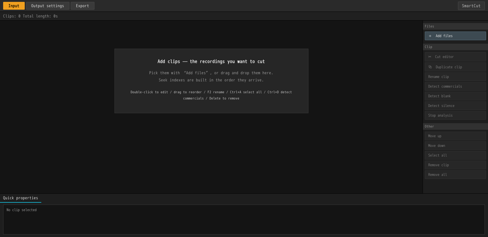

You start with an empty list. A **clip** is one row in that list, standing for one
recording on disk.

### Adding recordings

| How | |
|---|---|
| **Drag and drop** | Anywhere in the window works. A folder stands for the files in it |
| **＋ Add files** | Top right. Accepts a multiple selection |
| **Command-line arguments** | `smartcut recording1.ts recording2.ts`. A `.scproj` project file opens the same way |

SmartCut reads `.ts` `.m2ts` `.mts` `.m2t` `.mp4` `.mkv` `.mov` and `.m4v`.
Anything else is ignored, with a line saying so, and the list is left as it was.

### Recorded Blu-rays (BDAV)

**A disc is not one row but one row per recording on it.** A folder holding a
`BDAV` directory, an `.iso`, or a folder holding several of either -- all the
same. An `.iso` is not mounted: the streams inside it are read where they lie.

Rows are named by the **programme**, not by `00001.m2ts`. The disc's own index
(the `.rpls` files) carries the name, the time it was recorded and the chapter
marks, and that is where they come from.

Cuts are written **beside the disc** unless the output settings say otherwise,
under the programme's name (`cut_2026年08月17日01時00分-BS11….ts`) -- there is
nowhere to write inside a disc. "The same as the input" means `.ts` here.

Encrypted discs cannot be opened, and commercial Blu-rays (BDMV) are not
supported. How it works is in [BDAV discs](../developers/bdav.md).

Network (SMB) shares work as command-line arguments, as drops from a file manager,
and in the output folder box. **SmartCut does not mount anything.** If you hand it
a share that is not currently connected, it stops and tells you where to open it:
open `smb://…` in your file manager first, then add the file again.

### What happens as soon as a clip lands

Clips are read in the order they arrive, and a seek index is left on disk. This is
exactly the work the engine would otherwise have to do the moment you open the cut
editor, done in advance — so a clip the list has finished reading **opens
instantly**.

The bottom right of each row says where it got to. `Indexed in 2s` means the index
was just built; `Index from an earlier run` means the answer was already on disk.

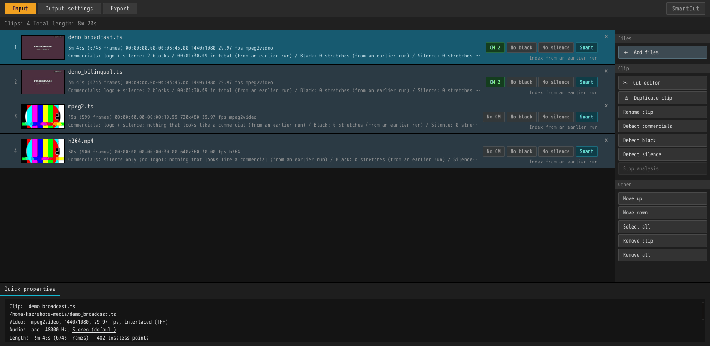

Each row shows the filename; then the length in frames, the time range, the
resolution, the frame rate and the codec; and then whatever commercial detection
and your own cuts have to say. On the right, `Smart` means smart rendering applies
to this material, and `CM 2` means two commercial blocks were found.

**The picture on the left follows the cuts.** Recordings tend to open on black or
on the tail of the programme before, so it is taken a little way in rather than at
the head -- and once there are cuts, a little way into *what survives*. A row whose
commercials have been cut never goes on showing one of them.

**You can drag rows into a different order.** The export runs down the list, so
move whatever you want written first to the top. A multiple selection moves
together.

### Working the list

| | |
|---|---|
| **Double-click** / `Enter` | Open that recording in the cut editor |
| `Ctrl+A` | Select all |
| `Ctrl+D` | Detect commercials in the selection |
| `Delete` | Remove it from the list (the file itself is not touched) |
| `↑` `↓` | Move the selection. Hold `Shift` to extend it |
| **Drag a row** | Reorder. `Esc` cancels |
| **⧉ Duplicate clip** | Put the same recording in the list twice. Cuts and marks come with it |

**Duplicating** is for the two-hour recording that contains two programmes: the
same file on two rows, each written out over a different range. The output
filenames get `_1` and `_2` appended.

**Quick properties**, along the bottom, describes whichever single clip is
selected — the path, the codec, the resolution, the scan type, the audio, the
length, how many lossless points there are, how many scenes, and the state of the
index. With several clips selected it just says how many.

### Detecting commercials

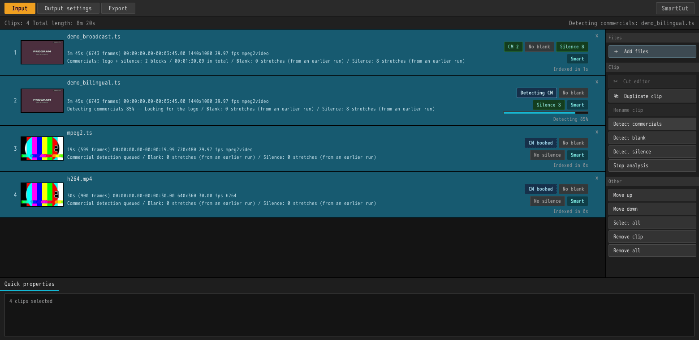

`Ctrl+A` then `Ctrl+D` (or the **Detect commercials** button on the right) runs
detection over everything selected. Dropping a night's recordings in and pressing
`Ctrl+D` once is what this was built for: detection works through them one at a
time, running alongside the indexing queue rather than behind it.

Progress appears on the row: `Detecting commercials 84% — Looking for the logo`.
Rows whose turn has not come say `Commercial detection queued`. The audio pass
takes a few seconds and the logo pass takes about ten times that, so the progress
figure is weighted to match.

What detection finds are blocks on the 15-second grid, from three signals: caption
resets, silence, and the station logo. The number of blocks and their total length
go on the row. The details are in
[commercial detection](cm-detection.md).

**Detection only places marks. The cutting is yours.** Open the cut editor and the
start of each commercial block, and of each return to the programme, is already
there as a keyframe.

To stop, press **Stop analysis**; pressing it again picks up where it left off.
Detection stops between clips, not inside one.

There is more about running a whole evening's worth at once in
[batch processing](batch.md).

---

## 2. Cut

Double-click a row and it opens in its own window.

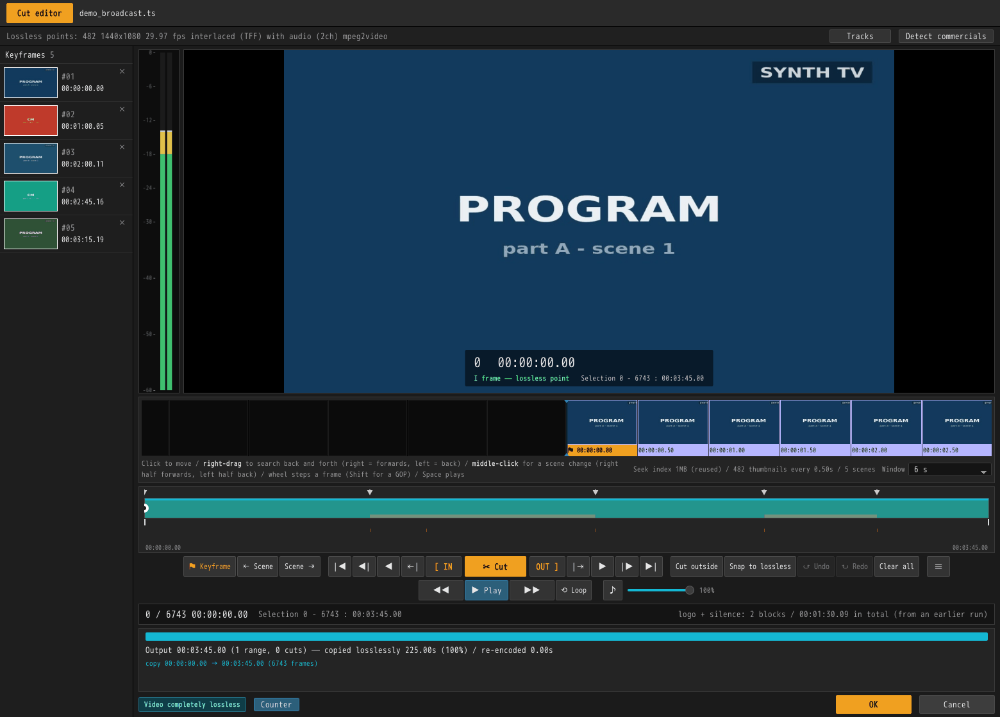

### What is where

| Where | What |
|---|---|
| Top line | The filename |
| Info bar | Lossless points, resolution, fps, scan type, audio, codec. **Tracks** and **Detect commercials** on the right |
| Left column | The **keyframes** — your marks, each with a thumbnail. Click one to jump there |
| The large picture | The preview. Bottom right: frame number, timecode, what kind of frame it is, and the current selection |
| The band under it | The **filmstrip**. One cell is one GOP by default; the `View` menu to its right offers 3 s to 3 min, or frame by frame |
| The scrubber | Green is the output itself. `▼` are keyframes, a red vertical line is a join left by a cut, and the fine ticks below are scene changes |
| The button row | **Cut** in the middle, `[ IN` to its left and `OUT ]` to its right, and outwards from there: go to, one frame, lossless point, start and end |
| The band and lines below | The engine's **plan**: what will be copied and what will be re-encoded |
| Bottom right | **OK** and **Cancel** |

### Getting about

| | |
|---|---|
| **Click** the filmstrip | Go to that frame |
| **Right-drag** the filmstrip | Search back and forth. Right of centre is forwards, left is back, and further out is faster |
| **Middle-click** the filmstrip | Jump to the next scene change |
| **Wheel** over the filmstrip | One frame per notch. Hold `Shift` to hop from lossless point to lossless point |
| **Drag** the scrubber | Move the playhead. Grab near the IN or OUT mark and you move that mark instead |
| **Hover** the scrubber | Shows the frame at that moment in a small picture |
| `Space` or **▶ Play** | Play from here, picture and sound. Press again to stop |
| `←` `→` | Back and forward one frame. Hold to repeat |
| `Shift+←` `Shift+→` | One second |
| `S` / `Shift+S` | Next / previous scene change |
| `◀\|` `\|▶` | Previous / next **lossless point** |
| `\|◀` `▶\|` | Start / end |

**Every number on this screen is on the output's clock.** What you cut does not go
grey — it disappears. The scrubber shrinks, the filmstrip closes over the hole, and
the frame counter counts the length that will actually be written.

### Marks and edits are two different things

- A **keyframe** is a *mark*, not an edit. `⚑ Keyframe` (or `K`) puts one on the
  frame you are on. Marks line up down the left with a thumbnail each; click one to
  jump there, or click its `×` to remove it.
- A **cut** is the edit. Set IN and OUT, press `✂ Cut`, and that range leaves the
  output.

Marks also arrive without your placing any: from a detection, from a `.keyframe`
file beside the recording, and — for a recording opened off a **BDAV disc** — from
the chapters the recorder itself set, which on a Japanese recording are frequently
the commercial breaks. Those are read on the first visit only, and the `.keyframe`
file wins where there is one.

### Selecting with IN and OUT

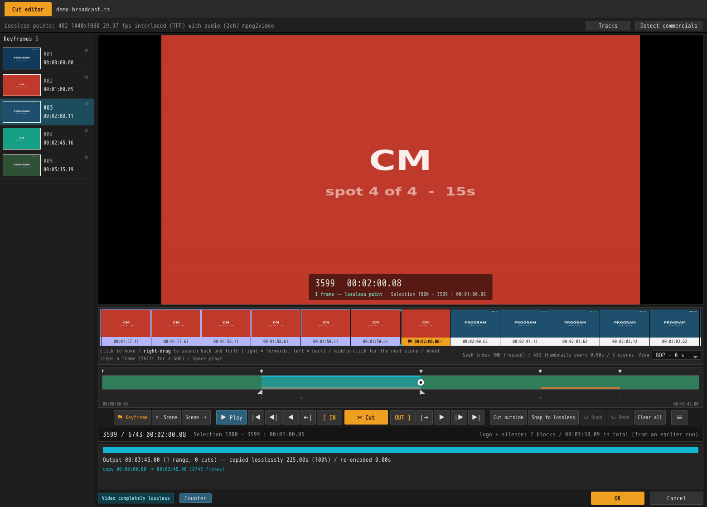

Click the keyframe at the head of the commercial block and press `I`. Then click
the keyframe where the programme comes back, press `←` to step one frame off it,
and press `O`. That puts the block exactly inside the selection.

- **IN to OUT includes the OUT frame.** Select five frames and five frames go.
- **Setting one end leaves the other alone.** You usually place IN and OUT one at a
  time as you close in, so re-placing IN is no reason to lose OUT. Only when the
  two cross does the one you just placed win, and the other retreats to the end of
  the timeline.
- The selection is written out under the preview and on the status line, as
  `Selection 1800 - 3599 : 00:01:00.06`.

### Cutting

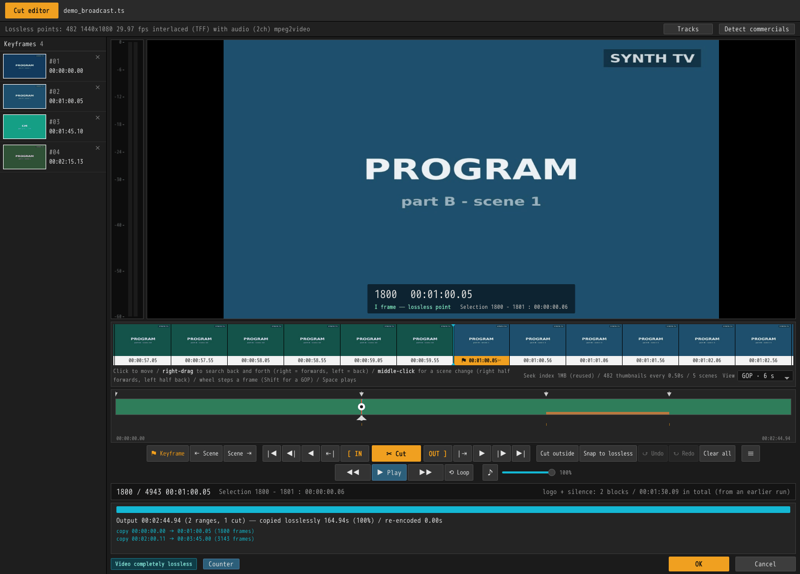

`✂ Cut` takes the selection out of the output. The screen is rebuilt immediately,
and the band and lines below tell you what will be written:

```
Output 00:02:44.94 (2 ranges, 1 cuts) — copied losslessly 164.94s (100%) / re-encoded 0.00s
copy 00:00:00.00 → 00:01:00.05 (1800 frames)
copy 00:02:00.11 → 00:03:45.00 (3143 frames)
```

If the badge at the bottom left reads `Video completely lossless`, not one frame of
this output will be re-encoded. Cut the second commercial block the same way and it
becomes `3 ranges, 2 cuts`.

**A join left by a cut becomes a keyframe of its own**, because that is exactly the
place you will want to check afterwards. The scrubber keeps a red line there.

### Cutting again, and cutting wider

| Button | |
|---|---|
| **Cut outside** | Drop everything outside the selection. One press for lifting a single stretch out |
| **Snap to lossless** | Move both ends of the selection to the nearest lossless point. Press it and the re-encoding goes to zero |
| **↺ Undo** | Take the last cut back (fifty deep) |
| **Clear all** | Remove every cut and every keyframe |

### When re-encoding is needed

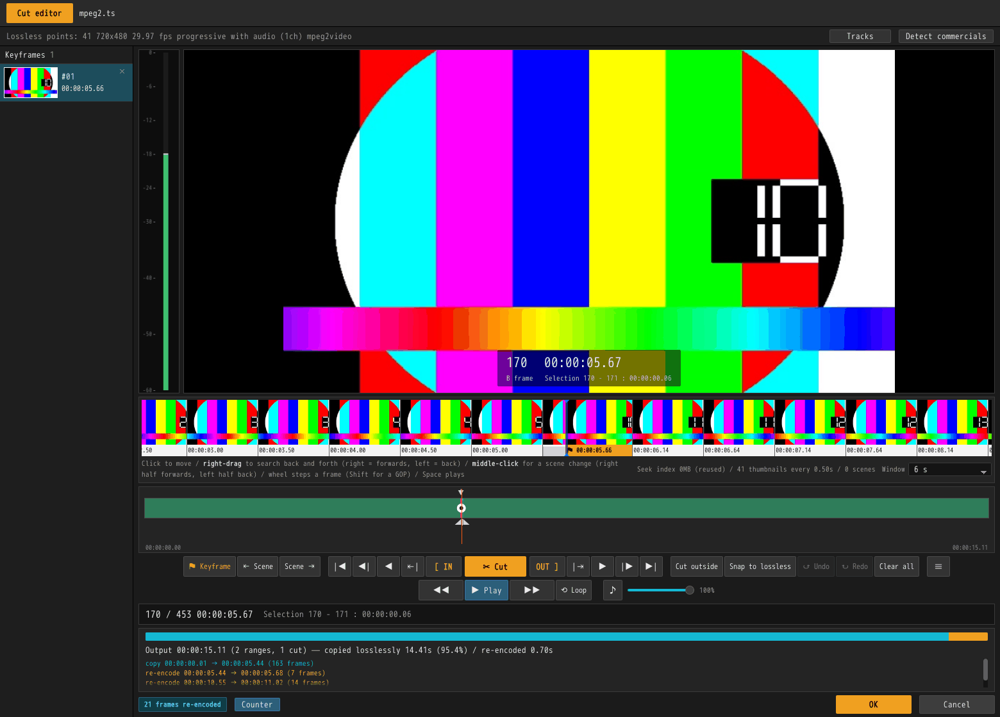

When a cut point lands inside a GOP, that partial GOP alone is rebuilt. The orange
part of the band and the `re-encode` lines are those frames — above, **14 frames**
out of 461, leaving 97.0% of the length a byte-for-byte copy.

Commercial boundaries in a broadcast recording sit in silence, and silence is
usually a lossless point too, so removing commercials often comes out completely
lossless. Cutting at an arbitrary moment is what costs those fourteen frames, and
**Snap to lossless** takes them back to zero.

### Choosing which tracks are written

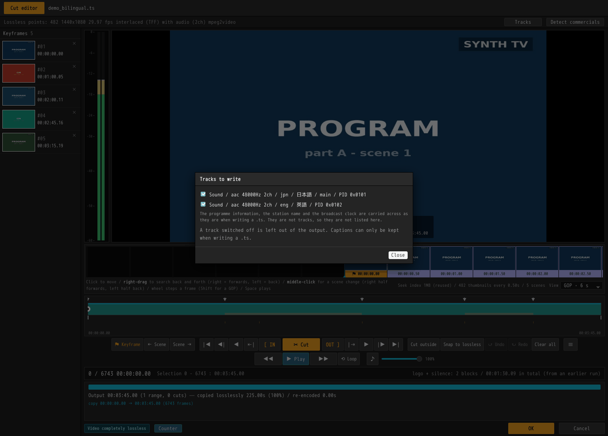

**Tracks**, on the info bar. A broadcast recording contains more than a picture and
a sound, and this is where you say which of it goes into the output.

**Everything is on by default.** The case this menu exists for is switching off the
second language on a bilingual broadcast; a track nobody asked about is a track
that was in the recording, and dropping it silently would mean the program deciding
what the recording is for.

Captions can only be kept when writing a `.ts`. Superimposed text and data
broadcasting cannot be carried on a cut timeline at all, so they appear as `not
carried` rather than as choices. Programme information (EIT), the station name and
the broadcast clock are not tracks and so are not listed, but they are carried
across when writing a `.ts`.

This choice is a fact about *this clip*, so it travels back with the edit and is
saved in the project. Two duplicates of one recording can answer it differently.

### Leaving

- **OK** — take the cuts and marks back to the list and close.
- **Cancel** — throw away what was done here and close.

Either way the list window has stayed where it was, ready for the next recording.

---

## 3. Output settings

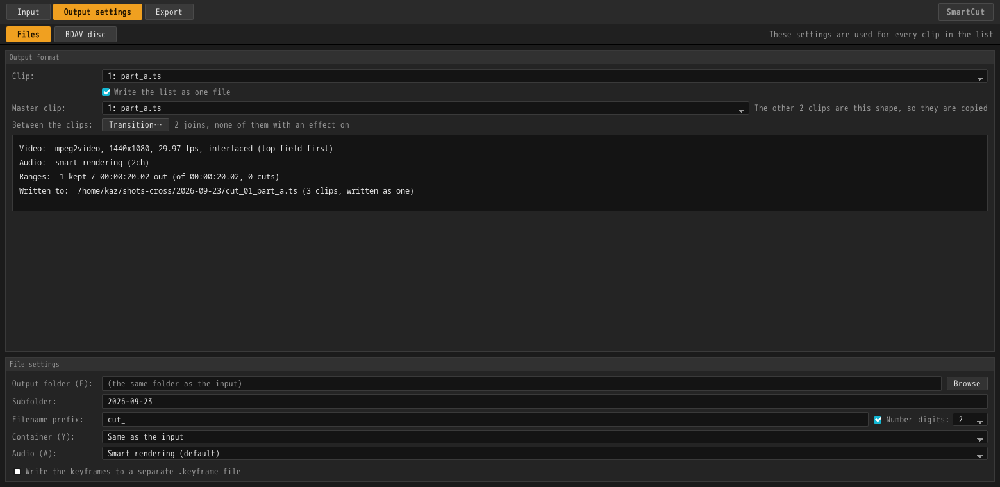

**These settings apply to every clip in the list.** The top half is there to be
read: pick a clip and it shows what that recording will become under the current
settings — video, audio, how many ranges, how long the output is, and the path it
will be written to.

| Field | |
|---|---|
| **Output folder** | Empty means alongside the input. Use `Browse`, or type a path (an SMB path is fine) |
| **Filename prefix** | `cut_` by default, so `cut_recording.ts` |
| **Container** | `Same as the input`, or a specific one. The extension is what decides the container |
| **Audio** | `Smart rendering (default)` / `Copy through` / `Re-encode everything` |
| **Audio channels** | `Same as the input`, or 1ch, 2ch, 5.1ch. Asking for a different count is a downmix, and **re-encodes the whole track** |
| **Audio bitrate** | For the frames that are rebuilt. `Leave it to the engine` follows the material |
| **Write the keyframes to a separate .keyframe file** | Puts a `.keyframe` file next to the video, under the same name |

**What the three audio modes differ on.** The default, `Smart rendering`, rebuilds
only the few frames a boundary falls inside, so nothing from the far side of a cut
is heard; cut in silence and the result is byte-identical to a copy. `Copy through`
is lossless to the byte, but a little of the cut-away side survives at the join.
`Re-encode everything` cuts to sample precision, at the price of rebuilding the
whole track. There is more detail in [audio](../technical/audio.md).

**Audio channels and bitrate are greyed out unless the mode is
`Re-encode everything`**, because they describe an encode that the other two modes
do not run over the whole track. They keep their values while greyed out, so they
are still there when you switch back.

The `.keyframe` file contains **line numbers only, CRLF, no header**, and the
numbers are on the written file's clock. A `.keyframe` file sitting next to a video
is read back automatically when that video is opened in SmartCut.

---

## 4. Write

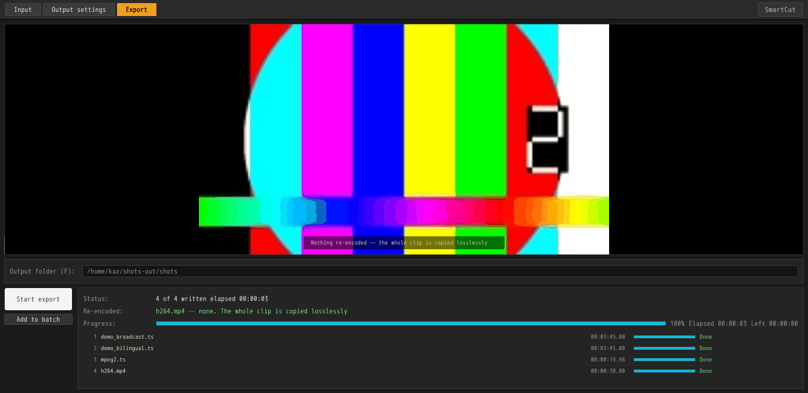

`Start export` writes the list out from the top down. Each row carries its own
progress and result, and above them are the overall state, the elapsed time and the
time remaining. At the end it says `4 of 4 written`.

`Stop export` finishes writing the clip currently under the head, then stops.

### This screen shows the frames that get re-encoded

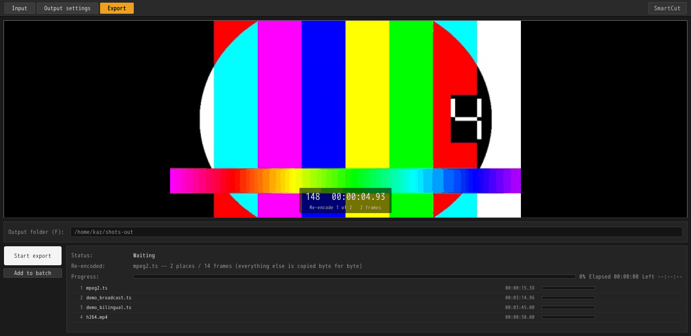

The large picture is not a representative frame. It is a frame that will be
re-encoded — the only place in the output whose quality is this program's doing.
How many such places there are is in `Re-encode 1 of 2`, and how many frames in
total is on the line above.

For a clip whose cuts all landed on lossless points, you get its representative
frame instead, with `Nothing re-encoded — the whole clip is copied losslessly`
written underneath.

---

## Saving your work

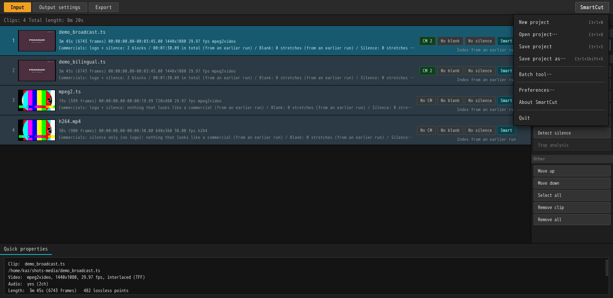

The **SmartCut** button at the top right saves and opens projects (`Ctrl+S` /
`Ctrl+O`). A project holds the list itself: the paths, the cuts and marks you put
in, the track choices, and the output settings.

A `.scproj` file is only a few hundred bytes, and it opens on another machine or
after the cache has been cleared. See [projects](projects.md) for what is in one
and why.

## Language and version

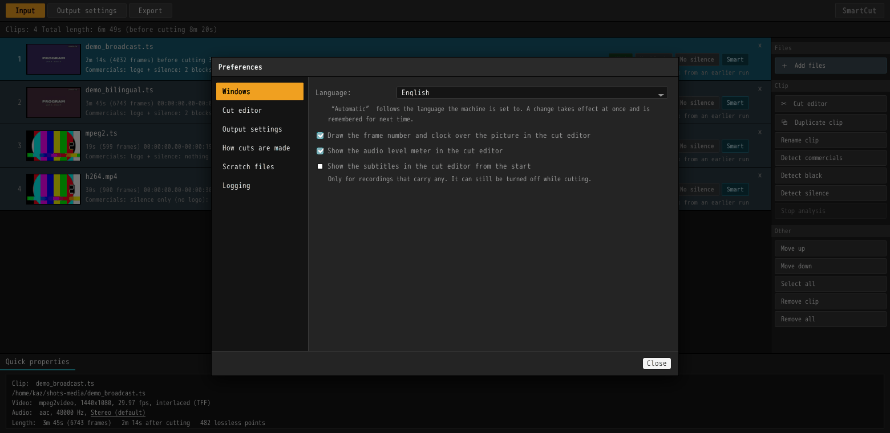

**Preferences…**, in the same menu, is where the interface language is chosen:
English, Japanese, or follow the system (the default). A change takes effect in
both windows at once and is remembered for next time.

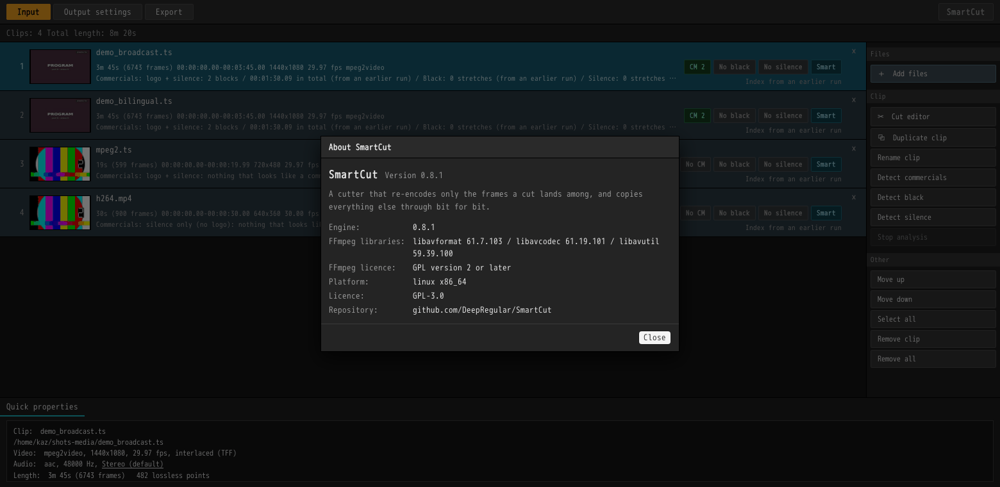

**About SmartCut** gives the versions — the program and the cutting engine, the
FFmpeg libraries actually loaded and their licence, and the platform. This is the
one place in either window where text can be selected and copied, so you can quote
it straight into a bug report.

---

## Keyboard reference

### List window

| | |
|---|---|
| `Ctrl+A` | Select all |
| `Ctrl+D` | Detect commercials in the selection |
| `Ctrl+S` / `Ctrl+Shift+S` | Save project / save as |
| `Ctrl+O` | Open project |
| `Enter` / double-click | Open the cut editor |
| `Delete` | Remove from the list |
| `↑` `↓` (with `Shift` to extend) | Move the selection |

### Cut editor

| | |
|---|---|
| `Space` | Play / stop |
| `←` `→` | One frame (hold to repeat) |
| `Shift+←` `Shift+→` | One second |
| `I` / `O` | Start / end the selection here |
| `K` | Mark this frame as a keyframe |
| `S` / `Shift+S` | Next / previous scene change |
| `Ctrl+D` | Detect commercials |

---

## Troubleshooting

| Problem | What to do |
|---|---|
| **Dropping a file does nothing** | Check the extension (`.ts` `.m2ts` `.mts` `.m2t` `.mp4` `.mkv` `.mov` `.m4v`). Folders are not accepted |
| **"Not connected to `\\nas\rec`"** | Open that share in your file manager first. SmartCut does not mount shares itself |
| **The captions are not in the output** | Captions survive only into a `.ts`. Check the container in the output settings |
| **The editor's picture is coarse, or slow to arrive** | The first time round it is building the index and the thumbnails; the line underneath says how far it has got. There is no second time |
| **I want zero re-encoding** | Select the range and press `Snap to lossless`. If that does not do it, this material's cut points do not fall on access points |
| **An unsupported codec or track layout** | See [known limits](../technical/validation.md#known-limitations) |

---

## Command-line reference

The same engine is available as `smartcut` (`smartcut-cli` if you installed the
`.deb`).

```bash
smartcut input.ts --keep 5.3-12.7 -o out.ts   # keep this range
smartcut input.ts --cut 8.0-20.0  -o out.ts   # drop this range
smartcut input.ts --analyze                   # show the plan, write nothing

smartcut input.ts --analyze --detect-cm --logo  # list the commercial candidates
smartcut input.ts --analyze --scenes            # list the scene changes
```

| Option | Meaning |
|---|---|
| `--keep START-END` / `--cut START-END` | Ranges to keep or drop. Repeatable. `1:23:45.6` form is also accepted |
| `--audio-mode smart\|copy\|reencode` | `smart` (the default) re-encodes only the frames a boundary falls inside, so nothing from the far side of a cut is heard — and nothing at all when the seam falls in silence. `copy` is lossless to the byte; `reencode` is sample-accurate |
| `--audio-channels N` | Channels to write, 1 to 8. Anything but the recording's own count is a downmix — 5.1 folded to stereo, for players that make a mess of surround — and a downmix has no copy path, so it re-encodes the whole track whatever `--audio-mode` says |
| `--audio-bitrate RATE` | Bits per second for re-encoded audio, as `192k` or `192000`. Left out, it follows the recording, and comes down with the channel count when there is a fold |
| `--aac auto\|mpeg2\|mpeg4` | Which flavour of AAC the frames SmartCut writes announce themselves as. `auto` follows the recording, which for a broadcast means MPEG-2 AAC |
| `--index scan\|container` | How access points are indexed. `container` is faster but unavailable for TS |
| `--seek-index PATH` | Where to keep the seek index. Written on the first run and read on the next, which skips the walk over the packets |
| `--detect-cm` / `--logo` / `--scenes` | Commercial candidates, logo assist, scene detection |
| `--drop-stream INDEX` | Leave one of the recording's streams out of the output. Repeatable. The same thing the cut editor's **Tracks** menu does |
| `--title N` | Which recording on a BDAV disc (a folder or an `.iso`) to open. Part of the programme's name works in place of the number. Without it, the disc's recordings are listed and nothing else happens |
| `--tables partial\|broadcast\|muxer` | How a `.ts` describes itself. The default `partial` writes a partial transport stream (one SIT, per DVB EN 300 468 Annex C / ARIB TR-B15); `broadcast` puts the recording's own PMT, SDT, EIT and TOT back; `muxer` leaves the muxer's own tables standing |
| `--no-open-gop` | Never start a copy at an open GOP |
| `-o OUTPUT` | Output path. The extension picks the container |
