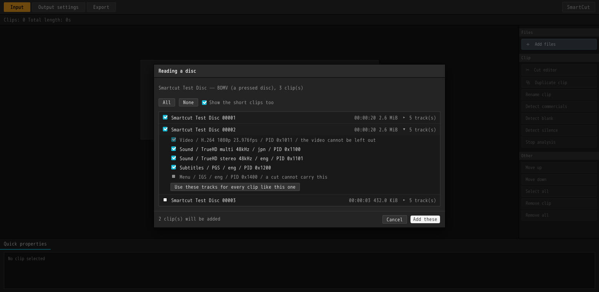
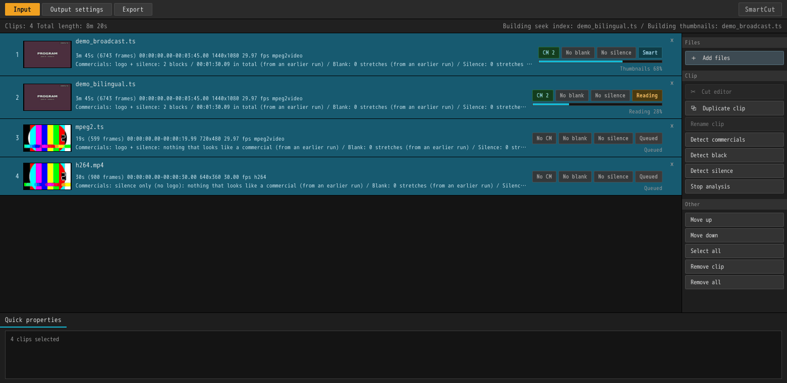
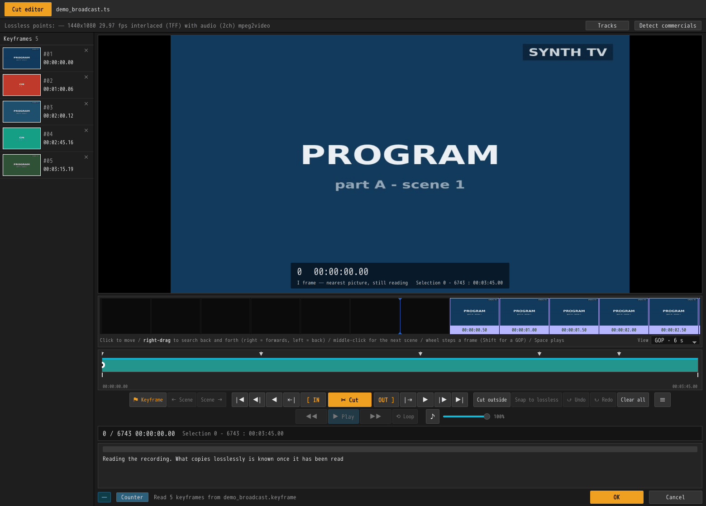
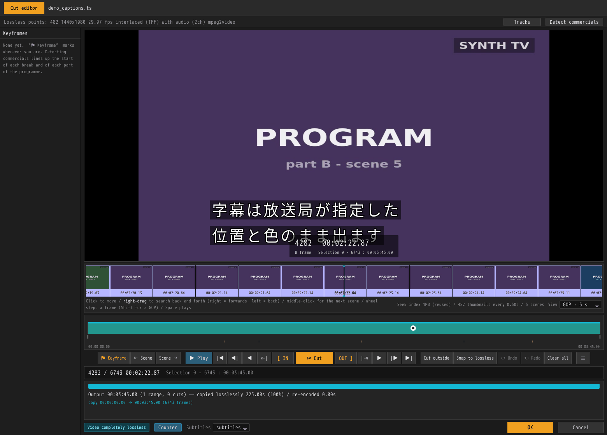
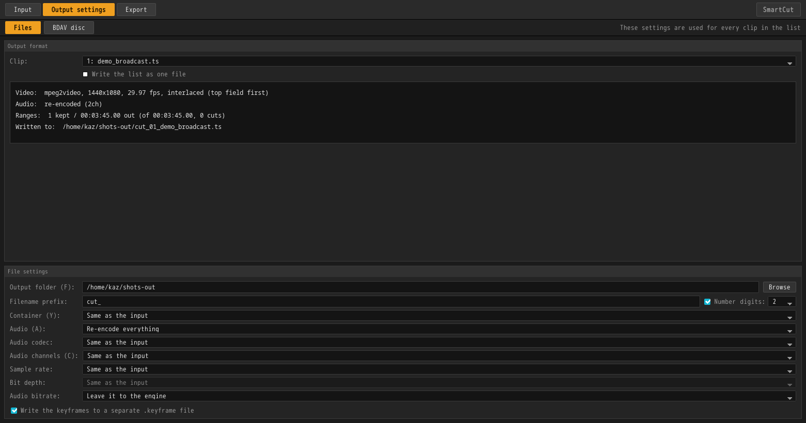
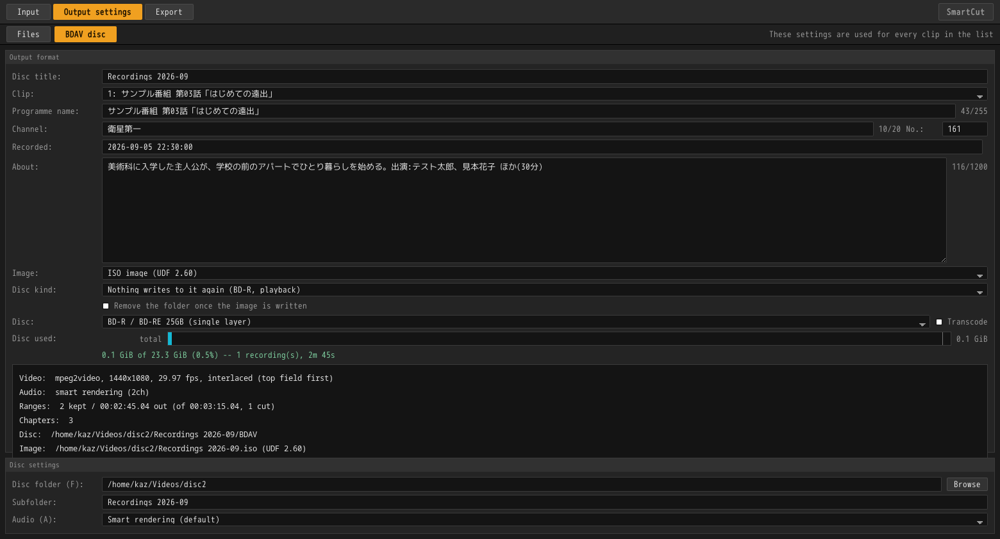
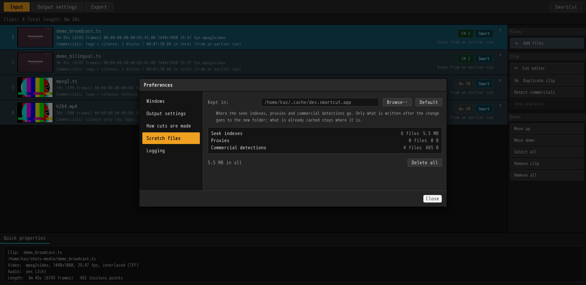

# Using the GUI

[← Documentation](../README.md) ・ [← SmartCut](../../README.md) ・ [日本語](gui.ja.md)

A walk through the screens in the order you meet them. The shape of the job is
**bring them in → cut → write them out**, and this page follows it from an empty
list to a finished export.

- Installing it is covered in the [README](../../README.md#download).
- To do the same things from a terminal, see [Using the command line](cli.md).
- If you start wondering *why* it can cut where it cuts, that is
  [the algorithm](../technical/algorithm.md).

> The screenshots on this page are not real broadcast material. They use a
> practice recording that
> [`tests/make_demo_media.sh`](../../tests/make_demo_media.sh) builds out of
> nothing but ffmpeg's own test sources: 1440x1080, 3 minutes 45, with two
> commercial blocks in it.

---

## First: four screens, two windows

The screens are laid out in the order you use them.

| Screen | Where | What you do there |
|---|---|---|
| **Input** | List window, first tab | Line the recordings up |
| **Cut editor** | **Its own window** | Open one recording, cut it, press **OK** to go back |
| **Output settings** | List window, second tab | Where files go, what format, what happens to the sound. **Applies to the whole list** |
| **Output** | List window, third tab | Write the list out, top to bottom |

Only the cut editor is a separate window. The other three are settings you
decide once for the whole list, but cutting is done one recording at a time, and
it needs a moment where you can say "this one is finished". That moment is the
**OK** button.

---

## 1. Line the recordings up


You start with an empty list. One row of that list is called a **clip**, and one
clip is one recording file.

### Adding recordings

| How | |
|---|---|
| **Drag and drop** | Anywhere on the window. Drop a folder and the supported files inside it come in |
| **＋ Add files** | The button at the top right. You can pick several |
| **Command-line arguments** | `smartcut recording1.ts recording2.ts`. A saved project (`.scproj`) opens the same way |

These are the files it can read:

```
.ts  .m2ts  .mts  .m2t  .mp4  .mkv  .mov  .m4v      (video files)
.vob .mpg   .mpeg .m2p                              (what is inside a DVD)
```

Drop anything else and it says it ignored them; the list does not change.

### Discs: Blu-ray and DVD

**A disc can be opened as it is.** A folder holding a `BDAV`, `BDMV` or
`VIDEO_TS` directory works, and so does an `.iso` file. An `.iso` does not need
mounting — the streams inside it are read where they lie.

**A disc becomes one row per recording on it, not a single row.**

Dropping one opens **Reading a disc**, which asks two questions.



**① Which clips do you want?**
Everything on a disc recorded from television is offered.
A pressed disc is a different matter. A season set holds twelve episodes among
some fifty logos, warnings and menu loops — and on the disc, all sixty-odd of
them are called `000NN`.

So **anything over five minutes is ticked for you**, and the rest is behind
*Show the short clips too*. Each row shows how long the clip runs and how much
of the disc it takes, which is usually enough to tell an episode from a logo.

**② Which tracks do you want?**
Open a row's *tracks* and you see what that clip carries: the video, the audio
tracks with their languages, the subtitles and the menus. The video cannot be
left out. **The subtitles travel with the cut** — whether they end up inside it
or beside it is [an output setting](#the-settings). A **menu** cannot travel:
its buttons point into a timeline the cut has just taken apart. Nor can the
**text subtitles** a disc writes as text, because the typeface they are drawn
with is a file on the disc rather than part of the stream. Both are listed as
`a cut cannot carry this` rather than offered as a choice.
*Use these tracks for every clip like this one* copies your answer across the
whole disc, which is what you want for a season set.

**What the rows are called:**

| Kind of disc | The name on the row |
|---|---|
| Blu-ray recorded off television (BDAV) | the **programme name** — the disc's own index carries the name, the recording time and the chapters |
| Pressed Blu-ray (BDMV) | the disc name plus a clip number (there are no programme names on it) |
| DVD-Video | the disc name plus a title number |

**Opening is instant.** A disc carries its own list of the places playback can
start from, so SmartCut reads that rather than examining the whole recording. On
an 81 GB, 2 hour 34 title, that took what used to be 8 minutes 45 down to under
a second.

**The chapters the disc set are on the timeline from the start**, because on a
Japanese recording the chapter marks are frequently the commercial breaks
themselves.

Cuts are written **beside the disc** unless the output settings say otherwise,
because there is nowhere to write inside a disc.

Encrypted discs cannot be opened, DVD and Blu-ray alike.

### What happens the moment a file lands



**The row is filled in immediately.** The length, the resolution, the frame
rate, the codec and whether there is sound all come from what the file says
about itself, which takes about thirty milliseconds however long it is. The
picture on the left arrives at the same time. Drop in twenty recordings and the
last row is never left as a path and an empty square for minutes.

Behind that, the **preparation** runs.

| What the row says | What is happening |
|---|---|
| `Reading` | Building the index used for seeking and cutting — the window calls it the seek index (about 1 second per GB) |
| `Thumbnails` | Building the filmstrip pictures and finding the scene changes (about 4 seconds per GB) |
| `Queued` | Its turn has not come yet |
| `Indexed in 2s` | The index was built just now |
| `Index from an earlier run` | An index from last time could be reused, so the reading pass was skipped |

The top right of the window shows which clip each job is on. Above, the second
recording is being read while the first one's thumbnails are built, and the last
two are still waiting — **and all four rows already show what they are, with a
picture.**

When the reading finishes, its answers replace the first ones on the row. The
only figure that tends to disagree is the length: what is inside a DVD does not
record its own length, so the first answer can be wrong.

**Nothing here makes the editor wait.** A recording that is still being read
opens on a double-click like any other — see
[Usable from the moment it opens](#usable-from-the-moment-it-opens).

### Working the list


Each row shows the filename; the length in frames, the time range, the
resolution, the frame rate and the codec; and then whatever commercial detection
and your own cuts have to say. On the right, `Smart` means smart rendering
applies to this material, and `CM 2` means two commercial blocks were found.

| | |
|---|---|
| **Double-click** / `Enter` | Open that recording in the cut editor |
| `Ctrl+A` | Select all |
| `Ctrl+D` | Detect commercials in the selection |
| `Delete` | Remove it from the list (**the file itself is not touched**) |
| `↑` `↓` | Move the selection. Hold `Shift` to extend it |
| **Drag a row** | Reorder. `Esc` cancels |
| **Right-click** | The commands for that row, as a menu |
| **⧉ Duplicate clip** | Put the same recording in the list twice. Cuts and marks come with it |

**The picture on the left follows the cuts.** Recordings tend to start on black
or on the tail of the previous programme, so the picture is taken a little way
in — and, once there are cuts, a little way into *what survives*. A row whose
commercials have been cut never goes on showing one of them.

**Rows can be dragged into a different order.** The export runs down the list,
so move whatever you want written first to the top.

**Duplicating** is for a two-hour recording that contains two programmes: the
same file on two rows, each written out over a different range. The output
filenames get `_1` and `_2` appended.

**Quick properties**, along the bottom, describes whichever single clip is
selected. With several selected, it just says how many.

### Detecting commercials


`Ctrl+A` then `Ctrl+D` (or the **Detect commercials** button on the right) runs
detection over everything selected. **Dropping in a night's recordings and
pressing `Ctrl+D` once** is exactly what this was built for.

Progress appears on the row: `Detecting commercials 84% — Looking for the logo`.
Rows whose turn has not come say `Commercial detection queued`.

**Detection only places marks. The cutting is up to you.** Open the cut editor
and the start of each commercial block, and each return to the programme, is
already there as a keyframe. See [Commercial detection](cm-detection.md).

To stop, press **Stop analysis**; pressing it again picks up where it left off.

Running a whole evening's worth at once is covered in
[Working through a batch](batch.md).

---

## 2. Cut

Double-click a row and it opens in its own window.


### Usable from the moment it opens

The editor does not wait for the recording to be read. **What you can do grows
in three stages.**

| When | What becomes available |
|---|---|
| **The moment it opens** (30 ms) | Length, resolution, fps, audio, codec; the timeline, the scrubber, keyframes, **cutting itself**, track choices, commercial detection |
| **When the reading finishes** (about 1 s per GB) | How many lossless points there are, `Snap to lossless`, a frame-accurate preview, the export plan, playback |
| **When the thumbnails are built** (about 4 s per GB) | Every picture in the filmstrip, the scene changes, the scrubber's hover preview |

**Only two things wait.** `Snap to lossless` has nothing to snap to yet, and
`Play` has no exact place to start from yet. Everything else works from the
first stage.



While the band underneath reads `Reading the recording. What copies losslessly
is known once it has been read`, you are in the first stage: `Snap to lossless`
is greyed out, but the preview is there, the filmstrip has pictures in it, and
**you can already make cuts.**

**The pictures at this stage were found by approximate seeking.** There is no
index yet to give exact positions, so the filmstrip's cells are cut on an even
grid and some of them stay empty. While you are moving the playhead the strip
keeps to the quick way and **completes itself the moment you stop** — which is
why it can look thin while you search and fill in when you let go.

Once the reading finishes, both settle down to exact. **Cuts made earlier stay
exactly where you put them.** The only thing that changes is what they cost: a
join that is not on a lossless point shows up in the plan as a few re-encoded
frames, and `Snap to lossless` can take those to zero once it lights up.

### What is where on the screen

| Where | What |
|---|---|
| Top line | The filename |
| Info bar | Lossless points, resolution, fps, scan type, audio, codec. **Tracks** and **Detect commercials** on the right |
| Left column | The **keyframes** — your marks, each with a thumbnail. Click one to jump there |
| The large picture | The preview. At its foot, in the middle: frame number, timecode, what kind of frame it is, and the current selection. **Counter**, on the bottom line, turns them off |
| The band under it | The **filmstrip**: the frames around you, laid out as pictures. The `View` menu on the right sets how much time one cell covers |
| The scrubber | **Green is the output itself.** `▼` are keyframes, a red vertical line is a join left by a cut, and the fine ticks below are scene changes |
| The button row | **Cut** in the middle, `[ IN` to its left and `OUT ]` to its right, and outwards from there: go to, one frame, lossless point, start and end |
| The band and lines below | **The export plan**: what will be copied and what will be rebuilt |
| The bottom line | On the left, what the cut costs, and beside it **Counter** and **Subtitles** — what the preview carries. **OK** and **Cancel** on the right |

> **What a "lossless point" is.** Video is built of **key frames**, which are
> whole pictures on their own, and frames that hold only the difference from
> their neighbours. Cut in the middle of the difference frames and the picture
> has to be rebuilt from scratch. **Cut on a key frame and it does not.**
> SmartCut calls those places — the ones where the stream can simply be cut —
> lossless points.

**Every number on this screen is on the output's clock.** What you cut does not
go grey — it disappears. The scrubber shrinks, the filmstrip closes over the
hole, and the frame counter counts the length that will actually be written.

### Moving around

| | |
|---|---|
| **Click** the filmstrip | Go to that frame |
| **Right-drag** the filmstrip | Search back and forth. Right of centre is forwards, left is back, and further out is faster |
| **Middle-click** the filmstrip | Jump to the next scene change |
| **Wheel** over the filmstrip | One frame per notch. Hold `Shift` to hop from lossless point to lossless point |
| **Drag** the scrubber | Move the playhead. Grab near the IN or OUT mark and you move that mark instead |
| **Hover** the scrubber | Shows the frame at that moment in a small picture |
| `Space` or **▶ Play** | Play from here, picture and sound. Press again to stop |
| `←` `→` | Back and forward one frame. Hold to repeat |
| `Shift+←` `Shift+→` | One second |
| `S` / `Shift+S` | Next / previous scene change |
| `◀\|` `\|▶` | Previous / next **lossless point** |
| `\|◀` `▶\|` | Start / end |

### Showing the subtitles



**Subtitles** sits on the bottom line, beside what the cut costs. It is off to begin
with; choose a track and it is drawn over the preview. **It is there to place a cut by.** Whether a
seam lands in the middle of a line, and how far a subtitle runs either side of a
commercial break, are not things the picture alone will tell you.

- A broadcast's **ARIB captions** are drawn as characters, at the position, size and
  colour the broadcaster asked for, so they stay sharp however big the window is.
  The ones a broadcaster sends **as dots** rather than as characters — the arrow that
  carries a sentence onto the next line, the brackets a speaker's name sits in, the
  `ü` in a German line — are drawn from those dots, in the cell a character would
  have taken.
- A disc's subtitles — **PGS** and a DVD's **subpictures** — are pictures, and what
  the disc drew is what is put on screen.
- Where a recording carries more than one (a bilingual broadcast, Japanese and English
  on a disc), the one chosen is the one drawn.
- The frame number and time stay at the **foot** of the picture whether subtitles are
  showing or not. They share that corner with a caption, and they are drawn over it, so
  where the playhead is never goes missing. Where the caption is the one you want to
  see whole, turn **Counter** off beside it — the line under the film strip still
  says where you are, and the answer is remembered for the next clip.
- Playback keeps up with them.
- **A recording that carries no subtitles has no picker.** The bottom line then holds
  **Counter** and nothing else — which is what the screenshots elsewhere on this page
  show, since the practice recording has none.

None of this changes what is written. This chooses what is **on screen**; which
subtitles go into the output is answered by **Tracks** and by the output settings.

### Marks and cuts are two different things

- A **keyframe** is a *mark*, not an edit. `⚑ Keyframe` (or `K`) puts one on
  the frame you are on. Marks are listed down the left with a thumbnail each;
  click one to jump there, or click its `×` to remove it.
- A **cut** is the edit. Set IN and OUT, press `✂ Cut`, and that range leaves
  the output.

Marks can also arrive without your placing any: from a detection, from a
`.keyframe` file next to the recording, and — for a recording opened off a
**disc** — from the chapters the recorder itself set.

### Selecting with IN and OUT


Click the keyframe at the head of the commercial block and press `I`. Then click
the keyframe where the programme comes back, press `←` to step one frame off it,
and press `O`. That puts the block exactly inside the selection.

- **IN to OUT includes the OUT frame.** Select five frames and five frames go.
- **Setting one end leaves the other alone**, because you place IN and OUT one
  at a time as you close in. Only when the two cross does the one you just
  placed win, and the other retreats to the end of the timeline.
- The selection is shown under the preview and on the status line, as
  `Selection 1800 - 3599 : 00:01:00.06`.

### Making the cut


`✂ Cut` takes the selection out of the output. The screen is rebuilt
immediately, and the lines below tell you what will be written:

```
Output 00:02:44.94 (2 ranges, 1 cuts) — copied losslessly 164.94s (100%) / re-encoded 0.00s
copy 00:00:00.00 → 00:01:00.05 (1800 frames)
copy 00:02:00.11 → 00:03:45.00 (3143 frames)
```

**If the badge at the bottom left reads `Video completely lossless`, not one
frame of this output will be rebuilt.** Cut the second commercial block the same
way and it becomes `3 ranges, 2 cuts`.

**A join left by a cut becomes a keyframe of its own**, because that is exactly
the place you will want to check afterwards. The scrubber keeps a red line
there.

### Cutting again, and cutting the other way round

| Button | |
|---|---|
| **Cut outside** | Drop everything **outside** the selection. One press for lifting a single stretch out |
| **Snap to lossless** | Move both ends of the selection to the nearest lossless point. **Press it and the re-encoding goes to zero** |
| **↺ Undo** | Take the last cut back (fifty deep) |
| **Clear all** | Remove every cut and every keyframe |

### When re-encoding is needed


**When a cut point lands between key frames, the piece around it is rebuilt.**
The orange part of the band, and the `re-encode` lines, are those frames.

Above, **21 frames** out of 453 — leaving 95.4% of the length a byte-for-byte
copy.

Commercial boundaries in a broadcast recording sit in silence, and silence is
usually a lossless point as well, so **removing commercials often comes out
completely lossless.** It is cutting at an arbitrary moment that costs those
twenty-one frames, and `Snap to lossless` takes them back to zero.

### Choosing which tracks are written


**Tracks**, on the info bar. A broadcast recording contains more than a picture
and a sound, and this is where you say which of it goes into the output.

**Everything is on by default.** The case this menu exists for is switching off
the second language on a bilingual broadcast. A track nobody asked about is
still a track that was in the recording, and dropping it silently would mean the
program deciding what the recording is for.

- **Captions can only be kept when writing a `.ts`.**
- Superimposed text and data broadcasting cannot be carried on a cut timeline at
  all, so they appear as `not carried` rather than as choices. For a recording
  off a disc, a menu and the text subtitles drawn with the disc's own typeface
  say the same thing.
- **A Blu-ray's subtitles are a choice here like any other track.** A DVD's are
  not: they go wherever the output settings send them, and the list says so on a
  line of its own — `inside the cut or beside it, as the output settings say`.
- Programme information, the station name and the broadcast clock are not tracks
  and so are not listed, but they are carried across when writing a `.ts`.

This choice is a fact about *this clip*, so it travels back with the edit and is
saved in the project.

### Finishing with a recording

- **OK** — take the cuts and marks back to the list and close.
- **Cancel** — throw away what was done here and close.

Either way the list window has stayed where it was, ready for the next
recording.

---

## 3. Output settings


**These settings apply to every clip in the list.**

The top half is there to be read: pick a clip and it shows **what that recording
will become under the current settings** — video, audio, how many ranges, how
long the output is, and the path it will be written to.

**Two things can come out of a run**, chosen by the two tabs just under this
screen's own tab:

| | |
|---|---|
| **Files** | Ordinary video files |
| **BDAV disc** | A folder a recorder or a player opens as a list of programmes ([below](#writing-a-bdav-disc)) |

What is set on either tab stays there when you switch.

### The settings

| Field | |
|---|---|
| **Output folder** | Empty means alongside the input. Use `Browse`, or type a path (an SMB path is fine) |
| **Subfolder** | A folder of that name under the output folder, which is where the run writes. Offered where there is more than one file. Emptied, the run writes straight into the folder above |
| **Filename prefix** | `cut_` by default, so `cut_recording.ts` |
| **Container** | The file format. `Same as the input`, or a specific one |
| **Audio** | `Smart rendering (default)` / `Copy through` / `Re-encode everything` |
| **Audio codec** | `Same as the input`, or AAC, AC-3, DTS, linear PCM |
| **Audio channels** | `Same as the input`, or 1ch, 2ch, 5.1ch |
| **Sample rate** | `Same as the input`, or 96 / 48 / 44.1 / 32 kHz |
| **Bit depth** | `Same as the input`, 16 or 24 bit (only meaningful for linear PCM) |
| **Audio bitrate** | For frames that are rebuilt. `Leave it to the engine` is the safe answer |
| **A disc's subtitles** | Shown only for a recording off a disc. `Inside the cut (PGS)` by default — one file, with its subtitles in it — or beside the cut: `.idx / .sub`, the pair every player and subtitle tool reads, or `.sup`, the display sets themselves. **The line says which destination leaves them untouched**, and that is a different one for a DVD than for a Blu-ray |
| **Write the keyframes to a separate .keyframe file** | Puts a `.keyframe` file next to the video, under the same name |

A `.keyframe` file is **frame numbers and nothing else, with no header**, counted
on the clock of the file that was written. If a `.keyframe` file sits next to a
video under the same name, SmartCut loads it when that video is opened.

### The three audio modes

| Mode | What happens |
|---|---|
| **Smart rendering** (default) | Rebuilds only the few frames a boundary falls inside, so nothing from the far side of a cut is heard. **Cut in silence and the result is byte-identical to a copy** |
| **Copy through** | Lossless to the byte, but a little of the cut-away side survives at the join |
| **Re-encode everything** | Cuts to sample precision, at the price of rebuilding the whole track |



**The five rows for codec, channels, rate, bit depth and bitrate appear only
under `Re-encode everything`.** They all describe an encode, and the other two
modes do not run one over the whole track. Their values are kept while they are
hidden.

**Changing what the sound is made of rebuilds the whole track.** The only frames
that can be copied are frames in the recording's own shape. Any one of these
makes the whole track a re-encode:

- a different codec (AAC → AC-3, say)
- a different channel count (5.1 folded to stereo — a downmix)
- a different sample rate (a resample)

Choose by what you need. **AAC** is what a broadcast carries and plays straight
off a phone. **AC-3** is what a disc player or an AV receiver handles most
reliably; **DTS** likewise. **Linear PCM** is uncompressed, so if the material
is going on to be edited further, there is no second generation of loss.

**Audio that came off a disc.** Blu-ray LPCM is smart rendered, the same as AAC.
DTS-HD and TrueHD are lossless, so no mode rebuilds a frame of either: they are
copied whichever mode is set, boundaries and all, and SmartCut says so.

### Why some choices are greyed out

**Combinations that cannot legally be written are greyed out.** Choose 44.1 kHz
and `Linear PCM` goes grey; change the container to MP4 and it comes back.

They are greyed rather than removed from the list, because a list that has
quietly got shorter cannot tell you what is missing.

The decision does not come from a table in the window. It comes from the engine
that does the writing — so **what you can choose is what this build can actually
produce.** An export never fails at the last moment.

**Values larger than the material are greyed out too.** Channels, sample rate
and bit depth can all be written larger than the recording once you are
re-encoding. But being writable and carrying more information are different
things:

- 6 channels made from 2 is two channels' worth of sound spread over six
- 48 kHz made from 44.1 kHz is the same waveform drawn with more points
- 24 bits made from 16 is the same numbers with eight zero bits under them

The only thing that grows is the file. So those three rows offer the recording's
own value and below.

**For a list, "the recording's value" is the smallest one in it.** With a stereo
recording and a 5.1 recording in the same list, the ceiling is 2ch — offering
5.1 would mean the stereo one got spread out.

### Writing a BDAV disc



A night's cuts can go out as files, or **as a disc**:

```
BDAV/
  info.bdav              which programmes are on it, and what the disc is called
  PLAYLIST/00001.rpls    one recording: from when to when, and its name
  CLIPINF/00001.clpi     that recording's own index
  STREAM/00001.m2ts      the picture and sound themselves
```

That folder is **exactly what a recorder writes to a BD-RE**, and an authoring
tool or ImgBurn will burn it as it stands.

Writing a disc adds these fields:

| Field | |
|---|---|
| **Disc title** | The name a recorder shows over the list of what is on the disc. Filled in with the series the recordings are episodes of — the programme name with the episode number, the episode's own title and the broadcast's marks taken off it. Where they are not all one series — several programmes, or two seasons of one — there is no such name, and the moment the disc is being made stands there instead: `2026-09-11 00:15`. Typed over from either |
| **Programme name** | **Per clip**, not per list: what this recording is called in the disc's index. Filled in from what the recording says about itself, and typed over from there. Emptied, it goes back to what the recording said |
| **Channel** | Per clip. What the channel calls itself, and beside it the three digits a viewer knows it by — 0, or empty, where the recording does not say, which is what a terrestrial recording writes there |
| **Recorded** | Per clip. When the programme went out, as `2026-08-17 01:00:00`. Slashes, a missing seconds field and single digits are understood and put back in that shape; anything that cannot be read as a moment stops the run rather than being written as no moment at all |
| **About** | Per clip, and several lines of it: the sentence a listing carries and the cast and staff under it. This is what a recorder shows when the programme is selected in its list |
| **Image** | Whether to wrap the finished disc in a `.iso` (`None` / `UDF 2.50` / `UDF 2.60`). The folder is written either way, and the image goes beside it under the same name |
| **Remove the folder once the image is written** | Under the image, and only there when one is being made: the same thirty gigabytes twice over is not what most runs want to be left with. The folder is still written and the image still made of it — this happens afterwards, and only where the image was written. `BDAV` goes, and the folder above it only where that leaves it empty, so a disc written into a folder of your own leaves the rest of it alone |
| **Disc folder** | Replaces "Output folder", and **cannot be left empty** — a disc is one place, and the recordings in a list can have come from four. SmartCut makes one more folder under it, named by "Subfolder", and writes `BDAV` in there |

**The programme information comes with the recording.** This is the point of
writing a disc rather than a folder. `00001.m2ts` is not a name anybody wants a
recording called, and the index beside it is where everything a person reads
lives: the programme's name, the channel it came off, the night it was recorded,
and what the broadcaster said it was about. All of it is filled in from what the
recording already knows.

- A recording read off a disc keeps everything its playlist said.
- A broadcast recording is read for its own programme information.
- A cut this program made earlier still carries all of it.

**And all of it can be typed over**, because a recording that has been through
tools that kept none of it has nowhere else to get it from, and a name nobody
can correct is a name that is wrong forever. What the fields show is what will
be written. Emptying one leaves the field on the disc blank — which is a thing a
real disc does: an authoring tool's disc names the programme and the date and
leaves the channel and the description empty. The one exception is the name,
which fills itself back in, since a nameless row in a recorder's list is the one
outcome nobody wants.

The count beside each text field is how much room the index has left for it, in
bytes of the ARIB code a playlist is written in rather than in characters: 255
for the name, 20 for the channel and 1200 for the description. It turns colour
where what has been typed no longer fits, because what does not fit is cut off
on the way onto the disc.

**The chapter points are the cuts.** One at the start of every kept range —
which is where the commercial breaks were — plus any marks put down in the cut
editor. On a disc that is the list a viewer actually uses, which is why the
`.keyframe` sidecar is not offered here: the same list would be written twice,
and a player only looks at one of the two.

**A second run adds to the disc.** The numbering carries on from what is already
there, and nothing already on the disc is removed or rewritten, so a disc can be
filled over a week.

**SmartCut does not burn discs.** What it hands you is the image; the burner is
whatever you already use.

There is a great deal more of this in [Writing a disc](../technical/bdav.md).

---

## 4. Export


`Start export` writes the list out from the top down. Each row carries its own
progress and result, and above them are the overall state, the elapsed time and
the time remaining. At the end it says `4 of 4 written`.

`Stop export` **finishes writing the clip currently in progress**, then stops.
It never leaves a half-written file behind.

**Stopping part way through a disc takes back what was written to it.** The pass
that builds the index reads every stream back, which is minutes of work nobody
wants after saying stop, so it does not run — and without an index, a written
stream is one no programme points at, skipped by the next run's numbering and
carried into any image made of the disc afterwards.

### The picture here is the frame that gets re-encoded


The large picture is not a representative frame. It is **a frame that will be
re-encoded** — the only place in the output whose quality is this program's
doing.

`Re-encode 1 of 2` says how many such places there are, and the line above says
how many frames in total.

For a clip whose cuts all landed on lossless points, you get an ordinary
representative frame instead, with `Nothing re-encoded — the whole clip is
copied losslessly` written underneath.

While the list is being written the picture follows along. When the run ends it
**stays on the last frame encoded** rather than going back to the top.

---

## Saving your work


The **SmartCut** button at the top right saves and opens projects (`Ctrl+S` /
`Ctrl+O`). A project holds the list itself: the paths, the cuts and marks you
put in, the track choices, and the output settings.

**New project** in the same menu (`Ctrl+N`) empties all of it.

A `.scproj` file is only a few hundred bytes, and it opens on another machine.
See [Projects](projects.md).

## Preferences


**Preferences…**, in the same menu. Nothing settled here goes into a project:
it is the program's own set of answers, and it is still in force the next time
you start it.

The five groups are the list down the left. There is no OK: every change takes
effect as you make it.

### Windows

| Setting | What it does |
|---|---|
| **Language** | English, Japanese, or follow the system (the default). A change takes effect in both windows at once |
| **Frame number and clock over the picture** | The box at the foot of the cut editor's picture. The same answer as its **Counter** button |
| **Show the subtitles from the start** | Opens a recording that carries subtitles with the first track already chosen. It can still be switched while cutting |

### Output settings

**Carry the output settings over to the next start** remembers them and puts
them back at the next start and on **New project**: the folder, the file name
prefix, the container, what is done to the audio, and which of file output and
BDAV output you were on. A project that is opened brings its own settings and
wins.

Two things are never carried: the disc title, and the name of the folder made
under the output folder. Both are read off whatever is in the list, and
carrying either to another recording would mean answering for a recording this
session has not seen.

**Back to the defaults** puts the output settings back where they started.

### How cuts are made

| Setting | What it does |
|---|---|
| **Tidy the start of each range** | Re-encodes up to the first two seconds of a range that begins on an open GOP. The join is steadier; that much less of the output is copied losslessly. The same thing as the CLI's `--clean-joins` |
| **Build a proxy before cutting** | Re-encodes the whole recording and cuts against the lighter copy. Costs minutes and gigabytes per hour, and only pays where decoding one picture is itself slow. The width is a setting of its own |

### Scratch files



Where the seek indexes, proxies and commercial detections go. The default is
the cache directory the platform gives this program; **Browse…** changes it. A
folder that cannot be written to is refused on the spot and the old one stays
in force.

Only what is written after the change goes to the new folder. What is already
cached stays where it is.

How many files and how many bytes there are shows by kind, and **Delete all**
removes them. Nothing there is worth keeping: it is what another pass would
build again, never a cut or a project.

### Logging

**FFmpeg log** lets FFmpeg's own messages through to standard error. Silent by
default: almost none of them are faults, and this program says what it needs to
say in its own words. Turn it on to quote them in a bug report. It is the same
setting as the `SMARTCUT_FFMPEG_LOG` environment variable.

The proxy and the FFmpeg log can also be set from the environment (see
[Building](../technical/building.md)). The environment is the value each of
them starts at; a preference settled here beats it.

## About


**About SmartCut** gives the versions: the program and the cutting engine, the
FFmpeg libraries actually loaded and their licence, and the platform. **This is
the one place in either window where text can be selected and copied**, so you
can quote it straight into a bug report.

---

## Keyboard reference

### List window

| | |
|---|---|
| `Ctrl+A` | Select all |
| `Ctrl+D` | Detect commercials in the selection |
| `Ctrl+N` | New project |
| `Ctrl+S` / `Ctrl+Shift+S` | Save project / save as |
| `Ctrl+O` | Open project |
| `Enter` / double-click | Open the cut editor |
| `Delete` | Remove from the list |
| `↑` `↓` (`Shift` to extend) | Move the selection |

### Cut editor

| | |
|---|---|
| `Space` | Play / stop |
| `←` `→` | One frame (hold to repeat) |
| `Shift+←` `Shift+→` | One second |
| `I` / `O` | Start / end the selection here |
| `K` | Mark this frame as a keyframe |
| `S` / `Shift+S` | Next / previous scene change |
| `Ctrl+D` | Detect commercials |

---

## When something goes wrong

| What you see | What to do |
|---|---|
| **Dropping a file does nothing** | Check the extension is one of `.ts` `.m2ts` `.mts` `.m2t` `.mp4` `.mkv` `.mov` `.m4v` `.vob` `.mpg` `.mpeg` `.m2p`. Dropping a folder brings in the supported files inside it |
| **"`\\nas\rec` is not connected"** | Open that share in your file manager first. SmartCut does not mount anything itself |
| **Captions are missing from the output** | Captions can only be kept when writing a `.ts`. Check the container in the output settings |
| **The editor's picture is coarse or slow to appear** | It is still being read. Once the reading finishes the preview is frame-accurate, and once the thumbnails are built the filmstrip fills completely ([Usable from the moment it opens](#usable-from-the-moment-it-opens)). The index is built once only |
| **I want zero re-encoding** | Select the range and press `Snap to lossless`. If that still does not reach zero, this material cannot put the cut points on key frames |
| **An unsupported codec or layout** | See [known limitations](../technical/validation.md#known-limitations) |

---

To do the same things from a terminal, see [Using the command line](cli.md).
How the GUI itself is built is in the [design notes](../technical/design.md).
